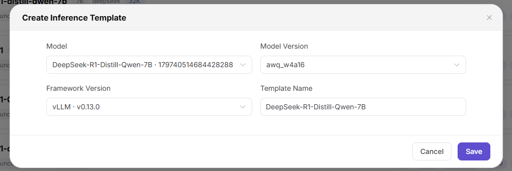
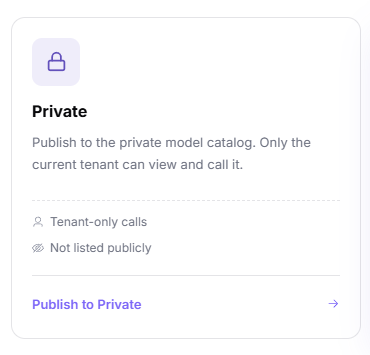

# Model Auto-Download and Inference Template Validation Best Practice

::: info Document Information
Version: v1.3<br>
Updated: 2026-08-13
:::

## Overview

To create a new inference template for customers who want to launch a model instance, complete the following workflow in order:

1. **Ensure the model is downloaded — Operator:** Find the target model in On-Prem and confirm that its weight files are downloaded to the required cluster.
2. **Create an inference template — Operator:** Configure the model, version, framework, VRAM factor, accelerator relation, and template availability.
3. **Create a model instance from the template — End User:** Select the template, configure concurrency and context length, and verify that the recommended resource flavor is correct.
4. **Publish a private model from the instance — End User:** Select the `Private` model type for the running instance, enable and test an API protocol, then configure the tag, billing, and rate limit.
5. **Test the private model — End User:** Find the model in the private model list, test it in Playground, and verify the generated cURL command in a shell.

The process is complete only when the model files are ready, the inference template is available, the instance is `Running` with a service port, and both the web experience and API call succeed.

## Before You Start

- Prepare Operator and End User accounts with the required permissions.
- Confirm the target model, model version, repository Model ID, target cluster, inference framework, and accelerator type.
- Confirm that the target cluster can access ModelScope or Hugging Face and has enough storage and accelerator capacity.
- Prepare a repository Token only when the model license or repository requires one. Do not include Tokens, passwords, API keys, or internal endpoints in documents or screenshots.
- Confirm the allowed billing and rate-limit policy before publishing.

::: warning Side effects
Saving the model version starts a download; submitting an instance consumes compute resources; publishing a private model changes the model's tenant-visible state; protocol testing, Playground, and cURL invoke the model. Perform these actions only in an approved environment.
:::

## 1. Ensure Model Download — Operator

### 1.1 Find the model

1. Sign in with an Operator account.
2. Hover over `AI Infra`, select `On-Prem`, and open `Models` or `Model Configuration`.
3. Search for the target model, for example `DeepSeek-R1-Distill-Qwen-7B`.
4. Models are normally pre-created. If the required model is not listed, click `Add Model` and complete the model information first.


### 1.2 Select the cluster and model version

1. Click the target model to open its details.
2. Scroll to the cluster section and click `Select linked clusters`.
3. Select the cluster that will store the model files and run the later instance.
4. If the model has not been downloaded in that cluster, click `Edit` for the version to configure.


### 1.3 Configure automatic download

1. Change `Model source` from `Local` to `ModelScope` or `Hugging Face`.
2. In an environment where Hugging Face access is unstable, use `ModelScope` when it is an approved source.
3. Open the selected repository, search for the exact model and version, copy its Model ID, and enter it as the remote repository ID in AGIOne.
4. Most public open-source repositories do not require a Token. If the selected model is licensed or access-restricted, use an approved Token through the platform's credential mechanism.

For example, if you use ModelScope, search for the target model on ModelScope and copy the Model ID from the matching repository page before returning to AGIOne.


### 1.4 Save and verify the download

1. Review the model source, Model ID, version, and linked cluster.
2. If the model should become available immediately after a successful download, select `Enable after download`.
3. Click `Save`. AGIOne starts downloading the model automatically.
4. Refresh or reopen the model details until the download reaches a successful state.

**Success criteria:** the selected cluster shows the complete model version as downloaded and available. A saved configuration or a download still in progress is not sufficient.

**If the download fails:** check repository connectivity, the Model ID, Token authorization, cluster storage capacity, proxy configuration, and partial files before retrying.

## 2. Create an Inference Template — Operator

### 2.1 Create the template

1. Open the `Inference Templates` page.
2. Click `New Inference Template` or `Create Inference Template`.
3. Select the downloaded model and its version.
4. Select the required inference framework and enter a clear template name.



### 2.2 Complete the template configuration

1. In `Linked VRAM Factor`, click `Edit` and select `Common Model Inference VRAM Param Table for vLLM` for the vLLM configuration described here.
   Do not select a VRAM factor solely because a model is open-source or uses a MoE architecture. If the model architecture or VRAM behavior is outside the validated scope, have professional services validate the factor first.
2. Scroll to `Framework Relations` and click `Edit`.
3. Select the accelerator available in the target environment. For an `Ascend 910B` deployment, select `Ascend 910B`; select a different accelerator only when the framework, image, and resource specifications have been validated for it.
4. Click `Confirm` to save the framework relation.
5. Leave `Extra Parameters` unchanged during the basic validation. Use professional performance tuning before changing these parameters.
6. Change the framework status to `Available`.
7. Save the template and confirm that it appears successfully in the inference-template list.


**Success criteria:** the template references the intended model version, framework, VRAM factor, and accelerator relation; the framework status is `Available`, and the template can be selected for deployment.

## 3. Create a Model Instance from the Template — End User

### 3.1 Select the model and template

1. Sign in with an End User account.
2. Open `AI Infrastructure > On-Prem > Model Deployment > Templates`. In versions that expose the template entry on the On-Prem landing page, use that equivalent entry. Earlier versions can show `My Models > Start`; this entry also opens the available deployment templates.
3. Search for the target model and select it to open the configuration page.


### 3.2 Configure business parameters and resource flavor

1. Set the required concurrency for the model instance.
2. Set the required context length.
3. Observe the available flavors on the right. They update automatically when concurrency or context length changes.
4. Select the recommended flavor unless the project has an approved, validated alternative.


### 3.3 Submit and wait for the instance

1. Review the model, version, framework, concurrency, context length, flavor, and accelerator.
2. Click `Submit` only after compute consumption is approved.
3. Return to the instance list and click `Search` or refresh the page.
4. Wait until the instance status changes to `Running` and the service port becomes available.


Starting an instance can take several minutes. A DeepSeek-R1 14B instance can take approximately 5–10 minutes in a typical validation environment, but actual time depends on scheduling, image pulling, model loading, and health checks. This estimate is not an SLA.

**Success criteria:** the expected model and framework are shown, the instance is `Running`, and the required service port is available.

**If the instance does not start:** check scheduling events, accelerator availability, image pull status, model mount path, framework logs, startup parameters, service port, and health-check timing.

## 4. Publish a Private Model from the Created Instance — End User

### 4.1 Select the private model type and start publishing

1. Keep using the End User account and open `AI Infrastructure > On-Prem > Model Deployment > Instances`.
2. Confirm that the target instance is `Running` and that its service port is available, then open the instance actions from the model-instance list or `My Deployments` and click `Publish`.
3. In `Choose where to publish`, select `Private` and click `Publish to Private`.
4. Confirm that the publishing source is the instance created in the previous stage.



AGIOne classifies published models as `Public` or `Private`; these values are model types, not publication method names. In the current UI, the `Private` card and `Publish to Private` button select the private model type. A private model can be viewed and called only by the current tenant and does not enter the public model catalog.

### 4.2 Configure and test the protocol

1. Enable at least one API protocol, for example `OpenAI-ChatCompletions`.
2. Click `Test` and confirm that the protocol test passes before continuing.
3. Optionally set `Custom Tag` to `testing` to identify the validation model.


### 4.3 Configure billing and rate limits

1. For an approved non-production validation, select `Free` on the billing page. For every other use case, follow the approved billing policy.


2. Open the rate-limit page and choose whether to enable rate limiting according to the approved policy. For an approved isolated validation, rate limiting may remain disabled. If rate limiting is enabled, enter the approved RPM and TPM values; shared and production environments should not use unrestricted settings without approval.
3. Submit the private model for approval.
4. If automatic approval is enabled, no Operator action is required. Otherwise, wait for the Operator review before testing the model.


**Success criteria:** the protocol test passes, the private-model settings are correct, the model reaches its published/approved state, and it is visible only in the current tenant's private catalog—not in the public model catalog.

## 5. Test the Private Model — End User

### 5.1 Find the model and open Playground

1. With the End User account, open `Model Services > Studio > My Models > My Published`.
2. Select `Private`, search for the model that was just published, and confirm that its status is published or approved. Verify the record by model name and Model ID rather than list position alone.
3. Confirm that the model is visible in the current tenant's `Private` list. Search for the same Model ID in the `Public` list and confirm that no public record exists.
4. Open the private-model record and click `Playground`.
5. Enter a harmless test message and send it.
6. Confirm that a complete, relevant response appears without a protocol or service error.

### 5.2 Verify the generated cURL command

1. Open the selected private model's details and click `Quick Start`.
2. Select the intended serving Provider and protocol shown in `Quick Start`.
3. Review the Model ID, base URL, path, headers, and cURL body.
4. Copy the cURL command and paste it into the required shell environment.
5. Execute the command and confirm that the HTTP request and model response succeed.

The following structure shows the fields to verify. Use the base URL, Model ID, and path displayed for the selected private model in `Quick Start`:

```bash
curl -X POST "${AGIONE_BASE_URL}/v1/chat/completions" \
  -H "Content-Type: application/json" \
  -H "Authorization: Bearer ${AGIONE_API_KEY}" \
  -d '{
    "stream": true,
    "model": "MODEL_ID_FROM_QUICK_START",
    "messages": [
      {"role": "user", "content": "Hello"}
    ]
  }'
```

Replace the variables only in the authorized shell session. Do not store an actual API key in documents, screenshots, tickets, scripts, or shell history, and use only the key issued to the signed-in account for the authorized test.


A successful call returns a sequence of streaming response events in the shell. Before retaining execution evidence, mask the endpoint and all credentials.

**Success criteria:** the private model is visible to the current tenant, is not listed in the public catalog, and both the web chat and cURL request return a valid model response for the published Model ID.

## Completion Record

Record the following without including secrets:

| Stage | Minimum evidence |
| --- | --- |
| Model download | Model, version, repository source, Model ID, linked cluster, and successful download status |
| Inference template | Template name, model version, framework, VRAM factor, accelerator relation, and `Available` status |
| Model instance | Concurrency, context length, selected flavor, accelerator, `Running` status, and service port |
| Publish a private model | `Private` model type, tested protocol, tag, billing, rate-limit setting, approval status, and confirmation that the model is absent from the public catalog |
| Model test | Web-test result, cURL HTTP/result summary, Model ID, timestamp, and a request identifier with sensitive data removed |

## Related Documentation

- [Model Configuration](/usermanual/ai-infra-on-prem/operator/templates/models/)
- [Inference Templates](/usermanual/ai-infra-on-prem/operator/templates/inference-templates/)
- [Deployment Templates](/usermanual/ai-infra-on-prem/user/model-deployment/templates/)
- [Model Instances](/usermanual/ai-infra-on-prem/user/model-deployment/instances/)
- [My Deployments](/usermanual/model-services/user/studio/my-deployments/)
- [My Models](/usermanual/model-services/user/studio/my-models/)
- [Model Experience and API Calling](/userguide/scenarios/model-experience-api-calling/)
