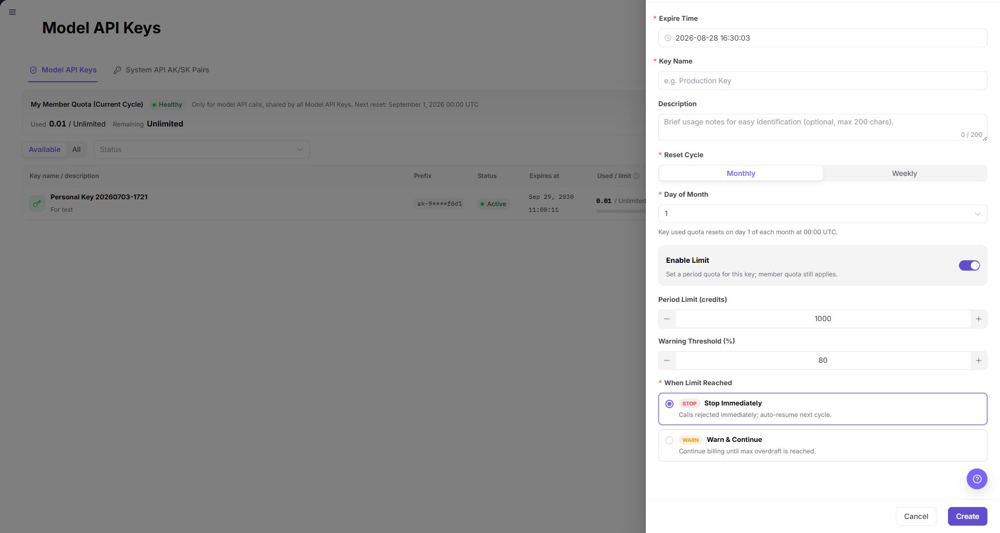
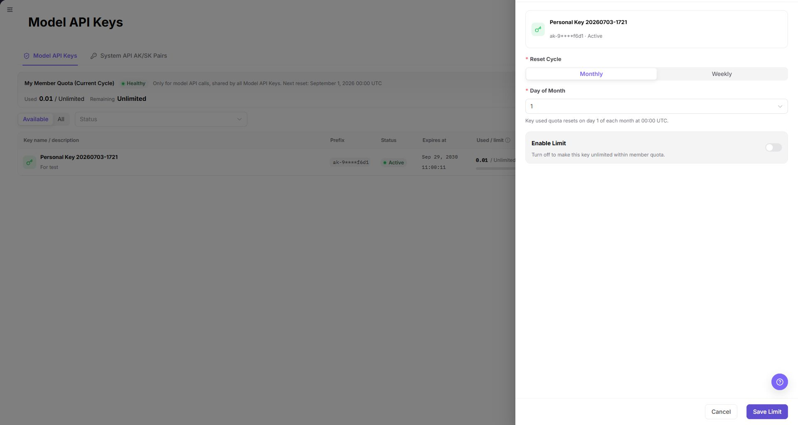

# Configure Projects, Keys, and Budgets

Use this task to configure the billing foundation and then create a project with a budget, model scope, and independent calling credential.

## Applicable Roles

- Platform Operators, Model Providers, end users, and provider administrators

## Before You Start

- Confirm permission to create projects and keys in the target tenant.
- If you are the platform operator, confirm permission to edit Platform Settings and the approved currency and Credit exchange rate.
- Identify the project owner, members, budget cycle, model scope, and over-budget policy.
- Decide whether the workload needs a Model API Key or System API AK/SK pair.

## Operator Setup: Configure Currency and Default Credit Exchange Rate

1. Open [Platform Settings](../../../usermanual/settings/operator/system-settings/platform-settings/) from `Settings > Platform Settings`, then select `Currency Settings`.
2. Click `Edit`, set `Currency Code`, `Currency Name`, and `Currency Symbol`, and click `Save` after reviewing the platform-wide impact.
3. Select `Account & Settlement` and click `Edit`.
4. Set `Default Credit exchange rate` as `1 <currency code> = <N> credits`, then click `Save`. Use the currency and rate displayed in the current environment. The screenshot below shows where to configure these values.

The configured rate converts an authorized recharge amount in the platform currency into account Credits. It is separate from model usage pricing: when an authorized model is called, the platform applies that model's billing mode and price to billable tokens or other units, converts the result to Credits, and deducts the Credits from the account balance while enforcing project and Key limits. Review recharge orders, transactions, model usage, and monthly bills when reconciling a balance change.

## Procedure

### 1. Create a Project

Open [Projects](../../../usermanual/settings/user/personal/projects/), select Create Project, and enter the name, description, reset cycle, cycle budget, alert threshold, over-budget policy, and model allowlist.

### 2. Review Project Details

Open the project from the list and review Overview, Members, Usage, API Keys, Activity, and Settings. Confirm that project state and budget rules were saved.

### 3. Create a Purpose-Specific Key

Open [My Keys](../../../usermanual/settings/user/personal/my-keys/) from the visible menu, then choose `Model API Keys` or `System API AK/SK Pairs`. Both creation dialogs contain `Key Name`, optional `Description`, and `Expire Time`; only the Model API dialog contains reset-cycle and limit controls. Use the description to record the purpose; do not treat Purpose as a separate field. Use separate Keys for production, testing, and temporary work.

### 4. Set Key Limits and Validate

For a Model API Key, open the row overflow menu and select `Limit`. Review `Reset Cycle`, the conditional reset day, and `Enable Limit`; when enabled, review `Period Limit (credits)` and `Warning Threshold (%)` against the project budget. Stop before `Save Limit` unless the change is explicitly approved. After an approved save, use a controlled request to verify that the model allowlist, project budget, and Key limit all apply.

### 5. Use Credits and Reconcile Consumption

1. An end user completes an authorized recharge. The platform uses the configured currency and `Default Credit exchange rate` to credit the account with Credits, and the recharge order or transaction record should show the resulting balance change.
2. The end user calls a model that is allowed by the project, member, and Key boundaries.
3. The platform applies the model's configured billing rule to the billable tokens, images, characters, duration, or other units. Token-priced models use their configured Credits-per-token-unit price; other modalities use their corresponding unit price.
4. The calculated Credits are deducted from the applicable balance. Confirm the deduction in the call or usage record and reconcile it with the transaction and billing-period summary.

> The currency-to-Credit exchange rate controls recharge conversion. It is not a substitute for the model's usage price, and changing either value can change later reconciliation results.

## Completion Checklist

> **Purpose:** These checks confirm that the project and its credentials are ready for controlled use. Resolve failed checks before distributing the key.

| Check | Pass Criteria |
| --- | --- |
| Billing foundation | Currency fields and the default Credit exchange rate are saved and match the approved deployment settings. |
| Project rules | Budget, alert, over-budget policy, and model allowlist are saved. |
| Key boundary | Key Name, Description, validity period, and applicable limit are clear; ownership is verified in the Project or Member scope. |
| Credit flow | An authorized recharge credits the account, an allowed model call produces usage, and the resulting Credits deduction is traceable. |
| Call validation | Allowed models work; disallowed or over-limit requests are restricted as configured. |
| Audit records | Project and key changes can be located in activity or operation logs. |

## Troubleshooting

| Symptom | Check First |
| --- | --- |
| Recharge credits differ from expectation | Currency setting, default Credit exchange rate, recharge amount, order status, and transaction record |
| Model deduction differs from expectation | Model billing mode and price, billable token or unit usage, project/Key limits, and the transaction or usage record |
| Calls stop after the project reaches its budget | Used budget, over-budget policy, and reset cycle |
| Key call fails | Key state, expiration, project budget, member quota, and model allowlist |
| Project or key is not visible | Account role, tenant membership, and menu permission |
| Workload fails after key rotation | Caller configuration update and whether the old key was disabled too early |
