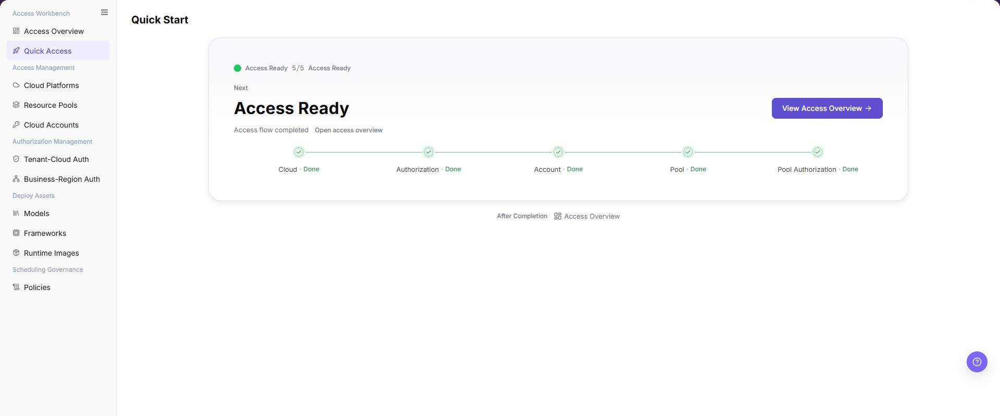

# Getting Started

## Feature Overview

| Item | Content |
| --- | --- |
| Applicable Roles | Operators, Model Providers, and Model Consumers |
| Navigation Path | User Manual > AI Infra(On-Cloud) > Getting Started |
| Page Route | N/A (documentation guide) |
| Managed Objects | Role boundaries, resource hierarchy, authorization relationships, and recommended reading order |

#### Beginner Explanation

Getting Started is a route map for first-time use. It explains the three roles and the order among cloud platforms, accounts, resource pools, deployment assets, and model deployment.

#### Terminology

| Term | Description |
| --- | --- |
| Operator | The role that maintains access, authorization, deployment assets, and scheduling policies. |
| Model Provider | The role that connects accounts, deploys, and publishes model services. |
| Model Consumer | The role that discovers and calls published model services. |

#### Recommended Operation Order

Confirm the role and goal, review Access Overview, complete missing foundation items through Quick Access, and use Quick Deployment only after assets and authorization are ready.

#### Beginner Checklist

| Scenario | Do First | Do Not Do Directly |
| --- | --- | --- |
| First visit | Review existing objects, states, and available actions | Change an unknown object |
| Before a change | Verify upstream dependencies, impact scope, and target object | Skip dependency and impact checks |
| After completion | Validate the current and downstream pages with Result Validation | Rely only on a success message |
| Page error | Record the redacted object, time, and page message | Submit repeatedly or record real credentials |

## Prerequisites

1. The current account has the permission required for Getting Started.
2. Confirm the current role and the business goal.
3. For credentials, authorization, deployment, or billing, confirm the owner and impact scope.

## Page Description

This page explains role responsibilities, resource hierarchy, and the main workflow. The image shows the Operator page used to assess access readiness.

Page screenshots:

The image shows Quick Access reference. Verify the target object, current state, fields, and actions.

## Main Operations

### Confirm Role Responsibilities

1. Operators manage access, authorization, assets, and policies.
2. Model Providers manage account access, model deployment, and publication.
3. Model Consumers use model services within their granted scope.

### Confirm Resource Preparation Order

1. Register cloud platforms and accounts before enabling resource pools.
2. Complete Tenant-Cloud Auth and Business-Region Auth.
3. Prepare models, frameworks, images, and policies before deployment.

### Choose the Next Entry

1. Open **"Access Overview"** when access status is unclear.
2. Open **"Quick Access"** when an access step is missing.
3. Open **"Quick Deployment"** when resources and authorization are ready.

## Parameter Reference

| Field Name | Required | Field Type | Example | Description |
| --- | --- | --- | --- | --- |
| Role Type | Yes | Enum | User | Used to decide whether to read the operator access configuration or the user deployment workflow. |
| Cloud Account | No | Text | Sample cloud account A | Used to locate access accounts, cloud account authorization, and resource synchronization status. |
| Resource Pool | No | Text | Sample resource pool | Used to confirm deployable regions, specifications, and inventory scope. |
| Deployment Asset | No | Text | Sample model / sample image | Used to check whether the model library, inference framework, and inference image match. |

## Pitfalls

- Do not skip the upstream dependency check: Confirm the current role and the business goal.
- Confirm impact before a configuration change: For credentials, authorization, deployment, or billing, confirm the owner and impact scope.
- A success message does not prove downstream synchronization. Use Result Validation afterward.
- Use only `<API_KEY>`, `<PERSONAL_KEY>`, `<ACCESS_KEY_ID>`, `<ACCESS_KEY_SECRET>`, `<BASE_URL>`, and `<ENDPOINT_PATH>` for credential and endpoint examples.

## Result Validation

| Check Item | Success Signal | If Abnormal |
| --- | --- | --- |
| Page is accessible | Title, navigation, and main content display correctly | Check role permission and navigation path |
| Managed objects are visible | Role boundaries, resource hierarchy, authorization relationships, and recommended reading order display as expected | Clear filters and verify upstream dependencies |
| Operation result is saved | The expected state or new record appears | Review page messages, required fields, and dependencies |
| Downstream result is consistent | Associated pages show the change | Wait for synchronization, refresh, and return to the responsible object |

## FAQ

#### Target Object Is Missing in Getting Started

**Symptom:**

The expected object is missing from the list or selector.

**Possible Causes:**

- Active query criteria filter out the target object.
- An upstream object is disabled, or the current role lacks visibility.

**Resolution:**

1. Clear filters and refresh the page.
2. Verify the prerequisite object: Confirm the current role and the business goal.
3. Confirm the current role and data scope, then locate the object again.

#### Getting Started Action Is Unavailable

**Symptom:**

An expected button, menu, or state switch is unavailable.

**Possible Causes:**

- The current account lacks the required action permission.
- Object state, references, or prerequisites block the action.

**Resolution:**

1. Verify the permission for the action and the current object state.
2. Check references and prerequisites identified by the page message.
3. Remove the blocker, refresh the page, and perform the action once.

#### Getting Started Change Does Not Reach Downstream

**Symptom:**

The page reports success, but a downstream page still shows the old state.

**Possible Causes:**

- An associated page has stale cache or synchronization delay.
- The current and downstream pages use different roles, tenants, or data scopes.

**Resolution:**

1. Wait for synchronization and refresh both pages.
2. Confirm that both pages use the same role, tenant, and object scope.
3. If they still differ, return to the responsible object and verify the saved result.

#### Getting Started Data Differs from Another Page

**Symptom:**

Counts or states differ from an associated page.

**Possible Causes:**

- The pages use different filters, aggregation rules, or update times.
- The change is still synchronizing, or role-based data scopes differ.

**Resolution:**

1. Align filters and aggregation rules on both pages.
2. Check update times and wait for synchronization.
3. Compare object details instead of summary counts only.

#### How to Troubleshoot a Getting Started Failure

**Symptom:**

Submission fails or the state does not change for an extended period.

**Possible Causes:**

- Required fields, field combinations, or object state do not meet submission rules.
- An upstream dependency is invalid, the request failed, or the same action is already processing.

**Resolution:**

1. Record the redacted object, time, and complete page message.
2. Verify required fields, object state, and upstream dependencies.
3. Confirm that no identical job is processing before one retry.

## Notes

- For credentials, authorization, deployment, or billing, confirm the owner and impact scope.
- Do not put real accounts, credentials, internal locations, or customer data in documentation, screenshots, tickets, or chat records.
- Authorization, deployment, deletion, publication, state, or billing changes require an auditable record and recovery plan.

## Next Steps

1. Operators should continue reading Access Cloud Platforms, Cloud Accounts, Resource Pools, Authorization Management, and Deployment Assets.
2. Users should continue reading Access Accounts, Quick Deployment, and My Deployments. To publish a model, continue with [Model Services My Deployments](../../model-services/user/studio/my-deployments/) and [My Models](../../model-services/user/studio/my-models/).
3. For the complete workflow, continue reading [Deploy a Cloud Model Service from Scratch](../end-to-end/deploy-cloud-model-service/).
