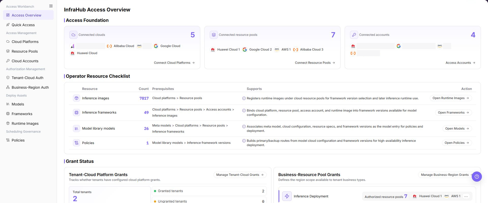

# Overview

## Feature Overview

| Item | Content |
| --- | --- |
| Applicable Roles | Operators, Model Providers, and Model Consumers |
| Navigation Path | User Manual > AI Infra(On-Cloud) > Overview |
| Page Route | N/A (documentation guide) |
| Managed Objects | Cloud access, authorization, deployment assets, scheduling policies, and model deployment workflows |

#### Beginner Explanation

Overview is the entry page for the on-cloud scheduling manual. Operators prepare cloud platforms, accounts, resource pools, authorization, and deployment assets; Model Providers deploy services; Model Consumers use published services.

#### Terminology

| Term | Description |
| --- | --- |
| Access Workflow | The preparation process from cloud-platform registration to available accounts and resource pools. |
| Deployment Assets | Deployment dependencies such as models, inference frameworks, and runtime images. |
| Scheduling Policy | Rules that select primary and backup deployment targets and define health probes. |

#### Recommended Operation Order

Read Getting Started first, let the Operator complete access and authorization, prepare deployment assets and policies, and then let the Model Provider run Quick Deployment and validate the result in My Deployments.

#### Beginner Checklist

| Scenario | Do First | Do Not Do Directly |
| --- | --- | --- |
| First visit | Review existing objects, states, and available actions | Change an unknown object |
| Before a change | Verify upstream dependencies, impact scope, and target object | Skip dependency and impact checks |
| After completion | Validate the current and downstream pages with Result Validation | Rely only on a success message |
| Page error | Record the redacted object, time, and page message | Submit repeatedly or record real credentials |

## Prerequisites

1. The current account has the permission required for Overview.
2. Identify whether the task is access, authorization, asset preparation, scheduling, or deployment.
3. Before a role handoff, confirm that the next role can observe the preceding result.

## Page Description

This page groups on-cloud scheduling entries by role and workflow. Configuration is performed on the linked feature pages.

Page screenshots:

The image shows Access Overview reference. Verify the target object, current state, fields, and actions.

## Main Operations

### Locate Operator Entries

1. Open Access Workbench, Access Management, Authorization Management, Deploy Assets, or Scheduling Governance under Operator.
2. Select the object page for the current stage. Treat search, filters, and pagination as supporting steps.
3. After completion, use Result Validation before handing the workflow to the next role.

### Locate Model Provider Entries

1. Open Quick Deployment or My Deployments under User > Model Services.
2. Open User > Access Management > Access Accounts when cloud credentials are required.
3. After deployment, verify status, events, and the publishing entry in My Deployments.

### Follow the Cross-Role Workflow

1. The Operator completes cloud platforms, accounts, resource pools, and both authorization types.
2. The Operator prepares models, frameworks, images, and policies.
3. The Model Provider starts and validates deployment; the Model Consumer uses the service after publication.

## Parameter Reference

| Field Name | Required | Field Type | Example | Description |
| --- | --- | --- | --- | --- |
| Role Type | Yes | Enum | Operator | Used to decide whether to enter the operator access workflow or the user deployment workflow first. |
| Cloud Resource Object | No | Text | Sample cloud account A | Used to locate a cloud platform, cloud account, resource pool, or access account. |
| Authorization Scope | No | Text | Sample tenant / sample business region | Used to check whether tenant authorization and business region authorization cover the target user. |
| Deployment Object | No | Text | Sample model service | Used to locate Quick Deployment, My Deployments, model library, framework, and image configurations. |
| Troubleshooting Scope | No | Time range | 2026-07-01 to 2026-07-31 | Used to check deployment events, resource synchronization, cost, and capacity issues. |

## Pitfalls

- Do not skip the upstream dependency check: Identify whether the task is access, authorization, asset preparation, scheduling, or deployment.
- Confirm impact before a configuration change: Before a role handoff, confirm that the next role can observe the preceding result.
- A success message does not prove downstream synchronization. Use Result Validation afterward.
- Use only `<API_KEY>`, `<PERSONAL_KEY>`, `<ACCESS_KEY_ID>`, `<ACCESS_KEY_SECRET>`, `<BASE_URL>`, and `<ENDPOINT_PATH>` for credential and endpoint examples.

## Result Validation

| Check Item | Success Signal | If Abnormal |
| --- | --- | --- |
| Page is accessible | Title, navigation, and main content display correctly | Check role permission and navigation path |
| Managed objects are visible | Cloud access, authorization, deployment assets, scheduling policies, and model deployment workflows display as expected | Clear filters and verify upstream dependencies |
| Operation result is saved | The expected state or new record appears | Review page messages, required fields, and dependencies |
| Downstream result is consistent | Associated pages show the change | Wait for synchronization, refresh, and return to the responsible object |

## FAQ

#### Target Object Is Missing in Overview

**Symptom:**

The expected object is missing from the list or selector.

**Possible Causes:**

- Active query criteria filter out the target object.
- An upstream object is disabled, or the current role lacks visibility.

**Resolution:**

1. Clear filters and refresh the page.
2. Verify the prerequisite object: Identify whether the task is access, authorization, asset preparation, scheduling, or deployment.
3. Confirm the current role and data scope, then locate the object again.

#### Overview Action Is Unavailable

**Symptom:**

An expected button, menu, or state switch is unavailable.

**Possible Causes:**

- The current account lacks the required action permission.
- Object state, references, or prerequisites block the action.

**Resolution:**

1. Verify the permission for the action and the current object state.
2. Check references and prerequisites identified by the page message.
3. Remove the blocker, refresh the page, and perform the action once.

#### Overview Change Does Not Reach Downstream

**Symptom:**

The page reports success, but a downstream page still shows the old state.

**Possible Causes:**

- An associated page has stale cache or synchronization delay.
- The current and downstream pages use different roles, tenants, or data scopes.

**Resolution:**

1. Wait for synchronization and refresh both pages.
2. Confirm that both pages use the same role, tenant, and object scope.
3. If they still differ, return to the responsible object and verify the saved result.

#### Overview Data Differs from Another Page

**Symptom:**

Counts or states differ from an associated page.

**Possible Causes:**

- The pages use different filters, aggregation rules, or update times.
- The change is still synchronizing, or role-based data scopes differ.

**Resolution:**

1. Align filters and aggregation rules on both pages.
2. Check update times and wait for synchronization.
3. Compare object details instead of summary counts only.

#### How to Troubleshoot a Overview Failure

**Symptom:**

Submission fails or the state does not change for an extended period.

**Possible Causes:**

- Required fields, field combinations, or object state do not meet submission rules.
- An upstream dependency is invalid, the request failed, or the same action is already processing.

**Resolution:**

1. Record the redacted object, time, and complete page message.
2. Verify required fields, object state, and upstream dependencies.
3. Confirm that no identical job is processing before one retry.

## Notes

- Before a role handoff, confirm that the next role can observe the preceding result.
- Do not put real accounts, credentials, internal locations, or customer data in documentation, screenshots, tickets, or chat records.
- Authorization, deployment, deletion, publication, state, or billing changes require an auditable record and recovery plan.

## Next Steps

1. Operators should regularly check cloud account key rotation, resource synchronization, and authorization scope.
2. Users should check Endpoint, API Key, events, and monitoring after deployment. To continue publishing, go to the `On-Cloud` list under `Model Services > Studio > My Deployments`, select a publish region, and redirect to the publish model page in [My Models](../model-services/user/studio/my-models/).
3. If cost or capacity is abnormal, cross-check On-Cloud deployment records, Model Services invocation records, and the cloud provider bill.
