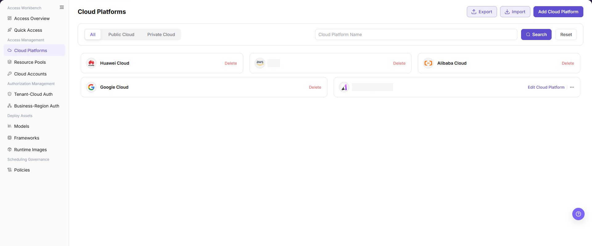
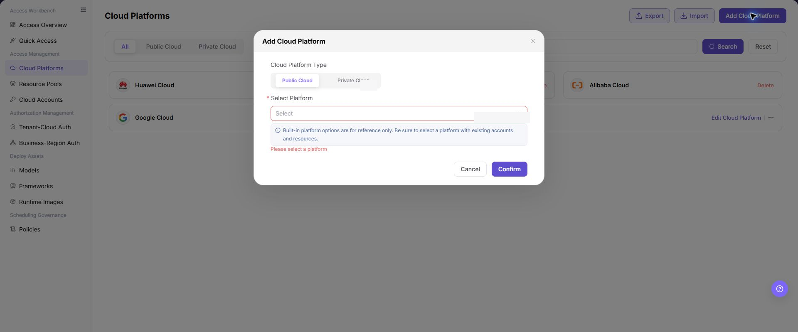
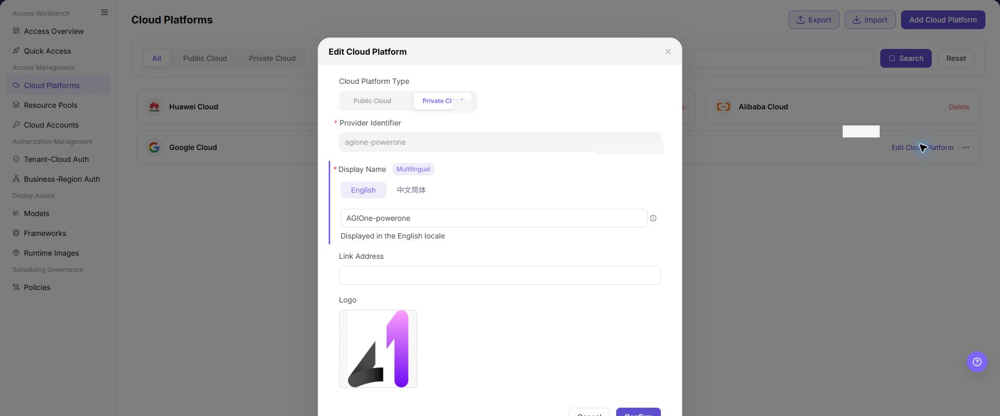

# Cloud Platforms

## Feature Overview

| Item | Content |
| --- | --- |
| Applicable Roles | Operators |
| Navigation Path | AI Infra(On-Cloud) > Access Management > Cloud Platforms |
| Page Route | `/infrahub/op/access/platform` |
| Managed Objects | Public and private cloud platform records and display settings |

#### Beginner Explanation

Cloud Platforms registers the cloud providers that can be used. Add the platform type and record before accounts, pools, and authorization can reference it.

#### Terminology

| Term | Description |
| --- | --- |
| Public Cloud | A cloud platform provided by an external cloud provider. |
| Private Cloud | A cloud platform maintained by an organization. |
| Provider Identifier | The unique identifier of a private-cloud record. |

#### Recommended Operation Order

Review the list to avoid duplicates, add the platform, edit private-cloud display settings when needed, and check all account, pool, and authorization references before deletion.

#### Beginner Checklist

| Scenario | Do First | Do Not Do Directly |
| --- | --- | --- |
| First visit | Review existing objects, states, and available actions | Change an unknown object |
| Before a change | Verify upstream dependencies, impact scope, and target object | Skip dependency and impact checks |
| After completion | Validate the current and downstream pages with Result Validation | Rely only on a success message |
| Page error | Record the redacted object, time, and page message | Submit repeatedly or record real credentials |

## Prerequisites

1. The current account has the permission required for Cloud Platforms.
2. Confirm the platform type and ownership, and verify that no duplicate record exists.
3. Before editing or deleting, check account, pool, authorization, and deployment dependencies.

## Page Description

The page provides All, Public Cloud, and Private Cloud views, with add, import, export, edit, and delete actions.

Page screenshots:

The image shows Cloud Platforms page. Verify the target object, current state, fields, and actions.

The image shows Cloud platform list reference. Verify the target object, current state, fields, and actions.

## Main Operations

### Add Cloud Platform

1. Click **"Add Cloud Platform"**.
2. Select `Public Cloud` or `Private Cloud`.
3. Select an existing platform in `Select Platform` and check for duplicates.
4. Click **"Confirm"** and verify the new record in the list.

The image shows Add Cloud Platform. Verify the target object, current state, fields, and actions.

The image shows Add cloud platform reference. Verify the target object, current state, fields, and actions.

### Edit Cloud Platform

1. Click **"Edit Cloud Platform"** on the target private-cloud card.
2. Verify the platform type and identifier, and update multilingual display names, link address, or logo as needed.
3. Click **"Confirm"**, refresh the list, and verify the result.

The image shows Edit Cloud Platform. Verify the target object, current state, fields, and actions.

### Delete Cloud Platform

1. Locate the target card and confirm that accounts, pools, or authorization do not reference it.
2. Click **"Delete"** and verify the target in the confirmation message.
3. Confirm deletion and refresh the list. If deletion fails, remove the dependencies identified by the page.

## Parameter Reference

| Field Name | Required | Field Type | Example | Description |
| --- | --- | --- | --- | --- |
| Cloud Platform Name | No | Text / search condition | `Huawei Cloud` | Cloud platform name used for list display and search. |
| Cloud Platform Type | Yes | Segmented control | `Public Cloud` | Platform category selected when adding a cloud platform. The current screenshot shows `Public Cloud` and `Private Cloud`. |
| Select Platform | Yes | Dropdown | `Alibaba Cloud` | Specific cloud provider or cloud platform selected when adding a cloud platform. |
| Add Cloud Platform | No | Action button | `Add Cloud Platform` | Opens the add cloud platform dialog. |
| Search | No | Action button | `Search` | Filters the list by cloud platform name or other conditions. |
| Reset | No | Action button | `Reset` | Clears filters and restores the default list. |
| Import | No | Action button | `Import` | Imports cloud platform configuration and may affect real configuration. Use with caution. |
| Export | No | Action button | `Export` | Exports cloud platform configuration or list data. Pay attention to sensitive information. |
| Edit Cloud Platform | No | Action entry | `Edit Cloud Platform` | Opens the configuration page or dialog for an existing cloud platform. |
| Delete | No | High-risk action | `Delete` | Before deleting a cloud platform record, confirm dependent accounts, resource pools, and authorization relationships. |

## Pitfalls

- Do not skip the upstream dependency check: Confirm the platform type and ownership, and verify that no duplicate record exists.
- Confirm impact before a configuration change: Before editing or deleting, check account, pool, authorization, and deployment dependencies.
- A success message does not prove downstream synchronization. Use Result Validation afterward.
- Use only `<API_KEY>`, `<PERSONAL_KEY>`, `<ACCESS_KEY_ID>`, `<ACCESS_KEY_SECRET>`, `<BASE_URL>`, and `<ENDPOINT_PATH>` for credential and endpoint examples.

## Result Validation

| Check Item | Success Signal | If Abnormal |
| --- | --- | --- |
| Page is accessible | Title, navigation, and main content display correctly | Check role permission and navigation path |
| Managed objects are visible | Public and private cloud platform records and display settings display as expected | Clear filters and verify upstream dependencies |
| Operation result is saved | The expected state or new record appears | Review page messages, required fields, and dependencies |
| Downstream result is consistent | Associated pages show the change | Wait for synchronization, refresh, and return to the responsible object |

## FAQ

#### Target Object Is Missing in Cloud Platforms

**Symptom:**

The expected object is missing from the list or selector.

**Possible Causes:**

- Active query criteria filter out the target object.
- An upstream object is disabled, or the current role lacks visibility.

**Resolution:**

1. Clear filters and refresh the page.
2. Verify the prerequisite object: Confirm the platform type and ownership, and verify that no duplicate record exists.
3. Confirm the current role and data scope, then locate the object again.

#### Cloud Platforms Action Is Unavailable

**Symptom:**

An expected button, menu, or state switch is unavailable.

**Possible Causes:**

- The current account lacks the required action permission.
- Object state, references, or prerequisites block the action.

**Resolution:**

1. Verify the permission for the action and the current object state.
2. Check references and prerequisites identified by the page message.
3. Remove the blocker, refresh the page, and perform the action once.

#### Cloud Platforms Change Does Not Reach Downstream

**Symptom:**

The page reports success, but a downstream page still shows the old state.

**Possible Causes:**

- An associated page has stale cache or synchronization delay.
- The current and downstream pages use different roles, tenants, or data scopes.

**Resolution:**

1. Wait for synchronization and refresh both pages.
2. Confirm that both pages use the same role, tenant, and object scope.
3. If they still differ, return to the responsible object and verify the saved result.

#### Cloud Platforms Data Differs from Another Page

**Symptom:**

Counts or states differ from an associated page.

**Possible Causes:**

- The pages use different filters, aggregation rules, or update times.
- The change is still synchronizing, or role-based data scopes differ.

**Resolution:**

1. Align filters and aggregation rules on both pages.
2. Check update times and wait for synchronization.
3. Compare object details instead of summary counts only.

#### How to Troubleshoot a Cloud Platforms Failure

**Symptom:**

Submission fails or the state does not change for an extended period.

**Possible Causes:**

- Required fields, field combinations, or object state do not meet submission rules.
- An upstream dependency is invalid, the request failed, or the same action is already processing.

**Resolution:**

1. Record the redacted object, time, and complete page message.
2. Verify required fields, object state, and upstream dependencies.
3. Confirm that no identical job is processing before one retry.

## Notes

- Before editing or deleting, check account, pool, authorization, and deployment dependencies.
- Do not put real accounts, credentials, internal locations, or customer data in documentation, screenshots, tickets, or chat records.
- Authorization, deployment, deletion, publication, state, or billing changes require an auditable record and recovery plan.

## Next Steps

1. Go to Cloud Accounts to configure account access for the added cloud platform.
2. Go to Resource Pools to create or synchronize the corresponding resource pool.
3. Go to Tenant-Cloud Auth or Business-Region Auth to configure the available scope.
