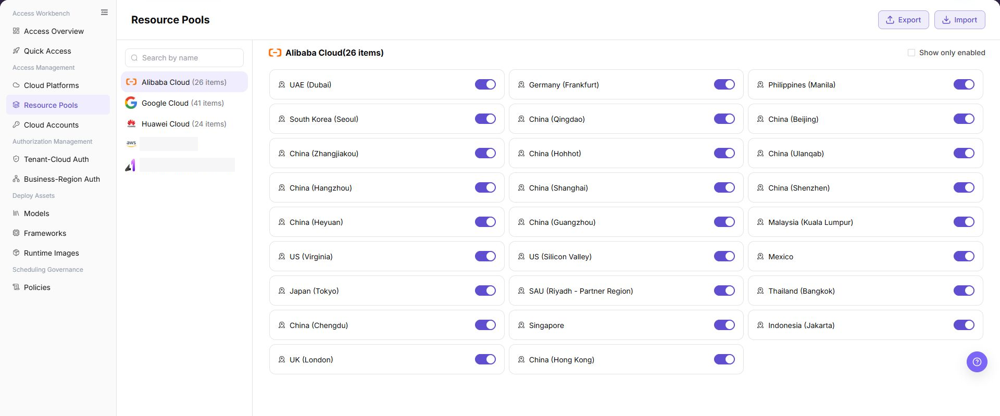

# Resource Pools

## Feature Overview

| Item | Content |
| --- | --- |
| Applicable Roles | Operators |
| Navigation Path | AI Infra(On-Cloud) > Access Management > Resource Pools |
| Page Route | `/infrahub/op/access/region` |
| Managed Objects | Regional resource pools under cloud platforms and their enabled states |

#### Beginner Explanation

Resource Pools controls whether cloud regions are available. Enabled pools can enter authorization and scheduling scopes; disabling affects deployment choices.

#### Terminology

| Term | Description |
| --- | --- |
| Resource Pool | An available resource scope organized by cloud platform and region. |
| Enabled State | Whether a pool can enter authorization and scheduling workflows. |
| Enabled Only | A filter that shows only enabled pools. |

#### Recommended Operation Order

Select a cloud platform and review its pools, assess authorization and deployment impact, then change the target state and verify downstream visibility.

#### Beginner Checklist

| Scenario | Do First | Do Not Do Directly |
| --- | --- | --- |
| First visit | Review existing objects, states, and available actions | Change an unknown object |
| Before a change | Verify upstream dependencies, impact scope, and target object | Skip dependency and impact checks |
| After completion | Validate the current and downstream pages with Result Validation | Rely only on a success message |
| Page error | Record the redacted object, time, and page message | Submit repeatedly or record real credentials |

## Prerequisites

1. The current account has the permission required for Resource Pools.
2. The target cloud platform is connected and its pool list loads correctly.
3. Before changing state, check tenant authorization, business authorization, scheduling policies, and existing deployments.

## Page Description

The left side lists cloud platforms; the right side shows regional pools and state switches for the selected platform.

Page screenshots:

The image shows Resource Pools page. Verify the target object, current state, fields, and actions.

The image shows Resource pool list reference. Verify the target object, current state, fields, and actions.

## Main Operations

### View Resource Pools

1. Select the target cloud platform on the left.
2. Use `Enabled Only` within the step when a narrower list is needed.
3. Verify region names and enabled states.

### Enable or Disable Resource Pool

1. Locate the target region and confirm its current state.
2. Toggle the state switch and read the region and action in the confirmation message.
3. Click **"Confirm"** and refresh the list.
4. Verify the expected visibility on authorization and deployment pages.

The image shows Enable or disable a resource pool. Verify the target object, current state, fields, and actions.

## Parameter Reference

| Field Name | Required | Field Type | Example | Description |
| --- | --- | --- | --- | --- |
| Cloud Platform | Yes | List item | `Alibaba Cloud` | Cloud platform that owns the resource pools. |
| Resource Pool Count | System-generated | Number | `26 items` | Number of resource pools under the current cloud platform. |
| Resource Pool Name | System-generated | Text | `China (Hangzhou)` | Resource pool name displayed by region on the current page. |
| Enabled Status | Yes | Switch | On / Off | Controls whether the resource pool can continue to be authorized, displayed, or scheduled. |
| Show only enabled | No | Checkbox | Selected / unselected | Filters the list to show only enabled resource pools. |
| Name Search | No | Input | Displayed on page | Searches cloud platform or resource pool related entries by name. |
| Import | No | Action button | `Import` | Imports resource pool related configuration and may affect real configuration. Use with caution. |
| Export | No | Action button | `Export` | Exports resource pool list or configuration data. Pay attention to sensitive information. |
| Confirmation Prompt | System-generated | Dialog | `Are you sure you want to Disable region China (Hangzhou)?` | Secondary confirmation shown before enabling or disabling. |
| Cancel | No | Action button | `Cancel` | Closes the confirmation dialog without applying the change. |
| OK | No | High-risk action | `OK` | Confirms enabling or disabling the resource pool and applies a real status change. |

## Pitfalls

- Do not skip the upstream dependency check: The target cloud platform is connected and its pool list loads correctly.
- Confirm impact before a configuration change: Before changing state, check tenant authorization, business authorization, scheduling policies, and existing deployments.
- A success message does not prove downstream synchronization. Use Result Validation afterward.
- Use only `<API_KEY>`, `<PERSONAL_KEY>`, `<ACCESS_KEY_ID>`, `<ACCESS_KEY_SECRET>`, `<BASE_URL>`, and `<ENDPOINT_PATH>` for credential and endpoint examples.

## Result Validation

| Check Item | Success Signal | If Abnormal |
| --- | --- | --- |
| Page is accessible | Title, navigation, and main content display correctly | Check role permission and navigation path |
| Managed objects are visible | Regional resource pools under cloud platforms and their enabled states display as expected | Clear filters and verify upstream dependencies |
| Operation result is saved | The expected state or new record appears | Review page messages, required fields, and dependencies |
| Downstream result is consistent | Associated pages show the change | Wait for synchronization, refresh, and return to the responsible object |

## FAQ

#### Target Object Is Missing in Resource Pools

**Symptom:**

The expected object is missing from the list or selector.

**Possible Causes:**

- Active query criteria filter out the target object.
- An upstream object is disabled, or the current role lacks visibility.

**Resolution:**

1. Clear filters and refresh the page.
2. Verify the prerequisite object: The target cloud platform is connected and its pool list loads correctly.
3. Confirm the current role and data scope, then locate the object again.

#### Resource Pools Action Is Unavailable

**Symptom:**

An expected button, menu, or state switch is unavailable.

**Possible Causes:**

- The current account lacks the required action permission.
- Object state, references, or prerequisites block the action.

**Resolution:**

1. Verify the permission for the action and the current object state.
2. Check references and prerequisites identified by the page message.
3. Remove the blocker, refresh the page, and perform the action once.

#### Resource Pools Change Does Not Reach Downstream

**Symptom:**

The page reports success, but a downstream page still shows the old state.

**Possible Causes:**

- An associated page has stale cache or synchronization delay.
- The current and downstream pages use different roles, tenants, or data scopes.

**Resolution:**

1. Wait for synchronization and refresh both pages.
2. Confirm that both pages use the same role, tenant, and object scope.
3. If they still differ, return to the responsible object and verify the saved result.

#### Resource Pools Data Differs from Another Page

**Symptom:**

Counts or states differ from an associated page.

**Possible Causes:**

- The pages use different filters, aggregation rules, or update times.
- The change is still synchronizing, or role-based data scopes differ.

**Resolution:**

1. Align filters and aggregation rules on both pages.
2. Check update times and wait for synchronization.
3. Compare object details instead of summary counts only.

#### How to Troubleshoot a Resource Pools Failure

**Symptom:**

Submission fails or the state does not change for an extended period.

**Possible Causes:**

- Required fields, field combinations, or object state do not meet submission rules.
- An upstream dependency is invalid, the request failed, or the same action is already processing.

**Resolution:**

1. Record the redacted object, time, and complete page message.
2. Verify required fields, object state, and upstream dependencies.
3. Confirm that no identical job is processing before one retry.

## Notes

- Before changing state, check tenant authorization, business authorization, scheduling policies, and existing deployments.
- Do not put real accounts, credentials, internal locations, or customer data in documentation, screenshots, tickets, or chat records.
- Authorization, deployment, deletion, publication, state, or billing changes require an auditable record and recovery plan.

## Next Steps

1. Go to Tenant-Cloud Auth or Business-Region Auth to verify resource pool visibility scope.
2. Go to Policies to confirm scheduling rules after enabling or disabling.
3. Go to Access Overview to review resource pool status and resource checklist display.
