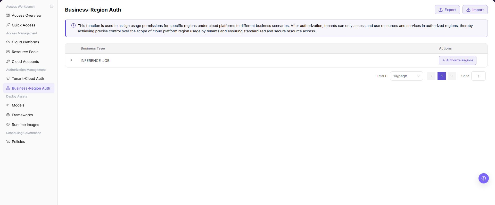
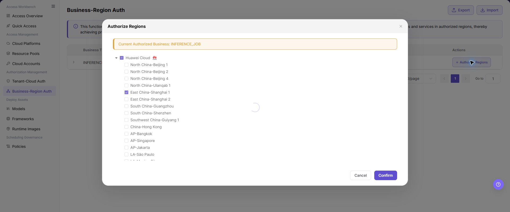

# Business-Region Auth

## Feature Overview

| Item | Content |
| --- | --- |
| Applicable Roles | Operators |
| Navigation Path | AI Infra(On-Cloud) > Authorization Management > Business-Region Auth |
| Page Route | `/infrahub/op/auth/region-auth` |
| Managed Objects | Authorization between business types and cloud-platform regions |

#### Beginner Explanation

Business-Region Auth defines the regions available to a business type. Even with tenant-cloud authorization, deployment remains limited to regions authorized here.

#### Terminology

| Term | Description |
| --- | --- |
| Business Type | A business scenario that needs cloud resources. |
| Authorized Region | A cloud-platform region available to a business type. |
| Resource Pool Scope | The set of pools visible and schedulable for the business. |

#### Recommended Operation Order

Confirm the business type, expand it to review current regions, open Authorize Regions to change scope, and verify the deployment page afterward.

#### Beginner Checklist

| Scenario | Do First | Do Not Do Directly |
| --- | --- | --- |
| First visit | Review existing objects, states, and available actions | Change an unknown object |
| Before a change | Verify upstream dependencies, impact scope, and target object | Skip dependency and impact checks |
| After completion | Validate the current and downstream pages with Result Validation | Rely only on a success message |
| Page error | Record the redacted object, time, and page message | Submit repeatedly or record real credentials |

## Prerequisites

1. The current account has the permission required for Business-Region Auth.
2. The business type exists, and related platforms and pools are connected and enabled.
3. Before changing regions, check existing deployments, scheduling policies, and capacity arrangements.

## Page Description

The page provides an authorization entry by business type, and the dialog lists regions by cloud platform.

Page screenshots:

The image shows Business-Region Auth page. Verify the target object, current state, fields, and actions.

The image shows Business authorization list reference. Verify the target object, current state, fields, and actions.

## Main Operations

### View Business-Region Authorization

1. Open Business-Region Auth.
2. Expand the target business type and review authorized regions.
3. Compare the scope with pool state and deployment requirements.

### Authorize Resource Pools

1. Click **"Authorize Regions"** on the target business row.
2. Expand the region tree by cloud platform and select or clear target regions.
3. Verify the current business and region scope, then click **"Confirm"**.
4. Verify the result in Quick Deployment or Access Overview.

The image shows Authorize resource pools. Verify the target object, current state, fields, and actions.

The image shows Authorize regions reference. Verify the target object, current state, fields, and actions.

## Parameter Reference

| Field Name | Required | Field Type | Example | Description |
| --- | --- | --- | --- | --- |
| Business Type | Yes | Text/Group | `INFERENCE_JOB` | Business scenario whose region authorization is being configured. |
| Current Authorized Business | Yes | Prompt | `INFERENCE_JOB` | Indicates the business type currently being authorized in the dialog. |
| Cloud Platform | Yes | Tree group | `Huawei Cloud` | Used to expand and select regions under the cloud platform. |
| Authorized Regions | Yes | Multi-select | `East China-Shanghai 1` | Cloud platform regions that the current business is allowed to use. |
| Region Count | No | Number | `2` | Number of authorized regions displayed in the list card. |
| Authorize Regions | No | Button | `Authorize Regions` | Opens the region authorization dialog. |
| Export | No | Button | `Export` | Exports authorization data and may contain sensitive operational information. |
| Import | No | Button | `Import` | Imports authorization data in bulk and may change multiple authorization configurations. |
| Cancel | No | Button | `Cancel` | Closes the dialog without saving the current configuration. |
| Confirm | Yes | Button | `Confirm` | Submits the region authorization configuration. Review carefully before clicking. |

## Pitfalls

- Do not skip the upstream dependency check: The business type exists, and related platforms and pools are connected and enabled.
- Confirm impact before a configuration change: Before changing regions, check existing deployments, scheduling policies, and capacity arrangements.
- A success message does not prove downstream synchronization. Use Result Validation afterward.
- Use only `<API_KEY>`, `<PERSONAL_KEY>`, `<ACCESS_KEY_ID>`, `<ACCESS_KEY_SECRET>`, `<BASE_URL>`, and `<ENDPOINT_PATH>` for credential and endpoint examples.

## Result Validation

| Check Item | Success Signal | If Abnormal |
| --- | --- | --- |
| Page is accessible | Title, navigation, and main content display correctly | Check role permission and navigation path |
| Managed objects are visible | Authorization between business types and cloud-platform regions display as expected | Clear filters and verify upstream dependencies |
| Operation result is saved | The expected state or new record appears | Review page messages, required fields, and dependencies |
| Downstream result is consistent | Associated pages show the change | Wait for synchronization, refresh, and return to the responsible object |

## FAQ

#### Target Object Is Missing in Business-Region Auth

**Symptom:**

The expected object is missing from the list or selector.

**Possible Causes:**

- Active query criteria filter out the target object.
- An upstream object is disabled, or the current role lacks visibility.

**Resolution:**

1. Clear filters and refresh the page.
2. Verify the prerequisite object: The business type exists, and related platforms and pools are connected and enabled.
3. Confirm the current role and data scope, then locate the object again.

#### Business-Region Auth Action Is Unavailable

**Symptom:**

An expected button, menu, or state switch is unavailable.

**Possible Causes:**

- The current account lacks the required action permission.
- Object state, references, or prerequisites block the action.

**Resolution:**

1. Verify the permission for the action and the current object state.
2. Check references and prerequisites identified by the page message.
3. Remove the blocker, refresh the page, and perform the action once.

#### Business-Region Auth Change Does Not Reach Downstream

**Symptom:**

The page reports success, but a downstream page still shows the old state.

**Possible Causes:**

- An associated page has stale cache or synchronization delay.
- The current and downstream pages use different roles, tenants, or data scopes.

**Resolution:**

1. Wait for synchronization and refresh both pages.
2. Confirm that both pages use the same role, tenant, and object scope.
3. If they still differ, return to the responsible object and verify the saved result.

#### Business-Region Auth Data Differs from Another Page

**Symptom:**

Counts or states differ from an associated page.

**Possible Causes:**

- The pages use different filters, aggregation rules, or update times.
- The change is still synchronizing, or role-based data scopes differ.

**Resolution:**

1. Align filters and aggregation rules on both pages.
2. Check update times and wait for synchronization.
3. Compare object details instead of summary counts only.

#### How to Troubleshoot a Business-Region Auth Failure

**Symptom:**

Submission fails or the state does not change for an extended period.

**Possible Causes:**

- Required fields, field combinations, or object state do not meet submission rules.
- An upstream dependency is invalid, the request failed, or the same action is already processing.

**Resolution:**

1. Record the redacted object, time, and complete page message.
2. Verify required fields, object state, and upstream dependencies.
3. Confirm that no identical job is processing before one retry.

## Notes

- Before changing regions, check existing deployments, scheduling policies, and capacity arrangements.
- Do not put real accounts, credentials, internal locations, or customer data in documentation, screenshots, tickets, or chat records.
- Authorization, deployment, deletion, publication, state, or billing changes require an auditable record and recovery plan.

## Next Steps

1. Validate the deployment or resource selection flow from the business perspective.
2. Review region selection order and fallback scope together with scheduling policies.
3. Regularly check authorized region counts to avoid business availability being too broad or too narrow.
