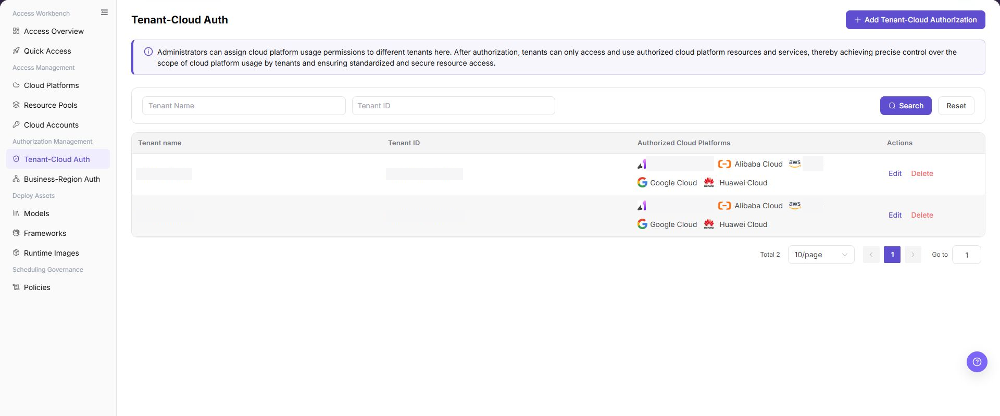
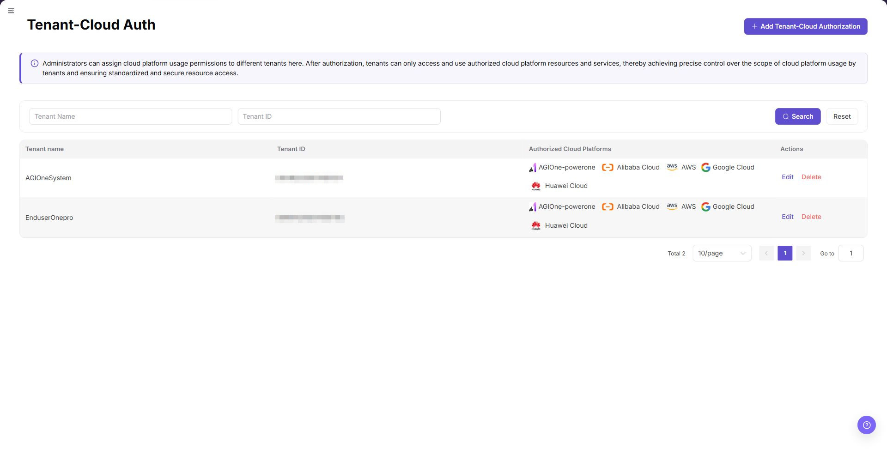
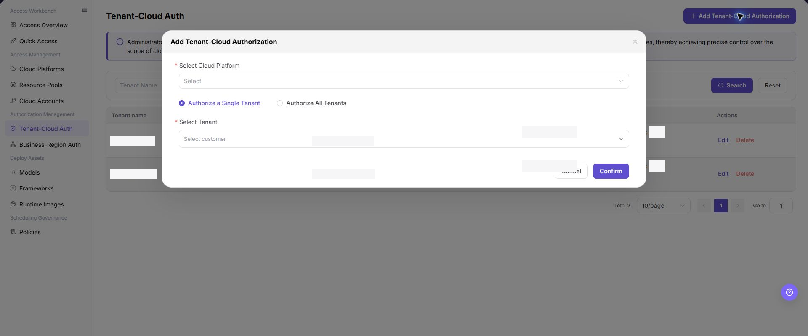
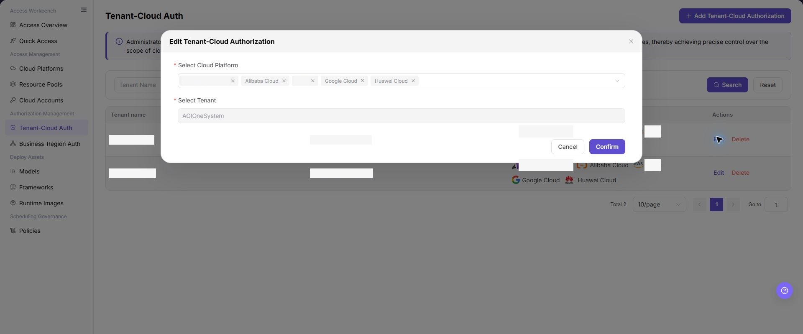
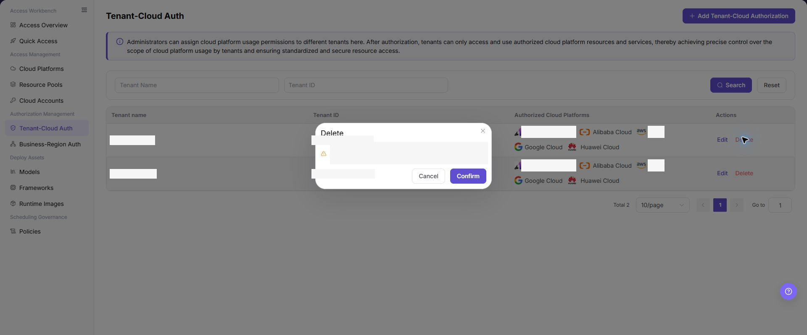

# Tenant-Cloud Auth

## Feature Overview

| Item | Content |
| --- | --- |
| Applicable Roles | Operators |
| Navigation Path | AI Infra(On-Cloud) > Authorization Management > Tenant-Cloud Auth |
| Page Route | `/infrahub/op/auth/platform-auth` |
| Managed Objects | Usage authorization between tenants and cloud platforms |

#### Beginner Explanation

Tenant-Cloud Auth grants a tenant access to a cloud platform. Authorized tenants can become eligible to see platform resources; removing authorization withdraws that scope.

#### Terminology

| Term | Description |
| --- | --- |
| Single-Tenant Authorization | Grants the selected cloud platform to one tenant. |
| Authorize All Tenants | Grants the selected cloud platform to all tenants. |
| Authorization Relationship | A saved availability relationship between a tenant and a cloud platform. |

#### Recommended Operation Order

Review existing relationships, add authorization, edit when scope changes, and check tenant deployments and business dependencies before deletion.

#### Beginner Checklist

| Scenario | Do First | Do Not Do Directly |
| --- | --- | --- |
| First visit | Review existing objects, states, and available actions | Change an unknown object |
| Before a change | Verify upstream dependencies, impact scope, and target object | Skip dependency and impact checks |
| After completion | Validate the current and downstream pages with Result Validation | Rely only on a success message |
| Page error | Record the redacted object, time, and page message | Submit repeatedly or record real credentials |

## Prerequisites

1. The current account has the permission required for Tenant-Cloud Auth.
2. The target cloud platform and tenant exist, and the authorization boundary is approved.
3. Before changing authorization, confirm tenant deployments, business visibility, and revocation arrangements.

## Page Description

The page shows tenant names, authorized cloud platforms, and add, edit, and delete actions.

Page screenshots:

The image shows Tenant-Cloud Auth page. Verify the target object, current state, fields, and actions.

The image shows Tenant authorization list reference. Verify the target object, current state, fields, and actions.

## Main Operations

### Add Tenant-Cloud Authorization

1. Click **"Add Tenant-Cloud Auth"**.
2. Select a cloud platform.
3. Select `Single-Tenant Authorization` or `Authorize All Tenants`; select the target tenant for single-tenant mode.
4. Verify the scope and click **"Confirm"**.

The image shows Add tenant authorization. Verify the target object, current state, fields, and actions.

The image shows Add tenant authorization reference. Verify the target object, current state, fields, and actions.

### Edit Tenant-Cloud Authorization

1. Click **"Edit"** on the target record.
2. Verify the cloud platform, authorization mode, and tenant scope.
3. Save and verify the updated relationship in the list.

The image shows Edit tenant authorization. Verify the target object, current state, fields, and actions.

### Delete Tenant-Cloud Authorization

1. Confirm that the tenant no longer depends on the cloud platform.
2. Click **"Delete"** and verify the target record.
3. After confirmation, check the list and tenant-side visibility.

The image shows Delete tenant authorization. Verify the target object, current state, fields, and actions.

## Parameter Reference

| Field Name | Required | Field Type | Example | Description |
| --- | --- | --- | --- | --- |
| Tenant Name | No | Text | `Sample Tenant` | Filters authorization records by tenant name. Do not enter a real customer name in examples. |
| Tenant ID | No | Text/Number | `1000000000000000` | Filters authorization records by tenant identifier. The example value is for documentation only. |
| Authorized Cloud Platforms | Yes | List/Multiple values | `Alibaba Cloud` | Displays or selects the cloud platform scope available to the tenant. |
| Select Cloud Platform | Yes | Dropdown | `Alibaba Cloud` | Selects the cloud platform to authorize when adding authorization. |
| Authorization Mode | Yes | Radio | `Authorize a Single Tenant` | Selects whether to authorize one tenant or all tenants. |
| Select Tenant | Conditionally required | Dropdown | `Sample Tenant` | Required when `Authorize a Single Tenant` is selected. |
| Search | No | Button | `Search` | Queries authorization records with the current filters. |
| Reset | No | Button | `Reset` | Clears filters and restores the list display. |
| Pagination | No | Page control | `10/page` | Opens additional list pages without modifying authorization records. |
| Edit | No | Action entry | `Edit` | Modifies an existing authorization. Confirm the impact scope before editing. |
| Delete | No | Action entry | `Delete` | Deletes authorization and may affect tenant resource availability. Use with caution. |
| Cancel | No | Button | `Cancel` | Closes the dialog without saving the current configuration. |
| Confirm | Yes | Button | `Confirm` | Submits the authorization configuration. Review carefully before clicking. |

## Pitfalls

- Do not skip the upstream dependency check: The target cloud platform and tenant exist, and the authorization boundary is approved.
- Confirm impact before a configuration change: Before changing authorization, confirm tenant deployments, business visibility, and revocation arrangements.
- A success message does not prove downstream synchronization. Use Result Validation afterward.
- Use only `<API_KEY>`, `<PERSONAL_KEY>`, `<ACCESS_KEY_ID>`, `<ACCESS_KEY_SECRET>`, `<BASE_URL>`, and `<ENDPOINT_PATH>` for credential and endpoint examples.

## Result Validation

| Check Item | Success Signal | If Abnormal |
| --- | --- | --- |
| Page is accessible | Title, navigation, and main content display correctly | Check role permission and navigation path |
| Managed objects are visible | Usage authorization between tenants and cloud platforms display as expected | Clear filters and verify upstream dependencies |
| Operation result is saved | The expected state or new record appears | Review page messages, required fields, and dependencies |
| Downstream result is consistent | Associated pages show the change | Wait for synchronization, refresh, and return to the responsible object |

## FAQ

#### Target Object Is Missing in Tenant-Cloud Auth

**Symptom:**

The expected object is missing from the list or selector.

**Possible Causes:**

- Active query criteria filter out the target object.
- An upstream object is disabled, or the current role lacks visibility.

**Resolution:**

1. Clear filters and refresh the page.
2. Verify the prerequisite object: The target cloud platform and tenant exist, and the authorization boundary is approved.
3. Confirm the current role and data scope, then locate the object again.

#### Tenant-Cloud Auth Action Is Unavailable

**Symptom:**

An expected button, menu, or state switch is unavailable.

**Possible Causes:**

- The current account lacks the required action permission.
- Object state, references, or prerequisites block the action.

**Resolution:**

1. Verify the permission for the action and the current object state.
2. Check references and prerequisites identified by the page message.
3. Remove the blocker, refresh the page, and perform the action once.

#### Tenant-Cloud Auth Change Does Not Reach Downstream

**Symptom:**

The page reports success, but a downstream page still shows the old state.

**Possible Causes:**

- An associated page has stale cache or synchronization delay.
- The current and downstream pages use different roles, tenants, or data scopes.

**Resolution:**

1. Wait for synchronization and refresh both pages.
2. Confirm that both pages use the same role, tenant, and object scope.
3. If they still differ, return to the responsible object and verify the saved result.

#### Tenant-Cloud Auth Data Differs from Another Page

**Symptom:**

Counts or states differ from an associated page.

**Possible Causes:**

- The pages use different filters, aggregation rules, or update times.
- The change is still synchronizing, or role-based data scopes differ.

**Resolution:**

1. Align filters and aggregation rules on both pages.
2. Check update times and wait for synchronization.
3. Compare object details instead of summary counts only.

#### How to Troubleshoot a Tenant-Cloud Auth Failure

**Symptom:**

Submission fails or the state does not change for an extended period.

**Possible Causes:**

- Required fields, field combinations, or object state do not meet submission rules.
- An upstream dependency is invalid, the request failed, or the same action is already processing.

**Resolution:**

1. Record the redacted object, time, and complete page message.
2. Verify required fields, object state, and upstream dependencies.
3. Confirm that no identical job is processing before one retry.

## Notes

- Before changing authorization, confirm tenant deployments, business visibility, and revocation arrangements.
- Do not put real accounts, credentials, internal locations, or customer data in documentation, screenshots, tickets, or chat records.
- Authorization, deployment, deletion, publication, state, or billing changes require an auditable record and recovery plan.

## Next Steps

1. Continue confirming tenant-available regions on the business-region authorization page.
2. Check the model deployment or resource selection page from the tenant perspective.
3. Regularly review configurations such as `Authorize All Tenants` to avoid overly broad authorization.
