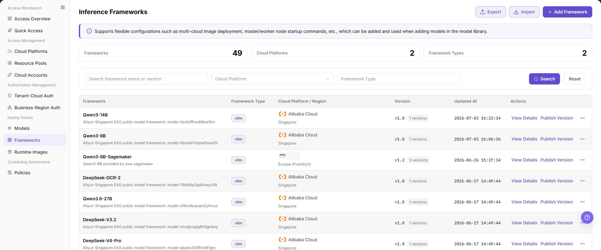
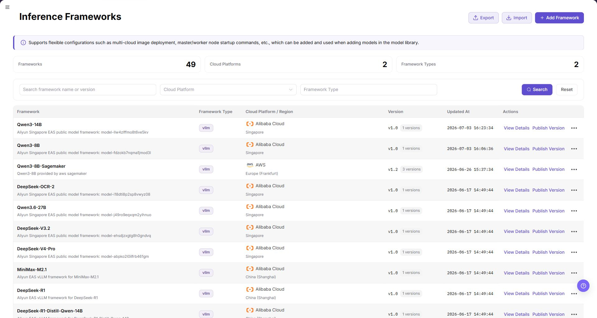
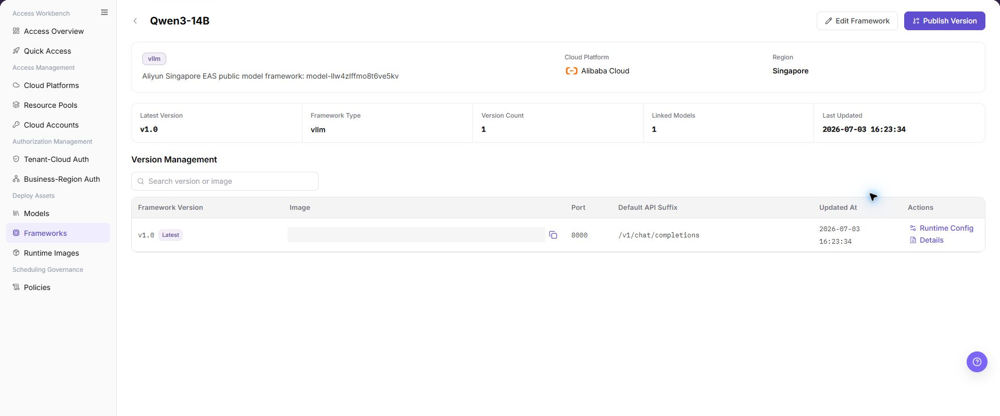
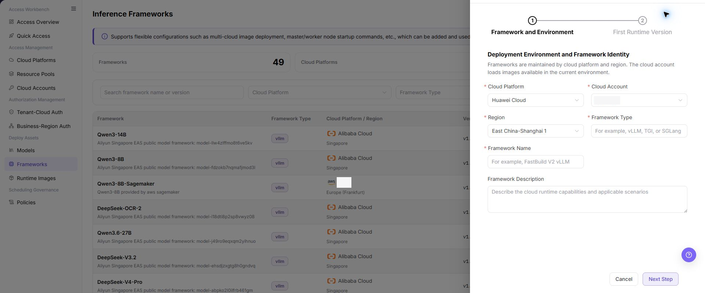
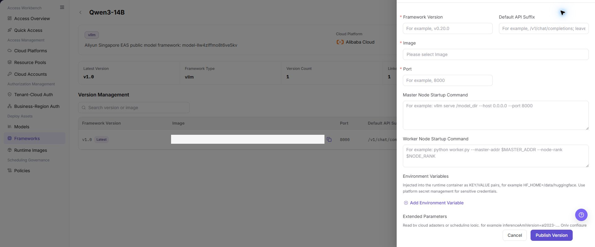

# Frameworks

## Feature Overview

| Item | Content |
| --- | --- |
| Applicable Roles | Operators |
| Navigation Path | AI Infra(On-Cloud) > Deploy Assets > Frameworks |
| Page Route | `/infrahub/op/model/framework` |
| Managed Objects | Inference frameworks, framework versions, runtime images, and startup configuration |

#### Beginner Explanation

Frameworks defines how a model service runs. A framework version combines the runtime image, startup method, and support scope for use by model-library records.

#### Terminology

| Term | Description |
| --- | --- |
| Inference Framework | The runtime framework that hosts model inference. |
| Framework Version | A framework record bound to an image and startup configuration. |
| Publish Version | Makes a maintained version available to model configuration. |

#### Recommended Operation Order

Review framework details and existing versions, add the framework, publish a configured version, and validate its availability in Models.

#### Beginner Checklist

| Scenario | Do First | Do Not Do Directly |
| --- | --- | --- |
| First visit | Review existing objects, states, and available actions | Change an unknown object |
| Before a change | Verify upstream dependencies, impact scope, and target object | Skip dependency and impact checks |
| After completion | Validate the current and downstream pages with Result Validation | Rely only on a success message |
| Page error | Record the redacted object, time, and page message | Submit repeatedly or record real credentials |

## Prerequisites

1. The current account has the permission required for Frameworks.
2. The target runtime image is registered and framework-version startup requirements are confirmed.
3. Before publishing a version, check model references, image accessibility, and startup parameters.

## Page Description

The page provides framework lists, details, versions, and the add entry.

Page screenshots:

The image shows Frameworks page. Verify the target object, current state, fields, and actions.

The image shows Framework list reference. Verify the target object, current state, fields, and actions.

## Main Operations

### View Framework Details

1. Locate the target framework and open its details.
2. Verify the framework identifier, state, and version list.
3. Open the target version and verify the runtime image and startup configuration.

The image shows Framework details. Verify the target object, current state, fields, and actions.

### Add Framework

1. Click **"Add Framework"**.
2. Enter basic information and add a version.
3. Select the runtime image and maintain startup and support scope.
4. Click **"Confirm"** and open the details for validation.

The image shows Add Framework. Verify the target object, current state, fields, and actions.

The image shows Add framework reference. Verify the target object, current state, fields, and actions.

### Publish Framework Version

1. Locate the configured version in framework details.
2. Click **"Publish"** and verify the version, image, and scope.
3. After publication, confirm that the version is selectable in Models.

The image shows Publish framework version. Verify the target object, current state, fields, and actions.

## Parameter Reference

| Field Name | Required | Field Type | Example | Description |
| --- | --- | --- | --- | --- |
| Cloud Platform | Yes | Tab/Single select | `Alibaba Cloud` | Selects the cloud platform to which the framework belongs. |
| Cloud Account | Yes | Dropdown | `Sample Cloud Account` | Selects the cloud account under the current cloud platform. |
| Region | Yes | Dropdown | `East China-Shanghai 1` | Selects the region where the framework is available. |
| Framework Type | Yes | Text | `LLM` | Framework type. The page example includes `LLM`. |
| Framework Name | Yes | Text | `Sample Framework` | Framework display name in the list and model configuration. |
| Framework Description | No | Multiline text | `Sample description` | Describes the framework purpose or compatible scenario. Do not write internal sensitive information. |
| Framework Version | Yes | Text | `v1.0` | Framework version. |
| Default API Suffix | No | Text | `/v1/chat/completions` | Default API path suffix for the model service. |
| Image | Yes | Dropdown | `Sample Image` | Runtime image used by the framework. |
| Port | Yes | Number/Text | `8000` | Port listened on by the framework service. |
| Master Node Startup Command | Yes | Multiline text | `python3 /opt/start.py` | Startup command for the master node. Examples must be sanitized. |
| Worker Node Startup Command | No | Multiline text | `python3 /opt/worker.py` | Startup command for worker nodes, filled in when required by the framework. |
| Environment Variables | No | Key-value configuration | `ENV_NAME=value` | Added through `Add Environment Variable`. Do not write real secrets. |
| Extended Parameters | No | Key-value configuration | `PARAM=value` | Added through `Add Extended Parameter`. Do not write internal sensitive parameters. |
| Export | No | Button | `Export` | Exports framework configuration and may contain sensitive operational information. |
| Import | No | Button | `Import` | Imports framework configuration in bulk and may change multiple records. |
| Cancel | No | Button | `Cancel` | Closes the dialog without saving the current configuration. |
| Confirm | Yes | Button | `Confirm` | Submits the framework configuration. Review carefully before clicking. |

## Pitfalls

- Do not skip the upstream dependency check: The target runtime image is registered and framework-version startup requirements are confirmed.
- Confirm impact before a configuration change: Before publishing a version, check model references, image accessibility, and startup parameters.
- A success message does not prove downstream synchronization. Use Result Validation afterward.
- Use only `<API_KEY>`, `<PERSONAL_KEY>`, `<ACCESS_KEY_ID>`, `<ACCESS_KEY_SECRET>`, `<BASE_URL>`, and `<ENDPOINT_PATH>` for credential and endpoint examples.

## Result Validation

| Check Item | Success Signal | If Abnormal |
| --- | --- | --- |
| Page is accessible | Title, navigation, and main content display correctly | Check role permission and navigation path |
| Managed objects are visible | Inference frameworks, framework versions, runtime images, and startup configuration display as expected | Clear filters and verify upstream dependencies |
| Operation result is saved | The expected state or new record appears | Review page messages, required fields, and dependencies |
| Downstream result is consistent | Associated pages show the change | Wait for synchronization, refresh, and return to the responsible object |

## FAQ

#### Target Object Is Missing in Frameworks

**Symptom:**

The expected object is missing from the list or selector.

**Possible Causes:**

- Active query criteria filter out the target object.
- An upstream object is disabled, or the current role lacks visibility.

**Resolution:**

1. Clear filters and refresh the page.
2. Verify the prerequisite object: The target runtime image is registered and framework-version startup requirements are confirmed.
3. Confirm the current role and data scope, then locate the object again.

#### Frameworks Action Is Unavailable

**Symptom:**

An expected button, menu, or state switch is unavailable.

**Possible Causes:**

- The current account lacks the required action permission.
- Object state, references, or prerequisites block the action.

**Resolution:**

1. Verify the permission for the action and the current object state.
2. Check references and prerequisites identified by the page message.
3. Remove the blocker, refresh the page, and perform the action once.

#### Frameworks Change Does Not Reach Downstream

**Symptom:**

The page reports success, but a downstream page still shows the old state.

**Possible Causes:**

- An associated page has stale cache or synchronization delay.
- The current and downstream pages use different roles, tenants, or data scopes.

**Resolution:**

1. Wait for synchronization and refresh both pages.
2. Confirm that both pages use the same role, tenant, and object scope.
3. If they still differ, return to the responsible object and verify the saved result.

#### Frameworks Data Differs from Another Page

**Symptom:**

Counts or states differ from an associated page.

**Possible Causes:**

- The pages use different filters, aggregation rules, or update times.
- The change is still synchronizing, or role-based data scopes differ.

**Resolution:**

1. Align filters and aggregation rules on both pages.
2. Check update times and wait for synchronization.
3. Compare object details instead of summary counts only.

#### How to Troubleshoot a Frameworks Failure

**Symptom:**

Submission fails or the state does not change for an extended period.

**Possible Causes:**

- Required fields, field combinations, or object state do not meet submission rules.
- An upstream dependency is invalid, the request failed, or the same action is already processing.

**Resolution:**

1. Record the redacted object, time, and complete page message.
2. Verify required fields, object state, and upstream dependencies.
3. Confirm that no identical job is processing before one retry.

## Notes

- Before publishing a version, check model references, image accessibility, and startup parameters.
- Do not put real accounts, credentials, internal locations, or customer data in documentation, screenshots, tickets, or chat records.
- Authorization, deployment, deletion, publication, state, or billing changes require an auditable record and recovery plan.

## Next Steps

1. Select the framework when adding a model in the model library and validate the compute plan.
2. Create a deployment with a test model to confirm service startup and health check results.
3. Regularly review framework images, startup commands, and environment variables to avoid outdated configuration.
