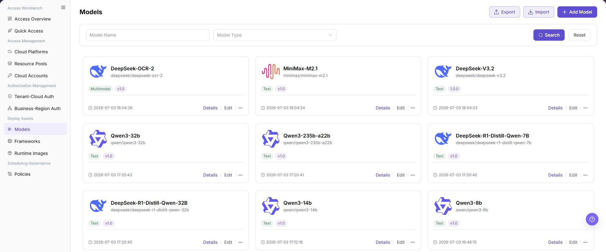
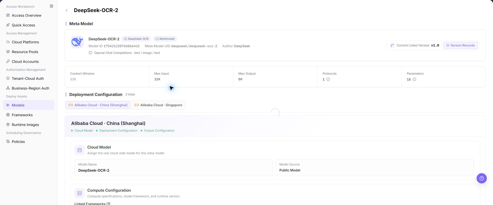
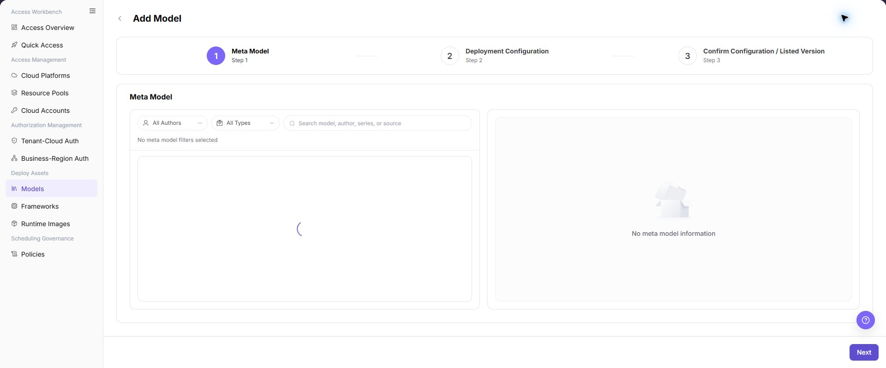

# Models

## Feature Overview

| Item | Content |
| --- | --- |
| Applicable Roles | Operators |
| Navigation Path | AI Infra(On-Cloud) > Deploy Assets > Models |
| Page Route | `/infrahub/op/model/model` |
| Managed Objects | Model-library records, meta-models, deployment targets, and cloud-model configuration |

#### Beginner Explanation

Models is the catalog of deployable model assets. Each record combines meta-model capability, cloud deployment targets, compute plans, and output configuration for policies and Quick Deployment.

#### Terminology

| Term | Description |
| --- | --- |
| Meta-model | A base definition of model capability, modality, and protocol. |
| Deployment Target | A cloud platform and region where the model can run. |
| Compute Plan | A resource-flavor combination used for model deployment. |

#### Recommended Operation Order

Review existing details, add a model, select the meta-model, deployment target, cloud model, compute plan, and output configuration in order, then submit and validate downstream availability.

#### Beginner Checklist

| Scenario | Do First | Do Not Do Directly |
| --- | --- | --- |
| First visit | Review existing objects, states, and available actions | Change an unknown object |
| Before a change | Verify upstream dependencies, impact scope, and target object | Skip dependency and impact checks |
| After completion | Validate the current and downstream pages with Result Validation | Rely only on a success message |
| Page error | Record the redacted object, time, and page message | Submit repeatedly or record real credentials |

## Prerequisites

1. The current account has the permission required for Models.
2. The meta-model, cloud platform, resource pool, and inference framework are ready.
3. Before adding or changing a model, confirm regions, resource cost, and policy references.

## Page Description

The page lists model-library records with details and an Add Model entry.

Page screenshots:

The image shows Models page. Verify the target object, current state, fields, and actions.

The image shows Model list reference. Verify the target object, current state, fields, and actions.

## Main Operations

### View Model Details

1. Locate the target model record.
2. Click the model name or **"Details"**.
3. Verify the meta-model, deployment target, framework version, compute plan, and state.

The image shows Model details. Verify the target object, current state, fields, and actions.

### Add Model

1. Click **"Add Model"** and select a meta-model.
2. Add a deployment target and select the platform, region, and cloud model.
3. Select the compute plan, framework version, and output configuration.
4. Review each configuration step and click **"Submit"**.
5. Return to Models and validate availability in Policies and Quick Deployment.

The image shows Add Model. Verify the target object, current state, fields, and actions.

The image shows Select meta-model. Verify the target object, current state, fields, and actions.

The image shows Add deployment target. Verify the target object, current state, fields, and actions.

The image shows Select cloud model. Verify the target object, current state, fields, and actions.

The image shows Select compute plan. Verify the target object, current state, fields, and actions.

The image shows Add output configuration. Verify the target object, current state, fields, and actions.

The image shows Confirm model configuration. Verify the target object, current state, fields, and actions.

## Parameter Reference

| Field Name | Required | Field Type | Example | Description |
| --- | --- | --- | --- | --- |
| Model Name | Yes | Text | `Sample Model` | Model name displayed in the Models list and details. |
| Model Type | No | Dropdown/Tag | `Conversation` | Used to filter or identify the model capability type. |
| Meta Model | Yes | Single select | `Sample Meta Model` | Base model definition selected in the first add model step. |
| Cloud Deployment Point | Yes | List/Selection | `Sample Cloud - Sample Region` | Each deployment point binds one cloud platform and region. |
| Cloud Account | Conditionally required | Dropdown | `Sample Cloud Account` | Cloud account selected when assigning a cloud model. |
| Cloud Model | Conditionally required | Dropdown | `Sample Cloud Model` | Cloud-side model that can be bound to the current model. |
| Model Framework | Yes | Single select/Table | `Sample Framework` | Framework that can run the model. |
| Type | No | Text | `vllm` | Model framework type. |
| Version | No | Text | `v1.0` | Framework or model version. |
| Image | Yes | Text | `<BASE_URL>/runtime:tag` | Runtime image address. Use placeholders only in documentation. |
| GPU Model | No | Text | `Sample GPU` | Used to filter deployment specifications. |
| GPU Count | No | Number | `1` | Used to filter deployment specifications. |
| CPU Cores | No | Number | `4` | CPU configuration in a deployment specification. |
| Memory (GB) | No | Number | `16` | Memory configuration in a deployment specification. |
| Card Type | No | Dropdown | `GPU` | Card type used when filtering specifications. |
| Specification | Yes | Single select | `example.spec` | Actual deployment specification name. |
| Price / Billing Cycle | No | Text | `--` | Price or billing cycle shown on the page. Confirm cost impact before configuration. |
| Request URL | Yes | Text | `{request_url}` | Generated after deployment. Do not write real internal addresses. |
| Request Method | Yes | Dropdown | `POST` | Request method in output configuration. |
| Request Headers | No | Table | `Authorization` | Request header configuration. Do not write real credentials. |
| Request Parameters | No | Table | `temperature` | Request parameter configuration. |
| Parameter type | No | Dropdown | `string` | Type of a request header or request parameter. |
| Required | No | Checkbox | `Yes` | Marks whether a parameter is required. |
| Save | Yes | Button | `Save` | Saves the current dialog or configuration block. |
| Next | Yes | Button | `Next` | Moves to the next configuration step. |

## Pitfalls

- Do not skip the upstream dependency check: The meta-model, cloud platform, resource pool, and inference framework are ready.
- Confirm impact before a configuration change: Before adding or changing a model, confirm regions, resource cost, and policy references.
- A success message does not prove downstream synchronization. Use Result Validation afterward.
- Use only `<API_KEY>`, `<PERSONAL_KEY>`, `<ACCESS_KEY_ID>`, `<ACCESS_KEY_SECRET>`, `<BASE_URL>`, and `<ENDPOINT_PATH>` for credential and endpoint examples.

## Result Validation

| Check Item | Success Signal | If Abnormal |
| --- | --- | --- |
| Page is accessible | Title, navigation, and main content display correctly | Check role permission and navigation path |
| Managed objects are visible | Model-library records, meta-models, deployment targets, and cloud-model configuration display as expected | Clear filters and verify upstream dependencies |
| Operation result is saved | The expected state or new record appears | Review page messages, required fields, and dependencies |
| Downstream result is consistent | Associated pages show the change | Wait for synchronization, refresh, and return to the responsible object |

## FAQ

#### Target Object Is Missing in Models

**Symptom:**

The expected object is missing from the list or selector.

**Possible Causes:**

- Active query criteria filter out the target object.
- An upstream object is disabled, or the current role lacks visibility.

**Resolution:**

1. Clear filters and refresh the page.
2. Verify the prerequisite object: The meta-model, cloud platform, resource pool, and inference framework are ready.
3. Confirm the current role and data scope, then locate the object again.

#### Models Action Is Unavailable

**Symptom:**

An expected button, menu, or state switch is unavailable.

**Possible Causes:**

- The current account lacks the required action permission.
- Object state, references, or prerequisites block the action.

**Resolution:**

1. Verify the permission for the action and the current object state.
2. Check references and prerequisites identified by the page message.
3. Remove the blocker, refresh the page, and perform the action once.

#### Models Change Does Not Reach Downstream

**Symptom:**

The page reports success, but a downstream page still shows the old state.

**Possible Causes:**

- An associated page has stale cache or synchronization delay.
- The current and downstream pages use different roles, tenants, or data scopes.

**Resolution:**

1. Wait for synchronization and refresh both pages.
2. Confirm that both pages use the same role, tenant, and object scope.
3. If they still differ, return to the responsible object and verify the saved result.

#### Models Data Differs from Another Page

**Symptom:**

Counts or states differ from an associated page.

**Possible Causes:**

- The pages use different filters, aggregation rules, or update times.
- The change is still synchronizing, or role-based data scopes differ.

**Resolution:**

1. Align filters and aggregation rules on both pages.
2. Check update times and wait for synchronization.
3. Compare object details instead of summary counts only.

#### How to Troubleshoot a Models Failure

**Symptom:**

Submission fails or the state does not change for an extended period.

**Possible Causes:**

- Required fields, field combinations, or object state do not meet submission rules.
- An upstream dependency is invalid, the request failed, or the same action is already processing.

**Resolution:**

1. Record the redacted object, time, and complete page message.
2. Verify required fields, object state, and upstream dependencies.
3. Confirm that no identical job is processing before one retry.

## Notes

- Before adding or changing a model, confirm regions, resource cost, and policy references.
- Do not put real accounts, credentials, internal locations, or customer data in documentation, screenshots, tickets, or chat records.
- Authorization, deployment, deletion, publication, state, or billing changes require an auditable record and recovery plan.

## Next Steps

1. Review deployment points, compute plan, and output configuration on the model details page.
2. Configure or check Tenant-Cloud Auth and Business-Region Auth.
3. Validate from the user perspective that the model can be selected in quick access or deployment flows.
