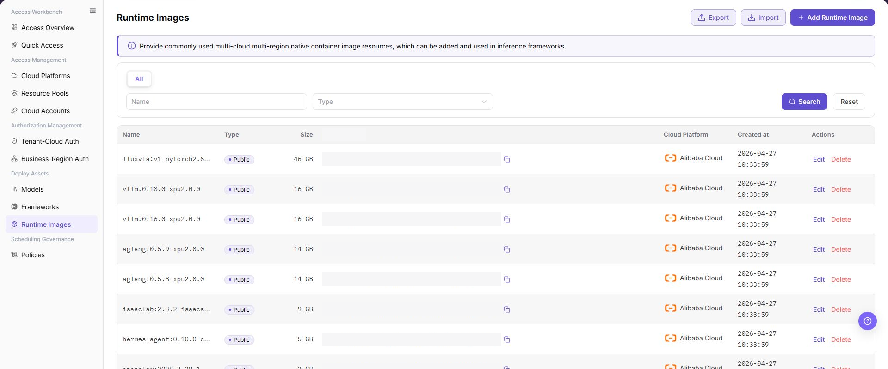
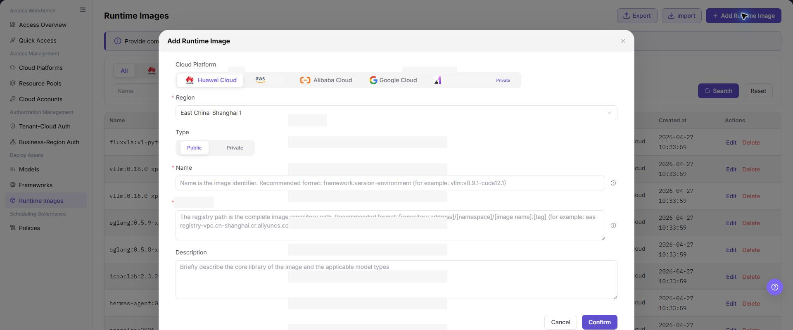
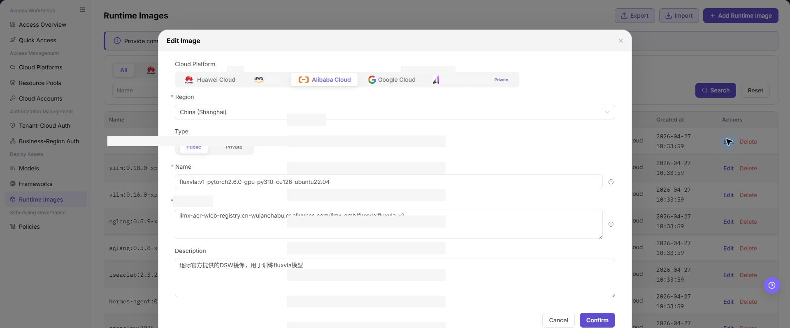

# Runtime Images

## Feature Overview

| Item | Content |
| --- | --- |
| Applicable Roles | Operators |
| Navigation Path | AI Infra(On-Cloud) > Deploy Assets > Runtime Images |
| Page Route | `/infrahub/op/model/image` |
| Managed Objects | Runtime images, image locations, platform architecture, and pool scope |

#### Beginner Explanation

Runtime Images defines the runtime package for model services. It tells frameworks where an image is located and which platforms and pools can use it; incorrect configuration causes pull or startup failures.

#### Terminology

| Term | Description |
| --- | --- |
| Image Location | A reference in an image registry. Documentation uses placeholders only. |
| Platform Architecture | The processor or runtime architecture supported by the image. |
| Resource Pool Scope | The platforms and pools allowed to use the image. |

#### Recommended Operation Order

Check for an existing image, add it and confirm platform, architecture, and pool scope, edit when location or scope changes, and validate it in a framework version.

#### Beginner Checklist

| Scenario | Do First | Do Not Do Directly |
| --- | --- | --- |
| First visit | Review existing objects, states, and available actions | Change an unknown object |
| Before a change | Verify upstream dependencies, impact scope, and target object | Skip dependency and impact checks |
| After completion | Validate the current and downstream pages with Result Validation | Rely only on a success message |
| Page error | Record the redacted object, time, and page message | Submit repeatedly or record real credentials |

## Prerequisites

1. The current account has the permission required for Runtime Images.
2. The image owner has confirmed accessibility, and platform and architecture are known.
3. Before adding or editing, check framework versions, pool permissions, and image-pull requirements.

## Page Description

The page lists runtime images and provides an add entry, including ownership, state, and actions.

Page screenshots:

The image shows Runtime Images page. Verify the target object, current state, fields, and actions.

The image shows Runtime image list reference. Verify the target object, current state, fields, and actions.

## Main Operations

### Add Runtime Image

1. Click **"Add Runtime Image"**.
2. Enter the name, image location, and platform architecture.
3. Select the applicable platform and pool scope.
4. Click **"Confirm"** and verify the new record.

The image shows Add Runtime Image. Verify the target object, current state, fields, and actions.

The image shows Add runtime image reference. Verify the target object, current state, fields, and actions.

### Edit Runtime Image

1. Click **"Edit"** on the target image row.
2. Verify the image location, architecture, and pool scope.
3. Save and verify that framework versions can still select and pull the image.

The image shows Edit Runtime Image. Verify the target object, current state, fields, and actions.

### View Runtime Images

1. Locate the target image by name or state.
2. Verify platform, architecture, pool scope, and update time.
3. If information differs, verify it in Edit instead of adding a duplicate.

## Parameter Reference

| Field Name | Required | Field Type | Example | Description |
| --- | --- | --- | --- | --- |
| Cloud Platform | Yes | Tab/Single select | `Alibaba Cloud` | Selects the cloud platform to which the image belongs or on which it can be used. |
| Region | Yes | Dropdown | `East China-Shanghai 1` | Selects the region where the image is located or available. |
| Type | Yes | Segmented control | `Public` | Selects public or private image. |
| Name | Yes | Text | `framework:v1.0-runtime` | Image identifier. It is recommended to include framework, version, and environment. |
| Registry Path | Yes | Multiline text | `<BASE_URL>/namespace/image:tag` | Complete image repository path. Use placeholders only in documentation. |
| Description | No | Multiline text | `Sample runtime image description` | Briefly describes the core library and applicable model types. Do not write internal sensitive information. |
| Size | No | Text | `16 GB` | Image size displayed in the list. |
| Created at | No | Date time | `2026-07-20 10:00:00` | Image creation time displayed in the list. |
| Search | No | Button | `Search` | Queries image records with the current filters. |
| Reset | No | Button | `Reset` | Clears filters and restores the list display. |
| Export | No | Button | `Export` | Exports image records and may contain sensitive operational configuration. |
| Import | No | Button | `Import` | Imports image records in bulk and may change multiple configurations. |
| Edit | No | Action entry | `Edit` | Modifies an existing image configuration. Confirm the impact scope before editing. |
| Delete | No | Action entry | `Delete` | Deletes an image record and may affect later deployment selection. |
| Cancel | No | Button | `Cancel` | Closes the dialog without saving the current configuration. |
| Confirm | Yes | Button | `Confirm` | Submits the runtime image configuration. Review carefully before clicking. |

## Pitfalls

- Do not skip the upstream dependency check: The image owner has confirmed accessibility, and platform and architecture are known.
- Confirm impact before a configuration change: Before adding or editing, check framework versions, pool permissions, and image-pull requirements.
- A success message does not prove downstream synchronization. Use Result Validation afterward.
- Use only `<API_KEY>`, `<PERSONAL_KEY>`, `<ACCESS_KEY_ID>`, `<ACCESS_KEY_SECRET>`, `<BASE_URL>`, and `<ENDPOINT_PATH>` for credential and endpoint examples.

## Result Validation

| Check Item | Success Signal | If Abnormal |
| --- | --- | --- |
| Page is accessible | Title, navigation, and main content display correctly | Check role permission and navigation path |
| Managed objects are visible | Runtime images, image locations, platform architecture, and pool scope display as expected | Clear filters and verify upstream dependencies |
| Operation result is saved | The expected state or new record appears | Review page messages, required fields, and dependencies |
| Downstream result is consistent | Associated pages show the change | Wait for synchronization, refresh, and return to the responsible object |

## FAQ

#### Target Object Is Missing in Runtime Images

**Symptom:**

The expected object is missing from the list or selector.

**Possible Causes:**

- Active query criteria filter out the target object.
- An upstream object is disabled, or the current role lacks visibility.

**Resolution:**

1. Clear filters and refresh the page.
2. Verify the prerequisite object: The image owner has confirmed accessibility, and platform and architecture are known.
3. Confirm the current role and data scope, then locate the object again.

#### Runtime Images Action Is Unavailable

**Symptom:**

An expected button, menu, or state switch is unavailable.

**Possible Causes:**

- The current account lacks the required action permission.
- Object state, references, or prerequisites block the action.

**Resolution:**

1. Verify the permission for the action and the current object state.
2. Check references and prerequisites identified by the page message.
3. Remove the blocker, refresh the page, and perform the action once.

#### Runtime Images Change Does Not Reach Downstream

**Symptom:**

The page reports success, but a downstream page still shows the old state.

**Possible Causes:**

- An associated page has stale cache or synchronization delay.
- The current and downstream pages use different roles, tenants, or data scopes.

**Resolution:**

1. Wait for synchronization and refresh both pages.
2. Confirm that both pages use the same role, tenant, and object scope.
3. If they still differ, return to the responsible object and verify the saved result.

#### Runtime Images Data Differs from Another Page

**Symptom:**

Counts or states differ from an associated page.

**Possible Causes:**

- The pages use different filters, aggregation rules, or update times.
- The change is still synchronizing, or role-based data scopes differ.

**Resolution:**

1. Align filters and aggregation rules on both pages.
2. Check update times and wait for synchronization.
3. Compare object details instead of summary counts only.

#### How to Troubleshoot a Runtime Images Failure

**Symptom:**

Submission fails or the state does not change for an extended period.

**Possible Causes:**

- Required fields, field combinations, or object state do not meet submission rules.
- An upstream dependency is invalid, the request failed, or the same action is already processing.

**Resolution:**

1. Record the redacted object, time, and complete page message.
2. Verify required fields, object state, and upstream dependencies.
3. Confirm that no identical job is processing before one retry.

## Notes

- Before adding or editing, check framework versions, pool permissions, and image-pull requirements.
- Do not put real accounts, credentials, internal locations, or customer data in documentation, screenshots, tickets, or chat records.
- Authorization, deployment, deletion, publication, state, or billing changes require an auditable record and recovery plan.

## Next Steps

1. Select or reference the runtime image in Frameworks.
2. Verify whether the image can be used in compute plans when adding a model in Models.
3. Use a test deployment to validate image pull, service startup, and health check results.
