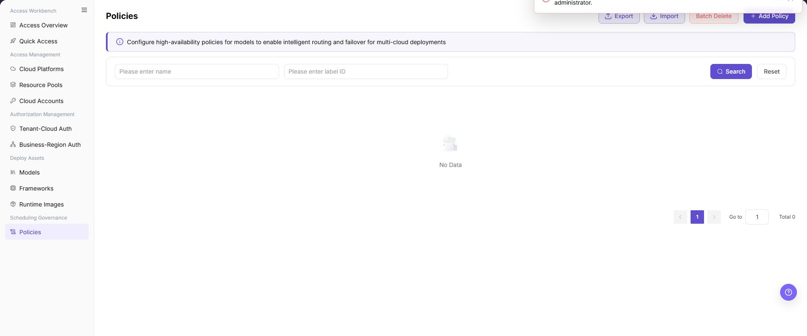
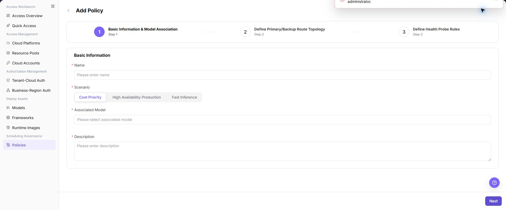

# Policies

## Feature Overview

| Item | Content |
| --- | --- |
| Applicable Roles | Operators |
| Navigation Path | AI Infra(On-Cloud) > Scheduling Governance > Policies |
| Page Route | `/infrahub/op/schedule/policy` |
| Managed Objects | Application scenarios, associated models, primary/backup routes, and health probes |

#### Beginner Explanation

Policies defines traffic rules for model deployment. It connects a model to primary and backup targets and uses health probes to determine routing.

#### Terminology

| Term | Description |
| --- | --- |
| Application Scenario | A scheduling objective such as cost priority, high availability, or low latency. |
| Primary/Backup Route | The topology between primary and backup deployment targets. |
| Health Probe | A rule that determines whether a target can continue receiving requests. |

#### Recommended Operation Order

Confirm the model and targets, create a policy, complete basic information, route topology, and health probes, then validate policy state and routing.

#### Beginner Checklist

| Scenario | Do First | Do Not Do Directly |
| --- | --- | --- |
| First visit | Review existing objects, states, and available actions | Change an unknown object |
| Before a change | Verify upstream dependencies, impact scope, and target object | Skip dependency and impact checks |
| After completion | Validate the current and downstream pages with Result Validation | Rely only on a success message |
| Page error | Record the redacted object, time, and page message | Submit repeatedly or record real credentials |

## Prerequisites

1. The current account has the permission required for Policies.
2. The associated model has at least one available deployment target, with confirmed framework version and resource flavor.
3. Before changing a policy, assess live routing, capacity, cost, and failover impact.

## Page Description

The page lists policies and provides a three-step creation flow.

Page screenshots:

The image shows Policies page. Verify the target object, current state, fields, and actions.

The image shows Policy list reference. Verify the target object, current state, fields, and actions.

## Main Operations

### Create Policy

1. Click **"Add Policy"**.
2. Enter a name and select the application scenario and associated model.
3. Click **"Next"** and configure primary/backup topology.
4. Configure health probes and verify thresholds and targets.
5. Click **"Submit"** and verify policy state in the list.

The image shows Create Policy. Verify the target object, current state, fields, and actions.

The image shows Basic information and model association. Verify the target object, current state, fields, and actions.

The image shows Primary/backup route topology. Verify the target object, current state, fields, and actions.

The image shows Health probe rules. Verify the target object, current state, fields, and actions.

### View Policies

1. Locate the target policy in the list.
2. Verify application scenario, associated model, state, and update time.
3. Open details and verify that topology and health probes match deployment targets.

## Parameter Reference

| Field Name | Required | Field Type | Example | Description |
| --- | --- | --- | --- | --- |
| Name | Yes | Text | `policy-cost-priority-demo` | Policy display name. Use sanitized examples or non-sensitive business-readable names. |
| Label ID | No | Text | `label-demo` | List filter field used to search policies by label identifier. |
| Scenario | Yes | Segmented control | `Cost Priority` | Selects the policy objective. The page supports cost priority, high availability production, and fast inference. |
| Associated Model | Yes | Select | `Sample Model / v1.0` | Selects the model and version bound to the policy. |
| Cloud Platform | No | Table field | `Sample Cloud Platform` | Cloud platform to which the related route node resource belongs. |
| Region | No | Table field | `Sample Region` | Region where the related route node resource is located. |
| Available specs | No | Table field | `gpu.example` | Resource specs available for the current model. |
| Available frameworks | No | Table field | `Sample Framework` | Inference frameworks available for the current model. |
| Description | Yes | Multiline text | `Sample policy description` | Describes the policy purpose. Do not write real customer, tenant, business, or internal test parameters. |
| Route Node | Yes | Selection | `Primary Route Node` | Node selected in route configuration for the policy. |
| Primary Route | Yes | Operation state | `Primary` | Route node used first by the policy. |
| Backup Route | No | Operation state | `Backup` | Backup route node used when the primary route is unavailable. |
| Priority | No | Ordering control | `P1` | Adjusts the priority order of backup routes or candidate nodes. |
| Spec | No | Display field | `gpu.example` | Resource spec used by the route node. |
| Price | No | Display field | `Sample price/hour` | Cost reference for the route node. Real amount details are not shown in documentation. |
| Framework | No | Display field | `Sample Framework` | Inference framework used by the route node. |
| Version | No | Table field | `v1.0` | Image or runtime configuration version. |
| Image | No | Table field | `<BASE_URL>/namespace/image:tag` | Image address example. Use placeholders only and do not write real registry addresses. |
| Master node startup command | No | Table field | `--model-path /models/example` | Master node startup command. Use placeholder examples only. |
| Worker node startup command | No | Table field | `--worker` | Worker node startup command. Do not write internal startup parameters. |
| Port | No | Number | `8000` | Service listening port. |
| Created at | No | Date time | `2026-07-21 10:00:00` | Creation time of the route node or version configuration. |
| Probe Type | Yes | Segmented control | `HTTP Heartbeat` | Health probe type. The page supports HTTP heartbeat, GPU performance metrics, and service status. |
| Probe Path | No | Text | `/health` | HTTP heartbeat probe path. |
| Check Interval | No | Number | `10` | Frequency for running health probes. |
| Failure Threshold | No | Number | `3` | Number of consecutive failures before the service is considered abnormal. |
| Recovery Threshold | No | Number/Rule | `2` | Rule or threshold for determining service recovery. |
| Downtime Timeout | No | Number | `30` | Timeout before the service is judged as down. |
| Search | No | Button | `Search` | Queries policy records with the current filters. |
| Reset | No | Button | `Reset` | Clears filters and restores the list display. |
| Export | No | Button | `Export` | Exports policy records and may contain sensitive operational configuration. |
| Import | No | Button | `Import` | Imports policy records in bulk and may change multiple policy configurations. |
| Batch Delete | No | Button | `Batch Delete` | Deletes policies in bulk. Confirm the impact scope before using it. |
| Previous | No | Button | `Previous` | Returns to the previous configuration step. |
| Next | No | Button | `Next` | Validates the current step and moves to the next step. |
| Submit | Yes | Button | `Submit` | Final action that submits the policy configuration. Review carefully before clicking. |

## Pitfalls

- Do not skip the upstream dependency check: The associated model has at least one available deployment target, with confirmed framework version and resource flavor.
- Confirm impact before a configuration change: Before changing a policy, assess live routing, capacity, cost, and failover impact.
- A success message does not prove downstream synchronization. Use Result Validation afterward.
- Use only `<API_KEY>`, `<PERSONAL_KEY>`, `<ACCESS_KEY_ID>`, `<ACCESS_KEY_SECRET>`, `<BASE_URL>`, and `<ENDPOINT_PATH>` for credential and endpoint examples.

## Result Validation

| Check Item | Success Signal | If Abnormal |
| --- | --- | --- |
| Page is accessible | Title, navigation, and main content display correctly | Check role permission and navigation path |
| Managed objects are visible | Application scenarios, associated models, primary/backup routes, and health probes display as expected | Clear filters and verify upstream dependencies |
| Operation result is saved | The expected state or new record appears | Review page messages, required fields, and dependencies |
| Downstream result is consistent | Associated pages show the change | Wait for synchronization, refresh, and return to the responsible object |

## FAQ

#### Target Object Is Missing in Policies

**Symptom:**

The expected object is missing from the list or selector.

**Possible Causes:**

- Active query criteria filter out the target object.
- An upstream object is disabled, or the current role lacks visibility.

**Resolution:**

1. Clear filters and refresh the page.
2. Verify the prerequisite object: The associated model has at least one available deployment target, with confirmed framework version and resource flavor.
3. Confirm the current role and data scope, then locate the object again.

#### Policies Action Is Unavailable

**Symptom:**

An expected button, menu, or state switch is unavailable.

**Possible Causes:**

- The current account lacks the required action permission.
- Object state, references, or prerequisites block the action.

**Resolution:**

1. Verify the permission for the action and the current object state.
2. Check references and prerequisites identified by the page message.
3. Remove the blocker, refresh the page, and perform the action once.

#### Policies Change Does Not Reach Downstream

**Symptom:**

The page reports success, but a downstream page still shows the old state.

**Possible Causes:**

- An associated page has stale cache or synchronization delay.
- The current and downstream pages use different roles, tenants, or data scopes.

**Resolution:**

1. Wait for synchronization and refresh both pages.
2. Confirm that both pages use the same role, tenant, and object scope.
3. If they still differ, return to the responsible object and verify the saved result.

#### Policies Data Differs from Another Page

**Symptom:**

Counts or states differ from an associated page.

**Possible Causes:**

- The pages use different filters, aggregation rules, or update times.
- The change is still synchronizing, or role-based data scopes differ.

**Resolution:**

1. Align filters and aggregation rules on both pages.
2. Check update times and wait for synchronization.
3. Compare object details instead of summary counts only.

#### How to Troubleshoot a Policies Failure

**Symptom:**

Submission fails or the state does not change for an extended period.

**Possible Causes:**

- Required fields, field combinations, or object state do not meet submission rules.
- An upstream dependency is invalid, the request failed, or the same action is already processing.

**Resolution:**

1. Record the redacted object, time, and complete page message.
2. Verify required fields, object state, and upstream dependencies.
3. Confirm that no identical job is processing before one retry.

## Notes

- Before changing a policy, assess live routing, capacity, cost, and failover impact.
- Do not put real accounts, credentials, internal locations, or customer data in documentation, screenshots, tickets, or chat records.
- Authorization, deployment, deletion, publication, state, or billing changes require an auditable record and recovery plan.

## Next Steps

1. Use a test deployment to validate policy hits, primary/backup routes, and failover behavior.
2. Monitor model service status, latency, cost, and availability affected by the policy.
3. Regularly review health probe thresholds, route priority, and associated model versions.
