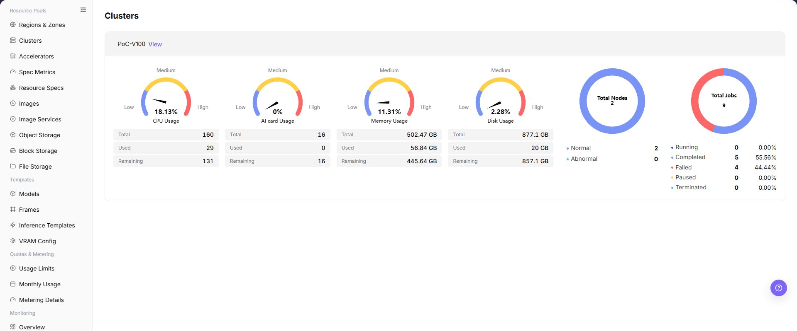

# Clusters

## Feature Overview

| Item | Content |
| --- | --- |
| Applicable Role | Operator |
| Navigation Path | AI Infra(On-Prem) > Monitoring > Clusters |
| Page Route | `/powerone/monitor/cluster` |
| Managed Object | Configuration, status, and relationships on Clusters |

#### Beginner Explanation

Cluster statistics are like health check reports for each equipment room. They compare capacity, health status, and resource watermarks across clusters to determine whether an issue is a local cluster problem or global resource shortage.

#### Terms

| Term | Description |
| --- | --- |
| Cluster Capacity | Total CPU, memory, GPU/NPU, and other resources the cluster can provide. |
| Resource Watermark | Ratio of used resources to remaining resources. |
| Health Status | Whether cluster components, nodes, and scheduling capability are normal. |

#### Recommended Operation Order

Confirm prerequisites for Cluster status, resource capacity, job count, and region/availability zone ownership, follow Main Operations, run Result Validation, and continue to the next page.

#### First-Time User Notes

Confirm that the task involves Configuration, status, and relationships on Clusters, and then follow the recommended order. If fields or state differ from expectations, check prerequisites before continuing downstream.

## Prerequisites

1. The current account has cluster monitoring view permissions.
2. The target cluster has been registered and is within the monitorable scope.
3. Cluster capacity, node, and accelerator metrics have been collected.
4. The region or cluster scope to compare has been confirmed.

## Page Description

Use this page to view and handle Configuration, status, and relationships on Clusters.

The image keeps the sidebar and complete feature area. Confirm the page title, scope, and primary operation entry.

Cluster statistics are used to compare cluster capacity, health status, and resource watermarks across different regions or resource pools. Operators can use the cluster dimension to determine whether there is overall capacity shortage, collection exception, or a hotspot in a single cluster.

The following figure shows the cluster statistics page.

## Main Operations

### View Monitored Objects

1. Open the monitoring page and select the time range, region, and resource pool.
2. Filter the objects supported by the current page, such as clusters, nodes, devices, jobs, or status.
3. Check aggregation scope, data refresh time, and object count to avoid comparing different scopes.
4. If no data is shown, expand the range and clear filters one at a time. Redact internal resource names and metrics before sharing.

### Drill Down into Abnormal Metrics

1. Click an abnormal metric, trend point, or **"Details"** for the target object.
2. Keep the same time range and inspect utilization, status, alerts, and related objects.
3. Determine whether the anomaly affects one object, one cluster, or the whole environment. Compare adjacent monitoring pages if information is insufficient.
4. Do not start, stop, migrate, or delete resources to test a monitoring anomaly.

### View Cluster Statistics

#### Procedure

1. Go to `AI Infrastructure > On-Prem > Monitoring > Cluster Statistics`.
2. Confirm the region in the upper-right corner and page filters.
3. View lists, charts, or statistic cards.
4. Focus on abnormal status, high watermarks, long periods without updates, or data inconsistent with expectations.
5. When cluster watermarks are abnormal, enter cluster details, node statistics, and job monitoring to confirm specific nodes and jobs.

#### View Cluster Statistics

1. Go to `AI Infrastructure > On-Prem > Monitoring > Cluster Statistics`.
2. View the cluster list and overall running status, and confirm cluster name, region/AZ, node count, device count, and resource usage level.
3. Select region, cluster, resource type, or time range filters as provided by the page.
4. Review CPU, memory, accelerator, storage, node status, and job-related statistics to identify insufficient resources, abnormal nodes, or unavailable devices.
5. If a cluster shows abnormal usage, continue troubleshooting in Nodes, Devices, or Jobs monitoring pages.

#### Key Focus

- Whether cluster status is available.
- Whether GPU, CPU, memory, and disk usage rates are abnormal.
- Whether jobs are concentrated on a small number of clusters.

## Parameter Quick Reference

| Field Name | Required | Field Type | Example | Description |
| --- | --- | --- | --- | --- |
| Cluster Name | Yes | Text | `cluster-prod-a` | Locates the monitored cluster object. |
| Region / AZ | Conditionally required | Drop-down | `Wuhan / AZ A` | Limits the resource location to which the cluster belongs. |
| Node Count | System-generated | Number | `10` | Shows the number of nodes included in monitoring statistics for the cluster. |
| Device Count | System-generated | Number | `80` | Shows the number of accelerators or other devices included in monitoring statistics for the cluster. |
| CPU Usage | System-generated | Percentage | `70%` | Shows the CPU resource usage level of the cluster. |
| Memory Usage | System-generated | Percentage | `68%` | Shows the memory resource usage level of the cluster. |
| Accelerator Usage | System-generated | Percentage | `65%` | Shows the GPU, NPU, or other accelerator resource usage level. |
| Storage Usage | System-generated | Percentage | `72%` | Shows the storage resource usage level of the cluster. |
| Node Status | System-generated | Status | `Normal` | Shows whether nodes are online, abnormal, or unavailable. |
| Job Count | System-generated | Number | `32` | Shows the number of running, queued, or abnormal jobs in the cluster. |
| Time Range | Conditionally required | Date range | `Last 1 hour` | Controls the query window for statistic cards, trend charts, and list data. |
| Resource Watermark | System-generated | Percentage | `GPU 78%` | Displays usage ratio of CPU, memory, GPU/NPU, and other resources. |
| Health Status | System-generated | Status | `Healthy` | Shows whether the cluster has unavailable, alert, or collection abnormal states. |
| GPU Usage | System-generated | Percentage | `65%` | Determines whether accelerator resources are close to bottleneck. |
| Update Time | System-generated | Date time | `2026-07-06 10:00` | Determines whether cluster monitoring data is timely. |

## Pitfalls

- Normal cluster watermarks do not mean every node or device is available.
- Use the same time range and metric units for cross-cluster comparison.
- Continue drilling down into node and device monitoring when a cluster is abnormal.
- Cluster statistics may have collection latency. Do not judge faults based only on a single instant metric.
- Abnormal cluster usage should be investigated together with nodes, devices, jobs, and scheduling events.
- Do not write real cluster IDs, node names, device IDs, resource pool IDs, tenant information, internal metric keys, or test data in the document.

### Configuration Rules and Impact

- **Cluster status is used for capacity judgment**: If the cluster is healthy but watermarks are high, look at expansion or scheduling first. If abnormal, troubleshoot cluster access and collection first.
- **View resource watermarks by type**: CPU, memory, GPU/NPU, and storage bottlenecks mean different things. Do not look only at a single total score.
- **Fix the time range for cross-cluster comparison**: Different time windows affect peak values, averages, and exception statistics.
- **Unavailable clusters affect instance creation**: When users fail to create instances, also check cluster health, specification association, and quotas.

## Result Validation

| Check Item | Success Signal | If Abnormal |
| --- | --- | --- |
| Page load | Clusters charts or lists are visible | Check monitoring permission and whether collection is available in the selected region |
| Scope | Time range, region, and object count match the investigation | Clear filters and restore them one at a time to avoid mixed scopes |
| Freshness | Update time is within the expected collection interval | Check collection interval, connection, and alerts in system or monitoring configuration |
| Correlation | An abnormal metric can be linked to a cluster, node, device, or job | Keep the same time range and cross-check adjacent monitoring pages and object details |

## FAQ

#### No Data on Clusters

**Symptom:**

The page opens, but charts or lists are empty.

**Possible Causes:**

- No job ran in the selected time.
- collection is unavailable in the region.
- the role lacks metric permission.

**Solution:**

1. Expand the time range and reset filters
2. verify regional monitoring capability
3. compare an adjacent monitoring page.

#### Clusters Is Not Updating

**Symptom:**

The data does not change for an extended period.

**Possible Causes:**

- The next collection cycle has not arrived.
- the collector is abnormal.
- the page is cached.

**Solution:**

1. Check update time
2. inspect collector status and alerts
3. refresh with the same time range.

#### Clusters Differs from Adjacent Pages

**Symptom:**

The same object has different values on two monitoring pages.

**Possible Causes:**

- Aggregation granularity differs.
- time range or time zone differs.
- filters target different objects.

**Solution:**

1. Align time range and time zone
2. verify aggregation scope
3. clear and restore filters one at a time.

#### Cannot Drill Down to the Target

**Symptom:**

The metric or details entry does not lead to the expected object.

**Possible Causes:**

- The object ended or was removed.
- the role cannot see it.
- relationship identifiers differ.

**Solution:**

1. Record object and time
2. check its list state
3. ask the Operator to verify visibility.

#### A Spike Cannot Be Reproduced

**Symptom:**

A spike was recorded, but current details are normal.

**Possible Causes:**

- The spike was brief.
- sampling is coarse.
- the job has ended.

**Solution:**

1. Lock the spike interval
2. compare job and node events
3. retain a sanitized screenshot and object identifier.

## Notes

- Cluster health does not mean all services are normal. Combine it with instance and job status.
- Fix the time range when comparing across clusters.
- Do not expose internal cluster names, API Server, or network information.
- Before expansion, migration, or fault judgment, cross-check with node statistics, device monitoring, job monitoring, and scheduling events.
- Documentation examples must not include real cluster IDs, node names, device IDs, resource pool IDs, tenant information, internal metric keys, or test data.

## Next Steps

1. When watermarks are high, enter node statistics to locate hotspot nodes.
2. When accelerators are tight, enter device monitoring to confirm model and VRAM.
3. When a cluster is unavailable, return to resource pool cluster management to check access status.
