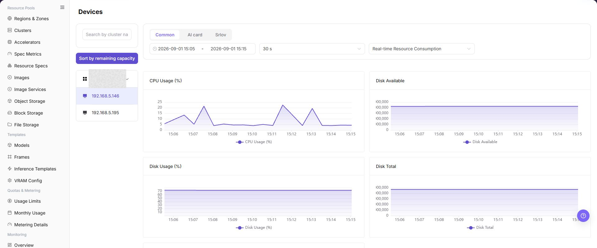

# Devices

## Feature Overview

| Item | Content |
| --- | --- |
| Applicable Role | Operator |
| Navigation Path | AI Infra(On-Prem) > Monitoring > Devices |
| Page Route | `/powerone/monitor/device` |
| Managed Object | Configuration, status, and relationships on Devices |

#### Beginner Explanation

Device monitoring is like an accelerator dashboard. It observes GPU/NPU utilization, VRAM, temperature, and health status to determine whether compute cards can continue hosting tasks.

#### Terms

| Term | Description |
| --- | --- |
| Device Utilization | Current compute utilization of GPU/NPU. |
| VRAM Usage | Accelerator VRAM occupation ratio. |
| Temperature | Device operating temperature. |

#### Recommended Operation Order

Confirm prerequisites for Accelerator devices such as GPU/NPU, VRAM, utilization, temperature, and health status, follow Main Operations, run Result Validation, and continue to the next page.

#### First-Time User Notes

Confirm that the task involves Configuration, status, and relationships on Devices, and then follow the recommended order. If fields or state differ from expectations, check prerequisites before continuing downstream.

## Prerequisites

1. The current account has device monitoring view permissions.
2. The target cluster has deployed device plugins and can report GPU/NPU metrics.
3. Device model, VRAM, temperature, and health status can be collected.
4. The accelerator model or job scope to focus on has been confirmed.

## Page Description

Use this page to view and handle Configuration, status, and relationships on Devices.

The image keeps the sidebar and complete feature area. Confirm the page title, scope, and primary operation entry.

Device monitoring is used to view GPU/NPU utilization, VRAM, temperature, and health status. Operators can use it to determine whether accelerators are offline, overheating, out of VRAM, or occupied by a single task for a long time.

The following figure shows the device monitoring page.

## Main Operations

### View Monitored Objects

1. Open the monitoring page and select the time range, region, and resource pool.
2. Filter the objects supported by the current page, such as clusters, nodes, devices, jobs, or status.
3. Check aggregation scope, data refresh time, and object count to avoid comparing different scopes.
4. If no data is shown, expand the range and clear filters one at a time. Redact internal resource names and metrics before sharing.

### Drill Down into Abnormal Metrics

1. Click an abnormal metric, trend point, or **"Details"** for the target object.
2. Keep the same time range and inspect utilization, status, alerts, and related objects.
3. Determine whether the anomaly affects one object, one cluster, or the whole environment. Compare adjacent monitoring pages if information is insufficient.
4. Do not start, stop, migrate, or delete resources to test a monitoring anomaly.

### View Device Monitoring

#### Procedure

1. Go to `AI Infrastructure > On-Prem > Monitoring > Device Monitoring`.
2. Confirm the region in the upper-right corner and page filters.
3. View lists, charts, or statistic cards.
4. Focus on abnormal status, high watermarks, long periods without updates, or data inconsistent with expectations.
5. When a device is abnormal, combine node statistics, job monitoring, and underlying driver status to judge whether it is job occupation or a hardware issue.

#### View Device Monitoring

1. Go to `AI Infrastructure > On-Prem > Monitoring > Device Monitoring`.
2. View the device list and overall running status, and confirm device ID, device type, node, cluster, region/AZ, and device status.
3. Select cluster, node, device type, device status, or time range filters as provided by the page.
4. Review accelerator usage, VRAM usage, temperature, health status, bound jobs, and exception information to identify unavailable devices, insufficient VRAM, or hardware exceptions.
5. If a device is abnormal, continue troubleshooting in Nodes or Jobs monitoring pages, together with cluster statistics, node logs, and scheduling events.

#### Key Focus

- Whether devices are identified and continuously reported.
- Whether VRAM and utilization are close to limits.
- Whether temperature, error counts, or health status are abnormal.

## Parameter Quick Reference

| Field Name | Required | Field Type | Example | Description |
| --- | --- | --- | --- | --- |
| Device ID | System-generated | Text | `GPU-0` | Distinguishes multiple devices on the same node. |
| Device Type | Yes | Text | `NVIDIA A800` | Shows GPU/NPU or other accelerator type and model. |
| Node | Conditionally required | Text | `node-gpu-01` | Locates the node where the device resides. |
| Cluster | Conditionally required | Text | `cluster-prod-a` | Locates the cluster to which the device belongs. |
| Region / AZ | Conditionally required | Drop-down | `Wuhan / AZ A` | Limits the resource location to which the device belongs. |
| Device Status | System-generated | Status | `Normal` | Shows whether the device is available, alerted, or offline. |
| Accelerator Usage | System-generated | Percentage | `92%` | Determines whether compute units are under high load. |
| VRAM Usage | System-generated | Percentage / Capacity | `62 GB / 80 GB` | Determines whether a model or job occupies all VRAM. |
| Temperature | System-generated | Number | `71°C` | Helps judge cooling and hardware health. |
| Health Status | System-generated | Status | `Normal` | Shows whether the device is available, alerted, or offline. |
| Bound Job | System-generated | Text / Number | `Running job` | Shows jobs currently associated with or occupying the device. |
| Time Range | Conditionally required | Date range | `Last 1 hour` | Controls the query window for statistic cards, trend charts, and list data. |

## Pitfalls

- Full VRAM does not necessarily mean compute is fully loaded. Judge together with utilization.
- Temperature exceptions should be escalated to operations promptly for hardware and cooling checks.
- When devices are invisible, check drivers, plugins, and node status first.
- Device monitoring may have collection latency. Do not judge hardware faults based only on a single instant metric.
- Device exceptions should be investigated together with node status, job status, scheduling events, device plugins, and node logs.
- High VRAM watermark does not necessarily mean a device fault. Judge together with bound jobs and model specifications.
- Do not write real device IDs, node names, node IPs, cluster IDs, resource pool IDs, tenant information, internal metric keys, or test data in the document.

### Configuration Rules and Impact

- **VRAM watermark directly affects model startup**: When VRAM is insufficient, instance creation may fail even if total cluster resources look sufficient.
- **View temperature and health together**: High temperature, missing cards, or driver exceptions can all cause job failures.
- **Device dimension is suitable for hotspot location**: When cluster watermarks are normal but jobs are slow, use the device dimension to confirm whether a single-card hotspot exists.
- **Model differences affect schedulability**: The same specification may require a specific GPU/NPU model, driver, or compute capability.

## Result Validation

| Check Item | Success Signal | If Abnormal |
| --- | --- | --- |
| Page load | Devices charts or lists are visible | Check monitoring permission and whether collection is available in the selected region |
| Scope | Time range, region, and object count match the investigation | Clear filters and restore them one at a time to avoid mixed scopes |
| Freshness | Update time is within the expected collection interval | Check collection interval, connection, and alerts in system or monitoring configuration |
| Correlation | An abnormal metric can be linked to a cluster, node, device, or job | Keep the same time range and cross-check adjacent monitoring pages and object details |

## FAQ

#### No Data on Devices

**Symptom:**

The page opens, but charts or lists are empty.

**Possible Causes:**

- No job ran in the selected time.
- collection is unavailable in the region.
- the role lacks metric permission.

**Solution:**

1. Expand the time range and reset filters
2. verify regional monitoring capability
3. compare an adjacent monitoring page.

#### Devices Is Not Updating

**Symptom:**

The data does not change for an extended period.

**Possible Causes:**

- The next collection cycle has not arrived.
- the collector is abnormal.
- the page is cached.

**Solution:**

1. Check update time
2. inspect collector status and alerts
3. refresh with the same time range.

#### Devices Differs from Adjacent Pages

**Symptom:**

The same object has different values on two monitoring pages.

**Possible Causes:**

- Aggregation granularity differs.
- time range or time zone differs.
- filters target different objects.

**Solution:**

1. Align time range and time zone
2. verify aggregation scope
3. clear and restore filters one at a time.

#### Cannot Drill Down to the Target

**Symptom:**

The metric or details entry does not lead to the expected object.

**Possible Causes:**

- The object ended or was removed.
- the role cannot see it.
- relationship identifiers differ.

**Solution:**

1. Record object and time
2. check its list state
3. ask the Operator to verify visibility.

#### A Spike Cannot Be Reproduced

**Symptom:**

A spike was recorded, but current details are normal.

**Possible Causes:**

- The spike was brief.
- sampling is coarse.
- the job has ended.

**Solution:**

1. Lock the spike interval
2. compare job and node events
3. retain a sanitized screenshot and object identifier.

## Notes

- Device serial numbers, node locations, and internal hardware IDs should be sanitized.
- Empty utilization does not necessarily indicate an exception. Combine it with the task time range.
- Device health exceptions should be handled according to hardware procedures first.
- Before device fault judgment, cross-check with node status, job status, scheduling events, device plugins, and node logs.
- Documentation examples must not include real device IDs, node names, node IPs, cluster IDs, resource pool IDs, tenant information, internal metric keys, or test data.

## Next Steps

1. When VRAM is high, enter job monitoring to locate occupying tasks.
2. When temperature or health is abnormal, contact operations to handle hardware or drivers.
3. When model resources are insufficient, review accelerator configuration and specification association.
