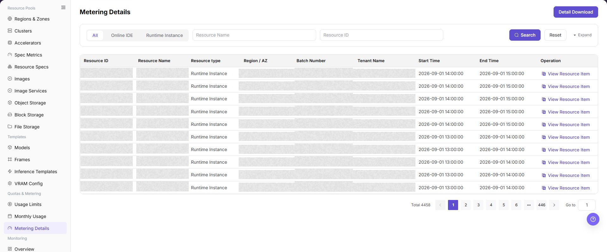

# Metering Details

## Feature Overview

| Item | Content |
| --- | --- |
| Applicable Role | Operator |
| Navigation Path | AI Infra(On-Prem) > Quotas & Metering > Metering Details |
| Page Route | `/powerone/quota-metric/resource` |
| Managed Object | Configuration, status, and relationships on Metering Details |

#### Beginner Explanation

Metering details are like resource consumption transaction records. They record what resources a tenant used, when they were used, how much was used, and how many Credits were converted.

#### Terms

| Term | Description |
| --- | --- |
| Resource Type | Type of metered object, such as online IDE or runtime instance. |
| Batch Number | Metering task or aggregation batch identifier. |
| Detail Download | Exports details within the current filter scope. |

#### Recommended Operation Order

Confirm prerequisites for Resource ID, resource name, resource type, region, availability zone, batch number, enterprise, and start/end time, follow Main Operations, run Result Validation, and continue to the next page.

#### First-Time User Notes

Confirm that the task involves Configuration, status, and relationships on Metering Details, and then follow the recommended order. If fields or state differ from expectations, check prerequisites before continuing downstream.

## Prerequisites

1. The current account has operator permissions.
2. The target region has been selected correctly.
3. Related resources, jobs, or metering tasks have reported data.

## Page Description

Use this page to view and handle Configuration, status, and relationships on Metering Details.

The image keeps the sidebar and complete feature area. Confirm the page title, scope, and primary operation entry.

Metering details are used to reconcile tenants, resources, billing cycles, usage, and Credits consumption record by record. Operators can locate abnormal details by tenant, resource name, or time range, and cross-check them with monthly metering summaries.

The following figure shows the metering details page.

## Main Operations

### View Metering Details

1. Go to `Quotas and Metering > Metering Details` and select a time range.
2. Filter by tenant, project, resource type, cluster, or metering status.
3. Check usage, unit, metering time, and refresh time.
4. If no record is returned, check the time zone and synchronization status. Redact metering and tenant data before sharing.

### Reconcile Metering with Resource Events

1. Open the target detail and record a redacted object, time, and metered value.
2. Compare resource creation, running, stopping, or deletion time with the metering interval.
3. Event time and metering interval should be traceable. If not, check data delay and measurement units.
4. Do not start or stop real resources to test metering anomalies.

### Download Metering Details

#### Procedure

1. Go to `AI Infrastructure > On-Prem > Quotas & Metering > Metering Details`.
2. Select resource type, region, availability zone, or enterprise.
3. Click **"Search"**.
4. Click **"View Resource Item"** or expand details to view resource start and end time.
5. To reconcile offline, Click **"Detail Download"**.

#### Detail Download

1. Go to `AI Infrastructure > On-Prem > Quotas & Metering > Metering Details`.
2. Select a resource type filter as needed, such as `All`, `Online IDE`, or `Runtime Instance`.
3. Use query conditions such as `Resource Name` and `Resource ID` to narrow the detail range.
4. Click **"Search"**, and confirm that resource ID, resource name, resource type, region/AZ, batch number, tenant name, start time, and end time match the export scope.
5. Before clicking **"Detail Download"**, verify filter conditions, billing period scope, and whether sensitive tenant or resource information is included.
6. After the download is complete, store the file in a controlled directory for reconciliation, metering review, or troubleshooting only.

#### Download Result Validation

- The download file is generated successfully, and resource type, region, availability zone, and time range match the current filters.
- File records can be reconciled with page details or resource events by resource ID and start and end time.

#### Download Notes

- Download files may contain tenant, resource, and metering information. Store and share them under access control.
- For a large range, narrow time, region, or resource-type filters first to reduce omissions and reconciliation difficulty.

#### Downloaded Records Do Not Match the Page Details

**Symptom:**

Record count or time range in the downloaded file does not match the page list.

**Possible Causes:**

- Download filters differ from the current page filters.
- Page data refreshed between search and download, or statistics are incomplete.
- Time zone, billing-period boundaries, or pagination caused a mistaken comparison.

**Solution:**

1. Set time, region, availability zone, and resource type again and record the filter scope.
2. Search and download again, then compare samples by resource ID and start and end time.
3. Align time zone and billing-period definitions and confirm the source metering task has completed.

## Parameter Quick Reference

| Field Name | Required | Field Type | Example | Description |
| --- | --- | --- | --- | --- |
| Tenant | Yes | Drop-down | `tenant-a` | Filters the consumption subject to view. |
| Resource Name | Conditionally required | Text | `inference-qwen` | Instance, job, or storage resource that generated metering. |
| Billing Cycle | Yes | Date range | `2026-07-01 to 2026-07-31` | Settlement cycle to which the details belong. |
| Usage | System-generated | Number / duration | `12 card-hours` | Actual resource usage. |
| Credits | System-generated | Number | `360` | Consumed credits converted from usage according to billing rules. |
| Detail Status | System-generated | Status | `Posted` | Shows whether the detail has completed statistics, posting, or correction. |

## Pitfalls

- Sufficient quota does not mean the underlying cluster definitely has idle resources.
- Metering data may be delayed. Use a unified time range and statistical definition during reconciliation.
- Sanitize tenant, amount, and business identifiers before exporting data.
- `Detail Download` exports metering details and may include tenant names, resource IDs, resource names, time ranges, and usage information.
- Downloaded files are only for reconciliation, metering review, or troubleshooting. Do not distribute them through unauthorized channels.
- Confirm filter conditions before downloading to avoid exporting an overly large scope or non-target tenant data.
- Do not write real tenant names, resource IDs, batch numbers, downloaded file names, internal paths, or test data in the manual.

### Configuration Rules and Impact

- **Filter before download**: Avoid exporting an overly large range.
- **Use details to explain summaries**: Monthly metering differences should first be checked from detail totals.

## Result Validation

| Check Item | Success Signal | If Abnormal |
| --- | --- | --- |
| Page entry | Metering Details opens with filters or statistics | Check menu permission, current business identity, and tenant scope |
| Data scope | Lists or statistics match the selected time, region, and object | Reset filters and verify time boundaries, time zone, and aggregation scope |
| Data update | Update time or latest record matches the expected cycle | Check whether the source job, metering, or quota record has been generated |
| Cross-check | Configuration, status, and relationships on Metering Details matches its details, billing, or monitoring records | Compare the responsible detail page by object identifier and time range |

## FAQ

#### No Records on Metering Details

**Symptom:**

The page opens, but lists or statistics are empty.

**Possible Causes:**

- Filters are too narrow.
- source records are not generated.
- the role cannot see them.

**Solution:**

1. Reset filters
2. verify the source job or metering cycle
3. check business identity and tenant scope.

#### Metering Details Shows the Wrong Scope

**Symptom:**

Data does not belong to the expected time, region, or object.

**Possible Causes:**

- Time boundaries differ.
- the region filter did not apply.
- ownership changed.

**Solution:**

1. Select time and region again
2. verify object identifiers
3. confirm ownership in source details.

#### Metering Details Is Delayed

**Symptom:**

A source operation completed, but its record is not visible.

**Possible Causes:**

- Aggregation is not complete.
- the page is cached.
- source state is still processing.

**Solution:**

1. Verify source state
2. wait one aggregation cycle and refresh
3. inspect the processing task if delay persists.

#### Details or Download Is Unavailable

**Symptom:**

The details, expand, or download entry is disabled.

**Possible Causes:**

- The record does not support it.
- role permission is insufficient.
- the file is not generated.

**Solution:**

1. Select an eligible record
2. check role permission
3. confirm the statistics or export task is complete.

#### Summary and Details Do Not Match

**Symptom:**

The summary differs from the total of individual records.

**Possible Causes:**

- Periods differ.
- values are rounded.
- some records are still processing.

**Solution:**

1. Align period and time zone
2. compare by object
3. wait for pending records and check again.

## Notes

- Metering details may have statistical delays. Confirm final posting status before settlement.
- Detail export files contain sensitive business data and should not be distributed through public channels.
- Do not directly modify detail definitions. Handle them through billing rules or correction processes.
- Before downloading details, confirm the filter scope and whether tenant or resource identifiers require desensitization.

## Next Steps

1. When details are abnormal, narrow the query scope by tenant, resource, and time range.
2. When details and monthly usage are inconsistent, confirm whether there are delayed postings, correction records, or cross-cycle resources.
3. Before exporting details, sanitize tenant names, resource names, amounts, and internal unit prices.
4. When explaining fees, combine resource specification, runtime duration, and billing rules into a definition tenants can understand.
