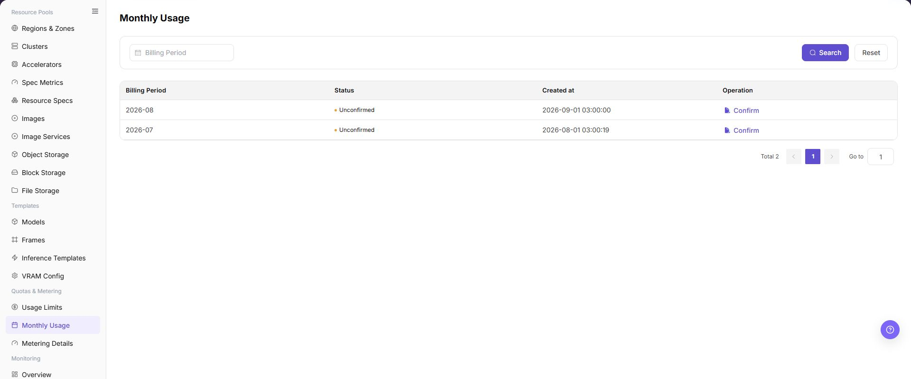

# Monthly Usage

## Feature Overview

| Item | Content |
| --- | --- |
| Applicable Role | Operator |
| Navigation Path | AI Infra(On-Prem) > Quotas & Metering > Monthly Usage |
| Page Route | `/powerone/quota-metric/month` |
| Managed Object | Configuration, status, and relationships on Monthly Usage |

#### Beginner Explanation

Monthly usage is like a monthly resource bill summary. It aggregates scattered compute, storage, and instance consumption into month, tenant, and resource type dimensions.

#### Terms

| Term | Description |
| --- | --- |
| Billing Period | Month or cycle to which metering belongs. |
| Monthly Summary | Consumption result aggregated by billing period. |

#### Recommended Operation Order

Confirm prerequisites for Billing period, status, creation time, and monthly summary records, follow Main Operations, run Result Validation, and continue to the next page.

#### First-Time User Notes

Confirm that the task involves Configuration, status, and relationships on Monthly Usage, and then follow the recommended order. If fields or state differ from expectations, check prerequisites before continuing downstream.

## Prerequisites

1. The current account has operator permissions.
2. The target region has been selected correctly.
3. Related resources, jobs, or metering tasks have reported data.

## Page Description

Use this page to view and handle Configuration, status, and relationships on Monthly Usage.

The image keeps the sidebar and complete feature area. Confirm the page title, scope, and primary operation entry.

Monthly metering aggregates tenant resource consumption, Credits conversion, and export status by month. Operators can first view monthly summaries, then drill down to metering details to reconcile abnormal growth, cross-cycle resources, or delayed postings.

The following figure shows the monthly metering page.

## Main Operations

### View Metering Totals

1. Go to `Quotas and Metering > Monthly Usage` and select the target month.
2. Filter by tenant, project, resource type, or cluster.
3. Check total usage, unit, resource count, and refresh time.
4. If no data is shown, check the month and metering job status. Redact totals before sharing.

### Drill Down into Monthly Metering Differences

1. Click an abnormal total or details entry while keeping the same month and object filters.
2. Compare Metering Details and resource events.
3. The total should be traceable to detail aggregation. If not, check delay, units, and supplemental records.
4. Do not modify metering or resource status to test the difference.

### View Monthly Metering

#### Procedure

1. Go to `AI Infrastructure > On-Prem > Quotas & Metering > Monthly Metering`.
2. Filter by billing period or status.
3. View billing period status and creation time in the list.
4. If the monthly summary is abnormal, go to metering details for reconciliation.

## Parameter Quick Reference

| Field Name | Required | Field Type | Example | Description |
| --- | --- | --- | --- | --- |
| Month | Yes | Month selector | `2026-07` | Month to which the monthly statistics belong. |
| Tenant | Conditionally required | Drop-down | `tenant-a` | View monthly usage for a specified tenant. |
| Resource Type | Conditionally required | Enum | `GPU` | Aggregates by compute, storage, instance, and other categories. |
| Aggregated Usage | System-generated | Number / capacity | `960 card-hours` | Accumulated usage for the month. |
| Fee / Credits | System-generated | Number | `28800` | Fee or Credits converted according to metering rules. |
| Export Status | System-generated | Status | `Generated` | Whether the monthly report can be downloaded or is still generating. |

## Pitfalls

- Sufficient quota does not mean the underlying cluster definitely has idle resources.
- Metering data may be delayed. Use a unified time range and statistical definition during reconciliation.
- Sanitize tenant, amount, and business identifiers before exporting data.

### Configuration Rules and Impact

- **Summary before details**: Monthly exceptions should be traced back to metering details.
- **Do not mix billing periods**: Clarify billing period scope during reconciliation.

## Result Validation

| Check Item | Success Signal | If Abnormal |
| --- | --- | --- |
| Page entry | Monthly Usage opens with filters or statistics | Check menu permission, current business identity, and tenant scope |
| Data scope | Lists or statistics match the selected time, region, and object | Reset filters and verify time boundaries, time zone, and aggregation scope |
| Data update | Update time or latest record matches the expected cycle | Check whether the source job, metering, or quota record has been generated |
| Cross-check | Configuration, status, and relationships on Monthly Usage matches its details, billing, or monitoring records | Compare the responsible detail page by object identifier and time range |

## FAQ

#### No Records on Monthly Usage

**Symptom:**

The page opens, but lists or statistics are empty.

**Possible Causes:**

- Filters are too narrow.
- source records are not generated.
- the role cannot see them.

**Solution:**

1. Reset filters
2. verify the source job or metering cycle
3. check business identity and tenant scope.

#### Monthly Usage Shows the Wrong Scope

**Symptom:**

Data does not belong to the expected time, region, or object.

**Possible Causes:**

- Time boundaries differ.
- the region filter did not apply.
- ownership changed.

**Solution:**

1. Select time and region again
2. verify object identifiers
3. confirm ownership in source details.

#### Monthly Usage Is Delayed

**Symptom:**

A source operation completed, but its record is not visible.

**Possible Causes:**

- Aggregation is not complete.
- the page is cached.
- source state is still processing.

**Solution:**

1. Verify source state
2. wait one aggregation cycle and refresh
3. inspect the processing task if delay persists.

#### Details or Download Is Unavailable

**Symptom:**

The details, expand, or download entry is disabled.

**Possible Causes:**

- The record does not support it.
- role permission is insufficient.
- the file is not generated.

**Solution:**

1. Select an eligible record
2. check role permission
3. confirm the statistics or export task is complete.

#### Summary and Details Do Not Match

**Symptom:**

The summary differs from the total of individual records.

**Possible Causes:**

- Periods differ.
- values are rounded.
- some records are still processing.

**Solution:**

1. Align period and time zone
2. compare by object
3. wait for pending records and check again.

## Notes

- Monthly usage is a reference for business operations and settlement. Confirm statistical definitions and final posting status before publishing.
- Exported reports may contain tenant names, fees, and usage details. Restrict distribution scope.
- Cross-month running resources may be split by cycle. Do not infer full-month fees from single-day details only.

## Next Steps

1. When monthly summaries are abnormal, drill down to metering details to reconcile resources and time ranges.
2. Before settlement, confirm that statistical cycles, delayed postings, and correction records have been processed.
3. After exporting reports, perform internal reviews by tenant or business line.
4. When abnormal fee growth is found, combine monitoring and job records to locate high-consumption resources.
