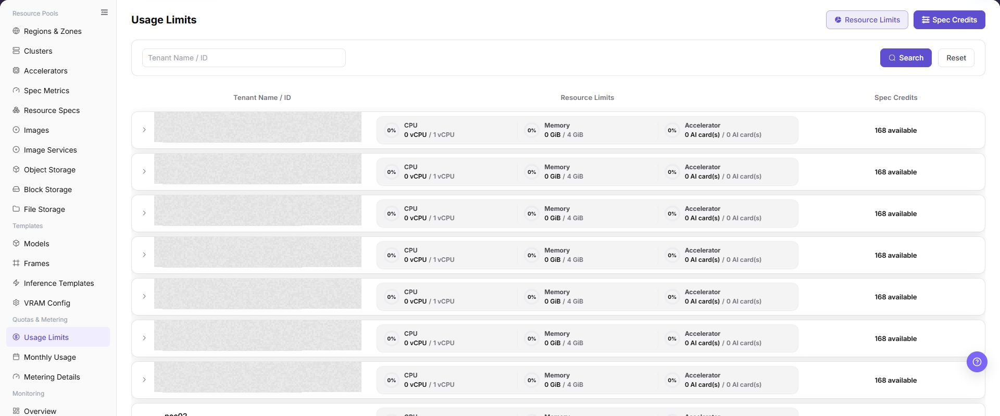

# Usage Limits

## Feature Overview

| Item | Content |
| --- | --- |
| Applicable Role | Operator |
| Navigation Path | AI Infra(On-Prem) > Quotas & Metering > Usage Limits |
| Page Route | `/powerone/quota-metric/credit` |
| Managed Object | Configuration, status, and relationships on Usage Limits |

#### Beginner Explanation

Usage limits are like a resource boundary sheet for a tenant. Resource specs define how much resource a single instance or job uses. Usage limits define how much resource a tenant can use in total and whether specific resources or specs have quota constraints.

#### Terms

| Term | Description |
| --- | --- |
| Resource Limits | Limits tenant usage by resource category, such as CPU, memory, and accelerator. |
| Spec Credits | Limits tenant usage by resource ID or spec dimension. |
| Unlimited | Removes a fixed limit from the resource item and expands the available scope. |

#### Recommended Operation Order

Confirm prerequisites for Tenant, resource limits, spec credits, resource items, resource IDs, and quota configuration, follow Main Operations, run Result Validation, and continue to the next page.

#### First-Time User Notes

Confirm that the task involves Configuration, status, and relationships on Usage Limits, and then follow the recommended order. If fields or state differ from expectations, check prerequisites before continuing downstream.

## Prerequisites

1. The current account has operator permissions.
2. The correct region is selected, and the region selector shows a normal status.
3. The target tenant, resource type, and spec scope have been confirmed.

## Page Description

Use this page to view and handle Configuration, status, and relationships on Usage Limits.

The image keeps the sidebar and complete feature area. Confirm the page title, scope, and primary operation entry.

Go to `Quotas & Metering > Usage Limits`. The page provides two top switches: `Resource Limits` and `Spec Credits`. The search box supports `Tenant Name / ID`. The main table shows `Tenant Name / ID`, `Resource Limits`, and `Spec Credits`.

After expanding a tenant row, operators can view or maintain the corresponding limit configuration. The `Resource Limits` expanded area shows `Category`, `Allocate resource`, and `Operation`. The `Spec Credits` expanded area shows `Resource ID`, `Quota`, and `Actions`. Actions such as `Delete`, `Unlimited`, and `Confirm` affect the tenant's available resource scope.

## Main Operations

### View Usage Limits

1. Go to `Quotas and Metering > Usage Limits`.
2. Filter by tenant, project, resource type, status, or update time.
3. Open details and check limit, used, remaining, and effective scope.
4. If no record is returned, reset filters. Redact quota and tenant information before sharing.

### Verify the Effect of a Limit Change

1. After an approved change, reopen the target limit and check the new value and update time.
2. In the same tenant or project context, review available quota and alert status.
3. If not applied, check the save message, synchronization delay, and parent limit.
4. Do not create real resources or repeatedly change quota to test the limit.

### View and Maintain Usage Limits

#### Pre-Operation Check

1. Confirm that the current region is the target region.
2. Confirm that the target tenant, resource type, and quota adjustment scope have been internally approved or verified.

#### Procedure

1. Go to `AI Infrastructure > On-Prem > Quotas & Metering > Usage Limits`.
2. Click **"Resource Limits"** or **"Spec Credits"** according to the verification target.
3. Enter `Tenant Name / ID` in the search box, or leave it empty to view the list.
4. Click **"Search"** to view matching tenants. Click **"Reset"** to restore query conditions.
5. Expand the target tenant row and review the current resource limits or spec credits.
6. In the `Resource Limits` expanded area, review `Category`, `Allocate resource`, and `Operation`.
7. In the `Spec Credits` expanded area, review `Resource ID`, `Quota`, and `Actions`.

8. Before maintaining configuration, identify whether `Unlimited`, `Delete`, `Add Row`, `Cancel`, and `Confirm` are present.
9. Before clicking the final **"Confirm"**, verify tenant, resource category, resource ID, quota, unlimited status, and deletion impact again.

## Parameter Quick Reference

| Field Name | Required | Field Type | Example | Description |
| --- | --- | --- | --- | --- |
| Tenant Name / ID | Depends on operation | Text / system-generated | `tenant-demo` | Locates the target tenant. Do not write real tenant names or tenant IDs in documentation. Area: Search box, main table. |
| Resource Limits | Depends on operation | Switch / summary column | `CPU 100 cores` | Views or maintains tenant limits for CPU, memory, accelerator, and other resource categories. Area: Top switch, main table. |
| Spec Credits | Depends on operation | Switch / summary column | `gpu-a100-1card: 10` | Views or maintains tenant credits by resource ID or spec dimension. Area: Top switch, main table. |
| Category | Depends on operation | System field | `CPU` | Resource category, such as CPU, memory, or accelerator category. Area: Resource Limits expanded area. |
| Allocate resource | Depends on operation | Quantity / capacity | `100 cores` | Allowed resource amount for the current category. Area: Resource Limits expanded area. |
| Resource ID | Depends on operation | System field | `gpu-a100-1card` | Spec or resource item identifier. Do not write real resource IDs in documentation. Area: Spec Credits expanded area. |
| Quota | Depends on operation | Quantity / capacity | `10` | Available quota for the current resource ID. Area: Spec Credits expanded area. |
| Unlimited | Depends on operation | Quick action | `Unlimited` | Removes the fixed limit from the corresponding resource item. Area: Expanded-area action. |
| Delete | Depends on operation | High-risk action | `Delete` | Deletes the current configuration item. Area: Expanded-area action. |
| Add Row | Depends on operation | Configuration action | `Add Row` | Adds a new resource item or quota configuration row. Area: Expanded-area action. |
| Cancel | Depends on operation | Safe exit | `Cancel` | Discards unsubmitted changes in the expanded area. Area: Expanded-area action. |
| Confirm | Depends on operation | High-risk final action | `Confirm` | Submits the current configuration adjustment. Area: Expanded-area action. |

## Pitfalls

- `Confirm` is a high-risk final action and may immediately change the tenant's available resource scope.
- `Delete` removes a configuration item and may leave a resource or spec without the expected limit.
- `Unlimited` expands the available resource scope and must not be used for real tenants without approval.
- Sufficient resource limits do not guarantee that the underlying cluster has idle capacity. Also check resource specs, cluster capacity, and scheduling status.
- Incorrect spec credits or resource IDs may make specs unavailable to users or expand access beyond expectations.
- Do not write real tenant IDs, tenant names, resource IDs, internal resource keys, accounts, secrets, tokens, or internal test parameters.

## Result Validation

| Check Item | Success Signal | If Abnormal |
| --- | --- | --- |
| Page entry | Usage Limits opens with filters or statistics | Check menu permission, current business identity, and tenant scope |
| Data scope | Lists or statistics match the selected time, region, and object | Reset filters and verify time boundaries, time zone, and aggregation scope |
| Data update | Update time or latest record matches the expected cycle | Check whether the source job, metering, or quota record has been generated |
| Cross-check | Configuration, status, and relationships on Usage Limits matches its details, billing, or monitoring records | Compare the responsible detail page by object identifier and time range |

## FAQ

#### No Records on Usage Limits

**Symptom:**

The page opens, but lists or statistics are empty.

**Possible Causes:**

- Filters are too narrow.
- source records are not generated.
- the role cannot see them.

**Solution:**

1. Reset filters
2. verify the source job or metering cycle
3. check business identity and tenant scope.

#### Usage Limits Shows the Wrong Scope

**Symptom:**

Data does not belong to the expected time, region, or object.

**Possible Causes:**

- Time boundaries differ.
- the region filter did not apply.
- ownership changed.

**Solution:**

1. Select time and region again
2. verify object identifiers
3. confirm ownership in source details.

#### Usage Limits Is Delayed

**Symptom:**

A source operation completed, but its record is not visible.

**Possible Causes:**

- Aggregation is not complete.
- the page is cached.
- source state is still processing.

**Solution:**

1. Verify source state
2. wait one aggregation cycle and refresh
3. inspect the processing task if delay persists.

#### Details or Download Is Unavailable

**Symptom:**

The details, expand, or download entry is disabled.

**Possible Causes:**

- The record does not support it.
- role permission is insufficient.
- the file is not generated.

**Solution:**

1. Select an eligible record
2. check role permission
3. confirm the statistics or export task is complete.

#### Summary and Details Do Not Match

**Symptom:**

The summary differs from the total of individual records.

**Possible Causes:**

- Periods differ.
- values are rounded.
- some records are still processing.

**Solution:**

1. Align period and time zone
2. compare by object
3. wait for pending records and check again.

## Notes

- Usage limits directly affect the tenant's available resource scope. Confirm tenant, region, and resource scope before real changes.
- `Confirm`, `Delete`, and `Unlimited` require explicit risk warnings.
- Do not write real tenant IDs, tenant names, resource IDs, internal resource keys, test parameters, accounts, secrets, or tokens in documentation, screenshots, or tickets.
- Sanitize tenant and resource identifiers before exporting or copying page information.

## Next Steps

1. After changing real limits, return to the user side and verify whether the target spec is selectable.
2. Use `Metering Details` to check whether subsequent resource usage matches expectations.
3. Use resource pools, monitoring, and job pages to troubleshoot insufficient resources or queued workloads.
4. Include quota changes in internal change or audit records.
