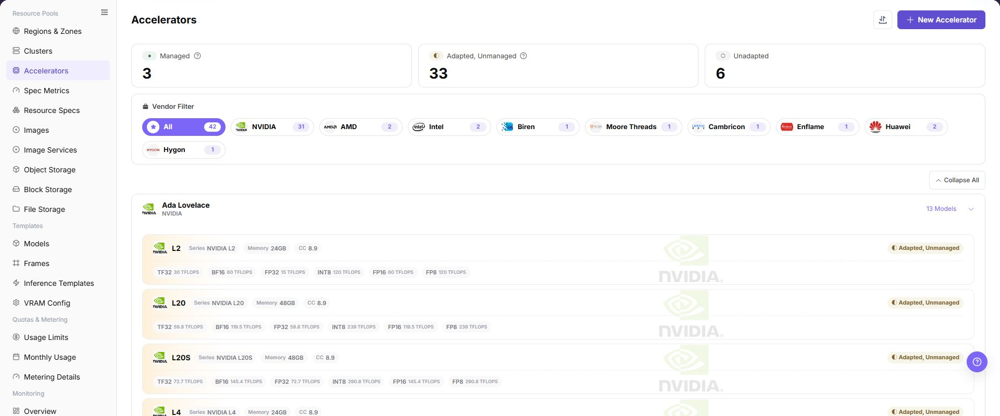
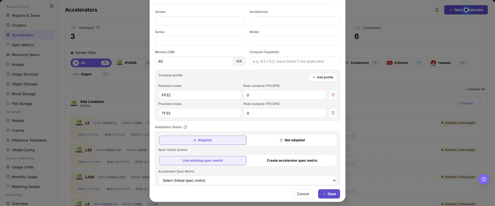

# Accelerators

## Feature Overview

| Item | Content |
| --- | --- |
| Applicable Role | Operator |
| Navigation Path | AI Infra(On-Prem) > Resource Pools > Accelerators |
| Page Route | `/powerone/resourcepool/accelerators` |
| Managed Object | Configuration, status, and relationships on Accelerators |

#### Beginner Explanation

- **Accelerator model** is like a hardware identity card. It tells the platform whether this is A100, H100, Ascend 910B, or another model.
- **Specification metric** is like a scheduling label. It determines which resource key Kubernetes uses to request the corresponding accelerator.
- **selector-key** helps identify device types, node labels, or monitoring fields. Incorrect configuration affects scheduling and monitoring matching.
- **Managed** means the platform can include this model in resource specifications and job scheduling.
- **Not adapted** models can be maintained as hardware information first, but cannot be opened as stable scheduling capability directly.

#### Terms

| Term | Description |
| --- | --- |
| Accelerator Vendor | Accelerator manufacturer, such as NVIDIA, Huawei, AMD, or Intel. |
| Model | Specific accelerator model, such as A100, H100, or Ascend 910B. |
| Architecture | Hardware architecture or generation under the same vendor, such as Ampere or Hopper. |

#### Recommended Operation Order

Confirm prerequisites for AI accelerator vendors, architectures, series, models, VRAM, compute capability, specification metrics, and management status, follow Main Operations, run Result Validation, and continue to the next page.

#### First-Time User Notes

Confirm that the task involves Configuration, status, and relationships on Accelerators, and then follow the recommended order. If fields or state differ from expectations, check prerequisites before continuing downstream.

## Prerequisites

1. The current account has operator permissions and can enter `AI Infra > On-Prem > Resource Pools > Accelerator Management`.
2. The target accelerator vendor, model, architecture, series, VRAM capacity, and compute capability have been confirmed.
3. Kubernetes resource key, selector-key, or monitoring identification fields have been confirmed to match actual cluster-reported information.
4. If the model needs to be managed for job scheduling, the corresponding metric has been prepared in `Resource Pools > Specification Metrics`.

## Page Description

Use this page to view and handle Configuration, status, and relationships on Accelerators.

The image keeps the sidebar and complete feature area. Confirm the page title, scope, and primary operation entry.

The page organizes accelerator models by vendor and architecture. The top area displays management status statistics, the left side supports vendor filtering, and cards display model, VRAM, compute power, and adaptation status.

The following figure shows the Accelerator Management list, where hardware models can be viewed by vendor and management status.

#### Vendor and Status Filters

| Area | Description |
| --- | --- |
| Status Statistics | Displays the counts of managed, adapted but not managed, and not adapted models. |
| Vendor Filter | Narrows the scope by vendors such as NVIDIA, AMD, Intel, and Huawei. |
| Model Card | Displays series, model, VRAM, compute capability, and peak compute power under different precisions. |
| Operation Entry | Opens create, edit, view, or other actual page operation entries. |

## Main Operations

### View Accelerators

1. Go to `Resource Pools > Accelerator Management`.
2. Filter by vendor, model, architecture, status, or update time.
3. Open details and check memory, compute capability, driver requirements, supported frameworks, and enabled status.
4. If no record is returned, reset filters. For a model mismatch, check naming and driver compatibility.

### Add Accelerator

#### Applicable Scenarios

Before a new hardware model is connected to the platform, accelerator basic information must be maintained. Existing accelerator models can also be maintained through this entry when adaptation status or specification metrics need to be supplemented.

#### Steps

1. Go to `AI Infrastructure > On-Prem > Resource Pools > Accelerator Management`.
2. Click **"New Accelerator"** or the actual add entry on the page.
3. Fill in vendor, architecture, series, model, Memory (GB) GiB, compute capability, precision mode, and peak compute (TFLOPS) according to the page fields.
4. Select or associate the specification metric as required by the page, and verify Kubernetes resource key, selector-key, or monitoring identification fields.
5. Before clicking the final **"Save"**, **"Submit"**, or **"OK"**, verify that the hardware model, resource metric, and actual cluster-reported information are consistent.
6. For learning or page validation only, view the fields and dialog without submitting real accelerator configuration.

The following figure shows the Create Accelerator dialog. Focus on hardware basic information and specification metric association.

### Import or Export Accelerators

#### Applicable Scenarios

Use the **"Import/Export"** menu to batch-maintain accelerator data, or to use the current accelerator list for controlled environment migration and reconciliation.

#### Steps

1. Go to `AI Infrastructure > On-Prem > Resource Pools > Accelerator Management`.
2. Click **"Import/Export"** and choose **"Import"** or **"Export"** according to the business purpose.
3. For import, upload the controlled data file as required by the page and verify vendor, architecture, model, memory, and specification metric fields.
4. For export, confirm the current filter scope, then generate and download the accelerator list as prompted by the page.
5. Before importing, verify that the wrong models will not be overwritten. After exporting, save the file in a controlled directory.

#### Result Validation

- After a successful import, the accelerator list shows the added or updated models and adaptation states.
- After a successful export, the downloaded records match the page filter scope.
- Imported models can be correctly identified on resource specification or cluster specification association pages.

#### Notes

- Model, resource key, selector-key, and memory values in the import file must match actual hardware reporting.
- Import may overwrite fields on objects with the same identifier. Back up and verify the file scope first; exported files may contain resource configuration and must not be shared externally.

#### An Imported Accelerator Does Not Appear

**Symptom:**

The import reports completion, but the target accelerator is not visible or its state is unchanged.

**Possible Causes:**

- Active filters hide the target record.
- The file identifier, required column, or enum value does not meet page requirements.
- The record conflicts with an existing model or background validation is incomplete.

**Solution:**

1. Reset filters and search again by model or vendor.
2. Check column names, identifiers, and metric values against the page requirements.
3. Check the page prompt and update time, then handle conflicts after validation finishes.

#### Operation Screenshots

The image shows fields and the confirmation area after opening the operation entry. Verify required fields, ownership, and impact before submission.

## Parameter Quick Reference

| Field Name | Required | Field Type | Example | Description |
| --- | --- | --- | --- | --- |
| Vendor | Yes | Dropdown / enum | `NVIDIA` | Accelerator vendor. Keep it consistent with the real hardware vendor. |
| Architecture | Yes | Dropdown / enum | `Ampere` | Accelerator architecture. Select according to page options or the real hardware architecture. |
| Series | Yes | Text | `Example value` | Accelerator series. Keep it consistent with vendor and model. |
| Model | Yes | Dropdown / enum | `A100-SXM4-80GB` | Accelerator model. Match the model actually reported by cluster nodes. |
| Memory (GB) GiB | Yes | Number / capacity | `128 GiB` | Single-card memory capacity. Use the page unit and avoid mixing GiB and GB. |
| Compute Capability | Optional | Text | `8.0` | CUDA or hardware capability version. Do not invent a value when it is not confirmed. |
| Precision mode | Conditionally required | Number / capacity | `FP16` | Precision mode for compute capability configuration. Keep it consistent with supported page options and hardware capability. |
| Peak compute (TFLOPS) | Conditionally required | Number / capacity | `312` | Peak compute value under the selected precision mode. Fill in only confirmed public or hardware-reported data. |
| Accelerator Spec Metric | Conditionally required | Text | `gpu-a100-80g` | Link an existing spec metric or create an accelerator spec metric. Verify k8s-key and selector-key against labels actually reported by nodes. |
| Adaptation Status | Yes | Status | `Adapted` | Whether platform resource recognition and scheduling are adapted. Do not expose unadapted devices to users. |
| Actions | System-generated | Action entry | `Edit` | New, edit, import/export, save, and similar entries. `Save` submits real configuration. Confirm the scope and impact before executing the final action. |

## Pitfalls

- Adding an accelerator affects resource specifications, scheduling identification, monitoring display, and inference template recommendations.
- Incorrect model, VRAM capacity, resource key, or selector-key may cause specifications to be unavailable, scheduling to fail, or monitoring to fail to match devices.
- Do not merge cards with similar display names but different Kubernetes resource keys into the same model.
- VRAM capacity affects inference templates and VRAM estimation results. Verify it against hardware information before submission.
- `Save`, `Submit`, and `OK` are high-risk final actions. Confirm the scope and impact before executing the final action.

### Configuration Rules and Impact

- **Resource key consistency**: The Kubernetes resource key in the accelerator metric must be consistent with the resource key actually reported by the cluster.
- **selector-key consistency**: selector-key should remain consistent with node labels, specification metrics, or monitoring identification fields.
- **Naming stability**: Vendor, series, and model should be consistent with hardware procurement, driver identification, and monitoring collection definitions.
- **Pre-management validation**: Before management, use a test job to verify resource requests, scheduling, and monitoring display.
- **Template impact**: VRAM capacity, compute capability, and adaptation status affect inference template recommendations and resource specification selection.

## Result Validation

| Check Item | Success Signal | If Abnormal |
| --- | --- | --- |
| Page entry | Accelerators opens with the target operation entry | Check Operator permission and whether the menu is available |
| Object record | Configuration, status, and relationships on Accelerators is visible in the list or details | Reset filters and verify name, ownership, and creation result |
| State result | State after creation or change matches the page message | Check operation feedback, dependency state, and latest update time |
| Downstream use | A downstream page can select or associate the target | Return to prerequisites and check enabled state, ownership, and visibility |

## FAQ

#### Target Is Missing from Accelerators

**Symptom:**

The page opens, but the expected Configuration, status, and relationships on Accelerators is missing.

**Possible Causes:**

- Filters remain active.
- the object belongs to another scope.
- a prerequisite is incomplete.

**Solution:**

1. Reset filters
2. verify region or tenant ownership
3. confirm prerequisite state.

#### The Operation Entry on Accelerators Is Unavailable

**Symptom:**

The create, register, or maintain entry is hidden or disabled.

**Possible Causes:**

- Role permission is insufficient.
- the page is read-only.
- dependencies are not ready.

**Solution:**

1. Check Operator permission
2. read the page message
3. complete dependency configuration first.

#### A Required Field on Accelerators Has No Options

**Symptom:**

The form opens, but a selection list is empty.

**Possible Causes:**

- Candidates are disabled.
- ownership differs.
- the current account cannot see them.

**Solution:**

1. Check candidate state
2. verify ownership
3. confirm visibility and refresh the form.

#### Accelerators Has an Abnormal State After the Operation

**Symptom:**

A record exists after submission, but its state is unexpected.

**Possible Causes:**

- Connectivity or validation failed.
- a dependency is abnormal.
- processing is incomplete.

**Solution:**

1. Check feedback and update time
2. inspect related objects
3. troubleshoot the processing stage.

#### A Downstream Page Cannot Use Accelerators

**Symptom:**

The current page is normal, but a downstream page cannot select or associate Configuration, status, and relationships on Accelerators.

**Possible Causes:**

- Visibility differs.
- the object is disabled.
- downstream cache is stale.

**Solution:**

1. Check enabled state and ownership
2. verify role visibility
3. refresh and select again.

## Notes

- Accelerator model, vendor, architecture, VRAM capacity, and compute capability should remain consistent with hardware inventory, driver identification, and monitoring collection.
- Before managing a model, confirm that the device plugin can report resources, specification metrics can identify the resource key, and monitoring can collect utilization and VRAM.
- Different driver or firmware versions may affect resource identification and stability. Submit a test job for validation before production access.
- Do not write real internal resource key mappings, node labels, cluster IDs, resource pool IDs, internal addresses, accounts, keys, tokens, AK/SK, or internal test parameters.

## Next Steps

1. Go to `Resource Pools > Specification Metrics` to maintain or confirm the corresponding metric.
2. Go to `Resource Pools > Resource Specifications` to create a specification that includes this accelerator.
3. Verify that this model can be selected correctly in an inference template or test job.
4. Return to the Accelerator Management list and confirm that status statistics, vendor filters, and model card information are as expected.
