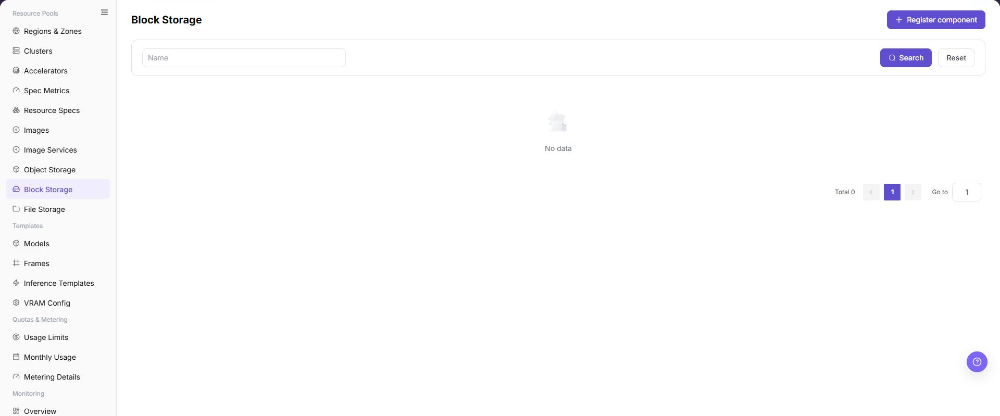
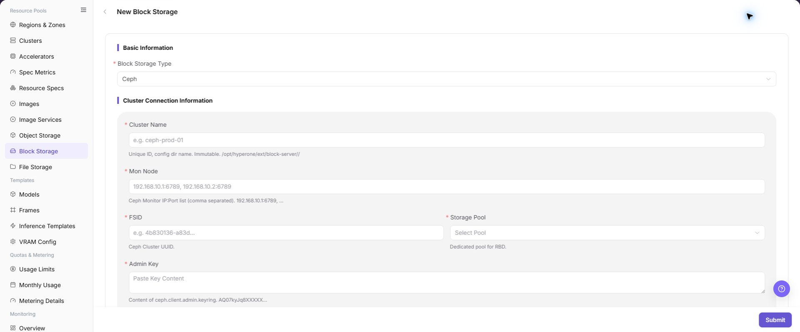

# Block Storage

## Feature Overview

| Item | Content |
| --- | --- |
| Applicable Role | Operator |
| Navigation Path | AI Infra(On-Prem) > Resource Pools > Block Storage |
| Page Route | `/powerone/resourcepool/block` |
| Managed Object | Configuration, status, and relationships on Block Storage |

#### Beginner Explanation

Block Storage is like the independent disk supplier for instances. It connects Ceph RBD or compatible block device capabilities to the platform. When users create instances that require persistent volumes, the platform applies and mounts block volumes according to the storage pool, capacity thresholds, and CSI configuration maintained here.

#### Terms

| Term | Description |
| --- | --- |
| Ceph | A distributed storage system that can provide object, block, and file capabilities. |
| Mon Addresses | Ceph Monitor addresses used to access and discover Ceph cluster status. |
| FSID | The unique identifier of a Ceph cluster, used to distinguish different Ceph clusters. |

#### Recommended Operation Order

Confirm prerequisites for Block Storage Type, Cluster Name, Mon Node, FSID, Storage Pool, Admin Key, Over-provision Ratio, Tenant Quota Limit, thresholds, and Description, follow Main Operations, run Result Validation, and continue to the next page.

#### First-Time User Notes

Confirm that the task involves Configuration, status, and relationships on Block Storage, and then follow the recommended order. If fields or state differ from expectations, check prerequisites before continuing downstream.

## Prerequisites

1. Ceph or an equivalent block storage service has been deployed.
2. Connection materials such as Mon Node, FSID, Storage Pool, authentication user, Keyring, or Secret have been prepared.
3. The target Kubernetes cluster has the corresponding CSI or volume plugin capability.
4. Storage Pool, capacity thresholds, performance, tenant isolation, and CSI policies have been confirmed.

## Page Description

Use this page to view and handle Configuration, status, and relationships on Block Storage.

The image keeps the sidebar and complete feature area. Confirm the page title, scope, and primary operation entry.

The page displays connected block storage components, status, capacity, connection information summary, and associated regions.

The following figure shows the block storage component list, where component status, capacity, and connection information summary can be viewed.

## Main Operations

### View Block Storage Components

1. Open the corresponding resource-pool component page and filter by name, cluster, status, or update time.
2. Open details and check redacted Endpoint information, capabilities, associated clusters, capacity, and health.
3. If no record is returned, reset filters and check cluster status. Do not copy credentials, internal addresses, or complete configuration.
4. For abnormal health, inspect connectivity and events before registering another component.

### Create Block Storage Component

#### Applicable Scenarios

Create a block storage component when a new Ceph RBD or compatible block storage service needs to be connected and used for workload PVC creation, volume mounting, capacity display, and resource scheduling. The current UI uses `Register component` on the list page and opens `New Block Storage - Block Storage`.

#### Steps

1. Go to `AI Infrastructure > On-Prem > Resource Pools > Block Storage`.
2. Click **"Register component"** to open the **"New Block Storage - Block Storage"** page.
3. Fill in `Block Storage Type`, `Cluster Name`, `Mon Node`, `FSID`, `Storage Pool`, `Admin Key`, `Over-provision Ratio`, `Tenant Quota Limit`, `Physical Threshold`, `Logical Threshold`, `Snapshot Limit per Vol`, and `Description` according to the page fields.
4. If the page provides `Test Connection`, run the read-only connectivity check first and confirm the returned result.
5. Before clicking the final **"Save"**, **"Submit"**, or **"OK"**, verify Mon Node, FSID, Storage Pool, Admin Key, thresholds, and capacity impact again.
6. For learning or page validation only, view fields and dialogs without submitting real block storage configuration.

The following figure shows the New Block Storage page, used to fill in block storage connection parameters.

#### Operation Screenshots

The image shows fields and the confirmation area after opening the operation entry. Verify required fields, ownership, and impact before submission.

## Parameter Quick Reference

| Field Name | Required | Field Type | Example | Description |
| --- | --- | --- | --- | --- |
| Block Storage Type | Yes | Dropdown / enum | `Ceph RBD` | Block storage backend type. Select according to actual page-supported types. |
| Cluster Name | Yes | Text | `cluster-a` | Storage cluster name to connect. Keep it consistent with the real storage cluster. |
| Mon Node | Yes | Address / path | `<mon-host>:6789` | Ceph Monitor node address list. Use placeholders only in documentation. Do not record real addresses. |
| FSID | Yes | Identifier / text | `<fsid>` | Unique identifier of the Ceph cluster. Keep it consistent with the target storage cluster. |
| Storage Pool | Yes | Text | `rbd-pool` | Storage pool that hosts block volumes. Confirm capacity, quota, and permissions. |
| Admin Key | Yes | Credential / sensitive text | `<PERSONAL_KEY>` | Admin key content or credential material. Fill it only in system forms. Do not write it in documents, screenshots, or tickets. |
| Over-provision Ratio | Yes | Number / capacity | `Example value` | Overcommit ratio between logical and physical capacity. Fill it carefully according to capacity planning. |
| Tenant Quota Limit | Yes | Number / capacity | `10 TiB` | Capacity limit available to tenants. Keep it consistent with tenant capacity policies. |
| Physical Threshold | Yes | Number / capacity | `80%` | Physical capacity alarm or limit threshold. Do not exceed the real capacity safety boundary. |
| Logical Threshold | Yes | Number / capacity | `90%` | Logical capacity alarm or limit threshold. Verify it together with the over-provision ratio. |
| Snapshot Limit per Vol | Yes | Number / capacity | `16` | Number of snapshots retained per volume. Configure according to capacity and backup policy. |
| Description | No | Multi-line text | `Example description` | Component purpose, boundary, or maintenance notes. Record non-sensitive notes only. |
| Actions | System-generated | Action entry | `Edit` | Register component, Test Connection, Submit, Search, Reset, and similar entries. `Submit` submits real configuration. Confirm the scope and impact before executing the final action. |

## Pitfalls

- Creating a block storage component may affect workload PVC creation, volume mounting, capacity display, and resource scheduling.
- Incorrect Mon Node, FSID, Storage Pool, CSI configuration, or Admin Key may cause volume creation failure, mount failure, or data unavailability.
- Storage Pool and CSI configuration must match the target cluster CSI capability. Otherwise, volumes may be created but fail to mount.
- Before expanding a block volume, confirm that the underlying storage, file system, and workload all support online expansion.
- Before unmounting or deleting a block volume, confirm that the instance has stopped writing to avoid file system corruption or data loss.
- `Save`, `Submit`, and `OK` are high-risk final actions.
- Do not record real Mon Node values, FSID, Storage Pool names, Admin Key, Secret, kubeconfig, cluster IDs, resource pool IDs, accounts, keys, tokens, or internal test parameters.

## Result Validation

| Check Item | Success Signal | If Abnormal |
| --- | --- | --- |
| Page entry | Block Storage opens with the target operation entry | Check Operator permission and whether the menu is available |
| Object record | Configuration, status, and relationships on Block Storage is visible in the list or details | Reset filters and verify name, ownership, and creation result |
| State result | State after creation or change matches the page message | Check operation feedback, dependency state, and latest update time |
| Downstream use | A downstream page can select or associate the target | Return to prerequisites and check enabled state, ownership, and visibility |

## FAQ

#### Target Is Missing from Block Storage

**Symptom:**

The page opens, but the expected Configuration, status, and relationships on Block Storage is missing.

**Possible Causes:**

- Filters remain active.
- the object belongs to another scope.
- a prerequisite is incomplete.

**Solution:**

1. Reset filters
2. verify region or tenant ownership
3. confirm prerequisite state.

#### The Operation Entry on Block Storage Is Unavailable

**Symptom:**

The create, register, or maintain entry is hidden or disabled.

**Possible Causes:**

- Role permission is insufficient.
- the page is read-only.
- dependencies are not ready.

**Solution:**

1. Check Operator permission
2. read the page message
3. complete dependency configuration first.

#### A Required Field on Block Storage Has No Options

**Symptom:**

The form opens, but a selection list is empty.

**Possible Causes:**

- Candidates are disabled.
- ownership differs.
- the current account cannot see them.

**Solution:**

1. Check candidate state
2. verify ownership
3. confirm visibility and refresh the form.

#### Block Storage Has an Abnormal State After the Operation

**Symptom:**

A record exists after submission, but its state is unexpected.

**Possible Causes:**

- Connectivity or validation failed.
- a dependency is abnormal.
- processing is incomplete.

**Solution:**

1. Check feedback and update time
2. inspect related objects
3. troubleshoot the processing stage.

#### A Downstream Page Cannot Use Block Storage

**Symptom:**

The current page is normal, but a downstream page cannot select or associate Configuration, status, and relationships on Block Storage.

**Possible Causes:**

- Visibility differs.
- the object is disabled.
- downstream cache is stale.

**Solution:**

1. Check enabled state and ownership
2. verify role visibility
3. refresh and select again.

## Notes

- Creating a block storage component may affect workload PVC creation, volume mounting, capacity display, and resource scheduling.
- keyring, Ceph user keys, Secret, and kubeconfig are sensitive materials.
- Before deleting a block storage component, confirm that no running instances, PVCs, PVs, or business data depend on it.
- `Save`, `Submit`, and `OK` are high-risk final actions. Confirm the scope and impact before executing the final action.
- Do not record real Mon Node values, FSID, Storage Pool names, Admin Key, Secret, kubeconfig, cluster IDs, resource pool IDs, accounts, keys, tokens, or internal test parameters.

## Next Steps

1. Bind the block storage component in regions or target clusters.
2. Use a test workload to verify creation, mounting, unmounting, and capacity release.
3. Include Ceph, Storage Pool, CSI status, and reclaim policies in operations inspections.
4. Regularly verify capacity statistics, Pool quotas, and abnormal events.
