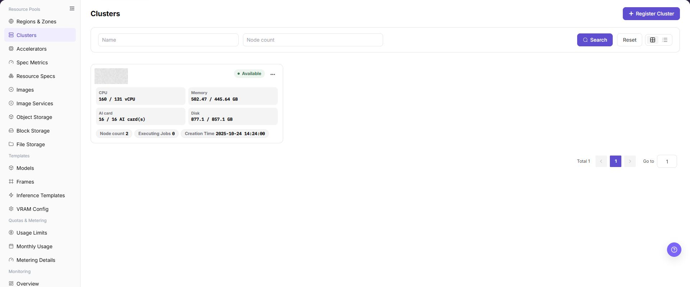
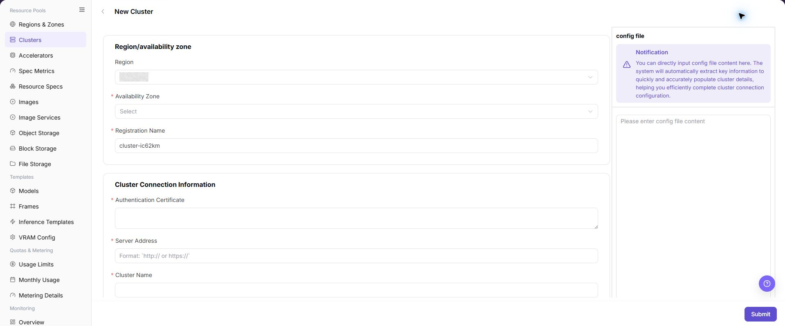

# Clusters

## Feature Overview

| Item | Content |
| --- | --- |
| Applicable Role | Operator |
| Navigation Path | AI Infra(On-Prem) > Resource Pools > Clusters |
| Page Route | `/powerone/resourcepool/cluster` |
| Managed Object | Configuration, status, and relationships on Clusters |

#### Beginner Explanation

An On-Prem Resource Pool is like a local compute management system:

- **Region/availability zone** indicates the site, machine room, or resource group where compute resources are located.
- **Cluster** is the Kubernetes environment that actually provides compute resources. The platform can schedule jobs only after the cluster is connected.
- **Node** is a specific server in the cluster and provides CPU, GPU, memory, disk, and other resources.
- **Specification** defines the resource package that a user job can request.
- **Storage** provides model, dataset, code repository, or output directories for jobs.

The core purpose of cluster creation is to bring a real Kubernetes cluster into platform scheduling, monitoring, and resource management.

#### Terms

| Term | Description |
| --- | --- |
| Kubernetes | A container orchestration system used to manage compute nodes, containers, service discovery, and job scheduling. |
| kubeconfig | A Kubernetes connection configuration file that usually contains the cluster address, certificates, users, and authentication information. |
| Server Address | The Kubernetes control entry point. The platform uses it to read nodes, resources, jobs, and status. |

#### Recommended Operation Order

Confirm prerequisites for Kubernetes clusters, regions, availability zones, nodes, specifications, storage, jobs, and resource monitoring, follow Main Operations, run Result Validation, and continue to the next page.

#### First-Time User Notes

Confirm that the task involves Configuration, status, and relationships on Clusters, and then follow the recommended order. If fields or state differ from expectations, check prerequisites before continuing downstream.

## Prerequisites

Before creating a cluster, confirm that the following conditions are met:

1. The current account has operator permissions and can access `AI Infra > On-Prem > Resource Pools > Cluster Management`.
2. The target region and availability zone have been created in `Resource Pools > Regions/Availability Zones`.
3. The Kubernetes server address can be reached from the platform management side.
4. kubeconfig, Authentication Certificate, Server Address, cluster name, and authentication materials have been prepared.
5. Cluster CIDR, Service CIDR, and NodePort have been checked against existing network plans.
6. If monitoring, JupyterLab, or RDMA capabilities are required, related services, ports, hardware, and network plans have been confirmed.

## Page Description

Use this page to view and handle Configuration, status, and relationships on Clusters.

The image keeps the sidebar and complete feature area. Confirm the page title, scope, and primary operation entry.

The Cluster Management page mainly includes the cluster list, cluster details, and cluster nodes information.

The following figure shows the cluster list entry, cluster cards, resource usage, and cluster operation entries.

#### Cluster List

| Area | Description |
| --- | --- |
| Status filter | Filters clusters by `All`, `Available`, `Unavailable`, `Onboarding`, `Failed`, `Pending Approval`, and other statuses. |
| Region/availability zone filter | Filters clusters by their region and availability zone. |
| Search area | Supports searching by cluster name, node count, and other conditions. |
| View switch | Supports grid view and list view. |
| Cluster card | Displays cluster name, status, region/availability zone, specifications, node count, and resource usage. |
| Operation entry | Opens cluster details, cluster nodes, or cluster-level operations such as disable and enable. |

#### Cluster Details

Cluster details are used to view device information, basic information, associated specifications, and storage configuration of a single cluster. Use this area first when troubleshooting cluster status, resource capacity, specification availability, or storage mounting.

#### Cluster Nodes

The cluster nodes page is used to view node status, resource usage, job information, and node details. Node details usually include hardware, network, runtime, labels, taints, and monitoring charts.

## Main Operations

### Create Cluster

#### Applicable Scenarios

Create a cluster when a new Kubernetes cluster needs to be included in unified platform scheduling, monitoring, and resource management. Common scenarios include first-time compute onboarding, adding a machine room or resource group, expanding GPU/CPU nodes, and providing schedulable nodes for later jobs.

#### Pre-Operation Checks

1. The target region and availability zone have been created and can be used for cluster onboarding.
2. kubeconfig or equivalent authentication materials come from a trusted cluster administrator.
3. server address, certificates, authentication method, and context have been verified.
4. Cluster CIDR, Service CIDR, and NodePort have been confirmed by network planning.
5. Monitoring service, JupyterLab address, RDMA, and other advanced options have been confirmed as required.

#### Steps

1. Go to `AI Infrastructure > On-Prem > Resource Pools > Cluster Management`.
2. Click **"Register Cluster"** in the upper-right corner of the page to open the **"New Cluster - Clusters"** page.
3. Paste kubeconfig in the `config file` area, or verify the connection information parsed by the page.

The following figure shows the `New Cluster - Clusters` page. Use it to locate kubeconfig, region/availability zone, connection information, authentication type, context, and advanced configuration areas.

4. Select `Region` and `Availability Zone`, and fill in `Registration Name`.
5. Verify or fill in `Authentication Certificate`, `Server Address`, and `Cluster Name`.
6. Select `Authentication Type`, fill in the corresponding authentication materials according to the page fields, and verify `Context Name`.
7. Configure `Cluster CIDR`, `Service CIDR`, `NodePort`, monitoring service, JupyterLab address, `Support RDMA Network`, description, and other advanced options.
8. Before clicking the final **"Submit"**, verify sensitive information, region/availability zone, network configuration, and scheduling impact again.
9. For learning or page validation only, view fields and screenshots. Do not perform the final `Submit`, `OK`, or `Save`.

### Associate Cluster Specifications

#### Applicable Scenarios

Associate specifications when the target cluster needs to run jobs with specific CPU, memory, GPU, or other accelerator configurations. After association, users may select these specifications when creating jobs in the corresponding region, availability zone, or cluster scope.

#### Steps

1. Go to `AI Infrastructure > On-Prem > Resource Pools > Cluster Management`.
2. In the cluster list, find the target cluster and verify cluster status, region, availability zone, and resource capacity.
3. Click **"..."** in the target cluster operation area and select `Cluster Details`.
4. In the left-side menu of the `Cluster Details` page, select the specification-related entry.
5. Click **"Associate Specifications"** or the actual association entry on the page.
6. Select the specifications to associate with the cluster, and verify specification name, specification type, CPU, memory, GPU, or other accelerator configuration.
7. Before clicking the final **"Save"**, **"Submit"**, or **"OK"**, verify that the specifications match the cluster resource capability.
8. For learning or page validation only, view the fields and dialog without submitting real association configuration.

### Add Cluster Storage

#### Applicable Scenarios

Add storage when jobs need shared directories, model repositories, local Git repositories, NFS directories, or host paths. Storage configuration affects job startup, file read/write, model loading, and tenant access scope.

#### Steps

1. Go to `AI Infrastructure > On-Prem > Resource Pools > Cluster Management`.
2. In the cluster list, find the target cluster and verify cluster status, region, availability zone, and resource capacity.
3. Click **"..."** in the target cluster operation area and select `Cluster Details`.
4. In the left-side menu of the `Cluster Details` page, select the storage-related entry.
5. Click **"Add Storage"** or the actual add entry on the page.
6. Configure storage name, storage type, shared path, container mount path, access mode, tenant scope, and description according to the page fields.
7. Before clicking the final **"Save"**, **"Submit"**, or **"OK"**, verify the storage path, mount policy, permission scope, and impact on running jobs.
8. For learning or page validation only, view the fields and dialog without submitting real storage configuration.

### View Cluster Details

#### Applicable Scenarios

View cluster details when you need to verify the basic information, device information, associated specifications, or storage configuration of one cluster. This entry is also the object-level entry for later specification and storage maintenance.

#### Steps

1. Go to `AI Infrastructure > On-Prem > Resource Pools > Cluster Management`.
2. Locate the target cluster and verify its state, region, availability zone, and resource usage.
3. Open the target cluster operation area **"..."** menu and click **"Cluster Details"**.
4. Review basic information, device information, associated specifications, and storage configuration.

#### Result Validation

- The cluster name, region, availability zone, and state in details match the list record.
- Device, specification, and storage information can be used for later troubleshooting or configuration.

#### Notes

- Addresses, authentication materials, and cluster identifiers in details may be sensitive. Keep only redacted content in documents, screenshots, and tickets.
- Details do not replace node and job monitoring. Continue to the monitoring pages when investigating resource anomalies.

#### The Cluster Details Entry Is Missing

**Symptom:**

The target cluster is visible in the list, but **"Cluster Details"** is missing from its operation menu.

**Possible Causes:**

- The current account has list-view permission only.
- The cluster is being processed abnormally and details are temporarily unavailable.
- The current view does not expose the operation menu.

**Solution:**

1. Check Operator permission and cluster state.
2. Switch to a list or card view that supports cluster operations.
3. If the entry is still missing, follow the page prompt and contact the permission or cluster maintainer.

### View Cluster Nodes

#### Applicable Scenarios

View cluster nodes when you need to verify node state, resource usage, job information, or node details under a cluster.

#### Steps

1. Go to `AI Infrastructure > On-Prem > Resource Pools > Cluster Management`.
2. Locate the target cluster and open the operation area **"..."** menu.
3. Click **"Cluster Nodes"** to view node state, resource usage, and job information.
4. Select a node to review hardware, network, runtime, labels, taints, and monitoring information.

#### Result Validation

- The Cluster Nodes page shows only nodes under the target cluster.
- Node state, resource usage, and monitoring time range can be reconciled with cluster details.

#### Notes

- When node resources look abnormal, first check the collection time and monitoring range instead of judging cluster availability from one instantaneous metric.
- Node details may contain internal addresses, labels, or runtime information. Redact them before sharing.

#### The Cluster Nodes Page Has No Data

**Symptom:**

After clicking **"Cluster Nodes"**, the node list is empty or resource metrics are not updated.

**Possible Causes:**

- Cluster onboarding is incomplete or nodes have not reported.
- Monitoring collection, network, or time-range settings are abnormal.
- The selected cluster scope does not match the target cluster.

**Solution:**

1. Return to cluster details and verify onboarding state and node count.
2. Check monitoring collection state, update time, and network configuration.
3. Select the target cluster again and refresh the node page.

### Disable or Enable Cluster

#### Applicable Scenarios

Disable a cluster when new job scheduling must be temporarily stopped, or enable it again after maintenance.

#### Steps

1. Go to `AI Infrastructure > On-Prem > Resource Pools > Cluster Management` and locate the target cluster.
2. Open the target cluster operation area **"..."** menu and select **"Disable Cluster"** or the enable entry shown for its current state.
3. Read the confirmation prompt and verify the impact on running jobs, nodes, associated specifications, and storage configuration.
4. After confirming the maintenance window and impact scope, click the confirmation button to change the state.
5. Refresh the cluster list and node page to verify the cluster state and scheduling scope.

#### Result Validation

- The cluster state changes to the disabled or available state shown by the page.
- New job creation or resource selection applies the cluster-state restriction.
- Existing specification and storage relationships remain visible and are not unintentionally deleted.

#### Notes

- Disabling a cluster may prevent new jobs from being scheduled, but does not mean that running jobs are automatically migrated or stopped. Confirm the actual impact first.
- Before enabling, verify node health, monitoring data, specification association, and storage mounts.

#### The Disabled Cluster Still Appears as Selectable

**Symptom:**

The cluster state is disabled, but a downstream resource selection page still shows it.

**Possible Causes:**

- The downstream page uses stale data or filters.
- The page is showing existing resource relationships rather than the new-job scheduling scope.
- State processing is still in progress.

**Solution:**

1. Refresh the downstream page and reset filters.
2. Distinguish existing resource associations from the selectable scope for new jobs.
3. Check the cluster update time and page prompt to confirm processing has finished.

### Edit Cluster Storage

#### Applicable Scenarios

Edit cluster storage when a shared path, container mount path, access mode, tenant scope, or description must change for an existing storage configuration.

#### Steps

1. Go to `AI Infrastructure > On-Prem > Resource Pools > Cluster Management` and open **"Cluster Details"** for the target cluster.
2. In the storage configuration area, find the target storage row and click **"Edit"**.
3. Verify the storage name and type, then update the shared path, container mount path, access mode, tenant scope, or description provided by the page.
4. Before clicking **"Save"** or the final confirmation entry, verify that running jobs will not lose data access.
5. Return to the storage list and verify the updated configuration and state.

#### Result Validation

- The storage list shows the updated path, access mode, tenant scope, or description.
- Cluster details still show the storage association with the target cluster.
- New jobs can use the storage according to the updated mount policy.

#### Notes

- Changing a shared path or container mount path may prevent jobs from starting or reading existing data. Verify that the path exists and permissions are valid.
- Reducing tenant scope or changing to read-only may affect running jobs. Confirm impact and rollback handling before the change.

#### Jobs Cannot Access Data After Storage Editing

**Symptom:**

Storage saves successfully, but new or running jobs cannot read the old path or write to the mounted directory.

**Possible Causes:**

- The shared path or container mount path is incorrect.
- Access mode, tenant scope, or underlying permission changed.
- Nodes cannot reach the storage service.

**Solution:**

1. Verify the path, access mode, and tenant scope in cluster details.
2. Check node network reachability and underlying storage permission.
3. Under the approved change process, restore the last verified configuration and repeat the mount validation.

### Remove Cluster Storage

#### Applicable Scenarios

Remove cluster storage when a storage configuration is no longer needed or an incorrect mount must be removed before reconfiguration.

#### Steps

1. Go to `AI Infrastructure > On-Prem > Resource Pools > Cluster Management` and open **"Cluster Details"** for the target cluster.
2. In the storage configuration area, find the target storage row and click **"Delete"**.
3. Read the confirmation prompt and verify the storage name, mount path, access scope, and associated jobs.
4. After confirming data retention and job impact, click the confirmation button to remove the association.
5. Return to the storage list and verify that the target configuration is no longer shown; then check downstream storage choices.

#### Result Validation

- The target storage configuration is removed from the storage list in cluster details.
- New job creation no longer offers that cluster storage configuration.
- Other storage configurations, cluster state, and existing data are not unintentionally removed.

#### Notes

- Removing the configuration does not necessarily delete underlying storage data, but it cancels the platform association and mount entry. Confirm data retention first.
- Do not remove storage directly when running or upcoming jobs depend on it. Arrange migration or a maintenance window first.

#### The Storage Is Still Visible After Removal

**Symptom:**

The old storage configuration is still visible in the list or job page after removal.

**Possible Causes:**

- The page cache or detail data has not refreshed.
- Another cluster still has a same-named storage association.
- The removal request is still processing.

**Solution:**

1. Refresh cluster details and verify the target cluster and storage ID.
2. Check associations on other clusters so a same-named record is not mistaken for the target.
3. Check the page prompt and update time for the processing state.

#### Operation Screenshots

The image shows fields and the confirmation area after opening the operation entry. Verify required fields, ownership, and impact before submission.

## Parameter Quick Reference

| Field Name | Required | Field Type | Example | Description |
| --- | --- | --- | --- | --- |
| Registration Name | Yes | Text | `cluster-wuhan-gpu` | Name used by the platform to identify the cluster. Use a name that reflects environment, region, purpose, and resource type. It is usually not recommended to change after creation. |
| Region | Yes | Text | `wuhan` | Region to which the cluster belongs. Select an existing and available region. It affects resource pool ownership and scheduling scope. |
| Availability Zone | Yes | Text | `wuhan-1` | Availability zone to which the cluster belongs. Must match the selected region. Incorrect selection affects node ownership and job scheduling. |
| config file | Conditionally required | File / configuration text | `Controlled configuration file` | kubeconfig content or connection configuration source. Can be used to auto-fill some fields, but parsed results must be manually verified. |
| Authentication Certificate | Yes | Credential / sensitive text | `Controlled certificate` | Certificate used to verify server identity. Sensitive material. Do not record it in documents or screenshots. |
| Server Address | Yes | Address / URL | `<BASE_URL>:<PORT>` | Kubernetes API access entry. Must be reachable from the platform side. Do not record real addresses in this document. |
| Cluster Name | Yes | Identifier / text | `cluster-a` | Kubernetes cluster name or page identification name. Keep it consistent with kubeconfig or real cluster information. |
| Authentication Type | Yes | Dropdown / enum | `Bearer Token` | Authentication method used to access the cluster. Select according to kubeconfig or materials provided by the administrator. |
| Context Name | Conditionally required | File / configuration text | `cluster-a-context` | Connection context in kubeconfig. Usually generated or imported automatically. Verify it before submission. |
| Cluster CIDR | Conditionally required | Number / capacity | `<POD_CIDR>` | Pod network segment configuration. Must match network planning and avoid conflicts with the platform, nodes, or other clusters. |
| Service CIDR | Conditionally required | Number / capacity | `<SERVICE_CIDR>` | Service network segment configuration. Must match network planning and avoid service access issues. |
| NodePort | Conditionally required | Port / number | `30000-32767` | Kubernetes NodePort port range. Fill in according to page-supported range and network policy. |
| Monitor Service Port | Optional | Port / number | `8000` | Cluster resource monitoring service configuration. Confirm monitoring collection capability, port, and network reachability. |
| JupyterLab Address | Optional | Address / URL | `<BASE_URL>` | Service address related to online development. Configure only when online IDE capability is required. |
| Support RDMA Network | Optional | Switch | `Disabled` | Whether to enable RDMA-related capabilities. Enable only when hardware, drivers, network, and scheduling policies explicitly support it. |
| Specification Name | Yes | Text | `Example Name` | Name of the specification to associate with the cluster. Should match the actual CPU, memory, GPU, or other accelerator capability of the cluster. |
| Specification Type | Conditionally required | Dropdown / enum | `Inference` | Resource type or job type of the specification. Confirm that the specification applies to the target cluster and business scenario. |
| CPU | Conditionally required | Number / capacity | `16 vCPU` | CPU configuration in the specification. Must not exceed cluster capability or scheduling policy limits. |
| Memory | Conditionally required | Number / capacity | `128 GiB` | Memory configuration in the specification. Verify it together with CPU, GPU, or accelerator configuration. |
| GPU/Accelerator | Conditionally required | Number / capacity | `1 x A100` | GPU, NPU, or other accelerator configuration in the specification. Must match target cluster node hardware and driver capability. |
| Enabled Status | System generated or optional | Status | `Enabled` | Whether the specification or storage configuration is available. If disabled, it is usually unavailable to users. |
| Association Status | System generated | Status | `Associated` | Whether the specification has been associated with the target cluster. After saving, confirm the status in the list or details page. |
| Storage Name | Yes | Text | `shared-data` | Name of the cluster storage configuration. Use a name that reflects purpose, environment, and access scope. |
| Storage Type | Yes | Dropdown / enum | `nfs` | Storage source or mount type. Common types include `nfs`, `hostpath`, or actual page-supported types. |
| Shared Path | Yes | Address / path | `/data/share` | Host-side or shared storage path. Do not record real paths in this document. Confirm that the path exists and permissions are correct before submission. |
| Container Mount Path | Yes | Address / path | `/mnt/data` | Path used by job containers to access the storage. Avoid conflicts with system directories, application directories, or other mount paths. |
| Access Mode | Yes | Dropdown / enum | `ReadWriteMany` | Storage read/write permission or access policy. Follow the least privilege principle and avoid granting write permission by mistake. |
| Tenant Scope | Conditionally required | Dropdown / enum | `Tenant A` | Tenant visibility or isolation scope of the storage. Avoid unexpected cross-tenant access to the same directory. |
| Description | Optional | Multi-line text | `Example description` | Cluster purpose, boundary, or maintenance notes. Record non-sensitive operations notes only. Do not write internal test parameters. |
| Actions | System generated | Action entry | `Edit` | Page entries for view, edit, disable, enable, and similar operations. Confirm impact scope and rollback plan before high-risk operations. |

## Pitfalls

- Cluster creation/registration connects a real Kubernetes cluster to platform scheduling, monitoring, and resource management. Treat it as a high-impact operation.
- kubeconfig, certificates, private keys, tokens, and passwords are sensitive materials. Do not write them into documents, screenshots, tickets, commit records, or chat messages.
- If the Server Address is unreachable, the platform cannot complete onboarding even when form fields are correctly formatted.
- Incorrect region or availability zone may cause resource ownership, specification association, storage configuration, and job scheduling exceptions.
- Incorrect authentication type, CIDR, or NodePort may cause onboarding failure, network conflicts, or service access exceptions.
- Associating specifications affects which resource specifications users can select when creating jobs. Incorrect association may cause scheduling failure, resource request mismatch, or capacity misjudgment.
- Adding storage affects job mount paths, read/write permissions, data access scope, and runtime stability. Incorrect shared paths, mount paths, or permission scope may cause job startup failure, inaccessible data, or unauthorized access.
- `Save`, `Submit`, and `OK` are high-risk final actions. Confirm the scope and impact before executing the final action.

### Configuration Rules and Impact

- **Configuration order**: Create the region and availability zone first, and then create the cluster under the corresponding availability zone.
- **Onboarding dependencies**: Server Address reachability, valid authentication materials, and correct CIDR and port planning are prerequisites for cluster onboarding.
- **Auto parsing**: Pasting kubeconfig can improve form completion efficiency, but the parsing result still requires manual verification.
- **Network impact**: Cluster CIDR, Service CIDR, and NodePort affect Pod, Service, and platform access paths.
- **Scheduling impact**: After creation, the cluster enters the platform scheduling scope, and later specifications, storage, and authorization configuration may reference it.
- **Specification impact**: Associating specifications changes which resource specifications users can select when creating jobs. Incorrect configuration may cause scheduling failure or resource request mismatch.
- **Storage impact**: Adding storage changes job mount paths, read/write permissions, and tenant access scope. Incorrect configuration may cause inaccessible data or unauthorized access.
- **Monitoring impact**: Monitoring data is used for capacity analysis and troubleshooting. If data is missing, check collection components, ports, and time ranges together.
- **Operations impact**: Disabling, enabling, or deleting a cluster may affect job scheduling and business availability. Confirm the maintenance window and rollback plan in advance.

## Result Validation

| Check Item | Success Signal | If Abnormal |
| --- | --- | --- |
| Page entry | Clusters opens with the target operation entry | Check Operator permission and whether the menu is available |
| Object record | Configuration, status, and relationships on Clusters is visible in the list or details | Reset filters and verify name, ownership, and creation result |
| State result | State after creation or change matches the page message | Check operation feedback, dependency state, and latest update time |
| Downstream use | A downstream page can select or associate the target | Return to prerequisites and check enabled state, ownership, and visibility |

## FAQ

#### Target Is Missing from Clusters

**Symptom:**

The page opens, but the expected Configuration, status, and relationships on Clusters is missing.

**Possible Causes:**

- Filters remain active.
- the object belongs to another scope.
- a prerequisite is incomplete.

**Solution:**

1. Reset filters
2. verify region or tenant ownership
3. confirm prerequisite state.

#### The Operation Entry on Clusters Is Unavailable

**Symptom:**

The create, register, or maintain entry is hidden or disabled.

**Possible Causes:**

- Role permission is insufficient.
- the page is read-only.
- dependencies are not ready.

**Solution:**

1. Check Operator permission
2. read the page message
3. complete dependency configuration first.

#### A Required Field on Clusters Has No Options

**Symptom:**

The form opens, but a selection list is empty.

**Possible Causes:**

- Candidates are disabled.
- ownership differs.
- the current account cannot see them.

**Solution:**

1. Check candidate state
2. verify ownership
3. confirm visibility and refresh the form.

#### Clusters Has an Abnormal State After the Operation

**Symptom:**

A record exists after submission, but its state is unexpected.

**Possible Causes:**

- Connectivity or validation failed.
- a dependency is abnormal.
- processing is incomplete.

**Solution:**

1. Check feedback and update time
2. inspect related objects
3. troubleshoot the processing stage.

#### A Downstream Page Cannot Use Clusters

**Symptom:**

The current page is normal, but a downstream page cannot select or associate Configuration, status, and relationships on Clusters.

**Possible Causes:**

- Visibility differs.
- the object is disabled.
- downstream cache is stale.

**Solution:**

1. Check enabled state and ownership
2. verify role visibility
3. refresh and select again.

## Notes

- Cluster creation/registration connects a real Kubernetes cluster to platform scheduling, monitoring, and resource management.
- kubeconfig, certificates, private keys, tokens, and passwords are sensitive materials and must not be written into documents, screenshots, tickets, or commit records.
- Incorrect region/availability zone, Server Address, authentication type, CIDR, or NodePort may cause onboarding failure, network conflicts, or scheduling exceptions.
- Associating specifications and adding storage affect real job specifications, mount paths, read/write permissions, and data access scope.
- `Save`, `Submit`, and `OK` are high-risk final actions.
- Do not write real kubeconfig, certificates, private keys, tokens, passwords, shared paths, internal addresses, server addresses, accounts, keys, AK/SK, cluster IDs, resource pool IDs, or internal test parameters.

## Next Steps

1. Return to the `Cluster Management` list and verify cluster status, region/availability zone, and resource usage.
2. Open cluster details and verify device information, basic information, associated specifications, and storage configuration.
3. Associate specifications with the cluster as needed so users can select target specifications when creating jobs.
4. Configure shared storage as needed, and use a test job to verify mounting, read/write, and path isolation.
5. View node resource monitoring and confirm that monitoring data, time range, and monitoring type can be switched normally.
