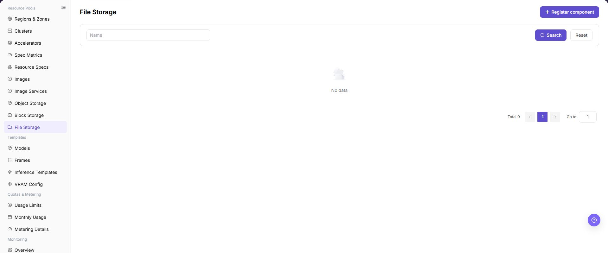
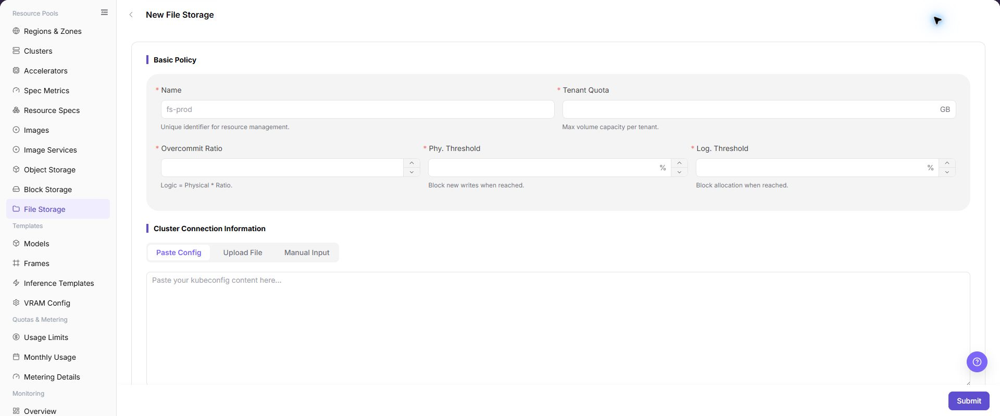

# File Storage

## Feature Overview

| Item | Content |
| --- | --- |
| Applicable Role | Operator |
| Navigation Path | AI Infra(On-Prem) > Resource Pools > File Storage |
| Page Route | `/powerone/resourcepool/file` |
| Managed Object | Configuration, status, and relationships on File Storage |

#### Beginner Explanation

A file storage component is like a shared filing cabinet in the platform. It determines which clusters can mount shared directories. Operators first connect NFS or compatible shared storage to the platform, and then user-side instances and jobs can use the same directory to read data, models, and output files.

#### Terms

| Term | Description |
| --- | --- |
| NFS | Network File System, used to share directories over the network. |
| Shared Path | The directory path exported by the file storage service. |
| Mount Path | The path after mounting inside a container or node. |

#### Recommended Operation Order

Confirm prerequisites for Name, Tenant Quota, Overcommit Ratio, Phy. Threshold, Log. Threshold, Cluster Connection Information, Paste Config, Upload File, Manual Input, and Description, follow Main Operations, run Result Validation, and continue to the next page.

#### First-Time User Notes

Confirm that the task involves Configuration, status, and relationships on File Storage, and then follow the recommended order. If fields or state differ from expectations, check prerequisites before continuing downstream.

## Prerequisites

1. NFS or an equivalent file storage service has been deployed.
2. The shared path has been created, and access permissions, directory ownership, and network policies have been confirmed.
3. Target cluster nodes can access the file storage service address and exported directory.
4. Tenant directories, read/write policies, capacity, overcommit ratio, and backup policies have been planned.
5. If the page requires `kubeconfig`, prepare sanitized validation material. Use only sanitized placeholders in validation materials and documentation.

## Page Description

Use this page to view and handle Configuration, status, and relationships on File Storage.

The image keeps the sidebar and complete feature area. Confirm the page title, scope, and primary operation entry.

The page displays connected file storage components, status, service address, shared path, capacity, and associated regions or clusters.

The following figure shows the file storage page.

## Main Operations

### View File Storage Components

1. Open the corresponding resource-pool component page and filter by name, cluster, status, or update time.
2. Open details and check redacted Endpoint information, capabilities, associated clusters, capacity, and health.
3. If no record is returned, reset filters and check cluster status. Do not copy credentials, internal addresses, or complete configuration.
4. For abnormal health, inspect connectivity and events before registering another component.

### Create File Storage Component

#### Pre-Operation Check

1. The file storage service address is accessible from target cluster nodes.
2. The shared path has been exported and permissions comply with the read/write policy.
3. The mount path does not conflict with container system directories or application directories.
4. Tenant isolation method, directory naming rules, capacity limit, and overcommit policy have been confirmed.

#### Procedure

1. Go to `AI Infrastructure > On-Prem > Resource Pools > File Storage`.
2. Click **"Register component"** to open the **"New File Storage - File Storage"** page.
3. Fill in `Name`, `Tenant Quota`, `Overcommit Ratio`, `Phy. Threshold`, and `Log. Threshold` according to the page fields.
4. In `Cluster Connection Information`, provide connection configuration through `Paste Config`, `Upload File`, or `Manual Input`, and confirm that the configuration content has been sanitized.
5. If the page provides `Test Connection`, verify connectivity from target cluster nodes to the file storage service first.
6. In `Cluster Configuration`, fill in `Description`, and continue checking cluster connection information, capacity thresholds, and description according to the actual page.
7. Before clicking the final **"Save"**, **"Submit"**, or **"OK"**, verify the cluster connection information, capacity thresholds, and capacity impact again.
8. For learning or page validation only, view fields and dialogs without submitting real file storage configuration.

The following figure shows the New File Storage page, used to fill in basic policy, cluster connection information, and cluster configuration.

#### Operation Screenshots

The image shows fields and the confirmation area after opening the operation entry. Verify required fields, ownership, and impact before submission.

## Parameter Quick Reference

| Field Name | Required | Field Type | Example | Description |
| --- | --- | --- | --- | --- |
| Name | Yes | File / configuration text | `Example Name` | File storage component name. Use a name that reflects environment, purpose, or capacity boundary. |
| Tenant Quota | Yes | Number / capacity | `10 TiB` | Whether tenant capacity usage is limited. Keep it consistent with tenant capacity policies. |
| Overcommit Ratio | Yes | File / configuration text | `1.5` | Overcommit ratio between logical and physical file storage capacity. Fill it carefully according to capacity planning. |
| Phy. Threshold | Yes | Number / capacity | `Example value` | Physical capacity alarm or limit threshold. Do not exceed the real capacity safety boundary. |
| Log. Threshold | Yes | Number / capacity | `Example value` | Logical capacity alarm or limit threshold after overcommit. Verify it together with the overcommit ratio. |
| Paste Config | Conditionally required | File / configuration text | `Example value` | Enter cluster connection information by pasting kubeconfig content. Do not write real kubeconfig in documentation. |
| Upload File | Conditionally required | File / configuration text | `Controlled configuration file` | Enter cluster connection information by uploading a file. Upload only authorized configuration files from controlled environments. |
| Manual Input | Conditionally required | Text | `Example value` | Enter cluster connection information manually. Do not write real internal addresses, accounts, or secrets. |
| Description | No | Multi-line text | `Example description` | Component purpose, boundary, or maintenance notes. Record non-sensitive notes only. |
| Actions | System-generated | Action entry | `Edit` | Test Connection, Submit, Search, Reset, and similar entries. `Submit` submits real configuration. Confirm the scope and impact before executing the final action. |

## Pitfalls

- Creating a file storage component may affect mounts and read/write access for jobs, IDEs, model repositories, or dataset directories.
- Incorrect service address, shared path, export permission, UID/GID, or read/write policy may cause mount failure, write failure, or unintended cross-tenant access.
- Incorrect capacity thresholds or overcommit ratio may block file volume creation too early, or make displayed capacity inconsistent with actual resources.
- Verify the file storage service address and mount path from target nodes, not only from the platform management side.
- `Save`, `Submit`, and `OK` are high-risk final actions.
- Do not write real NFS addresses, internal paths, accounts, secrets, tokens, kubeconfig, cluster IDs, resource pool IDs, tenant directories, or internal test parameters.

## Result Validation

| Check Item | Success Signal | If Abnormal |
| --- | --- | --- |
| Page entry | File Storage opens with the target operation entry | Check Operator permission and whether the menu is available |
| Object record | Configuration, status, and relationships on File Storage is visible in the list or details | Reset filters and verify name, ownership, and creation result |
| State result | State after creation or change matches the page message | Check operation feedback, dependency state, and latest update time |
| Downstream use | A downstream page can select or associate the target | Return to prerequisites and check enabled state, ownership, and visibility |

## FAQ

#### Target Is Missing from File Storage

**Symptom:**

The page opens, but the expected Configuration, status, and relationships on File Storage is missing.

**Possible Causes:**

- Filters remain active.
- the object belongs to another scope.
- a prerequisite is incomplete.

**Solution:**

1. Reset filters
2. verify region or tenant ownership
3. confirm prerequisite state.

#### The Operation Entry on File Storage Is Unavailable

**Symptom:**

The create, register, or maintain entry is hidden or disabled.

**Possible Causes:**

- Role permission is insufficient.
- the page is read-only.
- dependencies are not ready.

**Solution:**

1. Check Operator permission
2. read the page message
3. complete dependency configuration first.

#### A Required Field on File Storage Has No Options

**Symptom:**

The form opens, but a selection list is empty.

**Possible Causes:**

- Candidates are disabled.
- ownership differs.
- the current account cannot see them.

**Solution:**

1. Check candidate state
2. verify ownership
3. confirm visibility and refresh the form.

#### File Storage Has an Abnormal State After the Operation

**Symptom:**

A record exists after submission, but its state is unexpected.

**Possible Causes:**

- Connectivity or validation failed.
- a dependency is abnormal.
- processing is incomplete.

**Solution:**

1. Check feedback and update time
2. inspect related objects
3. troubleshoot the processing stage.

#### A Downstream Page Cannot Use File Storage

**Symptom:**

The current page is normal, but a downstream page cannot select or associate Configuration, status, and relationships on File Storage.

**Possible Causes:**

- Visibility differs.
- the object is disabled.
- downstream cache is stale.

**Solution:**

1. Check enabled state and ownership
2. verify role visibility
3. refresh and select again.

## Notes

- Do not configure shared directories with an overly broad public read/write scope.
- Before deleting or adjusting a shared path, confirm that no running jobs, IDEs, model repositories, or dataset directories depend on it.
- Do not record real NFS addresses, internal paths, kubeconfig, accounts, secrets, tokens, cluster IDs, resource pool IDs, tenant directories, or internal test parameters in documentation, screenshots, or examples.

## Next Steps

1. Reference the file storage component in region or cluster storage configuration.
2. Use a test job to verify read/write, concurrency, and capacity limits.
3. Include shared directories in backup, cleanup, and permission audits.
