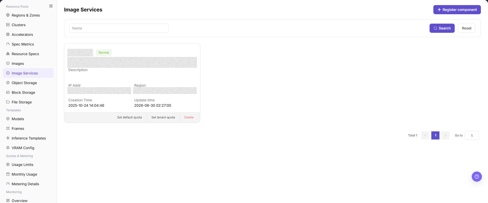
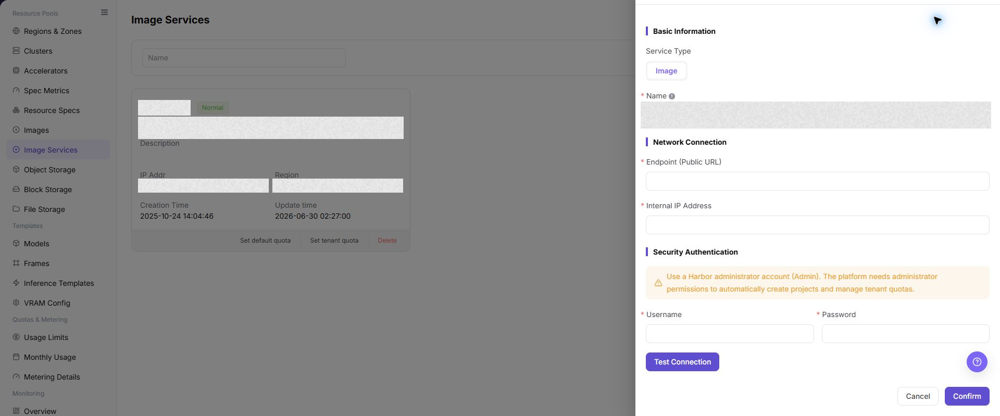

# Image Services

## Feature Overview

| Item | Content |
| --- | --- |
| Applicable Role | Operator |
| Navigation Path | AI Infra(On-Prem) > Resource Pools > Image Services |
| Page Route | `/powerone/resourcepool/images` |
| Managed Object | Configuration, status, and relationships on Image Services |

#### Beginner Explanation

Image Services is like the image repository access card of the platform. It tells the platform where to pull runtime images, which credentials to use, and which regions or clusters can use the repository. When the image component is configured incorrectly, user-side model instances, online IDEs, runtime instances, and jobs usually get stuck during image pull.

#### Terms

| Term | Description |
| --- | --- |
| Harbor | A common enterprise container image repository. |
| Registry | Image repository service used to store and distribute container images. |
| Endpoint | Service address used by the platform or clusters to access the image repository. |

#### Recommended Operation Order

Confirm prerequisites for Service type, image, name, Endpoint (Public URL), Internal IP Address, Username, Password, Description, and Actions, follow Main Operations, run Result Validation, and continue to the next page.

#### First-Time User Notes

Confirm that the task involves Configuration, status, and relationships on Image Services, and then follow the recommended order. If fields or state differ from expectations, check prerequisites before continuing downstream.

## Prerequisites

1. The image repository has been deployed and can be accessed from the platform side and target clusters.
2. Repository address, Endpoint, authentication method, access credentials, and certificate policy have been prepared.
3. The target cluster can resolve and access the image repository address.
4. Associated regions, bound clusters, public images, custom images, and tenant project permission boundaries have been confirmed.

## Page Description

Use this page to view and handle Configuration, status, and relationships on Image Services.

The image keeps the sidebar and complete feature area. Confirm the page title, scope, and primary operation entry.

The page displays connected image components, status, access address, project count, sync status, and associated regions.

The following figure shows the image services list, where component status, Endpoint, sync status, and operation entrypoints can be viewed.

## Main Operations

### View Image Services

1. Open the corresponding resource-pool component page and filter by name, cluster, status, or update time.
2. Open details and check redacted Endpoint information, capabilities, associated clusters, capacity, and health.
3. If no record is returned, reset filters and check cluster status. Do not copy credentials, internal addresses, or complete configuration.
4. For abnormal health, inspect connectivity and events before registering another component.

### Register Image Component

#### Applicable Scenarios

Register an image component when a new Harbor, Docker Registry, or compatible image repository needs to be connected and used by specified regions, clusters, or user-side image services.

#### Steps

1. Go to `AI Infrastructure > On-Prem > Resource Pools > Image Services`.
2. Click **"Register component"**.
3. Fill in `Service Type`, `Image`, `Name`, `Endpoint (Public URL)`, `Internal IP Address`, `Username`, `Password`, and `Description` according to the page fields.
4. If the page provides `Test Connection`, run the read-only connectivity check first and confirm the returned result.
5. Before submission, confirm that the repository address is reachable from both the platform side and target clusters, and that robot credentials or access accounts have minimum required permissions.
6. Before clicking the final **"Save"**, **"Submit"**, or **"OK"**, verify Endpoint, internal IP address, credential source, and component usage scope again.
7. For learning or page validation only, view fields and forms without submitting real image component configuration.

The following figure shows the Register Image Component form, used to fill in image service connection information and sync configuration.

### Set Default Image Service Quota

#### Applicable Scenarios

Use **"Set Default Quota"** when an image service needs a default resource quota for tenants without an individual quota.

#### Steps

1. Go to `AI Infrastructure > On-Prem > Resource Pools > Image Services` and locate the target image service.
2. Use the page entry **"Set Default Quota"**.
3. Verify the service, quota fields, and scope shown by the page, then fill in or adjust the allowed quota.
4. Before the final confirmation, verify that the default quota will not exceed service capacity or affect current tenant use unexpectedly.

#### Result Validation

- Image service details or quota information shows the new default quota.
- Tenants without an individual quota use the new default quota for calculation or restriction.
- Tenants with an individual quota keep their dedicated configuration.

#### Notes

- A default quota affects multiple tenants or objects without dedicated settings. Confirm capacity and business scope first.
- Do not write real registry addresses, accounts, passwords, or access keys in quota descriptions or screenshots.

#### The Default Quota Does Not Take Effect

**Symptom:**

The save succeeds, but a related tenant still shows the old image quota.

**Possible Causes:**

- The tenant already has an individual quota.
- Page data or quota calculation has not refreshed.
- The edited service is not the service actually being used.

**Solution:**

1. Check the tenant-quota entry for a dedicated configuration.
2. Refresh service details and check the update time.
3. Verify service name, scope, and downstream image relationships.

### Set Tenant Image Service Quota

#### Applicable Scenarios

Use **"Set Tenant Quota"** when a specified tenant needs an image service quota different from the default.

#### Steps

1. Go to `AI Infrastructure > On-Prem > Resource Pools > Image Services` and locate the target image service.
2. Click **"Set Tenant Quota"** and select the target tenant.
3. Verify tenant, image service, and quota fields, then enter the tenant quota.
4. Before the final confirmation, verify that the tenant scope and quota will not affect other tenants.

#### Result Validation

- Tenant quota details show the target tenant and new quota value.
- Image use by the target tenant follows the new limit; other tenants follow their own or default quota.
- Overall image service capacity is not incorrectly over-allocated.

#### Notes

- Verify tenant name and scope before selection so the quota is not applied to the wrong tenant.
- Lowering a quota may affect image synchronization, upload, or use in progress. Confirm the business window first.

#### The Target Tenant Is Missing from the Tenant Quota Entry

**Symptom:**

The target tenant is not available after opening **"Set Tenant Quota"**.

**Possible Causes:**

- The tenant is outside the visible scope of the image service.
- Tenant or image service state is unavailable.
- The current account lacks tenant-quota permission.

**Solution:**

1. Verify image service state and scope.
2. Check tenant visibility and state on the tenant or permission page.
3. Check Operator permission and reopen the quota entry.

### Remove Image Service

#### Applicable Scenarios

Remove an image service when it is no longer needed and no region, job, template, or image-management record depends on it.

#### Steps

1. Go to `AI Infrastructure > On-Prem > Resource Pools > Image Services` and locate the target service.
2. Click **"Delete"** for the target service.
3. Read the confirmation prompt and verify service name, Endpoint, region bindings, quota settings, and downstream dependencies.
4. After confirming replacement service, migration handling, and impact scope, click the confirmation button to remove it.
5. Refresh the list and check downstream choices on Regions & Zones and Image Management.

#### Result Validation

- The target image service is removed from the service list.
- Region bindings and new image synchronization or upload entries no longer reference the service.
- Other services, tenant quotas, and existing image records are not unintentionally removed.

#### Notes

- Removing the service may break image synchronization, upload, job pulls, and region resource creation. Complete dependency migration first.
- Removing the platform service record does not necessarily delete registry data. Handle registry-side content according to its retention policy.

#### The Image Service Cannot Be Removed

**Symptom:**

The removal fails or the page reports that associated objects still exist.

**Possible Causes:**

- A region, image, or other resource object still binds the service.
- The current account lacks removal permission.
- Synchronization or another background task is running.

**Solution:**

1. Check relationships on Regions & Zones, Image Management, and quota configuration.
2. Check service task state and update time.
3. Remove dependencies or complete migration, then retry according to approval.

#### Operation Screenshots

The image shows fields and the confirmation area after opening the operation entry. Verify required fields, ownership, and impact before submission.

## Parameter Quick Reference

| Field Name | Required | Field Type | Example | Description |
| --- | --- | --- | --- | --- |
| Service Type | Yes | Dropdown / enum | `Image` | Service type of the current component. On the Image Services page, this usually displays `Image`. |
| Image | Yes | Dropdown / enum | `<BASE_URL>/<PROJECT>/<IMAGE>:<TAG>` | Service type value when registering an image component. Keep it consistent with the actual page option. |
| Name | Yes | Text | `Example Name` | Display name of the image service. Use a name that reflects repository purpose, region, or environment. |
| Endpoint (Public URL) | Yes | Address / path | `<BASE_URL>` | Public entry used by the platform or user side to access the image repository. Use placeholders only in documentation. Do not record real addresses. |
| Internal IP Address | Conditionally required | IP address | `<PRIVATE_IP>` | Internal address used by clusters or the platform to access the image repository. Keep it consistent with real network, DNS, and container runtime configuration. |
| Username | Conditionally required | Address / path | `<USERNAME>` | Image repository access account. Fill it only in system forms. Do not write it in documents, screenshots, or tickets. |
| Password | Conditionally required | Credential / sensitive text | `<PERSONAL_KEY>` | Image repository access password. Sensitive credential. Do not write it in documents, screenshots, or tickets. |
| Description | No | Multi-line text | `Example description` | Component purpose, boundary, or maintenance notes. Record non-sensitive notes only. |
| Actions | System-generated | Action entry | `Edit` | Register component, Test Connection, Cancel, Confirm, edit, delete, and similar entries. `Confirm` and `Delete` are high-risk actions. |

## Pitfalls

- Registering an image component affects image pull capability for regions, clusters, jobs, online IDEs, and model instances.
- Incorrect repository address, certificate chain, Robot credentials, or Image Pull Secret may cause `ImagePullBackOff`.
- Binding the image component to the wrong region may cause user-side image projects to be invisible or jobs to fail image pull.
- `Save`, `Submit`, and `OK` are high-risk final actions.
- Do not record real repository addresses, Robot passwords, Image Pull Secret, tokens, AK/SK, internal addresses, cluster IDs, resource pool IDs, or internal test parameters.

## Result Validation

| Check Item | Success Signal | If Abnormal |
| --- | --- | --- |
| Page entry | Image Services opens with the target operation entry | Check Operator permission and whether the menu is available |
| Object record | Configuration, status, and relationships on Image Services is visible in the list or details | Reset filters and verify name, ownership, and creation result |
| State result | State after creation or change matches the page message | Check operation feedback, dependency state, and latest update time |
| Downstream use | A downstream page can select or associate the target | Return to prerequisites and check enabled state, ownership, and visibility |

## FAQ

#### Target Is Missing from Image Services

**Symptom:**

The page opens, but the expected Configuration, status, and relationships on Image Services is missing.

**Possible Causes:**

- Filters remain active.
- the object belongs to another scope.
- a prerequisite is incomplete.

**Solution:**

1. Reset filters
2. verify region or tenant ownership
3. confirm prerequisite state.

#### The Operation Entry on Image Services Is Unavailable

**Symptom:**

The create, register, or maintain entry is hidden or disabled.

**Possible Causes:**

- Role permission is insufficient.
- the page is read-only.
- dependencies are not ready.

**Solution:**

1. Check Operator permission
2. read the page message
3. complete dependency configuration first.

#### A Required Field on Image Services Has No Options

**Symptom:**

The form opens, but a selection list is empty.

**Possible Causes:**

- Candidates are disabled.
- ownership differs.
- the current account cannot see them.

**Solution:**

1. Check candidate state
2. verify ownership
3. confirm visibility and refresh the form.

#### Image Services Has an Abnormal State After the Operation

**Symptom:**

A record exists after submission, but its state is unexpected.

**Possible Causes:**

- Connectivity or validation failed.
- a dependency is abnormal.
- processing is incomplete.

**Solution:**

1. Check feedback and update time
2. inspect related objects
3. troubleshoot the processing stage.

#### A Downstream Page Cannot Use Image Services

**Symptom:**

The current page is normal, but a downstream page cannot select or associate Configuration, status, and relationships on Image Services.

**Possible Causes:**

- Visibility differs.
- the object is disabled.
- downstream cache is stale.

**Solution:**

1. Check enabled state and ownership
2. verify role visibility
3. refresh and select again.

## Notes

- Registering an image component affects image pull capability for regions, clusters, jobs, online IDEs, and model instances.
- Robot credentials, repository passwords, Image Pull Secret, tokens, and certificate materials are sensitive information.
- Incorrect repository address, certificate chain, Robot credentials, or Image Pull Secret may cause `ImagePullBackOff`.
- Binding the image component to the wrong region may cause user-side image projects to be invisible or jobs to fail image pull.
- Long-term use of the `latest` tag in production templates is not recommended. Use explicit version tags instead.
- `Save`, `Submit`, and `OK` are high-risk final actions. Confirm the scope and impact before executing the final action.
- Do not record real repository addresses, Robot passwords, Image Pull Secret, tokens, AK/SK, internal addresses, cluster IDs, resource pool IDs, or internal test parameters.

## Next Steps

1. Go to [Regions / Availability Zones](../regions-zones/) to bind or verify the image component.
2. Guide users to create projects and push images in [Image Services](../../../user/extensions/images/).
3. Go to Image Management or user-side Image Services to confirm that projects, images, and tags are visible.
4. Use a test job, online IDE, or model instance to verify image pull and startup.
