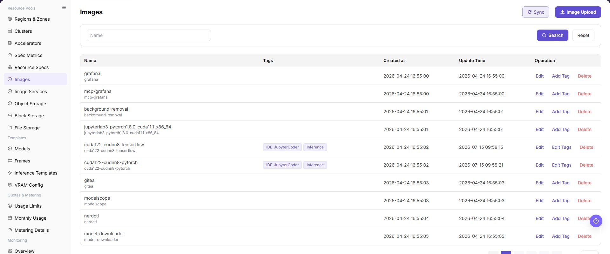

# Images

## Feature Overview

| Item | Content |
| --- | --- |
| Applicable Role | Operator |
| Navigation Path | AI Infra(On-Prem) > Resource Pools > Images |
| Page Route | `/powerone/resourcepool/image` |
| Managed Object | Configuration, status, and relationships on Images |

#### Beginner Explanation

Image Management is like the runtime environment shelf of the platform. Operators first make sure the image registry and image component are available, then build, log in, and push images through a client, and finally return to the platform page to sync or register image information so that jobs, IDEs, inference services, or templates can select the correct version.

#### Terms

| Term | Description |
| --- | --- |
| Client Tool | Local tool used to build, log in, and push images, such as Docker, Podman, or the actual client supported by the page. |
| Image Registry | Registry service that stores images. |
| Project/Namespace | Project, tenant, or namespace in the image registry, used to isolate images. |

#### Recommended Operation Order

Confirm prerequisites for Client tool, image registry, project/namespace, image name, image tag, image address, image type, architecture, and sync status, follow Main Operations, run Result Validation, and continue to the next page.

#### First-Time User Notes

Confirm that the task involves Configuration, status, and relationships on Images, and then follow the recommended order. If fields or state differ from expectations, check prerequisites before continuing downstream.

## Prerequisites

1. The image component has been connected, and the Image Management list loads normally.
2. The current account has view and management permissions for `AI Infra > On-Prem > Resource Pools > Image Management`.
3. Docker, Podman, or the actual client tool supported by the page is ready on the local client.
4. Image naming, tag meaning, purpose, architecture, and impact scope have been planned.

## Page Description

Use this page to view and handle Configuration, status, and relationships on Images.



The image keeps the sidebar and complete feature area. Confirm the page title, scope, and primary operation entry.

The page displays image name, tags, creation time, update time, and operation entrypoints in a table.

The following figure shows the image management list, where image tags can be maintained and upload or sync can be performed.

## Main Operations

### View Images

1. Go to `Resource Pools > Image Management`.
2. Filter by name, version, architecture, status, or update time.
3. Open details and check format, architecture, size, validation status, and applicable scenarios.
4. If no record is returned, reset filters. Do not share internal registry locations or credentials.

### Manage Image Tags and Status

1. Locate the target image in the image list and verify its current tags, creation time, update time, and synchronization state.
2. Click **"Add Tag"** or **"Edit Tags"** in the target image row and maintain the tag content as prompted by the page.
3. Verify tag meaning, image architecture, and reference scope from downstream jobs or templates.
4. Refresh the list after changing tags and verify the new tags and synchronization state. Use the separate **"Delete"** action when the image record itself must be removed.

### Upload Images

#### Applicable Scenarios

Use the client upload guide when a locally built or existing runtime image needs to be pushed to an image registry and added to platform Image Management.

#### Steps

1. Go to `AI Infrastructure > On-Prem > Resource Pools > Image Management`, and confirm that the image component is connected and the image list loads normally.
2. Prepare the local client environment for image build, login, and push, such as Docker, Podman, or the actual client tool supported by the page.
3. Build or load the local image, and tag the image address with a placeholder format, such as `<BASE_URL>/<project>/<image>:<tag>`.
4. Log in to the image registry and push the image. Use placeholders only in learning or documentation examples. Do not write real registry addresses, accounts, or passwords.
5. Return to `Image Management`, Click **"Image Upload"**, **"Sync"**, or the actual page entry, and add the image address, tags, purpose, architecture, and other information to platform management.
6. Before clicking the final **"Save"**, **"Submit"**, or **"OK"**, verify the image source, tag meaning, purpose, and impact on existing jobs.
7. For learning or page validation only, view fields, dialogs, and client command formats. Do not push real images or submit real configuration.

Use placeholder-only client command examples:

```bash
docker tag <local-image>:<local-tag> <BASE_URL>/<project>/<image>:<tag>
docker login <BASE_URL>
docker push <BASE_URL>/<project>/<image>:<tag>
```

The following figure shows the Image Upload entrypoint. Confirm image source, purpose, and tags before uploading.


### Sync Images

#### Applicable Scenarios

Use **"Sync"** in the upper-right corner when images or tags in the image registry have changed and the latest list must be synchronized to the platform.

#### Steps

1. Go to `AI Infrastructure > On-Prem > Resource Pools > Image Management` and verify that the image component is healthy.
2. Click **"Sync"** in the upper-right corner, read the page prompt, and confirm the synchronization scope.
3. After synchronization completes, refresh the list and locate the target record by image name or tag.

#### Result Validation

- The list shows the synchronized image or tag and its update time changes.
- Image address, architecture, and synchronization state match the target registry record.
- Later job, IDE, or inference-template pages can select the synchronized image.

#### Notes

- Synchronization may add tags or update states; it is not the same as deleting existing platform records. Confirm registry content and impact scope first.
- Do not submit repeatedly during synchronization. If the state does not change for a long time, check image component connectivity and page prompts.

#### An Image Tag Is Missing After Synchronization

**Symptom:**

Synchronization completes, but the target image or tag is still not listed.

**Possible Causes:**

- The registry project, tag, or architecture is outside the current synchronization scope.
- The image component connection is abnormal or synchronization is incomplete.
- Active list filters hide the target record.

**Solution:**

1. Reset filters and search again by image name.
2. Open Image Services and verify Endpoint, state, and connectivity.
3. Check image update time and synchronization state, then recheck after processing completes.

### Edit Image

#### Applicable Scenarios

Edit an image when page-editable information must change but the image content in the registry does not need to be rebuilt or pushed again.

#### Steps

1. Go to `AI Infrastructure > On-Prem > Resource Pools > Image Management` and locate the target image.
2. Click **"Edit"** in the image row and verify the image identifier and editable fields in the dialog.
3. Update the fields provided by the page and verify that the wrong image will not be changed or affect existing jobs.
4. Before clicking the final **"Save"** or **"OK"**, verify image address, architecture, tags, and purpose.
5. Return to the list and verify the updated information and update time.

#### Result Validation

- The image list shows the updated fields and the image address-to-tag relationship is correct.
- Image state does not become abnormal because of the metadata edit.
- Downstream selection pages can identify the updated image information.

#### Notes

- Editing page information does not replace image build, push, or synchronization in the registry. Push registry changes from a client and then synchronize them.
- Before changing tags, architecture, or purpose, check dependencies from instances, jobs, and templates to avoid incorrect downstream image selection.

#### Image Information Is Still Old After Editing

**Symptom:**

The edit reports success, but the list or details still show old information.

**Possible Causes:**

- Page cache has not refreshed.
- Final confirmation was not completed or background validation is incomplete.
- The searched row is not the same object that was edited.

**Solution:**

1. Refresh the list and locate the record again by image address or identifier.
2. Check the page prompt and update time to confirm processing finished.
3. Verify address, tag, and architecture so that another record was not edited by mistake.

### Remove Image

#### Applicable Scenarios

Remove an image when its platform record is no longer needed and no job, IDE, template, or instance depends on it.

#### Steps

1. Go to `AI Infrastructure > On-Prem > Resource Pools > Image Management` and locate the target image.
2. Click **"Delete"** in the image row.
3. Read the confirmation prompt and verify image name, address, tag, and related business objects.
4. After confirming impact scope, data retention, and rollback handling, click the confirmation button to remove the record.
5. Refresh the list and check image choices on downstream pages.

#### Result Validation

- The target image record is removed from Image Management.
- New job, IDE, or inference-template pages no longer offer the removed platform image.
- Other images, tags, and underlying registry data are not unintentionally deleted.

#### Notes

- Removing a platform record does not necessarily delete image data in the registry. Confirm the boundary and retention requirement first.
- Do not remove an image with running jobs or template dependencies. Configure and migrate to a replacement image first.

#### The Image Still Appears Downstream After Deletion

**Symptom:**

The image is gone from Image Management, but a downstream page still offers it.

**Possible Causes:**

- The downstream page cache has not refreshed.
- The downstream page stores a historical configuration or uses a registry-side record.
- The deletion request is still processing.

**Solution:**

1. Refresh the downstream page and reset filters.
2. Check whether the downstream object references a platform image record or a registry address.
3. Check image update time and page prompt to confirm removal has completed.

## Parameter Quick Reference

| Field Name | Required | Field Type | Example | Description |
| --- | --- | --- | --- | --- |
| Client Tool | Conditionally required | Text | `Docker` | Local tool used to build, log in, and push images. Use Docker, Podman, or the actual client tool supported by the page. |
| Image Registry | Yes | Address / path | `<BASE_URL>` | Registry where the image is stored. Use only the `<BASE_URL>` placeholder in documentation examples, not real registry addresses. |
| Project/Namespace | Yes | Address / path | `example-project` | Project, tenant, or namespace in the image registry. Use the `<project>` placeholder in examples, and fill in real values according to registry permissions only during actual operations. |
| Image Name | Yes | Address / path | `vllm-runtime` | Image display name or image name in the registry. The name should reflect framework, purpose, or runtime environment. |
| Image Tag | Yes | Text | `v1.0.0` | Image version tag. Avoid using only `latest` in production scenarios. |
| Image Address | Yes | Image URI | `<BASE_URL>/<PROJECT>/<IMAGE>:<TAG>` | Full image address, such as `<BASE_URL>/<project>/<image>:<tag>`. Verify registry, project, image, and tag before submission. |
| Image Type | No | Dropdown / enum | `Inference` | Image purpose type, such as development, training, or inference. Keep it consistent with later job, IDE, or inference template use. |
| Architecture | No | Number / capacity | `Ampere` | Image CPU architecture or hardware architecture. Match the target cluster node architecture. |
| Sync Status | System-generated | Status | `Synced` | Status after the platform synchronizes the image. Return to the platform after pushing and refresh or sync to check status. |
| Actions | No | Action entry | `Edit` | Supports upload image, sync, edit tags, view, delete, and other operations. Confirm impact scope before high-risk operations. |

## Pitfalls

- Client upload may write images to a real image registry and affect later jobs, IDEs, inference services, or template choices.
- Reusing or overwriting image tags may cause existing tasks to pull unexpected versions.
- Images must not contain keys, tokens, AK/SK, account passwords, internal configuration files, or test data.
- Do not write real accounts, passwords, or registry addresses in commands such as `docker login` or `podman login`.
- `Save`, `Submit`, and `OK` are high-risk final actions.

### Configuration Rules and Impact

- **Image before job**: The target image must be pullable from the registry before a job can run.
- **Stable tags**: Tags are used for filtering, recommendation, and deployment reproduction. Do not change their semantics casually.
- **Pullable address**: Image address, project/namespace, and tag must match the actual repository content.
- **Least privilege**: Client login credentials should only cover the required push or pull scope and must not be written into the document.
- **Delete carefully**: Before deleting or taking an image offline, confirm that no jobs, templates, model versions, online IDEs, or inference services depend on it.

## Result Validation

| Check Item | Success Signal | If Abnormal |
| --- | --- | --- |
| Page entry | Images opens with the target operation entry | Check Operator permission and whether the menu is available |
| Object record | Configuration, status, and relationships on Images is visible in the list or details | Reset filters and verify name, ownership, and creation result |
| State result | State after creation or change matches the page message | Check operation feedback, dependency state, and latest update time |
| Downstream use | A downstream page can select or associate the target | Return to prerequisites and check enabled state, ownership, and visibility |

## FAQ

#### Target Is Missing from Images

**Symptom:**

The page opens, but the expected Configuration, status, and relationships on Images is missing.

**Possible Causes:**

- Filters remain active.
- the object belongs to another scope.
- a prerequisite is incomplete.

**Solution:**

1. Reset filters
2. verify region or tenant ownership
3. confirm prerequisite state.

#### The Operation Entry on Images Is Unavailable

**Symptom:**

The create, register, or maintain entry is hidden or disabled.

**Possible Causes:**

- Role permission is insufficient.
- the page is read-only.
- dependencies are not ready.

**Solution:**

1. Check Operator permission
2. read the page message
3. complete dependency configuration first.

#### A Required Field on Images Has No Options

**Symptom:**

The form opens, but a selection list is empty.

**Possible Causes:**

- Candidates are disabled.
- ownership differs.
- the current account cannot see them.

**Solution:**

1. Check candidate state
2. verify ownership
3. confirm visibility and refresh the form.

#### Images Has an Abnormal State After the Operation

**Symptom:**

A record exists after submission, but its state is unexpected.

**Possible Causes:**

- Connectivity or validation failed.
- a dependency is abnormal.
- processing is incomplete.

**Solution:**

1. Check feedback and update time
2. inspect related objects
3. troubleshoot the processing stage.

#### A Downstream Page Cannot Use Images

**Symptom:**

The current page is normal, but a downstream page cannot select or associate Configuration, status, and relationships on Images.

**Possible Causes:**

- Visibility differs.
- the object is disabled.
- downstream cache is stale.

**Solution:**

1. Check enabled state and ownership
2. verify role visibility
3. refresh and select again.

## Notes

- Client upload may write images to a real image registry and affect later jobs, IDEs, inference services, or template choices.
- Reusing or overwriting image tags may cause existing tasks to pull unexpected versions.
- Images must not contain keys, tokens, AK/SK, account passwords, internal configuration files, or test data.
- Do not write real accounts, passwords, or registry addresses in commands such as `docker login` or `podman login`.
- `Save`, `Submit`, and `OK` are high-risk final actions. Confirm the scope and impact before executing the final action.

## Next Steps

1. Enter model configuration, framework configuration, job creation, online IDE, or inference service flows to verify that the image is selectable.
2. Maintain tags, architecture, and description according to image purpose for later filtering.
3. Regularly clean up unused image records after confirming that no downstream dependencies remain.
