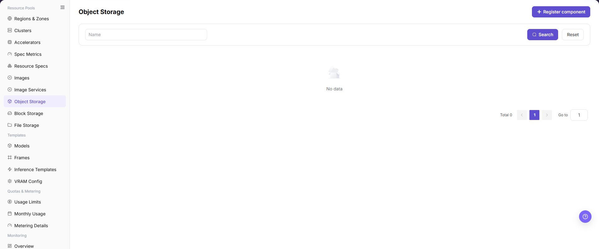
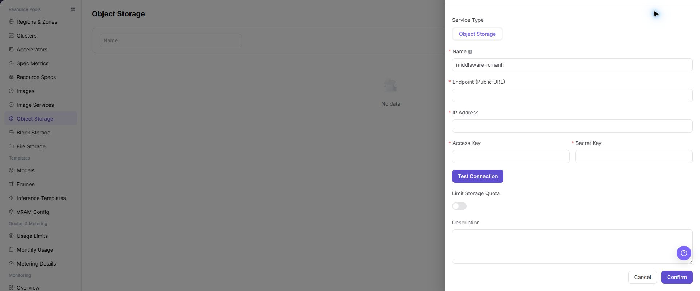

# Object Storage

## Feature Overview

| Item | Content |
| --- | --- |
| Applicable Role | Operator |
| Navigation Path | AI Infra(On-Prem) > Resource Pools > Object Storage |
| Page Route | `/powerone/resourcepool/storage` |
| Managed Object | Configuration, status, and relationships on Object Storage |

#### Beginner Explanation

- **Object storage** is like a bucket-organized file repository, suitable for storing model weights, datasets, compressed packages, and runtime artifacts.
- **Bucket** is the top-level container of object storage. Users can organize objects only after creating buckets.
- **Endpoint** is the access entrypoint. The platform, clusters, or jobs need to access object storage through it.
- **AK/SK** are access credentials and sensitive information. They should not appear in screenshots, documentation, or tickets.

#### Terms

| Term | Description |
| --- | --- |
| MinIO | A common S3-compatible object storage implementation. |
| S3 | Object storage API protocol or compatible interface. |
| Bucket | The top-level object storage container used to organize objects. |

#### Recommended Operation Order

Confirm prerequisites for Service Type, Object Storage, Name, Endpoint (Public URL), IP Address, Access Key, Secret Key, Limit Storage Quota, Description, and Actions, follow Main Operations, run Result Validation, and continue to the next page.

#### First-Time User Notes

Confirm that the task involves Configuration, status, and relationships on Object Storage, and then follow the recommended order. If fields or state differ from expectations, check prerequisites before continuing downstream.

## Prerequisites

1. The object storage service has been deployed and can be accessed from the platform management side and target clusters.
2. Endpoint, internal address, access protocol, authentication method, access credentials, capacity plan, and associated regions have been prepared.
3. Bucket naming, tenant isolation, permission boundaries, and data retention policies have been confirmed.
4. The current account has operator resource pool management permissions.

## Page Description

Use this page to view and handle Configuration, status, and relationships on Object Storage.

The image keeps the sidebar and complete feature area. Confirm the page title, scope, and primary operation entry.

The page displays connected object storage components, status, access Endpoint, internal address, capacity information, and associated regions.

The following figure shows the object storage list, where component status, Endpoint, internal address, capacity, and operation entrypoints can be viewed.

## Main Operations

### View Object Storage Components

1. Open the corresponding resource-pool component page and filter by name, cluster, status, or update time.
2. Open details and check redacted Endpoint information, capabilities, associated clusters, capacity, and health.
3. If no record is returned, reset filters and check cluster status. Do not copy credentials, internal addresses, or complete configuration.
4. For abnormal health, inspect connectivity and events before registering another component.

### Register Object Storage Component

#### Applicable Scenarios

Register a storage component when a new MinIO, S3-compatible storage, or another object storage service needs to be connected and used by regions, user-side buckets, or job object path read/write. In this page, storage component refers to the object storage entry managed here.

#### Steps

1. Go to `AI Infrastructure > On-Prem > Resource Pools > Object Storage`.
2. Click **"Register component"**.
3. Fill in `Service Type`, `Object Storage`, `Name`, `Endpoint (Public URL)`, `IP Address`, `Access Key`, `Secret Key`, `Limit Storage Quota`, and `Description` according to the page fields.
4. If the page provides `Test Connection`, run the read-only connectivity check first and confirm the returned result.
5. Before clicking the final **"Save"**, **"Submit"**, or **"OK"**, verify Endpoint (Public URL), IP Address, Access Key, Secret Key, and quota limit again.
6. For learning or page validation only, view fields and forms without submitting real object storage configuration.

The following figure shows the Register Storage Component form, used to configure object storage access method and connection parameters.

#### Operation Screenshots

The image shows fields and the confirmation area after opening the operation entry. Verify required fields, ownership, and impact before submission.

## Parameter Quick Reference

| Field Name | Required | Field Type | Example | Description |
| --- | --- | --- | --- | --- |
| Service Type | Yes | Dropdown / enum | `Image` | Service type of the current component. On the Object Storage page, this usually displays `Object Storage`. |
| Object Storage | Yes | Dropdown / enum | `Object Storage` | Service type value when registering a storage component. Keep it consistent with the actual page option. |
| Name | Yes | Text | `Example Name` | Display name of the object storage component. Use a name that reflects storage type, environment, or region. |
| Endpoint (Public URL) | Yes | Address / path | `<BASE_URL>` | Public entry exposed by object storage to the platform or service side. Do not record real Endpoint values in documentation. |
| IP Address | Conditionally required | IP address | `<PRIVATE_IP>` | Address used by clusters or the platform to access object storage. Keep it consistent with actual network, DNS, and routing configuration. |
| Access Key | Yes | Credential / sensitive text | `<ACCESS_KEY_ID>` | Access key for object storage. Fill it only in system forms. Do not write it in documents, screenshots, or tickets. |
| Secret Key | Yes | Credential / sensitive text | `<ACCESS_KEY_SECRET>` | Secret key for object storage. Sensitive credential. Do not write it in documents, screenshots, or tickets. |
| Limit Storage Quota | No | Number / capacity | `Enabled` | Whether to limit object storage quota. Plan according to tenant, region, and job scale. |
| Description | No | Multi-line text | `Example description` | Component purpose, boundary, or maintenance notes. Record non-sensitive notes only. |
| Actions | System-generated | Action entry | `Edit` | Register component, Test Connection, Cancel, Confirm, Edit quota, Delete, and similar entries. `Confirm` and `Delete` are high-risk actions. |

## Pitfalls

- Registering a storage component affects regional object storage capability, user-side bucket creation, job object path read/write, and data access scope.
- Incorrect Endpoint, internal address, certificate, AK/SK, bucket policy, or region binding may cause jobs to fail to read from or write to object storage.
- AK/SK, tokens, internal connection strings, and production bucket paths are sensitive information and must not be written into documents, screenshots, or tickets.
- `Save`, `Submit`, and `OK` are high-risk final actions.
- Do not record real Endpoint values, internal addresses, AK/SK, tokens, bucket names, production object paths, cluster IDs, resource pool IDs, or internal test parameters.

## Result Validation

| Check Item | Success Signal | If Abnormal |
| --- | --- | --- |
| Page entry | Object Storage opens with the target operation entry | Check Operator permission and whether the menu is available |
| Object record | Configuration, status, and relationships on Object Storage is visible in the list or details | Reset filters and verify name, ownership, and creation result |
| State result | State after creation or change matches the page message | Check operation feedback, dependency state, and latest update time |
| Downstream use | A downstream page can select or associate the target | Return to prerequisites and check enabled state, ownership, and visibility |

## FAQ

#### Target Is Missing from Object Storage

**Symptom:**

The page opens, but the expected Configuration, status, and relationships on Object Storage is missing.

**Possible Causes:**

- Filters remain active.
- the object belongs to another scope.
- a prerequisite is incomplete.

**Solution:**

1. Reset filters
2. verify region or tenant ownership
3. confirm prerequisite state.

#### The Operation Entry on Object Storage Is Unavailable

**Symptom:**

The create, register, or maintain entry is hidden or disabled.

**Possible Causes:**

- Role permission is insufficient.
- the page is read-only.
- dependencies are not ready.

**Solution:**

1. Check Operator permission
2. read the page message
3. complete dependency configuration first.

#### A Required Field on Object Storage Has No Options

**Symptom:**

The form opens, but a selection list is empty.

**Possible Causes:**

- Candidates are disabled.
- ownership differs.
- the current account cannot see them.

**Solution:**

1. Check candidate state
2. verify ownership
3. confirm visibility and refresh the form.

#### Object Storage Has an Abnormal State After the Operation

**Symptom:**

A record exists after submission, but its state is unexpected.

**Possible Causes:**

- Connectivity or validation failed.
- a dependency is abnormal.
- processing is incomplete.

**Solution:**

1. Check feedback and update time
2. inspect related objects
3. troubleshoot the processing stage.

#### A Downstream Page Cannot Use Object Storage

**Symptom:**

The current page is normal, but a downstream page cannot select or associate Configuration, status, and relationships on Object Storage.

**Possible Causes:**

- Visibility differs.
- the object is disabled.
- downstream cache is stale.

**Solution:**

1. Check enabled state and ownership
2. verify role visibility
3. refresh and select again.

## Notes

- Registering a storage component affects regional object storage capability, user-side bucket creation, job object path read/write, and data access scope.
- Do not screenshot or record real Endpoint values, internal addresses, AK/SK, tokens, internal connection strings, production bucket names, or production object paths.
- Before deleting, disabling, or replacing an object storage component, confirm data migration, backups, region bindings, and dependent jobs.
- `Save`, `Submit`, and `OK` are high-risk final actions. Confirm the scope and impact before executing the final action.
- Do not record real Endpoint values, internal addresses, AK/SK, tokens, bucket names, production object paths, cluster IDs, resource pool IDs, or internal test parameters.

## Next Steps

1. Go to [Regions / Availability Zones](../regions-zones/) to bind the object storage component.
2. Guide users to create buckets and upload data in [Object Storage](../../../user/storage/object-storage/).
3. Verify object read/write, permissions, and path configuration with a test job.
4. Regularly check capacity usage, bucket policy, and data retention policy.
