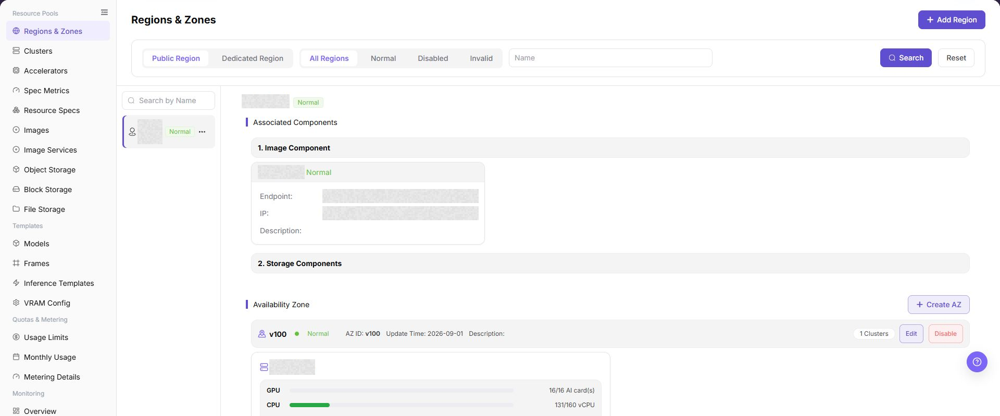
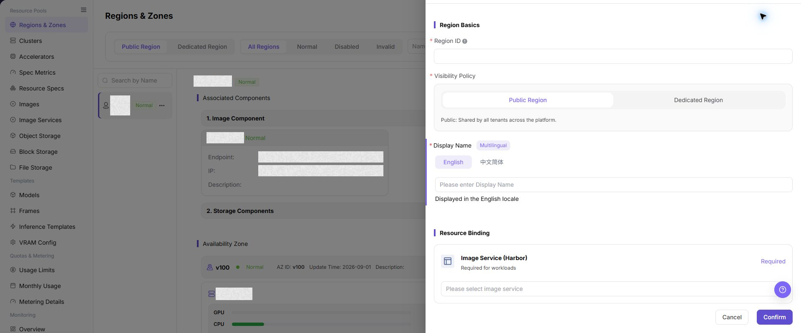
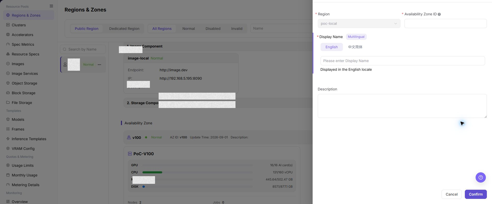

# Regions & Zones

## Feature Overview

| Item | Content |
| --- | --- |
| Applicable Role | Operator |
| Navigation Path | AI Infra(On-Prem) > Resource Pools > Regions & Zones |
| Page Route | `/powerone/resourcepool/region` |
| Managed Object | Configuration, status, and relationships on Regions & Zones |

#### Beginner Explanation

You can think of an On-Prem resource pool as an office system:

- **Region** is like a city, such as Wuhan or Beijing. It distinguishes the broad location or scope of resources.
- **Availability Zone** is like an office area or floor inside a city. It further divides where resources are hosted.
- **Cluster** is like a work area inside an office zone. It provides the actual CPU, GPU, memory, disk, and other compute resources.
- **Job** is like a specific piece of work. It must be scheduled onto a cluster to run.
- **Public Region** is like an open office area that all authorized users can share.
- **Dedicated Region** is like an independent office with access control, available only to specified teams or tenants.

Therefore, the first-time configuration order cannot be reversed: create a region first, then create an availability zone, register clusters into the availability zone, and finally submit a job to verify that the resources are usable.

#### Terms

| Term | Description |
| --- | --- |
| Harbor | A container image registry used to store and distribute images required by jobs. After a region is bound to an image service, later jobs can pull images from the corresponding registry. |
| Endpoint | The service access entry, usually used by the platform or jobs to access components such as image and storage services. |
| IP | The service location address or access address, used to determine whether the component network is reachable. |

#### Recommended Operation Order

Confirm prerequisites for Region, Availability Zone, region-associated components, and cluster resources under availability zones, follow Main Operations, run Result Validation, and continue to the next page.

#### First-Time User Notes

Confirm that the task involves Configuration, status, and relationships on Regions & Zones, and then follow the recommended order. If fields or state differ from expectations, check prerequisites before continuing downstream.

## Prerequisites

Before configuration, confirm that the following conditions are met:

1. The current account has operator permissions and can access `Resource Pools > Regions & Zones`.
2. At least one available image service has been connected. If the image service dropdown is empty, first go to `Resource Pools > Image Services` to check whether the component has been connected, enabled, and whether the current account has view or bind permissions.
3. If object storage, file storage, or block storage is required in the region, complete the corresponding storage component connection in advance. An empty dropdown usually means that the component has not been connected, has not been enabled, or is not accessible to the current account.
4. If clusters will be registered later, plan the region ID, availability zone ID, display names, and cluster ownership relationship in advance.

## Page Description

Use this page to view and handle Configuration, status, and relationships on Regions & Zones.

The image keeps the sidebar and complete feature area. Confirm the page title, scope, and primary operation entry.

The page consists of the filter area, region list, and region detail area. After you enter the page, the system displays the region list that matches the current filter criteria by default. After you select a region, the right side displays the component bindings, availability zones, and cluster resources of that region.

In the screenshot, the upper-right corner is the `Add Region` entry, the left side is the region list, and the right side shows the component bindings and availability zone resources of the current region.

#### Filter Area

The filter area is at the top of the page and is used to narrow down the region list.

| Filter Item | Description |
| --- | --- |
| Region Type | Filter by `Public Region` or `Dedicated Region`. Public regions can be shared by platform tenants. Dedicated regions are used to restrict the usage scope. |
| Status | Filter regions by `All`, `Normal`, `Disabled`, or `Invalid`. |
| Name | Enter a region name keyword and Click **"Search"** to quickly locate regions. Click **"Reset"** to clear filter criteria. |

#### Region List

The region list on the left displays the region name, status, and more action entry. After you click a region name, the detail area on the right refreshes to show the information of the selected region.

The `...` menu in the region list is used to perform region-level actions, such as editing, disabling, or enabling a region.

#### Region Details

Region details display the resource capabilities associated with the current region, including:

- Image component: displays the bound image service address, status, Endpoint, IP, description, and other information.
- Storage components: displays configuration summaries such as quotas, buckets, IP addresses, or other settings for enabled object storage, file storage, and block storage components.
- Availability zones: displays the availability zone status, availability zone ID, update time, description, and cluster count under the region.

Endpoint is the service access entry, usually used by the platform or jobs to access the corresponding component. IP is the service location address or access address, used to determine whether the component network is reachable.

#### Availability Zones and Cluster Resources

After expanding an availability zone, you can view the cluster resource usage under that availability zone. Cluster cards usually display the following information:

- Cluster name.
- GPU, CPU, MEM, and DISK resource usage.
- Node count, job count, and creation time.

Resource usage is displayed in the "used/total" format, which helps you quickly determine whether a specific availability zone or cluster has a resource bottleneck.

#### Management Notes

- The `...` menu in the region list is used to edit, disable, or enable a region.
- The `Availability Zone` section can edit, disable, or enable an availability zone, and can expand to show cluster resources under the availability zone.
- Management actions may affect new resource creation, new cluster registration, or new job scheduling. Confirm region, availability zone, cluster, and job dependencies before applying changes.

## Main Operations

### View Regions and Availability Zones

1. Go to `Resource Pools > Regions and Availability Zones`.
2. Filter by region name, availability zone, status, or update time.
3. Open details and check hierarchy, resource bindings, status, and associated clusters.
4. If no record is returned, reset filters. Before disabling, confirm that no resource or deployment depends on it.

### Add Region

#### Applicable Scenarios

Add a region when the platform needs to connect a new compute resource area, or when resource pools need to be divided by data center, city, or business scope. The following scenarios usually require adding a region:

- During the first deployment of an On-Prem resource pool, at least one region must be created.
- When a new data center is added, new compute resources are purchased, or a new resource supply area is connected, create regions based on resource location.
- When resources need to be isolated by tenant, department, or business line, create a dedicated region.

#### Configuration Basics

Before adding a region, confirm the resource boundary and component selection logic:

- **Region** is used to divide broad resource boundaries. It usually corresponds to a city, data center, resource pool, or tenant boundary.
- **Availability Zone** must belong to a region and is used to further distinguish data center areas, network domains, resource groups, or cluster groups under a region.
- **Image Service** is a key dependency of a region. If no image service is available, later jobs may fail to pull runtime images.
- **Storage Components** are enabled based on business needs. Object storage is suitable for model files and datasets, file storage is suitable for shared directories, and block storage is suitable for independent disk volumes.
- **Public Region** is suitable for shared resource pools, such as shared test resource pools or public training resource pools. **Dedicated Region** is suitable for department-owned or tenant-owned production compute resource pools.
- Storage component navigation paths are `Resource Pools > Object Storage`, `Resource Pools > File Storage`, and `Resource Pools > Block Storage`.

#### Pre-Operation Confirmation

An available image service must already exist before you add a region. Without an image service, even if the region can be created, later jobs may fail to pull runtime images.

Confirm the following first:

1. An available image service already exists in `Resource Pools > Image Services`.
2. The current account has permission to bind the image service.
3. If object storage, file storage, or block storage needs to be enabled, the corresponding component has been connected and is available in `Resource Pools > Object Storage`, `Resource Pools > File Storage`, or `Resource Pools > Block Storage`.
4. The region ID has been determined according to the long-term plan. The region ID is a resource boundary identifier and cannot be modified after creation.

#### Steps

1. Go to `AI Infrastructure > On-Prem > Resource Pools > Regions & Zones`.
2. Click **"Add Region"** in the upper-right corner of the page to open the Add Region dialog.
3. In the `Region Basics` section, fill in `Region ID`, select `Visibility Policy`, and maintain multilingual `Display Name`.
4. In the `Resource Binding` section, select the required `Image Service (Harbor)`, and enable `Object Storage`, `File Storage`, or `Block Storage` as needed.

The following screenshot shows the Add Region form. The upper area configures the region ID, visibility policy, and multilingual display names. The lower area binds the image service and optional storage components.

5. Before clicking the final **"Confirm"**, verify the region ID, visibility policy, display name, and resource binding again.
6. To discard the configuration, Click **"Cancel"** to close the dialog.

#### Add Region Field Notes

| Field Name | Required | Field Type | Example | Description |
| --- | --- | --- | --- | --- |
| Region ID | Yes | Text | `wuhan` | Unique region identifier. Use lowercase letters, numbers, and hyphens. It cannot be modified after creation. |
| Visibility Policy | Yes | Single choice | `Public Region` | Controls whether the region is shared by all tenants or visible only to a dedicated scope. |
| Display Name | Yes | Multilingual | English `WuHan` / Simplified Chinese `武汉` | Region name displayed in different language environments. |
| Image Service (Harbor) | Yes | Dropdown | `image-xxx` | Image service bound to the region. Later jobs depend on it to pull images. |
| Object Storage | No | Switch / Dropdown | `Off` | Enable only when unstructured data, model files, or datasets are required. |
| File Storage | No | Switch / Dropdown | `Off` | Enable only when a shared file system is required for multi-node I/O. |
| Block Storage | No | Switch / Dropdown | `Off` | Enable only when independent disks or high-performance block volumes are required. |

#### Add Region Pitfall Notes

- The region ID cannot be modified after creation. Confirm the naming, regional meaning, and tenant boundary before submitting.
- If the image service is unavailable, jobs may fail to pull images. Confirm that the image component status is normal before adding a region.
- Storage components are not mandatory. Enable a storage component only when the business requires the corresponding storage capability.
- A public region expands the resource visibility scope, while a dedicated region restricts the resource scope. Confirm the tenant or department boundary before configuration.

#### Add Region Submission Checks

After the region is submitted successfully, check whether the configuration has taken effect:

1. Confirm that the new region appears in the region list on the left.
2. Confirm that the region status is `Normal` or the expected status.
3. Select the region and confirm that the image component is displayed in the detail area on the right.
4. If storage components are enabled, confirm that the corresponding storage components appear in the associated component list.
5. If clusters will be registered later, go to the cluster registration page and confirm that the region can be selected.

### Edit Region

#### Applicable Scenarios

Edit a region when its multilingual display name or resource binding must change while the region ID and resource boundary remain unchanged. The region ID is read-only in the edit form.

#### Steps

1. Go to `AI Infrastructure > On-Prem > Resource Pools > Regions & Zones`.
2. Select the target region in the left list, open the row's **"..."** menu, and click **"Edit"**.
3. Verify the read-only `Region ID`, then update the multilingual display name or resource bindings provided by the page.
4. Before clicking **"Confirm"**, verify that the change will not unintentionally unbind an image or storage component in use.
5. Return to the list and region details to verify the updated name, bindings, and update time.

#### Result Validation

- The region list shows the updated multilingual name while the region ID and hierarchy remain unchanged.
- Region details show the resource bindings submitted in the form.
- The downstream cluster registration page can still select the region as expected.

#### Notes

- The region ID is a resource boundary identifier and cannot be changed by editing. Replacing it requires a separate assessment for creating a new region and migrating downstream resources.
- Removing a component binding may affect image pulls, storage mounts, or later resource creation. Check associated clusters and jobs before submitting.

#### The Region Name or Binding Does Not Change After Editing

**Symptom:**

The old name is still shown after saving, or the new resource binding is missing from region details.

**Possible Causes:**

- The final confirmation was not completed.
- The page state or data update has not refreshed.
- The component is unavailable or not visible to the current account.

**Solution:**

1. Reopen the region edit entry and verify the fields and page message.
2. Refresh the list, select the region again, and check the update time.
3. Open the corresponding component page and verify its status and visibility scope.

### Disable or Enable Region

#### Applicable Scenarios

Disable a region when new resource use must be temporarily stopped, or enable it again after maintenance. When the current state is `Normal`, the menu shows **"Disable"**; when the current state is `Disabled`, it shows **"Enable"**.

#### Steps

1. Go to `AI Infrastructure > On-Prem > Resource Pools > Regions & Zones` and filter by status to locate the target region.
2. Open the target region row's **"..."** menu and select **"Disable"** or **"Enable"** according to its current state.
3. Read the confirmation prompt and verify the impact on the region, availability zones, clusters, and job scheduling.
4. After confirming the impact scope, click the confirmation button to change the state.
5. Refresh the list and verify the region state and downstream selectable scope.

#### Result Validation

- After disabling, the region state is `Disabled`; after enabling, it returns to the page-defined normal available state.
- The changed region can be located with the status filter.
- Cluster registration, job scheduling, or resource creation applies the corresponding region-state restriction.

#### Notes

- Disabling a region usually affects new cluster registration, new resource creation, and new job scheduling. It does not mean that existing resources are deleted; verify the business window first.
- Before enabling, verify that image services, storage components, and downstream clusters are healthy so that newly available resources do not immediately fail.

#### Why Is the Enable Entry Missing?

**Symptom:**

The target region menu shows only **"Disable"**, not **"Enable"**.

**Possible Causes:**

- The region is still in the normal state.
- The `Disabled` filter has not been applied to other records.
- The current account cannot view disabled records.

**Solution:**

1. Confirm the current state of the target region.
2. Select the `Disabled` status filter and search for the region to restore.
3. If it is still unavailable, check Operator permission and region visibility.

### Create AZ

#### Applicable Scenarios

Add an availability zone when a region needs to host new clusters, or when resources need to be further divided by data center rack, network domain, or resource group. The following scenarios usually require adding an availability zone:

- Multiple clusters exist under the same region and resources need to be divided by cluster group.
- Different data center areas, floors, network domains, or rack areas exist in the same city or data center.
- Network isolation, fault isolation, or resource grouping is required to avoid mixing all clusters in the same availability zone.

#### Pre-Operation Confirmation

Before adding an availability zone, you must first create and select the target region. An availability zone cannot exist outside a region. Selecting the wrong owner affects later cluster registration and job scheduling.

Confirm the following first:

1. The target region has been created, and its status is `Normal` or the status expected for the current operation.
2. The target region has been selected in the region list on the left.
3. The availability zone ID has been determined according to the region plan. It is recommended to include the region prefix and a sequence number, such as `wuhan-1` or `wuhan-gpu-1`.
4. The availability zone ID cannot be modified after creation.

#### Steps

1. Select the target region in the region list on the left.
2. In the `Availability Zone` section on the right, Click **"Create AZ"** to open the Create AZ dialog.
3. Confirm that the `Region` field is the target region.
4. Fill in `Availability Zone ID`.
5. Fill in `Display Name` in each multilingual tab.
6. Fill in the description as needed, such as geographical location, data center number, or business purpose.

The following screenshot shows the Create AZ form. The top area shows the owning region, and the middle area is used to fill in the availability zone ID and multilingual display names.

7. Before clicking the final **"Confirm"**, verify the parent region, availability zone ID, display name, and description again.

#### Create AZ Field Notes

| Field Name | Required | Field Type | Example | Description |
| --- | --- | --- | --- | --- |
| Region | Yes | Dropdown | `Wuhan` | The parent region to which the availability zone belongs. When adding an availability zone, this is usually automatically filled from the currently selected region. Confirm that the ownership is correct before submitting. |
| Availability Zone ID | Yes | Text | `wuhan-1` | The unique identifier of the availability zone. It is recommended to use lowercase letters, numbers, and hyphens, such as `wuhan-1` or `wuhan-gpu-1`. It cannot be modified after creation. |
| Display Name (Multilingual) | Yes | Multilingual tabs | Simplified Chinese `Wuhan-1` / English `Wuhan-1` | The availability zone name displayed in different language environments. Keep the regional meaning consistent with the availability zone ID. |
| Description | No | Multi-line text | `Wuhan zone 1` | You can enter the data center location, purpose, network boundary, or maintenance notes to make later operations easier to identify. |

#### Create AZ Pitfall Notes

- Select the target region before adding an availability zone. Do not create the availability zone under the wrong region.
- The availability zone ID cannot be modified after creation. Include the region prefix and sequence number to avoid names that are hard to distinguish across regions.
- After an availability zone is created, it cannot run jobs by itself. You still need to register clusters under the availability zone.

#### Create AZ Submission Checks

After the availability zone is submitted successfully, check whether the configuration has taken effect:

1. Confirm that the new availability zone appears in the target region details.
2. Confirm that the availability zone ID, display name, and description are as expected.
3. Confirm that the availability zone status is `Normal` or the expected status.
4. Go to the cluster registration page and confirm that the new availability zone can be selected under the region.

### Edit Availability Zone

#### Applicable Scenarios

Edit an availability zone when its multilingual display name or description must change while its availability zone ID and parent region remain unchanged. The region and availability zone ID are read-only in the edit form.

#### Steps

1. Go to `AI Infrastructure > On-Prem > Resource Pools > Regions & Zones` and select the target region.
2. In the `Availability Zone` section, find the target zone, open its row's **"..."** menu, and click **"Edit"**.
3. Verify the read-only `Region` and `Availability Zone ID`, then update the multilingual display name or description provided by the page.
4. Before clicking **"Confirm"**, verify that the zone still belongs to the correct region and that the name change will not affect identification or operations handover.
5. Return to the availability zone list and verify the name, description, state, and update time.

#### Result Validation

- The availability zone list shows the updated multilingual name or description while the region and zone ID remain unchanged.
- The cluster count and resource relationships in the zone details are not unintentionally changed.
- The cluster registration page can still select the zone under the correct region.

#### Notes

- The availability zone ID and parent region cannot be changed by editing. Moving ownership requires a separate assessment for resource migration and scheduling impact.
- Changing a display name does not change the actual ownership of clusters, nodes, or jobs. Update operating records to use the new name.

#### The Availability Zone Shows the Wrong Parent After Editing

**Symptom:**

The zone is shown under the wrong region after editing, or the cluster registration page cannot find it.

**Possible Causes:**

- The wrong region was selected during the edit.
- Active filters hide the target record.
- The zone state or parent region is not available for registration.

**Solution:**

1. Return to region details and verify the zone's parent region and state.
2. Reset filters and reload the availability zone list.
3. In cluster registration, verify the region, availability zone, and available state.

### Disable or Enable Availability Zone

#### Applicable Scenarios

Disable an availability zone when new cluster registration or job use must be temporarily stopped, or enable it again after maintenance. When the current state is `Normal`, the menu shows **"Disable"**; when the current state is `Disabled`, it shows **"Enable"**.

#### Steps

1. Go to `AI Infrastructure > On-Prem > Resource Pools > Regions & Zones` and select the target region.
2. In the `Availability Zone` section, find the target zone, open its row action menu, and select **"Disable"** or **"Enable"** according to its current state.
3. Read the confirmation prompt and verify the impact on clusters, nodes, jobs, and storage under the zone.
4. After confirming the impact scope, click the confirmation button to change the state.
5. Refresh the availability zone list and verify the state and selectable scope in cluster registration and job scheduling.

#### Result Validation

- After disabling, the zone state is `Disabled`; after enabling, it returns to the page-defined normal available state.
- The target zone can be located with the status filter.
- Cluster registration and job scheduling apply the corresponding availability-zone state restriction.

#### Notes

- Disabling a zone affects new cluster registration or job scheduling under that zone. Confirm the handling of existing jobs, nodes, and storage first.
- Before enabling, verify cluster health, resource reporting, and storage configuration under the zone to avoid scheduling failures.

#### Why Is the Availability Zone Enable Entry Missing?

**Symptom:**

The target availability zone menu shows only **"Disable"**, not **"Enable"**.

**Possible Causes:**

- The zone is still in the normal state.
- Disabled records are hidden by the current status filter.
- The current account cannot view the zone.

**Solution:**

1. Check the current state of the availability zone.
2. Select the `Disabled` status filter and locate the record again.
3. Check Operator permission, the parent region, and the zone visibility scope.

#### Operation Screenshots

The image shows fields and the confirmation area after opening the operation entry. Verify required fields, ownership, and impact before submission.

The image shows fields and the confirmation area after opening the operation entry. Verify required fields, ownership, and impact before submission.

## Parameter Quick Reference

| Field Name | Required | Field Type | Example | Description |
| --- | --- | --- | --- | --- |
| Region ID | Yes | Text | `wuhan` | Unique region identifier that affects later availability zone, cluster, and resource pool ownership. |
| Visibility Policy | Yes | Single choice | `Public Region` | Controls whether the region is shared platform-wide or visible only to a dedicated scope. |
| Display Name | Yes | Multilingual | English `WuHan` / Simplified Chinese `武汉` | Name displayed for the region or availability zone in different language environments. |
| Availability Zone ID | Yes | Text | `wuhan-1` | Unique availability zone identifier that affects later cluster registration and scheduling scope. |
| Region | Yes | Dropdown | `WuHan` | The parent region of the availability zone. Verify ownership before submitting. |
| Image Service (Harbor) | Required for region | Dropdown | `image-xxx` | Image service bound to the region. It affects job image pulling. |
| Object Storage / File Storage / Block Storage | No | Switch / Dropdown | `Off` | Storage capabilities bound based on business requirements. |
| Description | No | Multi-line text | `Wuhan zone 1` | Records data center location, purpose, network boundary, or maintenance notes. |
| Actions | Conditionally triggered | Button | `Confirm` / `Cancel` | `Confirm` submits real configuration. Confirm the scope and impact before executing the final action. |

## Pitfalls

- **Configuration order**: Create a region first, then create an availability zone, and finally register clusters under the corresponding availability zone.
- **Image service**: Bind an available image service when adding a region. Otherwise, later jobs may fail to pull images normally.
- **Storage components**: Enable object storage, file storage, and block storage as needed. Do not force-enable a component in a region before the corresponding component is connected.
- **Public region**: Suitable for platform-wide shared resource pools, such as shared test resource pools or public training resource pools.
- **Dedicated region**: Suitable for tenant-limited, business-limited, or isolated resource pools, such as department-owned GPU resource pools.
- **Add impact**: Adding a region or availability zone may affect resource pool ownership, cluster management, scheduling scope, and capacity display.
- **Disable impact**: Disabling a region or availability zone may affect new job scheduling, new cluster registration, or new resource creation. In production environments, confirm the business window and impact scope before the operation.
- **Final actions**: `Confirm`, `Save`, and `Submit` are high-risk final actions. Verify naming, ownership, and impact scope before clicking them.
- **Resource observation**: Cluster resource usage under an availability zone helps quickly assess capacity, but it does not replace cluster node monitoring. When troubleshooting resource bottlenecks, go to the cluster or node detail page.
- **Multilingual display name**: Display names need to be maintained separately for Chinese and English to avoid empty names or inconsistent meanings in different language environments.

## Result Validation

| Check Item | Success Signal | If Abnormal |
| --- | --- | --- |
| Page entry | Regions & Zones opens with the target operation entry | Check Operator permission and whether the menu is available |
| Object record | Configuration, status, and relationships on Regions & Zones is visible in the list or details | Reset filters and verify name, ownership, and creation result |
| State result | State after creation or change matches the page message | Check operation feedback, dependency state, and latest update time |
| Downstream use | A downstream page can select or associate the target | Return to prerequisites and check enabled state, ownership, and visibility |

## FAQ

#### Target Is Missing from Regions & Zones

**Symptom:**

The page opens, but the expected Configuration, status, and relationships on Regions & Zones is missing.

**Possible Causes:**

- Filters remain active.
- the object belongs to another scope.
- a prerequisite is incomplete.

**Solution:**

1. Reset filters
2. verify region or tenant ownership
3. confirm prerequisite state.

#### The Operation Entry on Regions & Zones Is Unavailable

**Symptom:**

The create, register, or maintain entry is hidden or disabled.

**Possible Causes:**

- Role permission is insufficient.
- the page is read-only.
- dependencies are not ready.

**Solution:**

1. Check Operator permission
2. read the page message
3. complete dependency configuration first.

#### A Required Field on Regions & Zones Has No Options

**Symptom:**

The form opens, but a selection list is empty.

**Possible Causes:**

- Candidates are disabled.
- ownership differs.
- the current account cannot see them.

**Solution:**

1. Check candidate state
2. verify ownership
3. confirm visibility and refresh the form.

#### Regions & Zones Has an Abnormal State After the Operation

**Symptom:**

A record exists after submission, but its state is unexpected.

**Possible Causes:**

- Connectivity or validation failed.
- a dependency is abnormal.
- processing is incomplete.

**Solution:**

1. Check feedback and update time
2. inspect related objects
3. troubleshoot the processing stage.

#### A Downstream Page Cannot Use Regions & Zones

**Symptom:**

The current page is normal, but a downstream page cannot select or associate Configuration, status, and relationships on Regions & Zones.

**Possible Causes:**

- Visibility differs.
- the object is disabled.
- downstream cache is stale.

**Solution:**

1. Check enabled state and ownership
2. verify role visibility
3. refresh and select again.

## Notes

- Region IDs and availability zone IDs are resource boundary identifiers. Name them according to long-term plans and avoid temporary names.
- Region IDs can contain only lowercase letters, numbers, and hyphens. Availability zone IDs are also recommended to use a combination of lowercase letters, numbers, and hyphens.
- Region IDs and availability zone IDs cannot be modified after creation. Confirm the naming, ownership, and display names before submitting.
- Adding a region or availability zone may affect resource pool ownership, cluster management, scheduling scope, and capacity display. Confirm the impact scope before production configuration.
- Incorrect region or availability zone IDs may cause later resource binding, authorization, or scheduling exceptions.
- `Confirm`, `Save`, and `Submit` are high-risk final actions. Confirm the scope and impact before executing the final action.
- Before taking screenshots, check whether real data center codes, internal addresses, cluster IDs, resource pool IDs, accounts, keys, tokens, certificates, private keys, access keys, or internal test parameters are exposed on the page.
- The current account must have permissions to view and bind image services, storage components, regions, and availability zones. If a dropdown is empty, first check component status and account permissions.

## Next Steps

After completing this chapter, continue to check or perform the following:

1. Go to `Resource Pools > Clusters` to register clusters, and confirm that the new region and availability zone can be selected.
2. In the region details, confirm that the image service status is normal and that Endpoint and IP information are as expected.
3. If storage components are enabled, confirm that object storage, file storage, or block storage components are normal.
4. Associate specifications and required storage with the target cluster.
5. Submit a test job and confirm that images can be pulled, resources can be scheduled, storage can be mounted, and the job can run normally.
