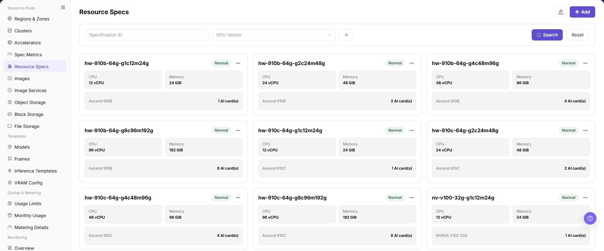
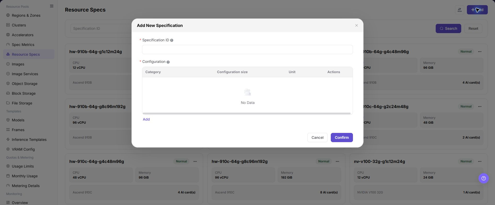

# Resource Specs

## Feature Overview

| Item | Content |
| --- | --- |
| Applicable Role | Operator |
| Navigation Path | AI Infra(On-Prem) > Resource Pools > Resource Specs |
| Page Route | `/powerone/resourcepool/flavor/list` |
| Managed Object | Configuration, status, and relationships on Resource Specs |

#### Beginner Explanation

- **Resource specification** is like a resource package. Users select it to request resources when creating jobs or services.
- **Specification metric** is a resource item in the package. CPU, memory, or accelerator metrics must exist before they can be combined into specifications.
- **Associated cluster** determines where the specification is available. After creation, the specification still needs to match actual cluster capacity.

#### Terms

| Term | Description |
| --- | --- |
| Specification ID | Resource package name displayed on the user side or job creation page. |
| CPU | CPU cores or CPU metric quantity included in the specification. |
| Memory | Memory capacity included in the specification. |

#### Recommended Operation Order

Confirm prerequisites for Specification name, CPU, memory, accelerator, accelerator quantity, specification metrics, associated clusters, and enabled status, follow Main Operations, run Result Validation, and continue to the next page.

#### First-Time User Notes

Confirm that the task involves Configuration, status, and relationships on Resource Specs, and then follow the recommended order. If fields or state differ from expectations, check prerequisites before continuing downstream.

## Prerequisites

1. The current account has operator permissions and can access `AI Infra > On-Prem > Resource Pools > Resource Specifications`.
2. Specification metrics have been configured, and CPU, memory, and accelerator metrics are available.
3. If the specification includes accelerators, accelerator model, k8s-key, selector-key, and resources actually reported by cluster nodes have been confirmed.
4. Specification naming, resource tiers, applicable job types, and later cluster association scope have been planned.

## Page Description

Use this page to view and handle Configuration, status, and relationships on Resource Specs.

The image keeps the sidebar and complete feature area. Confirm the page title, scope, and primary operation entry.

The page displays specification ID, status, CPU, memory, accelerator type, and quantity. It supports filtering by GPU vendor.

The following figure shows the resource specification list. Cards show CPU, memory, and accelerator quantity.

## Main Operations

### View Resource Specifications

1. Go to `Resource Pools > Resource Flavors`.
2. Filter by name, resource type, accelerator, status, or update time.
3. Open details and check CPU, memory, accelerators, storage, and applicable scenarios.
4. If no record is returned, reset filters. For a mismatch, check metric and accelerator associations.

### Add Resource Specification

#### Applicable Scenarios

Add a specification when resource tiers are required for training, inference, development, or model services, or when different resource combinations need to be provided by CPU, memory, accelerator model, and card count.

#### Steps

1. Go to `AI Infrastructure > On-Prem > Resource Pools > Resource Specifications`.
2. Click **"Add"** or the actual add entry on the page.
3. Fill in the specification ID. Use an ID that reflects CPU, memory, accelerator model, card count, and applicable scenario.
4. Select CPU, memory, accelerator, and other specification metrics, and fill in the corresponding quantities.
5. If the specification includes accelerators, verify that the accelerator metric, k8s-key, and selector-key are consistent with resources actually reported by the cluster.
6. Before clicking the final **"Save"**, **"Submit"**, or **"OK"**, verify the resource combination, naming convention, and later cluster association impact.
7. For learning or page validation only, view the fields and dialog without submitting real specification configuration.

The following figure shows the Add Resource Specification dialog. Clarify the CPU, memory, and accelerator combination during creation.

### Import or Export Resource Specifications

#### Applicable Scenarios

Use the **"Import/Export"** menu to batch-maintain resource specifications, or to export specification combinations for audit, reconciliation, and controlled migration.

#### Steps

1. Go to `AI Infrastructure > On-Prem > Resource Pools > Resource Specifications`.
2. Click **"Import/Export"** and choose **"Import"** or **"Export"** according to the business purpose.
3. For import, upload the file as required by the page and verify specification ID, resource metrics, quantities, accelerator model, and applicable scenario.
4. For export, confirm the filter scope, then generate and download the resource specification list as prompted by the page.
5. Before importing, verify that an incorrect definition used by cluster associations or jobs will not be overwritten. Save export files in a controlled directory.

#### Result Validation

- After import, the Resource Specifications list shows the added or updated combinations.
- The records in the export file match the current filter scope.
- Cluster specification association or job creation can correctly identify the imported specifications.

#### Notes

- Specification ID, metric quantities, and accelerator model must match actual cluster capacity; otherwise specification matching or scheduling may fail.
- Import may update fields on a specification with the same identifier. Check cluster associations, job dependencies, and file scope first.

#### An Imported Resource Specification Cannot Be Associated with a Cluster

**Symptom:**

The resource specification import completes, but the specification cannot be found in the specification association list in cluster details.

**Possible Causes:**

- The specification is unavailable or still being validated.
- Specification metrics do not match reported cluster resources.
- Specification scope or active filters do not match.

**Solution:**

1. Check state, specification ID, and update time in Resource Specifications.
2. Check metrics, keys, and model in Specification Metrics and Accelerators.
3. Reset filters, reopen cluster details, and verify the visibility scope.

#### Operation Screenshots

The image shows fields and the confirmation area after opening the operation entry. Verify required fields, ownership, and impact before submission.

## Parameter Quick Reference

| Field Name | Required | Field Type | Example | Description |
| --- | --- | --- | --- | --- |
| Specification ID | Yes | Dropdown / enum | `Example value` | Specification name selected when users create online IDEs, runtime instances, training jobs, or model services. Use an ID that reflects CPU, memory, accelerator model, card count, and applicable scenario. |
| CPU | Conditionally required | Number / capacity | `16 vCPU` | CPU metric and quantity included in the specification. Match the CPU resources required by the job, and avoid oversized or undersized settings. |
| Memory | Conditionally required | Number / capacity | `128 GiB` | Memory metric and capacity included in the specification. Keep memory units consistent to avoid display and scheduling definition mismatch. |
| Accelerator | No | Dropdown / enum | `1 x A100` | AI accelerator type or metric included in the specification. Keep it consistent with maintained accelerators and specification metrics. |
| Accelerator Quantity | No | Number / capacity | `1 x A100` | Number of accelerator cards included in the specification. Match resources actually reported by cluster nodes and schedulable capacity. |
| Specification Metric | Yes | Number / capacity | `Example value` | CPU, memory, accelerator, and other metrics referenced by the resource specification. k8s-key, selector-key, and unit should already be calibrated. |
| Associated Cluster | Conditionally required | Dropdown / enum | `cluster-a` | Cluster scope where the specification is available. Verify cluster region, availability zone, and actual resource capacity before association. |
| Enabled Status | No | Status | `Enabled` | Controls whether the specification can be selected by later flows. Complete association and test validation before opening it to users. |
| Actions | No | Action entry | `Edit` | Supports add, edit, create from this, enable, disable, delete, and other operations. Confirm impact scope and replacement options before high-risk actions. |

## Pitfalls

- Adding a specification affects resource packages available when users create online IDEs, runtime instances, training jobs, or model services.
- Oversized specifications may increase queue time; undersized specifications may cause insufficient resources after task startup.
- Incorrect specification metrics, k8s-key, or selector-key may make the specification unavailable or cause scheduling failures.
- `Save`, `Submit`, and `OK` are high-risk final actions.
- Do not record real cluster IDs, resource pool IDs, node labels, internal resource key mappings, tenant information, accounts, keys, tokens, or internal test parameters.

### Configuration Rules and Impact

- **Metrics before specifications**: Specifications depend on specification metrics. Without metrics, CPU, memory, or accelerators cannot be configured accurately.
- **Then associate clusters**: After a specification is created, it must still be associated with clusters before users can select it.
- **Consistent resource combination**: CPU, memory, and accelerator quantity in the specification should match cluster schedulable resources.
- **Readable naming**: Specification names should help capacity troubleshooting, user selection, and later template references.
- **Change enabled status carefully**: Before disabling or modifying an opened specification, confirm impacts on templates, tenant quotas, and running instances.

## Result Validation

| Check Item | Success Signal | If Abnormal |
| --- | --- | --- |
| Page entry | Resource Specs opens with the target operation entry | Check Operator permission and whether the menu is available |
| Object record | Configuration, status, and relationships on Resource Specs is visible in the list or details | Reset filters and verify name, ownership, and creation result |
| State result | State after creation or change matches the page message | Check operation feedback, dependency state, and latest update time |
| Downstream use | A downstream page can select or associate the target | Return to prerequisites and check enabled state, ownership, and visibility |

## FAQ

#### Target Is Missing from Resource Specs

**Symptom:**

The page opens, but the expected Configuration, status, and relationships on Resource Specs is missing.

**Possible Causes:**

- Filters remain active.
- the object belongs to another scope.
- a prerequisite is incomplete.

**Solution:**

1. Reset filters
2. verify region or tenant ownership
3. confirm prerequisite state.

#### The Operation Entry on Resource Specs Is Unavailable

**Symptom:**

The create, register, or maintain entry is hidden or disabled.

**Possible Causes:**

- Role permission is insufficient.
- the page is read-only.
- dependencies are not ready.

**Solution:**

1. Check Operator permission
2. read the page message
3. complete dependency configuration first.

#### A Required Field on Resource Specs Has No Options

**Symptom:**

The form opens, but a selection list is empty.

**Possible Causes:**

- Candidates are disabled.
- ownership differs.
- the current account cannot see them.

**Solution:**

1. Check candidate state
2. verify ownership
3. confirm visibility and refresh the form.

#### Resource Specs Has an Abnormal State After the Operation

**Symptom:**

A record exists after submission, but its state is unexpected.

**Possible Causes:**

- Connectivity or validation failed.
- a dependency is abnormal.
- processing is incomplete.

**Solution:**

1. Check feedback and update time
2. inspect related objects
3. troubleshoot the processing stage.

#### A Downstream Page Cannot Use Resource Specs

**Symptom:**

The current page is normal, but a downstream page cannot select or associate Configuration, status, and relationships on Resource Specs.

**Possible Causes:**

- Visibility differs.
- the object is disabled.
- downstream cache is stale.

**Solution:**

1. Check enabled state and ownership
2. verify role visibility
3. refresh and select again.

## Notes

- Once opened to users, resource specifications directly affect creation choices for model instances, online IDEs, runtime instances, and training jobs.
- Before modifying specification ID, resource quantity, or enabled/disabled status, confirm associated clusters, templates, tenant quotas, and running instances.
- Large specifications may increase queue time, while small specifications may cause insufficient resources after task startup. Calibrate with monitoring and failure cases.
- `Save`, `Submit`, and `OK` are high-risk final actions. Confirm the scope and impact before executing the final action.
- Do not record real cluster IDs, resource pool IDs, node labels, internal resource key mappings, tenant information, accounts, keys, tokens, or internal test parameters.

## Next Steps

1. Go to `AI Infra > On-Prem > Resource Pools > Cluster Management` and associate specifications with the target cluster.
2. Submit a test job, online IDE, or model service to verify specification scheduling results.
3. Return to the Resource Specifications list and confirm that enabled status, filter results, and associations are as expected.
