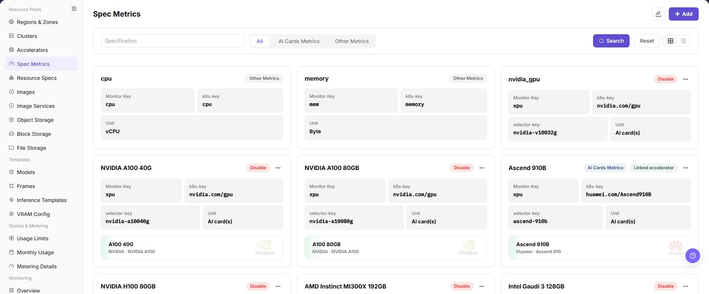
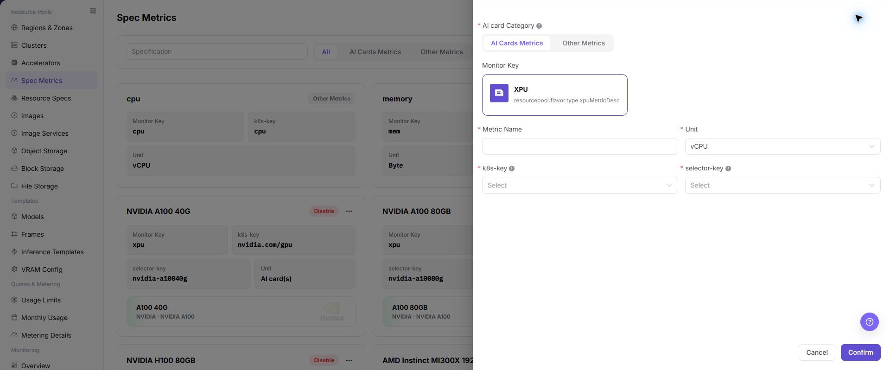

# Spec Metrics

## Feature Overview

| Item | Content |
| --- | --- |
| Applicable Role | Operator |
| Navigation Path | AI Infra(On-Prem) > Resource Pools > Spec Metrics |
| Page Route | `/powerone/resourcepool/flavor/type` |
| Managed Object | Configuration, status, and relationships on Spec Metrics |

#### Beginner Explanation

Specification metrics are like units of measure in a resource specification table. Whether CPU, memory, GPU, VRAM, and other fields can be correctly identified, displayed, and counted depends on metric definitions. When metric definitions are inconsistent, the specification name users see can fail to match the actual scheduled resources.

#### Terms

| Term | Description |
| --- | --- |
| Metric Name | Metric name displayed on the page and referenced by resource specifications. |
| Metric Type | CPU, memory, AI accelerator metric, or another metric type provided by the page. |
| Resource Key | Resource identifier used for scheduling or metering. |

#### Recommended Operation Order

Confirm prerequisites for Metric name, metric type, resource key, unit, k8s-key, selector-key, monitoring metric, and enabled status, follow Main Operations, run Result Validation, and continue to the next page.

#### First-Time User Notes

Confirm that the task involves Configuration, status, and relationships on Spec Metrics, and then follow the recommended order. If fields or state differ from expectations, check prerequisites before continuing downstream.

## Prerequisites

1. The current account has operator permissions and can access `AI Infra > On-Prem > Resource Pools > Specification Metrics`.
2. Target cluster resource reporting definitions have been confirmed, including k8s-key, selector-key, unit, and monitoring metric mapping.
3. If creating an AI accelerator metric, accelerator model, node labels, and device plugin reporting information have been confirmed.
4. The impact on resource specifications, templates, job scheduling, or metering rules has been evaluated.

## Page Description

Use this page to view and handle Configuration, status, and relationships on Spec Metrics.

The image keeps the sidebar and complete feature area. Confirm the page title, scope, and primary operation entry.

The page displays configured metrics as cards and supports filtering by metric name, AI accelerator metrics, and other metrics.

The following figure shows the specification metric list, where monitoring metrics, k8s-key, selector-key, and units can be viewed.

## Main Operations

### View Specification Metrics

1. Go to `Resource Pools > Flavor Metrics`.
2. Filter by name, type, unit, status, or update time.
3. Open details and check data type, unit, range, default, and referenced flavors.
4. If no record is returned, reset filters. For inconsistent units or ranges, check references first.

### Add Specification Metric

#### Applicable Scenarios

Add a specification metric when a new hardware resource type needs to be added, CPU or memory metrics need maintenance, or an AI accelerator needs to be connected to resource specifications and job scheduling.

#### Steps

1. Go to `AI Infrastructure > On-Prem > Resource Pools > Specification Metrics`.
2. Click **"Add"** or the actual add entry on the page.
3. Select a metric type, such as CPU, memory, AI accelerator metric, or another metric type provided by the page.
4. Select AI card category, AI cards metrics, or other metrics, and fill in metric name, unit, k8s-key, and selector-key according to the page fields.
5. For an AI accelerator metric, verify that selector-key is consistent with labels actually reported by cluster nodes.
6. Before clicking the final **"Save"**, **"Submit"**, or **"OK"**, verify the metric scope, unit, k8s-key, and selector-key again.
7. For learning or page validation only, view the fields and drawer without submitting real specification metric configuration.

The following figure shows the Add Specification Metric drawer. AI accelerator metrics require k8s-key and selector-key.

### Import or Export Specification Metrics

#### Applicable Scenarios

Use the **"Import/Export"** menu to batch-maintain specification metrics, or to export the current metric definitions for audit, reconciliation, and controlled migration.

#### Steps

1. Go to `AI Infrastructure > On-Prem > Resource Pools > Specification Metrics`.
2. Click **"Import/Export"** and choose **"Import"** or **"Export"** according to the business purpose.
3. For import, upload the file as required by the page and verify metric type, name, unit, `k8s-key`, and `selector-key`.
4. For export, confirm the filter scope and generate and download the metric list as prompted by the page.
5. Before importing, verify that an incorrect metric used by resource specifications will not be overwritten. Save export files in a controlled directory.

#### Result Validation

- After import, the specification metrics list shows the added or updated definitions.
- The metric scope in the export file matches the current filter conditions.
- The Resource Specifications page can correctly reference the imported metrics.

#### Notes

- Unit, `k8s-key`, and `selector-key` affect resource reporting, specification matching, and scheduling. Do not judge equivalence by display name alone.
- Verify identifiers and reference relationships before importing to avoid overwriting an in-use metric definition.

#### An Imported Metric Cannot Be Referenced by Resource Specifications

**Symptom:**

The metric import completes, but the metric cannot be found when creating or editing a resource specification.

**Possible Causes:**

- The metric is disabled or still being validated.
- Metric type, unit, or identifier does not match.
- The current account cannot see the resource specification scope.

**Solution:**

1. Check the metric state, type, unit, and update time in Specification Metrics.
2. Recheck the import file against the metric type and resource key used by Resource Specifications.
3. Confirm visibility scope and refresh the resource specification form.

#### Operation Screenshots

The image shows fields and the confirmation area after opening the operation entry. Verify required fields, ownership, and impact before submission.

## Parameter Quick Reference

| Field Name | Required | Field Type | Example | Description |
| --- | --- | --- | --- | --- |
| AI card Category | Conditionally required | Dropdown / enum | `CPU` | Category selected when adding an AI accelerator metric. Keep it consistent with hardware categories in Accelerators. |
| AI Cards Metrics | Conditionally required | Dropdown / enum | `Example value` | Metric type selected for AI accelerator spec metrics. Used to distinguish accelerator metrics. |
| Other Metrics | Conditionally required | Port / number | `CPU` | CPU, memory, or another non-accelerator metric supported by the page. Keep it consistent with resource specification display and scheduling scope. |
| Metric Name | Yes | Text | `GPU VRAM` | Display name of the specification metric. Use a name that expresses resource type and unit. |
| Unit | Yes | Text | `GiB` | Display or metering unit. Keep it consistent with capacity statistics and Resource Specs. |
| k8s-key | Conditionally required | Credential / sensitive text | `nvidia.com/gpu` | Kubernetes scheduling resource key. Must match the resource key actually reported by Kubernetes nodes. |
| selector-key | Conditionally required | Credential / sensitive text | `accelerator` | Accelerator model, node label, or device selector key. Must match the accelerator model or node label. |
| Actions | System-generated | Action entry | `Edit` | Add, edit, import/export, delete, and similar entries. `Confirm` submits real configuration. Confirm the scope and impact before executing the final action. |

## Pitfalls

- Adding specification metrics affects resource specifications, job scheduling, monitoring display, and metering definitions.
- k8s-key must match the resource key actually reported by Kubernetes nodes, or jobs may fail to request resources.
- selector-key must match accelerator models or node labels, or AI accelerator metrics may fail to match devices correctly.
- Incorrect metric units may cause specification display, capacity statistics, or template recommendation deviations.
- Before disabling or deleting metrics referenced by resource specifications, confirm the impact on specifications, templates, and running jobs.
- `Save`, `Submit`, and `OK` are high-risk final actions. Confirm the scope and impact before executing the final action.

### Configuration Rules and Impact

- **Metric before specification**: Resource specifications must reference existing and available specification metrics.
- **k8s-key consistency**: Use the key actually reported by Kubernetes nodes, not the page display name.
- **selector-key consistency**: The selector-key of AI accelerator metrics should be consistent with accelerator models or node labels.
- **Unit consistency**: Capacity metrics such as memory, VRAM, and disk should use unified GiB, GB, or platform-defined units.
- **Disable impact**: Disabling a metric may affect resource specifications, template recommendations, job creation, and metering statistics.
- **Monitoring impact**: Incorrect monitoring metric mapping may cause abnormal resource monitoring display or capacity statistics deviations.

## Result Validation

| Check Item | Success Signal | If Abnormal |
| --- | --- | --- |
| Page entry | Spec Metrics opens with the target operation entry | Check Operator permission and whether the menu is available |
| Object record | Configuration, status, and relationships on Spec Metrics is visible in the list or details | Reset filters and verify name, ownership, and creation result |
| State result | State after creation or change matches the page message | Check operation feedback, dependency state, and latest update time |
| Downstream use | A downstream page can select or associate the target | Return to prerequisites and check enabled state, ownership, and visibility |

## FAQ

#### Target Is Missing from Spec Metrics

**Symptom:**

The page opens, but the expected Configuration, status, and relationships on Spec Metrics is missing.

**Possible Causes:**

- Filters remain active.
- the object belongs to another scope.
- a prerequisite is incomplete.

**Solution:**

1. Reset filters
2. verify region or tenant ownership
3. confirm prerequisite state.

#### The Operation Entry on Spec Metrics Is Unavailable

**Symptom:**

The create, register, or maintain entry is hidden or disabled.

**Possible Causes:**

- Role permission is insufficient.
- the page is read-only.
- dependencies are not ready.

**Solution:**

1. Check Operator permission
2. read the page message
3. complete dependency configuration first.

#### A Required Field on Spec Metrics Has No Options

**Symptom:**

The form opens, but a selection list is empty.

**Possible Causes:**

- Candidates are disabled.
- ownership differs.
- the current account cannot see them.

**Solution:**

1. Check candidate state
2. verify ownership
3. confirm visibility and refresh the form.

#### Spec Metrics Has an Abnormal State After the Operation

**Symptom:**

A record exists after submission, but its state is unexpected.

**Possible Causes:**

- Connectivity or validation failed.
- a dependency is abnormal.
- processing is incomplete.

**Solution:**

1. Check feedback and update time
2. inspect related objects
3. troubleshoot the processing stage.

#### A Downstream Page Cannot Use Spec Metrics

**Symptom:**

The current page is normal, but a downstream page cannot select or associate Configuration, status, and relationships on Spec Metrics.

**Possible Causes:**

- Visibility differs.
- the object is disabled.
- downstream cache is stale.

**Solution:**

1. Check enabled state and ownership
2. verify role visibility
3. refresh and select again.

## Notes

- Adding specification metrics affects resource specifications, job scheduling, monitoring display, and metering definitions.
- k8s-key, selector-key, unit, and monitoring metric mapping must follow real cluster and platform definitions.
- Do not directly delete metrics referenced by specifications. Migrate specifications and verify job scheduling first.
- `Save`, `Submit`, and `OK` are high-risk final actions.
- Do not write real internal resource key mappings, node labels, cluster IDs, resource pool IDs, internal addresses, accounts, keys, tokens, or internal test parameters.

## Next Steps

1. Go to `Resource Pools > Resource Specifications` to create or adjust specifications.
2. Go to `Resource Pools > Accelerator Management` to confirm accelerator model associations.
3. Verify in a test job that the metric resource can be requested normally.
4. Return to the Specification Metrics list and confirm that enabled status, unit, and filter results are as expected.
