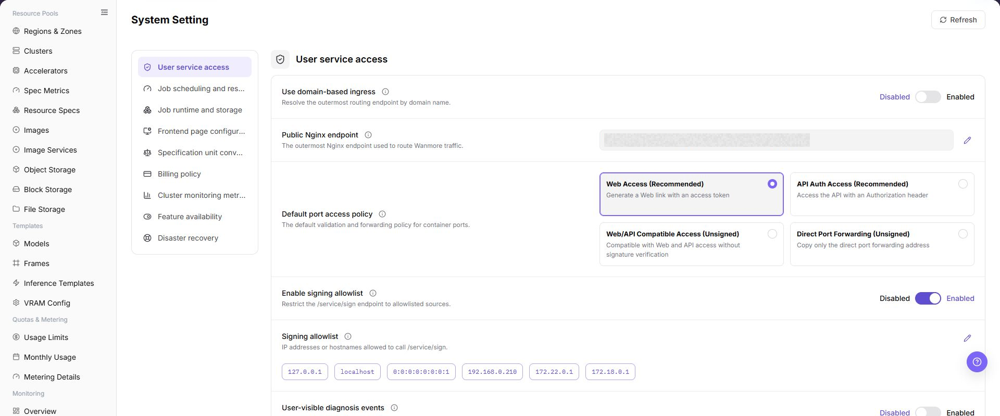
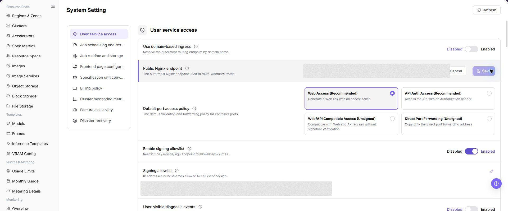

# System Setting

## Feature Overview

| Item | Content |
| --- | --- |
| Applicable Role | Operator |
| Navigation Path | AI Infra(On-Prem) > System > System Setting |
| Page Route | `/powerone/system/config-properties` |
| Managed Object | Configuration, status, and relationships on System Setting |

#### Beginner Explanation

System Setting is the workspace for Configuration, status, and relationships on System Setting. Confirm the object, state, and dependencies before an operation, and then use Result Validation to confirm downstream availability.

#### Terms

| Term | Description |
| --- | --- |
| Configuration Item | A system-level parameter or switch provided by the platform. |
| Configuration Value | The current value used by a configuration item. It may be a switch, text, enum, or number. |
| Status | Whether the configuration item is enabled, available, or effective. |

#### Recommended Operation Order

Confirm prerequisites for System configuration items, configuration values, descriptions, status, and action entries, follow Main Operations, run Result Validation, and continue to the next page.

#### First-Time User Notes

Confirm that the task involves Configuration, status, and relationships on System Setting, and then follow the recommended order. If fields or state differ from expectations, check prerequisites before continuing downstream.

## Prerequisites

1. The current account has operator permissions.
2. The correct On-Prem environment and target region have been selected.
3. Confirm whether this operation is read-only or has approved change permission.

## Page Description

Use this page to view and handle Configuration, status, and relationships on System Setting.

The image keeps the sidebar and complete feature area. Confirm the page title, scope, and primary operation entry.

Go to `AI Infra > On-Prem > System > System Setting`. The page displays system-level configuration items. The list is used to view configuration item names, configuration values, descriptions, status, and possible action entries.

If the page provides buttons such as `Edit`, `Save`, `Submit`, or `OK`, open only to review fields and do not perform the final action.

## Main Operations

### View Current System Configuration

1. Go to `System > System Settings`.
2. Review configuration groups for scheduling, storage, images, alerts, or other system parameters.
3. Check the current value, source, effective scope, and update time.
4. Do not record or share passwords, Tokens, internal Endpoints, or secret configuration.

### View System Setting

#### Pre-Operation Check

1. Confirm that the current environment, account, and region match the review target.
2. Confirm that this operation is for viewing only and will not modify real configuration values.
3. If an edit dialog or drawer must be opened, record only field names, buttons, and prompts. Do not record real configuration values.

#### Procedure

1. Go to `AI Infrastructure > On-Prem > System > System Setting`.
2. View the system configuration list and confirm that the page route is `/powerone/system/config-properties`.
3. Review configuration item name, configuration value, description, status, or action entry.
4. If the page provides view-only buttons such as search, filter, refresh, expand, or details, use them to narrow the review scope.
5. If the page provides `Edit` or a similar maintenance entry, open it only to review fields and do not fill in real configuration values.
6. Before clicking the final **"Save"**, **"Submit"**, or **"OK"**, stop and verify change approval, impact scope, and rollback plan again.

##### User Service Access

1. Go to `AI Infrastructure > On-Prem > System > System Setting`.
2. Locate the `User Service Access` configuration group.
3. Review configuration item names, configuration values, descriptions, status, and action entries.
4. If changes are required, record only fields, inline edit areas, or dialogs. Before saving, verify the changed fields and execute the final action only after approval.

##### Task Scheduling and Resource Control

1. Go to `AI Infrastructure > On-Prem > System > System Setting`.
2. Locate the `Task Scheduling and Resource Control` configuration group.
3. Review configuration item names, configuration values, descriptions, status, and action entries.
4. If changes are required, record only fields, inline edit areas, or dialogs. Before saving, verify the changed fields and execute the final action only after approval.

##### Task Runtime Environment and Storage

1. Go to `AI Infrastructure > On-Prem > System > System Setting`.
2. Locate the `Task Runtime Environment and Storage` configuration group.
3. Review configuration item names, configuration values, descriptions, status, and action entries.
4. If changes are required, record only fields, inline edit areas, or dialogs. Before saving, verify the changed fields and execute the final action only after approval.

##### Frontend Page Configuration

::: details Additional screenshot file

:::

1. Go to `AI Infrastructure > On-Prem > System > System Setting`.
2. Locate the `Frontend Page Configuration` configuration group.
3. Review configuration item names, configuration values, descriptions, status, and action entries.
4. If changes are required, record only fields, inline edit areas, or dialogs. Before saving, verify the changed fields and execute the final action only after approval.

##### Specification Unit Conversion

::: details Additional screenshot file

:::

1. Go to `AI Infrastructure > On-Prem > System > System Setting`.
2. Locate the `Specification Unit Conversion` configuration group.
3. Review configuration item names, configuration values, descriptions, status, and action entries.
4. If changes are required, record only fields, inline edit areas, or dialogs. Before saving, verify the changed fields and execute the final action only after approval.

##### Billing Policy

1. Go to `AI Infrastructure > On-Prem > System > System Setting`.
2. Locate the `Billing Policy` configuration group.
3. Review configuration item names, configuration values, descriptions, status, and action entries.
4. If changes are required, record only fields, inline edit areas, or dialogs. Before saving, verify the changed fields and execute the final action only after approval.

##### Cluster Monitoring Metrics

1. Go to `AI Infrastructure > On-Prem > System > System Setting`.
2. Locate the `Cluster Monitoring Metrics` configuration group.
3. Review configuration item names, configuration values, descriptions, status, and action entries.
4. If changes are required, record only fields, inline edit areas, or dialogs. Before saving, verify the changed fields and execute the final action only after approval.

##### Feature Availability

1. Go to `AI Infrastructure > On-Prem > System > System Setting`.
2. Locate the `Feature Availability` configuration group.
3. Review configuration item names, configuration values, descriptions, status, and action entries.
4. If changes are required, record only fields, inline edit areas, or dialogs. Before saving, verify the changed fields and execute the final action only after approval.

##### Disaster Recovery

1. Go to `AI Infrastructure > On-Prem > System > System Setting`.
2. Locate the `Disaster Recovery` configuration group.
3. Review configuration item names, configuration values, descriptions, status, and action entries.
4. If changes are required, record only fields, inline edit areas, or dialogs. Before saving, verify the changed fields and execute the final action only after approval.

### Edit System Setting

#### Applicable Scenarios

Edit a system setting when an editable configuration must change and change approval, impact assessment, and rollback handling are ready.

#### Steps

1. Go to `AI Infrastructure > On-Prem > System > System Setting`.
2. Locate the target configuration group and click **"Edit"** in the configuration item action area provided by the page.
3. Verify configuration name, current value, description, effective scope, and dependencies. Change only approved fields.
4. Before clicking **"Save"** or **"OK"**, review the impact on scheduling, storage, images, billing, monitoring, or feature availability.
5. After submission, refresh the page and verify configuration value, state, update time, and downstream service behavior.

#### Result Validation

- The configuration list or details show the new value, state, and update time.
- Affected user services, job scheduling, resource control, or page features behave as expected.
- Unrelated configuration groups and sensitive settings are not changed.

#### Notes

- System settings are global configuration. Changes may affect multiple tenants, jobs, or services; do not submit without approval, rollback handling, and an impact window.
- Configuration values, access tokens, passwords, internal addresses, and secret material must not be written in documents, screenshots, tickets, or chats.

#### Service Behavior Is Abnormal After Saving a System Setting

**Symptom:**

The system setting reports success, but user service access, job scheduling, storage, or monitoring behavior is unexpected.

**Possible Causes:**

- The value format or unit does not meet page requirements.
- The edited group or effective scope is not the target.
- Downstream service cache has not refreshed or a dependent service has not reloaded.

**Solution:**

1. Return to the configuration group and verify the new value, description, scope, and update time.
2. Check the state, logs, or page prompt of affected services.
3. Restore the last verified configuration under the rollback plan and verify service state again.

#### Operation Screenshots

The image shows fields and the confirmation area after opening the operation entry. Verify required fields, ownership, and impact before submission.

## Parameter Quick Reference

| Field Name | Required | Field Type | Example | Description |
| --- | --- | --- | --- | --- |
| Configuration Item | Depends on item | System field | `platform.feature.enabled` | Identifies a system-level configuration item. |
| Configuration Value | Depends on item | Text / switch / enum / number | `true` | Current value used by the configuration item. Do not write real sensitive values in documentation or screenshots. |
| Description | Depends on item | Text | `Feature switch description` | Describes the purpose and impact scope of the configuration item. |
| Status | Depends on item | Status | `Enabled` | Shows whether the configuration item is enabled, available, or effective. |
| Actions | Depends on item | Action entry | `Edit` | Entry used to view, edit, or maintain a configuration item. |

## Pitfalls

- System settings may affect global platform behavior. Confirm the impact scope before making changes.
- `Save`, `Submit`, and `OK` are high-risk final actions and are final actions; confirm the scope and impact before executing them.
- Incorrect feature availability, billing policy, disaster recovery, scheduling, or resource governance settings may affect user access, job scheduling, billing results, and recovery capability.
- Do not write real configuration values, tokens, AK/SK, internal endpoints, tenant information, accounts, secrets, or test parameters.
- If a configuration item involves authentication, networking, billing, scheduling, or resource governance, confirm it through the internal change process before modifying it.
- When reviewing fields and dialogs, use placeholders and do not enter real sensitive values.

## Result Validation

| Check Item | Success Signal | If Abnormal |
| --- | --- | --- |
| Page entry | System Setting opens with the target operation entry | Check Operator permission and whether the menu is available |
| Object record | Configuration, status, and relationships on System Setting is visible in the list or details | Reset filters and verify name, ownership, and creation result |
| State result | State after creation or change matches the page message | Check operation feedback, dependency state, and latest update time |
| Downstream use | A downstream page can select or associate the target | Return to prerequisites and check enabled state, ownership, and visibility |

## FAQ

#### Target Is Missing from System Setting

**Symptom:**

The page opens, but the expected Configuration, status, and relationships on System Setting is missing.

**Possible Causes:**

- Filters remain active.
- the object belongs to another scope.
- a prerequisite is incomplete.

**Solution:**

1. Reset filters
2. verify region or tenant ownership
3. confirm prerequisite state.

#### The Operation Entry on System Setting Is Unavailable

**Symptom:**

The create, register, or maintain entry is hidden or disabled.

**Possible Causes:**

- Role permission is insufficient.
- the page is read-only.
- dependencies are not ready.

**Solution:**

1. Check Operator permission
2. read the page message
3. complete dependency configuration first.

#### A Required Field on System Setting Has No Options

**Symptom:**

The form opens, but a selection list is empty.

**Possible Causes:**

- Candidates are disabled.
- ownership differs.
- the current account cannot see them.

**Solution:**

1. Check candidate state
2. verify ownership
3. confirm visibility and refresh the form.

#### System Setting Has an Abnormal State After the Operation

**Symptom:**

A record exists after submission, but its state is unexpected.

**Possible Causes:**

- Connectivity or validation failed.
- a dependency is abnormal.
- processing is incomplete.

**Solution:**

1. Check feedback and update time
2. inspect related objects
3. troubleshoot the processing stage.

#### A Downstream Page Cannot Use System Setting

**Symptom:**

The current page is normal, but a downstream page cannot select or associate Configuration, status, and relationships on System Setting.

**Possible Causes:**

- Visibility differs.
- the object is disabled.
- downstream cache is stale.

**Solution:**

1. Check enabled state and ownership
2. verify role visibility
3. refresh and select again.

## Notes

- System Setting is a platform-level configuration entry and should not be modified casually.
- System settings affect global platform behavior. Confirm the impact scope, approval record, and rollback plan before real changes.
- Do not write real configuration values, secrets, tokens, internal endpoints, accounts, or tenant information in documentation, screenshots, or tickets.
- Before sharing page information externally, desensitize configuration values and internal identifiers.

## Next Steps

1. If configuration is missing, record the configuration item name and page location first, then follow the internal confirmation process.
2. If configuration must be changed, confirm the impact scope, approval record, and rollback plan first.
3. After changes, return to affected modules and verify that pages, tasks, or service behavior matches expectations.
