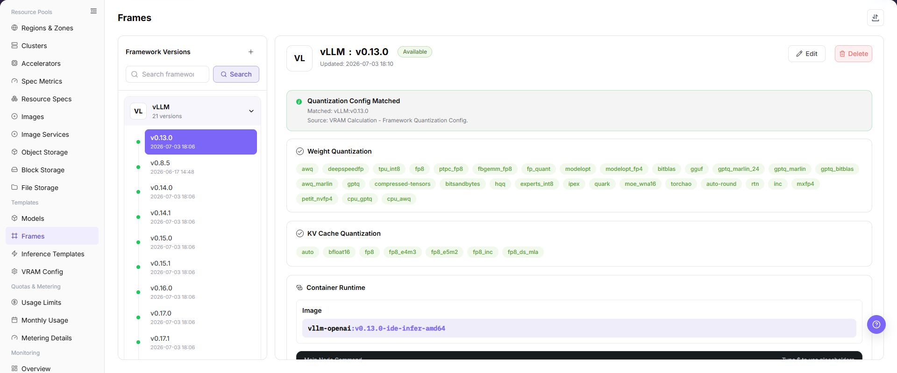
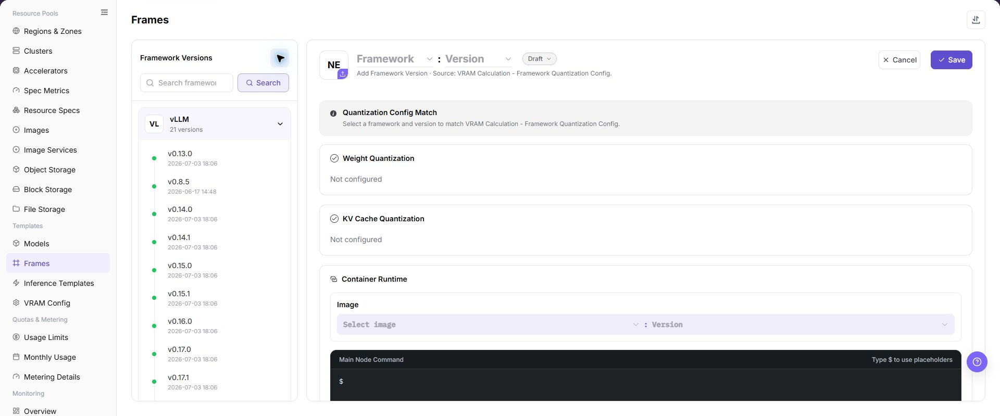

# Frames

## Feature Overview

| Item | Content |
| --- | --- |
| Applicable Role | Operator |
| Navigation Path | AI Infra(On-Prem) > Templates > Frames |
| Page Route | `/powerone/fast-build-v2/frameworks` |
| Managed Object | Configuration, status, and relationships on Frames |

#### Beginner Explanation

Framework configuration is like a standard startup manual for model services. It defines which container image to use, which commands the main node and worker nodes run, which ports are exposed, which environment variables are injected, and what message is shown to users after creation succeeds. When users deploy a model through an inference template, the platform assembles the runtime environment from this configuration.

#### Terms

| Term | Description |
| --- | --- |
| Framework Configuration | A reusable deployment environment template composed of core parameters such as container images, startup commands, network policies, and environment variables. |
| Framework Name | Name of the underlying inference framework or engine. Use the official framework name where possible, such as `VLLM`, `TensorRT`, or `Triton Inference Server`. |
| Version Name | Version identifier of the framework configuration, used for iteration tracking or compatibility management. It can align with the underlying framework version or use an internal scenario name. |

#### Recommended Operation Order

Confirm prerequisites for Framework name, version name, image, main node startup command, worker node startup command, extra parameters, environment variables, port exposure policy, port tags, and creation success message, follow Main Operations, run Result Validation, and continue to the next page.

#### First-Time User Notes

Confirm that the task involves Configuration, status, and relationships on Frames, and then follow the recommended order. If fields or state differ from expectations, check prerequisites before continuing downstream.

## Prerequisites

1. The framework image has been prepared and can be pulled by the target region and target cluster.
2. The supported model types, quantization methods, ports, main node startup command, and worker node startup command have been clarified.
3. Extra parameters, environment variables, port exposure policy, port tags, and creation success message have been planned.
4. Startup commands, environment variables, extra parameters, and message text have been confirmed not to expose real keys, tokens, AK/SK, private keys, or internal download addresses.
5. The current account has template management permissions.

## Page Description

Use this page to view and handle Configuration, status, and relationships on Frames.

The image keeps the sidebar and complete feature area. Confirm the page title, scope, and primary operation entry.

The page displays the framework configuration list and supports maintaining framework basic information, image versions, startup commands, and configuration parameters.

The following figure shows the framework configuration page.

## Main Operations

### View Framework Configuration

1. Open the corresponding template-configuration page and filter by name, version, status, or update time.
2. Open details and check associated models, frameworks, images, resource requirements, and current version.
3. If no record is returned, reset filters. For incompatibility, first check dependencies.
4. Redact internal images, storage locations, and startup configuration before sharing.

### Add Framework or Version

#### Pre-Operation Check

1. The container image, base dependencies, and image region required by the framework have been confirmed.
2. The main node startup command, worker node startup command, and single-node startup method have been confirmed.
3. The service port, port exposure policy, port tags, and access authentication method have been confirmed.
4. Extra parameters, environment variables, and placeholders have been sanitized.
5. The model types, inference protocols, and resource specifications supported by the framework have been confirmed.

#### Procedure

1. Go to `AI Infrastructure > On-Prem > Templates > Framework Configuration`.
2. Click **"Add"**, **"Add Framework"**, or the actual add entry on the page.
3. In the basic information area, fill in framework name, version name, description, and supported scenarios.
4. Select or fill in the framework image, and confirm image region, target cluster, and image registry pull permissions.
5. Configure main node startup command and worker node startup command, and confirm that commands run as foreground processes.
6. Maintain extra parameters, environment variables, and placeholder references as required by the page.
7. Configure service port, port exposure policy, port tag, and health check.
8. Configure the creation success message to describe access methods and follow-up operations, without real credentials or internal addresses.
9. Before clicking the final **"Save"**, **"Submit"**, or **"OK"**, verify image, startup commands, ports, authentication policy, and region availability.

The following figure shows the add framework page, used to configure basic information, runtime settings, port policy, and creation message.

### Import or Export Frameworks

#### Applicable Scenarios

Use the **"Import/Export"** menu to batch-maintain framework configurations, or to export framework definitions for audit, reconciliation, and controlled migration.

#### Steps

1. Go to `AI Infrastructure > On-Prem > Templates > Framework Configuration`.
2. Click **"Import/Export"** and choose **"Import"** or **"Export"** according to the business purpose.
3. For import, upload the file as required by the page and verify framework, version, image, startup commands, port policy, and parameter configuration.
4. For export, confirm the framework or version filter scope, then generate and download the framework configuration as prompted by the page.
5. Before importing, verify that image, region, port, and model dependencies are available in the target environment. Save export files in a controlled directory.

#### Result Validation

- After import, the Framework Configuration list shows the added or updated framework version.
- The framework scope in the export file matches the current filter conditions.
- Inference templates or deployment pages can correctly resolve the imported framework version and port configuration.

#### Notes

- Startup commands, images, and port settings must match the runtime environment. Verify foreground startup, health checks, and access policy before importing.
- Import may update fields on a framework version with the same identifier. Check referenced templates and instances first.

#### An Imported Framework Cannot Be Used by an Inference Template

**Symptom:**

The framework import completes, but the framework version is missing from an inference template or deployment page.

**Possible Causes:**

- Framework image, region, or port configuration is unavailable in the target environment.
- Framework version state or visibility does not allow downstream selection.
- Framework or version identifiers in the import file do not match dependency references.

**Solution:**

1. Open framework details and verify version, image, region, ports, and state.
2. Check dependencies on Image Management, Regions & Zones, and Inference Templates.
3. Correct identifiers or visibility according to page requirements before importing again.

### Edit Framework Version

#### Applicable Scenarios

Edit a framework version when its image, startup parameters, ports, or description need to change.

#### Steps

1. Go to `AI Infrastructure > On-Prem > Templates > Framework Configuration` and locate the target framework version.
2. Click **"Edit"** in the target row and verify the framework and version identifiers.
3. Update the editable configuration provided by the page, with special attention to image, startup commands, ports, and access policy.
4. Before clicking the final **"Save"** or **"OK"**, verify the impact on referenced templates and running instances.
5. Return to the list and verify the updated version information and state.

#### Result Validation

- The framework list shows the updated version configuration and update time.
- Inference templates can read the updated framework configuration.
- Ports, health checks, and startup parameters still match the runtime environment.

#### Notes

- Changing a startup command, image, or port may prevent new instances from starting. Arrange compatibility checks and rollback handling first.
- Do not write real credentials or internal addresses in environment variables, extra parameters, or creation messages.

#### An Instance Fails After Framework Version Editing

**Symptom:**

The framework saves successfully, but a new instance cannot start or its health check fails.

**Possible Causes:**

- The image lacks dependencies or cannot be pulled.
- The startup command does not run as a foreground process.
- Service port, port policy, or health check does not match the application.

**Solution:**

1. Verify image, startup command, port, and health check in framework details.
2. Check image availability and network reachability in Image Management and Regions & Zones.
3. Under the approved change process, restore the verified version and repeat startup validation.

### Delete Framework Version

#### Applicable Scenarios

Delete a framework version when it is no longer used and no inference template, instance, or job depends on it.

#### Steps

1. Go to `AI Infrastructure > On-Prem > Templates > Framework Configuration` and locate the target framework version.
2. Click **"Delete"** in the target row.
3. Read the confirmation prompt and verify framework, version, image, port, and downstream references.
4. After confirming a replacement version and impact scope, click the confirmation button to delete it.
5. Refresh the list and check framework choices on inference templates and deployment pages.

#### Result Validation

- The target framework version is removed from the framework configuration list.
- Downstream templates and new instance configuration no longer offer that version.
- Other framework versions, images, and running instances are not unintentionally removed.

#### Notes

- Deleting a framework version configuration does not necessarily delete the image in the registry. Handle dependencies and retention separately.
- Do not directly delete a version referenced by templates or instances. Migrate or remove the reference first.

#### Framework Version Deletion Fails

**Symptom:**

Deletion fails or the page reports that associated objects still exist.

**Possible Causes:**

- An inference template, instance, or job still references the version.
- The current account lacks deletion permission.
- Another framework task is still processing.

**Solution:**

1. Check version references on Inference Templates and deployment pages.
2. Verify permission and framework task state.
3. Complete migration or remove references, then delete according to approval.

### Maintain Framework Ports

#### Applicable Scenarios

Maintain framework ports when a service port, exposure policy, or port tag must change, or when a port is no longer needed.

#### Steps

1. Go to `AI Infrastructure > On-Prem > Templates > Framework Configuration`, locate the target version, and click **"Edit"**.
2. In the port configuration area, verify service port, exposure policy, port tag, and health check.
3. When a port is no longer used, click its **"Delete Port"** entry and verify the port number and impact scope.
4. Before clicking the final **"Save"** or **"OK"**, verify that templates, instances, and access entries will not become invalid.
5. Return to framework details and verify the port list and access policy.

#### Result Validation

- Framework details show the updated port, exposure policy, and tag.
- Health checks and later access entries use the correct port.
- Templates or instances depending on the port do not show a new missing-configuration error.

#### Notes

- Deleting or changing a port affects service probing, routing, and access. Confirm migration handling for existing instances and callers first.
- Unsigned or direct port policies expand exposure. Use them only within a clearly controlled network boundary.

#### The Access Entry Fails After Port Removal

**Symptom:**

The service access entry fails or health checks continue to fail after port maintenance.

**Possible Causes:**

- Application listening port does not match the configuration.
- Port exposure policy or tag was changed.
- Referenced templates or instances have not refreshed the new port configuration.

**Solution:**

1. Verify startup command, service port, and health-check path.
2. Check exposure policy, port tag, and network access rules.
3. Confirm references are updated in template or instance details; restore the previous port under the approved change process if needed.

#### Operation Screenshots

The image shows fields and the confirmation area after opening the operation entry. Verify required fields, ownership, and impact before submission.

## Parameter Quick Reference

| Field Name | Required | Field Type | Example | Description |
| --- | --- | --- | --- | --- |
| Framework Name | Yes | Text | `vLLM` | Name of the underlying inference framework or engine. Use the official framework name where possible for easier identification and technical integration. |
| Version Name | Yes | Text | `v0.8.0` | Version identifier of the framework configuration, used for iteration tracking or compatibility management. Align it with the underlying framework version or use a stable internal scenario name. |
| Image | Yes | Text | `<BASE_URL>/<PROJECT>/<IMAGE>:<TAG>` | Container image required to run inference tasks. Use placeholders in documentation. Do not write real image registry addresses. |
| Image Region | Conditionally required | Text | `wuhan` | Region where the image is hosted or can be pulled. Keep it consistent with target region, cluster network, and registry permissions. |
| Main Node Startup Command | Yes | Configuration text | `Example value` | Startup command for the main node in the task cluster. In single-node tasks, this is used directly as the node startup command. The command must run as a foreground process to avoid immediate container exit. |
| Worker Node Startup Command | Required for distributed scenarios | Configuration text | `python worker.py` | Startup command for Worker nodes, used in distributed inference. Keep it consistent with main-node communication, scheduling topology, and framework version. |
| Extra Parameters | No | Configuration text | `--max-model-len 8192` | Parameters used to dynamically supplement or adjust startup commands. They can be injected into commands through placeholders. Do not write real tokens, AK/SK, private keys, passwords, or internal addresses. |
| Environment Variables | No | Configuration text | `ENV=prod` | Preset environment variables injected when the container starts. Use only non-sensitive variables. Use platform credentials or Secret mechanisms for sensitive values. |
| Service Port | Yes | Port / number | `8000` | Listening port used for platform probing, routing, or service exposure. Must match the actual listening port of the framework. |
| Port Exposure Policy | Conditionally required | Port / number | `Example value` | Default exposure method and access authentication mechanism for the port. Do not select a non-authenticated policy for external or cross-tenant access. |
| Port Tag | No | Port / number | `OpenAI API Port` | Used to identify port protocol type or purpose. System predefined tags can generate corresponding access help documents. |
| Health Check | Conditionally required | Address / path | `/health` | Path or command used to determine whether the framework service starts successfully. Match the actual service path, port, and startup delay. |
| Creation Success Message | No | Port / number | `Example value` | Message shown to users after the task cluster is created. Markdown and placeholders are supported. It can include access methods and follow-up operations, but not real credentials or internal endpoints. |
| Parameter Placeholder | No | Configuration text | `${modelName}` | Variable used in startup commands, extra parameters, or creation success messages. Use platform-supported placeholder names and avoid unsupported variables. |
| Actions | System-generated | Action entry | `Edit` | Add, edit, save, submit, OK, and similar page operations. `Save`, `Submit`, and `OK` are high-risk final actions. |

#### Port Exposure Policy and Port Tags

| Configuration | Value | Description |
| --- | --- | --- |
| Port Exposure Policy | `Web access` | Provides a Web-based access entry. Access requests carry a time-limited security token, `wmtoken`. |
| Port Exposure Policy | `API validation access` | Provides a native API endpoint. The `Authorization` request header must carry valid signature information. |
| Port Exposure Policy | `Web/API compatible validation access` | The port does not enable authentication. Use it only in trusted networks or test scenarios. |
| Port Exposure Policy | `Direct port forwarding` | The port does not enable authentication and is accessed through the cluster node IP and mapped port. It is suitable for internal debugging or specific network architectures. |
| Port Tag | `OpenAI API Port` | Identifies an inference service compatible with the OpenAI API format. The system generates corresponding API call help documents. |
| Port Tag | `Ollama API Port` | Identifies an inference service compatible with the Ollama API format. The system generates corresponding Ollama API usage guides. |
| Port Tag | `Custom` | Used for internal notes or special protocol identifiers. It does not trigger automatic document generation. |

#### Parameter Placeholder Description

Startup commands, extra parameters, and creation success messages can use placeholders. When a job is created, the platform replaces placeholders with actual task cluster parameters.

| Placeholder | Description |
| --- | --- |
| `${regionId}` | Region ID assigned to the task cluster. |
| `${zoneId}` | Zone ID assigned to the task cluster. |
| `${name}` | Task cluster name. |
| `${flavorId}` | Specification ID used by the task cluster. |
| `${image}` | Image used by the task cluster. |
| `${envs}` | Environment variables. |
| `${useRdma}` | Whether to use the RDMA network. |
| `${openSsh}` | Whether SSH is enabled. |
| `${startCommand}` | Startup command object, including main node and worker node commands. |
| `${clusterId}` | Cluster ID assigned to the task. |
| `${portOpenPolicy}` | Port exposure policy. |
| `${portTag}` | Port tag of the exposed port. |
| `${jobType}` | Task deployment type. |
| `${modelName}` | Fast deployment model name. |
| `${frame}` | Fast deployment framework name. |
| `${frameVersion}` | Fast deployment framework version. |
| `${extraParamString}` | Extra parameter concatenation string. Parameter names do not include the `--` prefix. |
| `${prefixExtraParamString}` | Extra parameter concatenation string. Parameter names include the `--` prefix. |
| `${vendor}` | Model vendor. |
| `${supportModelClusterIds}` | List of cluster IDs that support the current model. |

## Pitfalls

- The startup command must run as a foreground process to avoid the container exiting immediately after startup.
- The service port must match the actual framework listening port, otherwise health checks or access entries may fail.
- The image must include framework dependencies, model loading dependencies, and required system libraries.
- Inconsistent image region, image registry permissions, or target cluster network may cause image pull failures.
- A non-authenticated port exposure policy may expand the real service exposure scope. Do not select it for external or cross-tenant access.
- Environment variables, extra parameters, and creation success messages must not contain real tokens, AK/SK, private keys, passwords, or internal endpoints.
- `Save`, `Submit`, and `OK` are high-risk final actions. Confirm the scope and impact before executing the final action.

## Result Validation

| Check Item | Success Signal | If Abnormal |
| --- | --- | --- |
| Page entry | Frames opens with the target operation entry | Check Operator permission and whether the menu is available |
| Object record | Configuration, status, and relationships on Frames is visible in the list or details | Reset filters and verify name, ownership, and creation result |
| State result | State after creation or change matches the page message | Check operation feedback, dependency state, and latest update time |
| Downstream use | A downstream page can select or associate the target | Return to prerequisites and check enabled state, ownership, and visibility |

## FAQ

#### Target Is Missing from Frames

**Symptom:**

The page opens, but the expected Configuration, status, and relationships on Frames is missing.

**Possible Causes:**

- Filters remain active.
- the object belongs to another scope.
- a prerequisite is incomplete.

**Solution:**

1. Reset filters
2. verify region or tenant ownership
3. confirm prerequisite state.

#### The Operation Entry on Frames Is Unavailable

**Symptom:**

The create, register, or maintain entry is hidden or disabled.

**Possible Causes:**

- Role permission is insufficient.
- the page is read-only.
- dependencies are not ready.

**Solution:**

1. Check Operator permission
2. read the page message
3. complete dependency configuration first.

#### A Required Field on Frames Has No Options

**Symptom:**

The form opens, but a selection list is empty.

**Possible Causes:**

- Candidates are disabled.
- ownership differs.
- the current account cannot see them.

**Solution:**

1. Check candidate state
2. verify ownership
3. confirm visibility and refresh the form.

#### Frames Has an Abnormal State After the Operation

**Symptom:**

A record exists after submission, but its state is unexpected.

**Possible Causes:**

- Connectivity or validation failed.
- a dependency is abnormal.
- processing is incomplete.

**Solution:**

1. Check feedback and update time
2. inspect related objects
3. troubleshoot the processing stage.

#### A Downstream Page Cannot Use Frames

**Symptom:**

The current page is normal, but a downstream page cannot select or associate Configuration, status, and relationships on Frames.

**Possible Causes:**

- Visibility differs.
- the object is disabled.
- downstream cache is stale.

**Solution:**

1. Check enabled state and ownership
2. verify role visibility
3. refresh and select again.

## Notes

- Do not write keys in environment variable examples, extra parameters, creation success messages, or screenshots.
- Before changing framework image, port exposure policy, or startup command, confirm the impact scope of templates and instances that use this framework.
- Images are related to regions. After adding a region or migrating images, revalidate framework availability.

## Next Steps

1. Reference the framework in [Inference Templates](../inference-templates/).
2. Use a test model to verify image, command, port, extra parameters, and placeholders.
3. Include framework changes in version records to avoid affecting existing templates.
