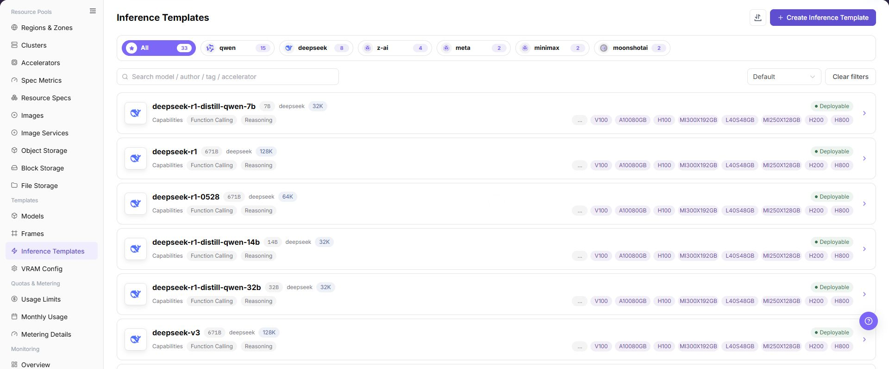
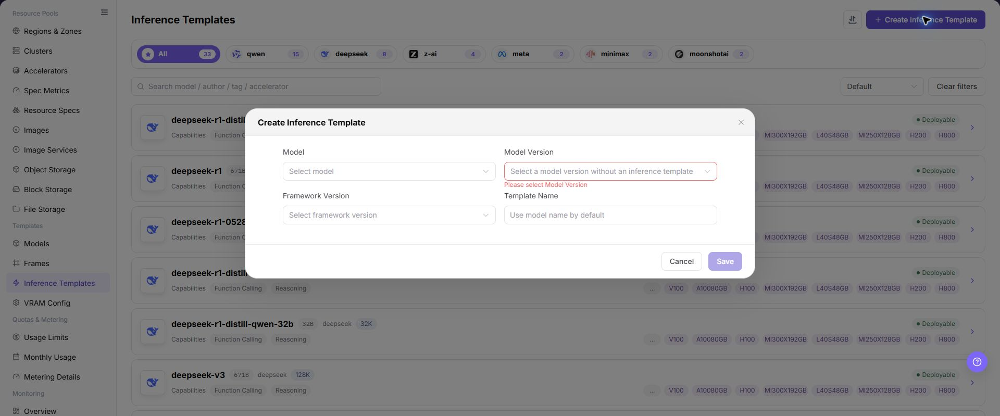

# Inference Templates

## Feature Overview

| Item | Content |
| --- | --- |
| Applicable Role | Operator |
| Navigation Path | AI Infra(On-Prem) > Templates > Inference Templates |
| Page Route | `/powerone/fast-build-v2/inference-templates` |
| Managed Object | Configuration, status, and relationships on Inference Templates |

#### Beginner Explanation

An inference template is like an assembly list for a model service. It combines frameworks, specifications, default parameters, and visibility scope so users can quickly create services from the template during deployment.

#### Terms

| Term | Description |
| --- | --- |
| Template | Deployment plan selected when users create model instances. |
| Factor Form | Parameter set filled in by users when creating instances. |
| Dynamic Expression | Dynamically calculates field values or display conditions based on user input, model, precision, or resource conditions. |

#### Recommended Operation Order

Confirm prerequisites for Inference templates, model scope, framework scope, specification recommendations, form parameters, and publication status, follow Main Operations, run Result Validation, and continue to the next page.

#### First-Time User Notes

Confirm that the task involves Configuration, status, and relationships on Inference Templates, and then follow the recommended order. If fields or state differ from expectations, check prerequisites before continuing downstream.

## Prerequisites

1. Model configuration, framework configuration, and VRAM estimation have been completed.
2. Available resource specifications have been created and associated with target clusters.
3. Image services and required storage capabilities have been connected.
4. The parameters that users need to fill in when creating instances have been clarified.

## Page Description

Use this page to view and handle Configuration, status, and relationships on Inference Templates.

The image keeps the sidebar and complete feature area. Confirm the page title, scope, and primary operation entry.

The page displays the inference template list, including template name, status, model scope, framework scope, update time, and operation entrypoints.

The following figure shows the inference templates page.

## Main Operations

### View Inference Templates

1. Open the corresponding template-configuration page and filter by name, version, status, or update time.
2. Open details and check associated models, frameworks, images, resource requirements, and current version.
3. If no record is returned, reset filters. For incompatibility, first check dependencies.
4. Redact internal images, storage locations, and startup configuration before sharing.

### Create Inference Template

#### Pre-Operation Check

1. Available frameworks, runtime images, and model configurations have been prepared.
2. Resource specifications, deployment mode, and visibility scope adapted by the template have been confirmed.
3. Default parameters have been confirmed not to expose internal paths, credentials, or test endpoints.
4. Which user deployment entrypoints are affected by template changes has been clarified.

#### Procedure

1. Go to `AI Infrastructure > On-Prem > Templates > Inference Templates`.
2. Click **"Add"**, **"Create Inference Template"**, or the actual create entry on the page.
3. In the basic information area, fill in template name, description, applicable scenario, publication scope, and visibility scope.
4. In the model configuration area, select model, model version, model source, or applicable model scope.
5. In the framework configuration area, select framework, framework version, runtime image, and startup configuration.
6. In the resource configuration area, select resource specification, deployment mode, VRAM estimation rules, region, or cluster scope.
7. In the port and network area, configure service port, port exposure policy, port tag, and health check.
8. In the factor form area, configure parameters users must fill in when creating instances, default values, validation rules, dynamic expressions, and trigger conditions.
9. Before clicking the final **"Save"**, **"Submit"**, **"Publish"**, or **"OK"**, verify model, framework, specifications, parameters, ports, visibility scope, and user-side impact.

The following figure shows the Create Inference Template page, used to configure basic information, resource specifications, and factor forms.

### Import or Export Inference Templates

#### Applicable Scenarios

Use the **"Import/Export"** menu to batch-maintain inference templates, or to export template configurations for audit, reconciliation, and controlled migration.

#### Steps

1. Go to `AI Infrastructure > On-Prem > Templates > Inference Templates`.
2. Click **"Import/Export"** and choose **"Import"** or **"Export"** according to the business purpose.
3. For import, upload the file as required by the page and verify template, model, framework, resource specification, factor form, and visibility scope.
4. For export, confirm the template filter scope, then generate and download the template configuration as prompted by the page.
5. Before importing, verify that dependencies are available in the target environment. Save export files in a controlled directory.

#### Result Validation

- After import, the Inference Templates list shows the added or updated template and state.
- The template scope in the export file matches the current filter conditions.
- Model, framework, specification, and parameter references in template details can be resolved correctly.

#### Notes

- Template import depends on model, framework, image, and specification objects. Do not submit it when dependencies are missing in the target environment.
- Import may update a template with the same identifier. Verify release scope, default parameter values, and downstream deployment impact first.

#### An Imported Inference Template Cannot Be Published or Deployed

**Symptom:**

The template import completes, but its state is abnormal or the template cannot be used on later publish or deployment pages.

**Possible Causes:**

- The model, framework, image, or specification is missing or unavailable in the target environment.
- Factor fields, default values, or validation rules are incompatible.
- Template visibility or state does not allow downstream use.

**Solution:**

1. Open template details and verify the model, framework, image, and resource specification one by one.
2. Open the corresponding configuration pages to verify dependency state and version compatibility.
3. Check template visibility, release state, and factor-form validation rules.

#### Operation Screenshots

The image shows fields and the confirmation area after opening the operation entry. Verify required fields, ownership, and impact before submission.

## Parameter Quick Reference

| Field Name | Required | Field Type | Example | Description |
| --- | --- | --- | --- | --- |
| Template Name | Yes | Text | `llm-inference-template` | Template name users see when creating inference services. Use a maintainable name instead of temporary test naming. |
| Description | No | Multi-line text | `Example description` | Template purpose, adapted model, and usage boundary. Write non-sensitive notes only. Do not include internal addresses or test parameters. |
| Applicable Scenario | Conditionally required | Dropdown / enum | `Model inference` | Business scenario or model service type for the template. Keep it consistent with model type, framework capability, and user entry. |
| Publication Scope | Conditionally required | Dropdown / enum | `Example value` | Scope where the template is published to the user side. Confirm affected tenants, regions, and entries before publishing. |
| Visibility Scope | Yes | Dropdown / enum | `Tenant A` | Controls which users or tenants can use the template. Incorrect scope may make the template invisible or visible to non-target tenants. |
| Model | Conditionally required | Dropdown / enum | `A100-SXM4-80GB` | Model or model set applicable to the template. Dependent objects must be available and match the framework. |
| Model Version | Conditionally required | Dropdown / enum | `v0.8.0` | Model version referenced by the template. Keep it consistent with model path, quantization method, and VRAM estimation rules. |
| Model Source | Conditionally required | Address / path | `Object Storage` | Model file source, repository source, or object storage source. Do not write real model repository addresses, endpoints, or internal paths. |
| Framework | Yes | Number / capacity | `vLLM` | Runtime framework configuration called by the template. The framework must support the selected model type and runtime mode. |
| Framework Version | Conditionally required | Text | `v0.8.0` | Framework version referenced by the template. Confirm impact on existing templates and instances before modification. |
| Runtime Image | Conditionally required | Text | `<BASE_URL>/<PROJECT>/<IMAGE>:<TAG>` | Container image used by the framework runtime. Confirm image region, registry permissions, and target cluster pull access. |
| Resource Specification | Yes | Number / capacity | `gpu-a100-1card` | Default recommended or selectable compute specification for the template. Match model VRAM, concurrency, context length, and deployment mode. |
| Deployment Mode | Yes | Dropdown / enum | `Single instance` | Determines service replicas, scaling, and scheduling mode. Keep it consistent with framework startup commands and resource specifications. |
| VRAM Estimation Rule | Conditionally required | Number / capacity | `80` | VRAM rule used to recommend or validate specifications. Keep it consistent with model parameter count, quantization method, and context length. |
| Service Port | Conditionally required | Port / number | `8000` | Actual listening or exposed port of the model service. Must match the actual framework listening port. |
| Port Exposure Policy | Conditionally required | Port / number | `Example value` | Port exposure method and authentication mechanism. Incorrect configuration may expand service exposure scope. |
| Port Tag | No | Port / number | `OpenAI API Port` | Identifies port protocol type or purpose. Keep it consistent with OpenAI API, Ollama API, or custom protocol. |
| Health Check | Conditionally required | Address / path | `/health` | Path or command used to determine whether the service starts successfully. Match the actual service path, port, and startup delay. |
| Factor Form | Conditionally required | Configuration text | `Context length` | Parameter form that users fill in when creating instances. Verify fields, default values, and validation rules one by one. |
| Default Parameters | No | Dropdown / enum | `--max-model-len 8192` | Model or runtime parameters prefilled when creating services. Do not write real tokens, AK/SK, private keys, endpoints, or test values. |
| Dynamic Expression | Conditionally required | Dropdown / enum | `${gpuCount} >= 1` | Dynamically calculates fields or visibility based on model, framework, specification, or user input. Expression errors can cause missing fields or abnormal startup commands. |
| Trigger Condition | Conditionally required | Dropdown / enum | `Model type = LLM` | Controls fields displayed under specific models, frameworks, or options. Validate with actual model, framework, and specification combinations. |
| Actions | System-generated | Action entry | `Edit` | Add, save, submit, publish, OK, and similar page operations. `Save`, `Submit`, `Publish`, and `OK` are high-risk final actions. |

## Pitfalls

- Publishing an inference template affects user-side selectable templates and the real service creation scope.
- Incorrect visibility scope may make the template invisible or visible to non-target tenants.
- Mismatched model, framework, image, specification, or VRAM rules can cause instance creation or startup failures.
- Incorrect default parameters, dynamic expressions, or trigger conditions can cause missing user form fields, wrong parameters, or abnormal startup commands.
- Incorrect port exposure policy may expand the service exposure scope.
- Do not write real tokens, AK/SK, private keys, endpoints, internal addresses, model repository addresses, tenant IDs, cluster IDs, or test parameters.
- `Save`, `Submit`, `Publish`, and `OK` are high-risk final actions. Confirm the scope and impact before executing the final action.

## Result Validation

| Check Item | Success Signal | If Abnormal |
| --- | --- | --- |
| Page entry | Inference Templates opens with the target operation entry | Check Operator permission and whether the menu is available |
| Object record | Configuration, status, and relationships on Inference Templates is visible in the list or details | Reset filters and verify name, ownership, and creation result |
| State result | State after creation or change matches the page message | Check operation feedback, dependency state, and latest update time |
| Downstream use | A downstream page can select or associate the target | Return to prerequisites and check enabled state, ownership, and visibility |

## FAQ

#### Target Is Missing from Inference Templates

**Symptom:**

The page opens, but the expected Configuration, status, and relationships on Inference Templates is missing.

**Possible Causes:**

- Filters remain active.
- the object belongs to another scope.
- a prerequisite is incomplete.

**Solution:**

1. Reset filters
2. verify region or tenant ownership
3. confirm prerequisite state.

#### The Operation Entry on Inference Templates Is Unavailable

**Symptom:**

The create, register, or maintain entry is hidden or disabled.

**Possible Causes:**

- Role permission is insufficient.
- the page is read-only.
- dependencies are not ready.

**Solution:**

1. Check Operator permission
2. read the page message
3. complete dependency configuration first.

#### A Required Field on Inference Templates Has No Options

**Symptom:**

The form opens, but a selection list is empty.

**Possible Causes:**

- Candidates are disabled.
- ownership differs.
- the current account cannot see them.

**Solution:**

1. Check candidate state
2. verify ownership
3. confirm visibility and refresh the form.

#### Inference Templates Has an Abnormal State After the Operation

**Symptom:**

A record exists after submission, but its state is unexpected.

**Possible Causes:**

- Connectivity or validation failed.
- a dependency is abnormal.
- processing is incomplete.

**Solution:**

1. Check feedback and update time
2. inspect related objects
3. troubleshoot the processing stage.

#### A Downstream Page Cannot Use Inference Templates

**Symptom:**

The current page is normal, but a downstream page cannot select or associate Configuration, status, and relationships on Inference Templates.

**Possible Causes:**

- Visibility differs.
- the object is disabled.
- downstream cache is stale.

**Solution:**

1. Check enabled state and ownership
2. verify role visibility
3. refresh and select again.

## Notes

- Template parameters must not contain real tokens, keys, or internal addresses.
- Before publishing a template, confirm that dependent models, frameworks, images, specifications, and storage are all available.
- Before modifying a published template, confirm the impact on user-side instance creation, template visibility scope, and active deployment entries.
- Before save, submit, publish, or confirm actions, verify the scope and impact and execute them only after approval.

## Next Steps

1. Use a test tenant to create a model instance and verify the template.
2. Adjust image, startup command, ports, and parameters based on failure logs.
3. After template publication, periodically review model versions, framework versions, and specification scope.
4. Review failure logs by model, framework, specification, and factor form combination to continuously calibrate the template.
