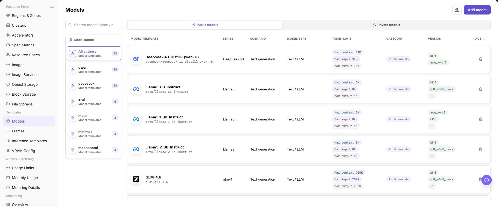
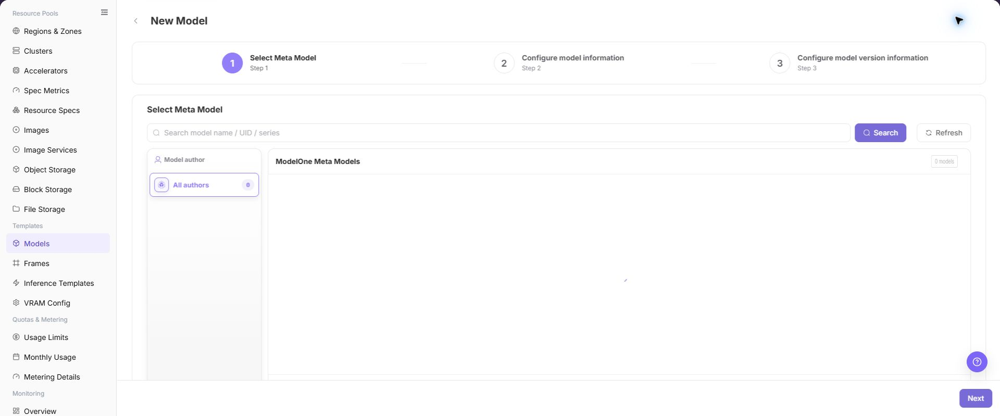

# Models

## Feature Overview

| Item | Content |
| --- | --- |
| Applicable Role | Operator |
| Navigation Path | AI Infra(On-Prem) > Templates > Models |
| Page Route | `/powerone/fast-build-v2/models` |
| Managed Object | Configuration, status, and relationships on Models |

#### Beginner Explanation

Model configuration is like a model asset card before listing a model. It organizes model paths, parameter sources, environment variables, and startup parameters so frameworks can load models correctly.

#### Terms

| Term | Description |
| --- | --- |
| Base Model | Model family or base model abstraction, such as a common description for the same model series. |
| Model Version | Version record of specific weights, quantization, source, and file path. |
| KV Token | Tokens related to inference KV Cache, which affect VRAM estimation. |

#### Recommended Operation Order

Confirm prerequisites for Base models, model versions, model sources, quantization methods, tags, and associated clusters, follow Main Operations, run Result Validation, and continue to the next page.

#### First-Time User Notes

Confirm that the task involves Configuration, status, and relationships on Models, and then follow the recommended order. If fields or state differ from expectations, check prerequisites before continuing downstream.

## Prerequisites

1. Model source, authorization, version, and parameter count have been confirmed.
2. Model files can be downloaded by the target cluster or have been prepared in shared storage.
3. Related quantization methods, KV Token, or calculation factors have been maintained in VRAM estimation.
4. The current account has template management permissions.

## Page Description

Use this page to view and handle Configuration, status, and relationships on Models.

The image keeps the sidebar and complete feature area. Confirm the page title, scope, and primary operation entry.

The page displays configurations by model author, model category, and model series, and supports maintaining public or private models.

The following figure shows the model configuration page.

## Main Operations

### View Model Configuration

1. Open the corresponding template-configuration page and filter by name, version, status, or update time.
2. Open details and check associated models, frameworks, images, resource requirements, and current version.
3. If no record is returned, reset filters. For incompatibility, first check dependencies.
4. Redact internal images, storage locations, and startup configuration before sharing.

### Add Model

#### Pre-Operation Check

1. Model file path, format, permissions, and source credentials have been confirmed.
2. The model matches the runtime framework, precision, context length, and resource specification.
3. Environment variables, startup parameters, and mount paths do not contain real keys.
4. If the model comes from an external repository, authorization scope and network connectivity have been confirmed.

#### Procedure

1. Go to `AI Infrastructure > On-Prem > Templates > Model Configuration`.
2. Click **"Add Model"** or the actual add entry on the page.

The following figure shows the base model selection page, used to select model author, model series, and the base model entry.

3. In the base model or basic information area, select model author, model series, model type, scenario, and token limits.

The following figure shows model information configuration, used to maintain model type, scenario, token limits, and basic description.

4. In the version information area, fill in model source, version, quantization method, model path, or repository identifier.

The following figure shows model version information configuration, used to maintain model source, version, quantization method, and path information.

5. Configure parameter source, environment variables, startup parameters, mount path, or model source credential as required by the page.
6. In the association configuration area, select tags, visibility scope, associated clusters, or available template scope.

In Step 6, use the following page to create or select tags for model classification and filtering.

Then use the associated cluster page to confirm where model files are accessible and deployment is allowed.

7. Before clicking the final **"Save"**, **"Submit"**, or **"OK"**, verify model path, credential reference, cluster accessibility, and visibility scope.

### Import or Export Models

#### Applicable Scenarios

Use the **"Import/Export"** menu to batch-maintain model configurations, or to export model definitions for audit, reconciliation, and controlled migration.

#### Steps

1. Go to `AI Infrastructure > On-Prem > Templates > Model Configuration`.
2. Click **"Import/Export"** and choose **"Import"** or **"Export"** according to the business purpose.
3. For import, upload the file as required by the page and verify base model, model version, model source, quantization method, tags, cluster associations, and visibility scope.
4. For export, confirm the model type or author filter scope, then generate and download the model configuration as prompted by the page.
5. Before importing, verify that base model, model source, and cluster dependencies are available in the target environment. Save export files in a controlled directory.

#### Result Validation

- After import, the Model Configuration list shows the added or updated model and state.
- The model scope in the export file matches the current filter conditions.
- Source, tags, and cluster associations in model details can be resolved correctly.

#### Notes

- Model import may update fields on an object with the same identifier. Verify version, source, cluster scope, and downstream template dependencies first.
- Model paths, registry addresses, and source credentials are sensitive. Redact and store both import and export files under control.

#### An Imported Model Cannot Be Used by an Inference Template

**Symptom:**

The model import completes, but the model cannot be found in an inference template or publish flow.

**Possible Causes:**

- The base model, model source, or model version is missing or unavailable in the target environment.
- Cluster association, visibility, or model state does not meet downstream selection conditions.
- Model identifier or version fields in the import file are inconsistent.

**Solution:**

1. Open model details and verify base model, source, version, state, and visibility.
2. Open Model Sources and Clusters to verify dependencies and associations.
3. Check identifiers and version fields in the import file against page requirements.

### Delete Model

#### Applicable Scenarios

Delete a model when its platform configuration is no longer needed and no inference template, publish flow, or running instance depends on it.

#### Steps

1. Go to `AI Infrastructure > On-Prem > Templates > Model Configuration` and locate the target model.
2. Click **"Delete"** in the target model row.
3. Read the confirmation prompt and verify model name, version, source, cluster associations, and downstream templates.
4. After confirming replacement configuration and impact scope, click the confirmation button to delete the model.
5. Refresh the list and check inference templates, publish flows, and model selection pages.

#### Result Validation

- The target model is removed from the Model Configuration list.
- New downstream templates or publish flows no longer offer the model.
- Base models, model sources, other versions, and unrelated models are not unintentionally removed.

#### Notes

- Deleting a model configuration does not necessarily delete model files or registry data. Handle retention separately according to storage policy.
- Do not delete a model with running instances, published templates, or job dependencies. Configure and migrate to a replacement first.

#### The Model Is Still Selectable After Deletion

**Symptom:**

The model is gone from Model Configuration, but a downstream page still offers it.

**Possible Causes:**

- The downstream page cache has not refreshed.
- A downstream template or instance stores a historical reference.
- The deletion request is still processing.

**Solution:**

1. Refresh the downstream page and reopen the model selector.
2. Check historical references in inference templates, publish records, and running instances.
3. Check model update time and page prompt to confirm deletion has completed.

#### Operation Screenshots

The image shows fields and the confirmation area after opening the operation entry. Verify required fields, ownership, and impact before submission.

## Parameter Quick Reference

| Field Name | Required | Field Type | Example | Description |
| --- | --- | --- | --- | --- |
| Model Name | Yes | Dropdown / enum | `Qwen3-8B` | Model name displayed by the platform and referenced by templates. Use a maintainable model name instead of temporary test naming. |
| Model Author | Conditionally required | Dropdown / enum | `Example Tenant` | Author, tenant, or source provider of the model. Keep it consistent with page filters, model series, and authorization source. |
| Model Series | Conditionally required | Dropdown / enum | `Example value` | Model family or base model series. Helps inference templates filter models by series. |
| Model Type | Conditionally required | Dropdown / enum | `Large language model` | Model capability type or business category. Keep it consistent with inference frameworks, template type, and user-side selection scope. |
| Scenario | Conditionally required | Dropdown / enum | `Example value` | Business scenario where the model applies. Do not mix test, training, or inference scenarios. |
| Token Limit | Conditionally required | Number / capacity | `8192` | Context length, input/output token limit, or KV Cache-related limit. Keep it consistent with model capability, VRAM estimation, and template parameters. |
| Model Source | Yes | Address / path | `Object Storage` | Model file source, repository source, or object storage source. Confirm authorization and network reachability for external sources. |
| Version | Yes | Dropdown / enum | `v0.8.0` | Model version or weight version record. Keep versions traceable. Do not use ambiguous `latest` for long-term configuration. |
| Quantization Method | Conditionally required | Dropdown / enum | `FP16` | Model weight quantization or precision method. Keep it consistent with runtime framework and VRAM estimation configuration. |
| Model Path | Yes | Address / path | `s3://example-bucket/model` | Path, repository identifier, or object storage location where the framework loads model files. Do not write real keys, tokens, accounts, passwords, or internal addresses. |
| Parameter Source | Conditionally required | Number / capacity | `Template default` | Whether parameters come from model configuration, template defaults, or user input. Prevent template defaults from overriding model-specific parameters. |
| Environment Variables | No | Configuration text | `ENV=prod` | Variables passed into the container runtime environment. Use only non-sensitive variables. Use credential references for sensitive values. |
| Startup Parameters | No | Dropdown / enum | `--max-model-len 8192` | Model parameters appended to the framework startup command. Match framework version, token limits, and resource specifications. |
| Model Source Credential | Conditionally required | Credential / sensitive text | `Object Storage` | Credential reference used when accessing a private model repository or object storage. Reference credential objects only. Do not write real credentials in documents. |
| Associated Cluster | Conditionally required | File / configuration text | `cluster-a` | Cluster scope where model files are accessible or deployable. Confirm network and storage accessibility for target clusters before submission. |
| Tags | No | Text | `llm` | Tags used for filtering, classification, or template matching. Keep tag meanings stable and avoid temporary tags. |
| Visibility Scope | Conditionally required | Dropdown / enum | `Tenant A` | Model visibility boundary for templates, tenants, or user-side pages. Incorrect visibility affects user-side selectable models. |
| Actions | System-generated | Action entry | `Edit` | Add, edit, save, submit, OK, and similar page operations. `Save`, `Submit`, and `OK` are high-risk final actions. |

## Pitfalls

- Incorrect model paths, repository addresses, object storage paths, or credential references can cause model loading failures after template deployment.
- Do not write real keys, tokens, AK/SK, accounts, passwords, or internal addresses in environment variables, startup parameters, or model paths.
- Incorrect associated clusters or visibility scope can affect model selection in inference templates and user-side visibility.
- Clarify the parameter source to prevent template default values from overriding model-specific parameters.
- `Save`, `Submit`, and `OK` are high-risk final actions. Confirm the scope and impact before executing the final action.

## Result Validation

| Check Item | Success Signal | If Abnormal |
| --- | --- | --- |
| Page entry | Models opens with the target operation entry | Check Operator permission and whether the menu is available |
| Object record | Configuration, status, and relationships on Models is visible in the list or details | Reset filters and verify name, ownership, and creation result |
| State result | State after creation or change matches the page message | Check operation feedback, dependency state, and latest update time |
| Downstream use | A downstream page can select or associate the target | Return to prerequisites and check enabled state, ownership, and visibility |

## FAQ

#### Target Is Missing from Models

**Symptom:**

The page opens, but the expected Configuration, status, and relationships on Models is missing.

**Possible Causes:**

- Filters remain active.
- the object belongs to another scope.
- a prerequisite is incomplete.

**Solution:**

1. Reset filters
2. verify region or tenant ownership
3. confirm prerequisite state.

#### The Operation Entry on Models Is Unavailable

**Symptom:**

The create, register, or maintain entry is hidden or disabled.

**Possible Causes:**

- Role permission is insufficient.
- the page is read-only.
- dependencies are not ready.

**Solution:**

1. Check Operator permission
2. read the page message
3. complete dependency configuration first.

#### A Required Field on Models Has No Options

**Symptom:**

The form opens, but a selection list is empty.

**Possible Causes:**

- Candidates are disabled.
- ownership differs.
- the current account cannot see them.

**Solution:**

1. Check candidate state
2. verify ownership
3. confirm visibility and refresh the form.

#### Models Has an Abnormal State After the Operation

**Symptom:**

A record exists after submission, but its state is unexpected.

**Possible Causes:**

- Connectivity or validation failed.
- a dependency is abnormal.
- processing is incomplete.

**Solution:**

1. Check feedback and update time
2. inspect related objects
3. troubleshoot the processing stage.

#### A Downstream Page Cannot Use Models

**Symptom:**

The current page is normal, but a downstream page cannot select or associate Configuration, status, and relationships on Models.

**Possible Causes:**

- Visibility differs.
- the object is disabled.
- downstream cache is stale.

**Solution:**

1. Check enabled state and ownership
2. verify role visibility
3. refresh and select again.

## Notes

- Model source and authorization must be traceable.
- Do not expose access keys in model paths, descriptions, or screenshots.
- Do not write real model repository addresses, object storage paths, AK/SK, tokens, accounts, passwords, or internal addresses in examples, screenshots, or tickets.
- Before modifying associated clusters, tags, or visibility scope, confirm the impact on inference templates and user-side deployment entries.

## Next Steps

1. Go to [Framework Configuration](../frames/) to maintain frameworks available for the model.
2. Go to [Inference Templates](../inference-templates/) to establish relationships among model, framework, specification, and parameters.
3. Go to [VRAM Estimation Configuration](../vram-config/) to calibrate KV Token, quantization, and dynamic expressions.
