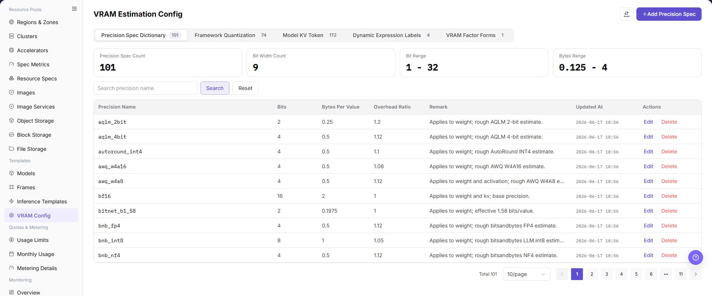
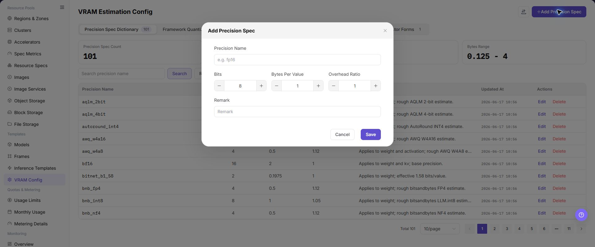

# VRAM Config

## Feature Overview

| Item | Content |
| --- | --- |
| Applicable Role | Operator |
| Navigation Path | AI Infra(On-Prem) > Templates > VRAM Config |
| Page Route | `/powerone/fast-build-v2/vram-factor-forms` |
| Managed Object | Configuration, status, and relationships on VRAM Config |

#### Beginner Explanation

VRAM configuration is like a capacity estimator before deployment. It estimates required VRAM from model size, precision, context length, and KV Token, avoiding the discovery that the service cannot fit only after startup.

#### Terms

| Term | Description |
| --- | --- |
| VRAM | Accelerator memory used to store model weights, KV Cache, and intermediate computation. |
| KV Token | Tokens related to Key/Value Cache in the inference context. |
| Factor | Variable involved in VRAM calculation, such as parameter count, precision, concurrency, and context length. |

#### Recommended Operation Order

Confirm prerequisites for VRAM formula, precision, KV Token, factor form, dynamic expressions, and recommended specifications, follow Main Operations, run Result Validation, and continue to the next page.

#### First-Time User Notes

Confirm that the task involves Configuration, status, and relationships on VRAM Config, and then follow the recommended order. If fields or state differ from expectations, check prerequisites before continuing downstream.

## Prerequisites

1. Model parameter count, precision, context length, concurrency, and framework VRAM overhead have been clarified.
2. Resource specifications that can be referenced by inference templates have been prepared.
3. VRAM capacity and usable margin of different accelerator models have been confirmed.
4. The current account has template management permissions.

## Page Description

Use this page to view and handle Configuration, status, and relationships on VRAM Config.

The image keeps the sidebar and complete feature area. Confirm the page title, scope, and primary operation entry.

The page displays VRAM estimation rules and precision configurations, and supports maintaining VRAM estimation logic for different model, framework, or precision combinations.

The following figure shows the vram estimation configuration page.

## Main Operations

### View VRAM Rules

1. Open the corresponding template-configuration page and filter by name, version, status, or update time.
2. Open details and check associated models, frameworks, images, resource requirements, and current version.
3. If no record is returned, reset filters. For incompatibility, first check dependencies.
4. Redact internal images, storage locations, and startup configuration before sharing.

### Configure VRAM Rules

#### Pre-Operation Check

1. Model parameter size, precision, quantization method, and maximum context length have been confirmed.
2. Target GPU/NPU model, single-card VRAM, and parallel strategy have been confirmed.
3. Estimation definitions for KV Token, batch size, and concurrency have been confirmed.
4. VRAM estimation results should be cross-verified with actual stress tests or trial runs.

#### Procedure

1. Go to `AI Infrastructure > On-Prem > Templates > VRAM Estimation Configuration`.
2. Click the add or edit entrypoint.
3. On the Basic Information tab, fill in rule name, applicable model, framework, and precision.
4. On the Factor Form tab, configure factors such as parameter count, KV Token, concurrency, and context length.
5. On the Dynamic Expression tab, configure VRAM calculation formulas, recommended specifications, and trigger conditions.
6. Save, then reference and verify it in inference templates.

The image shows the precision and memory-estimation fields. Verify model size, precision, accelerator type, and context assumptions before saving.

#### Operation Screenshots

The image shows fields and the confirmation area after opening the operation entry. Verify required fields, ownership, and impact before submission.

### Import or Export VRAM Rules

#### Applicable Scenarios

Use the **"Import/Export"** menu to batch-maintain VRAM estimation rules, or to export rules for audit, reconciliation, and controlled migration.

#### Steps

1. Go to `AI Infrastructure > On-Prem > Templates > VRAM Estimation Configuration`.
2. Click **"Import/Export"** and choose **"Import"** or **"Export"** according to the business purpose.
3. For import, upload the file as required by the page and verify precision specification, framework version, model parameters, KV Token, dynamic expression, and recommended specification.
4. For export, confirm the current rule or tab filter scope, then generate and download the rule configuration as prompted by the page.
5. Before importing, verify that model, framework, and precision dependencies are available in the target environment. Save export files in a controlled directory.

#### Result Validation

- After import, the VRAM configuration page shows the added or updated rule.
- The rule scope in the export file matches the current filter conditions.
- An inference template referencing the rule produces an explainable VRAM result.

#### Notes

- VRAM rules affect recommended specifications and pre-deployment resource assessment. Verify model size, precision, context length, and concurrency definitions before importing.
- Import may update a rule with the same identifier. Check referenced templates and instances first; rule files must not contain real credentials or internal addresses.

#### An Imported VRAM Rule Produces an Abnormal Result

**Symptom:**

The rule import completes, but an inference template produces a result that is much too large, too small, or unavailable.

**Possible Causes:**

- Model size, precision, KV Token, or context-length definitions differ.
- Framework version or dynamic expression is unavailable in the target environment.
- The referenced recommended specification is missing or its metrics do not match.

**Solution:**

1. Open rule details and verify factors and dynamic expressions one by one.
2. Check model, framework, and resource specification versions and metrics.
3. Recalculate with representative parameters and reconcile with a verified result.

### Edit VRAM Rules

#### Applicable Scenarios

Edit VRAM rules when precision, factors, or dynamic expressions need to change.

#### Steps

1. Go to `AI Infrastructure > On-Prem > Templates > VRAM Estimation Configuration` and locate the target rule.
2. Click **"Edit"** for the target rule and verify rule name and associated model and framework.
3. Update precision specification, factor form, dynamic expression, or recommended specification on the tabs provided by the page.
4. Before clicking the final **"Save"** or **"OK"**, verify the formula, trigger conditions, and impact on referenced templates.
5. Return to the list and recheck the result in an inference template.

#### Result Validation

- The rule list shows updated precision, factor, or expression configuration.
- A calculation with the same input parameters follows the new rule as expected.
- Referenced templates load the rule and recommended specifications remain within resource capacity.

#### Notes

- Changing factors or expressions may change recommended specifications for existing templates. Preserve the previous rule and test representative models first.
- Do not treat one calculation as a replacement for deployment stress testing. Check runtime VRAM pressure after a rule change.

#### The Calculation Does Not Change After Editing

**Symptom:**

The rule saves successfully, but an inference template still shows the old VRAM result.

**Possible Causes:**

- The template references another rule or cached data has not refreshed.
- Final confirmation was not completed.
- Input parameters do not trigger the changed expression branch.

**Solution:**

1. Verify the referenced rule and update time in template details.
2. Refresh the rule and template pages and check the save prompt.
3. Recalculate with parameters that trigger the target branch and compare results.

### Remove VRAM Rules

#### Applicable Scenarios

Remove a VRAM rule when it is no longer used and no inference template or deployment configuration depends on it.

#### Steps

1. Go to `AI Infrastructure > On-Prem > Templates > VRAM Estimation Configuration` and locate the target rule.
2. Click **"Delete"** for the target rule.
3. Read the confirmation prompt and verify rule name, associated model, framework, precision, and downstream templates.
4. After confirming a replacement rule and impact scope, click the confirmation button to remove it.
5. Refresh the list and check rule choices on inference template and deployment pages.

#### Result Validation

- The target rule is removed from the VRAM configuration list.
- New or edited inference templates no longer offer the rule.
- Other rules, models, frameworks, and template references are not unintentionally removed.

#### Notes

- Do not remove a rule referenced by a template or deployment configuration. Switch to a verified replacement first.
- Removing the rule configuration does not delete model or framework data. Handle those objects according to their own lifecycle.

#### VRAM Rule Deletion Fails

**Symptom:**

Deletion fails or the page reports that associated objects still exist.

**Possible Causes:**

- An inference template or deployment configuration still references the rule.
- The current account lacks removal permission.
- The rule is still being calculated or processed.

**Solution:**

1. Check rule references on inference template and deployment pages.
2. Verify permission, rule state, and update time.
3. Replace or remove references, then remove the rule according to approval.

## Parameter Quick Reference

| Field Name | Required | Field Type | Example | Description |
| --- | --- | --- | --- | --- |
| Model Scale | Yes | Text / number | `72B` | Model parameter scale used to estimate weight VRAM. |
| Precision | Yes | Enum | `BF16` | Affects VRAM usage for weights, activations, and KV Cache. |
| KV Token | Yes | Number | `32768` | Used to estimate KV Cache usage under context and concurrency. |
| Context Length | Yes | Number | `8192` | Maximum input/output context allowed by the model service. |
| Concurrency / Batch Size | No | Number | `4` | Used to estimate VRAM pressure under peak requests. |
| VRAM Estimation Result | System-generated | Capacity | `152 GB` | Recommended VRAM requirement calculated by the platform. |

## Pitfalls

- KV Token, context length, and concurrency significantly affect VRAM estimation. Do not look only at model parameter scale.
- Incorrect quantization precision causes recommended specifications to be too small or too large.
- VRAM estimation results should be verified through test deployments and cannot replace real stress tests.

## Result Validation

| Check Item | Success Signal | If Abnormal |
| --- | --- | --- |
| Page entry | VRAM Config opens with the target operation entry | Check Operator permission and whether the menu is available |
| Object record | Configuration, status, and relationships on VRAM Config is visible in the list or details | Reset filters and verify name, ownership, and creation result |
| State result | State after creation or change matches the page message | Check operation feedback, dependency state, and latest update time |
| Downstream use | A downstream page can select or associate the target | Return to prerequisites and check enabled state, ownership, and visibility |

## FAQ

#### Target Is Missing from VRAM Config

**Symptom:**

The page opens, but the expected Configuration, status, and relationships on VRAM Config is missing.

**Possible Causes:**

- Filters remain active.
- the object belongs to another scope.
- a prerequisite is incomplete.

**Solution:**

1. Reset filters
2. verify region or tenant ownership
3. confirm prerequisite state.

#### The Operation Entry on VRAM Config Is Unavailable

**Symptom:**

The create, register, or maintain entry is hidden or disabled.

**Possible Causes:**

- Role permission is insufficient.
- the page is read-only.
- dependencies are not ready.

**Solution:**

1. Check Operator permission
2. read the page message
3. complete dependency configuration first.

#### A Required Field on VRAM Config Has No Options

**Symptom:**

The form opens, but a selection list is empty.

**Possible Causes:**

- Candidates are disabled.
- ownership differs.
- the current account cannot see them.

**Solution:**

1. Check candidate state
2. verify ownership
3. confirm visibility and refresh the form.

#### VRAM Config Has an Abnormal State After the Operation

**Symptom:**

A record exists after submission, but its state is unexpected.

**Possible Causes:**

- Connectivity or validation failed.
- a dependency is abnormal.
- processing is incomplete.

**Solution:**

1. Check feedback and update time
2. inspect related objects
3. troubleshoot the processing stage.

#### A Downstream Page Cannot Use VRAM Config

**Symptom:**

The current page is normal, but a downstream page cannot select or associate Configuration, status, and relationships on VRAM Config.

**Possible Causes:**

- Visibility differs.
- the object is disabled.
- downstream cache is stale.

**Solution:**

1. Check enabled state and ownership
2. verify role visibility
3. refresh and select again.

## Notes

- VRAM estimation is a recommendation and validation basis. It does not replace real stress testing.
- Before modifying rules, confirm the impact scope on templates and user creation flows that use the rules.

## Next Steps

1. Reference VRAM estimation rules in inference templates.
2. Verify recommended specifications with small, medium, and large models.
3. Continuously calibrate VRAM formulas and safety margins based on online failure cases.
