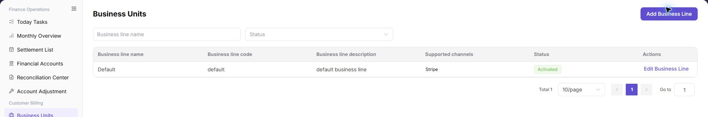

# Business Units

::: info Document Information
Version: v1.0
Updated: 2026-08-27
:::

## Feature Overview

| Item | Content |
| --- | --- |
| Applicable Role | Operations administrator |
| Navigation path | Billing > Customer Billing > Business Units |
| Page route | `/billing/customers/business-units` |
| Managed objects | Business units, payment channels, top-up amount limits, initial balance, overdraft limit, and status |

`Business Units` is used to configure business units, payment channels, single top-up amount ranges, initial balance, overdraft limit, and enabled or disabled status. These settings affect the customer top-up flow, available payment channels, and balance rules.

#### Beginner Explanation

Business Units works like the checkout configuration for customer top-up. Each business unit controls which payment channels are available, how much a customer can top up in one order, and whether overdraft is allowed.

#### Terms Quick Reference

| Term | Meaning | Handling tip |
| --- | --- | --- |
| Business Unit | Configuration object that controls customer top-up channels, amount limits, and overdraft rules. | Confirm the affected customer scope before changes. |
| Business Unit Code | Unique code used by the system to identify the business unit. | Keep it stable after creation. |
| Payment Channel | Payment method available to customers under the business unit. | Confirm the channel is connected and enabled. |
| Overdraft Limit | Maximum amount a customer can consume beyond balance. | Review the risk scope before enabling. |
| Status | Whether the business unit is available for customer top-up. | Evaluate online top-up impact before disabling. |

## Prerequisites

1. The current account has permission to manage business units.
2. At least one business unit exists before related modules, such as top-up and customer overview, can provide business-unit selections.
3. The browser is signed in with a platform operator account and the session has not expired.

## Page Description

The `Add Business Unit` button at the top of the page opens the creation dialog. The filter area contains:

| Field | Description |
| --- | --- |
| Business Unit Name | Filters by business unit name. |
| Status | Selects a business unit status, such as `Enabled` or `Disabled`. |

The business unit table contains:

| Field | Description |
| --- | --- |
| Business Unit Name | Display name of the business unit. |
| Business Unit Code | Code used by the system to identify the business unit. |
| Business Unit Description | Description of the business unit. |
| Supported Payment Channels | Bound payment channels, such as `Stripe` or `Alipay`. |
| Status | Current status. |
| Actions | Row actions, usually including `Edit Business Unit`. |

The following screenshot shows the filters and table fields. List data is masked to avoid exposing business configuration details.

## Main Operations

### View Business Units

1. Go to `Billing > Customer Billing > Business Units`.
2. Filter by business-unit name, identifier, status, or update time.
3. Open details and check associated customers, billing scope, status, and update time.
4. If no record is returned, reset filters. Do not disable or delete a business unit that is referenced by customers or bills.

The image shows the page entry or current state for this operation. Verify the page title, target record, and visible actions.

### Add a Business Unit

1. Go to `Billing > Customer Billing > Business Units`.
2. Click **"Add Business Unit"** at the top of the page.
3. In the dialog, fill in `Business Unit Name`, `Business Unit Code`, contact name, contact phone number, and business unit description.
4. Configure payment channels, single top-up amount range, initial balance, overdraft limit, and whether overdraft is disabled.
5. Confirm that the business unit code is stable, payment channels are available, and top-up amount limits match operation policy.
6. Before clicking the final `Confirm`, verify business unit name, code, payment channels, initial balance, and overdraft limit again.

## Parameter Quick Reference

| Field Name | Required | Field Type | Example | Description |
| --- | --- | --- | --- | --- |
| Business Unit Name | Required | Text | `Example business unit` | Display name of the business unit. |
| Business Unit Code | Required | Text | `retail-cn` | Unique code of the business unit. Keep it stable after creation. |
| Contact Name | No | Text | `Example owner` | Contact person for the business unit. Desensitize it in screenshots or tickets. |
| Contact Phone Number | No | Text | `138****0000` | Contact phone number. Desensitize it in screenshots or tickets. |
| Business Unit Description | No | Text | `Example top-up scope` | Business purpose and scope description. Do not write internal sensitive parameters. |
| Payment Channel | Required | Multi-select | `Stripe` | Payment channel available under the business unit. |
| Single Top-up Amount Range | Required | Amount range | `100 - 50,000` | Minimum and maximum amount allowed for one top-up order. |
| Initial Balance | No | Credits | `1,000 Credits` | Initial balance configured for customers under the business unit. |
| Overdraft Limit | No | Credits | `5,000 Credits` | Maximum overdraft amount allowed for customers. |
| Disable Overdraft | No | Switch / option | `Disable Overdraft` | Sets overdraft limit to zero and prevents overdraft consumption. |
| Status | System generated | Enum | `Enabled` | Whether the business unit is available for customer top-up. |
| Add Business Unit | No | Button | `Add Business Unit` | Opens the add business unit dialog. |
| Confirm | Required | Final action button | `Confirm` | Submits the business unit configuration. This is a high-risk final action. |
| Cancel | No | Button | `Cancel` | Closes the dialog without submitting changes. |

## Pitfalls

- Do not rely on one amount field alone for financial confirmation; cross-check transactions, bills, settlement statements, and reconciliation results.
- Do not repeat high-risk billing operations when the first attempt fails; check status and error details first.
- Remove sensitive customer, bank, contract, token, Key, or internal processing information before sharing screenshots or tickets.
- Adding a business unit affects customer top-up entry, available payment channels, single top-up amount range, initial balance, and overdraft rules.
- Business unit code should remain stable. An incorrect code may cause later top-up, customer ownership, or billing statistics issues.
- Incorrect payment channel, overdraft limit, or initial balance may affect real customer top-up and balance calculation.
- Clicking **"Confirm"** submits the business unit configuration. Verify the code, owner, and customer scope before proceeding.

## Result Validation

| Check Item | Success Signal | If Abnormal |
| --- | --- | --- |
| Business unit record | The added or edited business unit appears in the list. | Clear the filters and search again. |
| Status | The status column shows the expected value, Enabled or Disabled. | Refresh the page and check status-change permissions. |
| Payment channels | The payment channels for the business unit match the expected configuration. | Open the edit page and check the channel configuration. |

## FAQ

#### Target billing data is not visible in Business Units

The expected account, customer, order, bill, settlement, adjustment, or License record does not appear on this page.

**How to check:**

1. Confirm the current tenant, customer, account, and role scope.
2. Check page filters such as billing cycle, time range, customer, account type, status, and keyword.
3. Verify that upstream actions, such as top-up, reconciliation, settlement, adjustment, or License activation, have completed successfully.
4. If the record was just created or updated, refresh the list and compare it with related transaction, bill, settlement, or operation records.

#### Amount, status, or billing cycle does not match in Business Units

The displayed balance, consumption, settlement status, monthly bill, or License status differs from the expected result.

**How to check:**

1. Confirm business unit, customer, credit ownership, account status, and transaction scope before comparing figures.
2. Check whether pending top-up orders, adjustments, refunds, settlement reviews, or metering synchronization are still in progress.
3. Compare the summary number with the detail list and operation records on the related billing pages.
4. For financial-impacting differences, pause confirmation actions and escalate with desensitized record IDs, time range, customer scope, and screenshots without credentials.

#### Save fails

Check the selected billing cycle, customer or project scope, status filters, and related asynchronous task records. Compare the result with transaction details, settlement records, and operation logs before repeating any high-risk billing action.

#### Business Units Does Not Update After Refresh

**Symptom:**

The amount, count, or status in Business Units remains unchanged after the related process finishes.

**Possible causes:**

- The billing cycle, tenant, customer, or business scope does not match the processed object.
- An upstream statistics, posting, or settlement task is still running.
- The current account can view only part of the data scope.

**How to handle:**

1. Recheck the billing cycle and object scope in Business Units.
2. Refresh the page, reopen the target record, and verify the update time.
3. Cross-check the upstream status in Customer Billing and payment channels.
4. If the value still does not update, provide authorized personnel with the desensitized billing cycle, object identifier, status, and update time.

#### What Must Be Checked Before Sharing Business Units Information?

**Symptom:**

Business Units results must be shared in a screenshot, ticket, or report.

**Possible causes:**

- Business-unit names, payment channels, statuses, and settlement settings may be sensitive billing information.
- The sharing scope may exceed the recipient's business permission.
- A full screenshot may include account, environment, or unrelated information.

**How to handle:**

1. Keep only fields, statuses, and time ranges required for troubleshooting.
2. Use the specified light-gray opaque small-pixel mosaic only on sensitive text and values.
3. Confirm that the screenshot does not contain top-menu account data, environment information, real credentials, or internal addresses.
4. Share with the minimum required audience and record the desensitized scope.
## Notes

- Billing amounts, settlements, balances, and customer information are sensitive. Desensitize them before sharing.
- Keep page routes, API fields, Key, AK/SK, License, and other product terms in their UI form.
- Keep credentials, private operational details, and sensitive customer data out of the manual.
- Do not record real contact names, phone numbers, internal business codes, customer information, payment channel secrets, accounts, Token, or Key.
- If no business unit is required, close the dialog without submitting the configuration.

## Next Steps

- Open [Customer Top-up Orders](../top-up-orders/) to verify whether the business unit affects order filters and posting checks.
- Confirm whether the customer top-up flow references this business unit.
