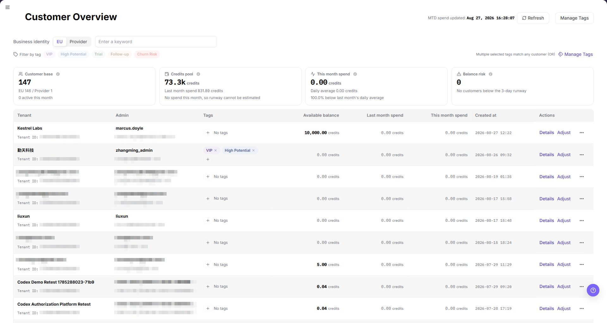
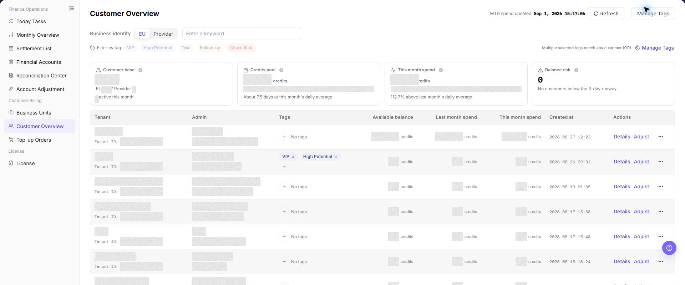

# Customer Overview

::: info Document Information
Version: v1.0
Updated: 2026-07-29
:::

## Feature Overview

| Item | Content |
| --- | --- |
| Applicable Role | Operations administrator |
| Navigation path | Billing > Customer Billing > Customer Overview |
| Page route | `/billing/customers/overview` |
| Managed objects | Customer records, customer tags, account balances, consumption, and revenue information |

`Customer Overview` is used to view EU and Provider customer records, tags, account balances, consumption, and revenue-related information. Operators can use this page to locate customers, verify customer identity, and continue with downstream billing checks.

#### Beginner Explanation

Customer Overview works like an operator-side CRM list for billing. It brings customer tenants, administrators, tags, balances, consumption, and Provider-related revenue information into one place.

#### Terms Quick Reference

| Term | Meaning | Handling tip |
| --- | --- | --- |
| Customer Account | An account object that records customer tenant, administrator, and balance information. | Confirm customer identity before troubleshooting. |
| Business Identity | The customer business category used for billing and customer overview filtering. | Keep the selected identity consistent when comparing records. |
| EU | End User customer identity. | Use it to review consumption and balance information. |
| Provider | Provider customer identity. | Use it to review Provider-related revenue or consumption information. |
| Tags | Labels used to classify customers. | Confirm the impact scope before adding or changing tags. |

## Prerequisites

1. The current account can access `Customer Billing > Customer Overview`.
2. At least one customer tenant has been created before the list can show data.
3. The browser is logged in with an operator account and the session has not expired.

## Page Description

The top of the page shows the update time for monthly consumption and provides a refresh button. `Manage Tags` at the top right opens the tag management dialog.

The summary area contains four KPI cards: `Customer base`, `Credits pool`, `This month spend`, and `Balance risk`. These cards provide a quick cross-customer signal and do not replace row-level verification.

The filter area contains:

- `Business Identity`: Select a customer type, usually `EU` or `Provider`.
- `Keyword`: Search by tenant `Name`, tenant ID, administrator account, or other visible customer identity fields.
- `Tags`: Select one or more built-in or custom tags. A customer that matches any selected tag is included.

Multiple selected tags use OR matching: a customer matching any selected tag is included. Tenant, administrator, and Tenant ID values shown in the list can be copied for follow-up checks; copy only sanitized values into tickets or documentation.

The customer table contains:

| Field | Description |
| --- | --- |
| Tenant Information | Customer tenant name and Tenant ID; visible identity values support copy interaction. |
| Administrator Information | Customer administrator account and email address; visible identity values support copy interaction. |
| Tags | Tags applied to the customer. |
| Available Balance | Credits remaining in the customer account. |
| Previous-Month Spending | Credits consumed in the previous calendar month. |
| Current-Month Spending | Credits consumed in the current calendar month. |
| Account Opening Time | Time when the customer tenant was created. |
| Actions | Row actions, including `Details`, `Adjust`, and an overflow menu when permitted. |

The tenant `Name` is the customer display identity. Confirm it before you open a row action. The following screenshot shows the current list with masked customer data.

## Main Operations

Use the following operations to view EU and Provider customer overview records and manage tags. Complete view-only checks before any export, tag change, save, or submit action.

### View Customer Overview - EU

1. Go to `Billing > Customer Billing > Customer Overview`.
2. Select **"EU"** in `Business Identity`.
3. Enter tenant `Name`, customer ID, administrator email, tags, or other filters as needed.
4. Click **"Search"** and review the EU customer list.
5. Verify tenant `Name`, administrator, business identity, tags, account balance, consumption, and last update time.

The image shows the page entry or current state for this operation. Verify the page title, target record, and visible actions.

### View Customer Overview - Provider

1. Go to `Billing > Customer Billing > Customer Overview`.
2. Select **"Provider"** in `Business Identity`.
3. Enter tenant `Name`, customer ID, administrator email, tags, or other filters as needed.
4. Click **"Search"** and review the Provider customer list.
5. Verify tenant `Name`, administrator, business identity, tags, account balance, revenue or consumption-related information, and last update time.

The image shows the page entry or current state for this operation. Verify the page title, target record, and visible actions.

### Manage Tags

1. Click **"Manage Tags"** at the top of the page.
2. Review the built-in tags. These tags are locked by the platform and cannot be edited.
3. In the custom tag area, enter a new tag name and click **"Create Tag"**.
4. Click **"Close"** to exit the dialog.

Before managing tags, verify the target customer scope and account permission. Do not record real customer tagging policies or internal operation notes in manuals, tickets, or comments.

The image shows the page entry or current state for this operation. Verify the page title, target record, and visible actions.

### Review an Account Adjustment

1. Locate the target customer by tenant `Name`.
2. Open the row actions and select **"Adjust Limit"**.
3. Confirm the target tenant `Name`, customer account, and account type.
4. Select the limit mode and enter a non-empty `Adjust Limit` value.
5. Review the prefilled `Remarks`. Replace it with the actual business reason when necessary.
6. Keep `Remarks` non-empty. An empty reason prevents submission.
7. For page validation only, click **"Cancel"**. Opening the dialog does not complete an adjustment.

## Parameter Quick Reference

| Field Name | Required | Field Type | Example | Description |
| --- | --- | --- | --- | --- |
| Business Identity | No | Enum | `EU` | Filters customers by business identity. |
| EU | System enum | Enum value | `EU` | End User customer view for consumption and balance information. |
| Provider | System enum | Enum value | `Provider` | Provider customer view for revenue or consumption-related information. |
| Tenant Name | No | Text | `Example tenant` | Locates a customer by the tenant `Name` shown in the list. |
| Customer ID | No | Text | `customer-xxxx` | Locates a customer by unique customer identifier. Use placeholders only in documentation. |
| Administrator Email | No | Text | `user@example.com` | Locates a customer by administrator email. Desensitize it in screenshots or tickets. |
| Tags | No | Multi-select | `VIP` | Filters customers by selected tags. |
| Account Balance | System generated | Credits | `10,000 Credits` | Current remaining customer account balance. |
| Consumption | System generated | Credits | `2,500 Credits` | Consumption amount for the selected customer scope. |
| Revenue Information | System generated | Credits | `1,000 Credits` | Provider revenue or settlement-related information. |
| Last Update Time | System generated | Time | `2026-07-10 12:00:00` | Latest update time of customer overview data. |
| Search | No | Button | `Search` | Refreshes the customer list by current filters. |
| Reset | No | Button | `Reset` | Clears filters and restores the default list. |
| Actions | System generated | Button / link | `Details` | Provides row-level entries for viewing or follow-up checks. |
| Adjust Limit | Yes for adjustment | Number | Sanitized amount | Sets the required adjustment amount in the dialog. |
| Remarks | Yes for adjustment | Multiline text | `Adjust Limit` | Records the business reason. The field is prefilled but must remain non-empty. |

## Pitfalls

- Do not rely on one amount field alone for financial confirmation; cross-check transactions, bills, settlement statements, and reconciliation results.
- Do not repeat high-risk billing operations when the first attempt fails; check status and error details first.
- Remove sensitive customer, bank, contract, token, Key, or internal processing information before sharing screenshots or tickets.
- Customer name, administrator email, customer ID, account balance, consumption amount, and revenue amount are sensitive. Desensitize screenshots, exports, tickets, and comments.
- Before exporting customer data, verify the filter scope and recipient permission, and redact customer identity, accounts, and amounts.
- Opening `Adjust Limit` does not change the account. The change occurs only after the final confirmation.
- An empty adjustment reason prevents submission. Review the prefilled remark before confirmation.

## Result Validation

| Check Item | Success Signal | If Abnormal |
| --- | --- | --- |
| Filters | The list refreshes according to the selected filters. | Clear the filters and search again. |
| Customer details | Selecting `Details` opens customer drill-down information. | Check customer permissions and the details entry point. |
| Tag visibility | The Manage Tags dialog shows built-in tags and existing custom tags. | Check tag-management permissions. |

## FAQ

#### The Customer List Is Empty

**Symptom:**

No customers appear after you open the page.

**Possible causes:**

- No customer account has been opened.
- The current account cannot view the selected business identity.
- The filters are too narrow.

**Resolution:**

1. Clear the filters and refresh the page.
2. Switch the business identity or account to confirm permissions.
3. If no customer exists, check the account-opening flow in the related module.

#### Tag Management Does Not Open

**Symptom:**

Selecting `Manage Tags` does not open the dialog.

**Possible causes:**

- The current account lacks tag-management permission.
- The browser blocked the dialog.

**Resolution:**

1. Refresh the page and select **"Manage Tags"** again.
2. Check whether the browser blocks dialogs or scripts.
3. Contact the platform administrator to confirm account permissions.

#### A Custom Tag Cannot Be Saved

**Symptom:**

The new tag does not take effect after you enter a name and save it.

**Possible causes:**

- The tag name exceeds 16 characters.
- The customer already has five tags, which is the limit.
- The name duplicates a built-in tag.

**Resolution:**

1. Shorten the tag name and use a stable, recognizable name.
2. Check the current number of tags and remove an unnecessary tag before retrying.
3. Rename the tag and create it again.

#### Customer Overview Does Not Update After Refresh

**Symptom:**

The amount, count, or status in Customer Overview remains unchanged after the related process finishes.

**Possible causes:**

- The billing cycle, tenant, customer, or business scope does not match the processed object.
- An upstream statistics, posting, or settlement task is still running.
- The current account can view only part of the data scope.

**How to handle:**

1. Recheck the billing cycle and object scope in Customer Overview.
2. Refresh the page, reopen the target record, and verify the update time.
3. Cross-check the upstream status in Customer Top-up Orders and Business Units.
4. If the value still does not update, provide authorized personnel with the desensitized billing cycle, object identifier, status, and update time.

#### What Must Be Checked Before Sharing Customer Overview Information?

**Symptom:**

Customer Overview results must be shared in a screenshot, ticket, or report.

**Possible causes:**

- Customer names, administrators, tags, amounts, and accounts may be sensitive billing information.
- The sharing scope may exceed the recipient's business permission.
- A full screenshot may include account, environment, or unrelated information.

**How to handle:**

1. Keep only fields, statuses, and time ranges required for troubleshooting.
2. Use the specified light-gray opaque small-pixel mosaic only on sensitive text and values.
3. Confirm that the screenshot does not contain top-menu account data, environment information, real credentials, or internal addresses.
4. Share with the minimum required audience and record the desensitized scope.
## Notes

- Billing amounts, settlements, balances, and customer information are sensitive. Desensitize them before sharing.
- Keep page routes, API fields, Key, AK/SK, License, and other product terms in their UI form.
- Keep credentials, private operational details, and sensitive customer data out of the manual.
- Do not record real customer names, tenant names, customer IDs, emails, phone numbers, account balances, consumption amounts, revenue amounts, order numbers, Token, or Key.
- Before exporting customer data, verify the filter scope and recipient permission, and redact customer identity, accounts, and amounts.

## Next Steps

- Open [Customer Top-up Orders](../top-up-orders/) to handle top-up tasks.
- Open [Business Units](../business-units/) to maintain customer business-unit configuration.
