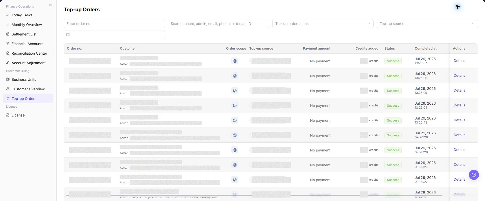
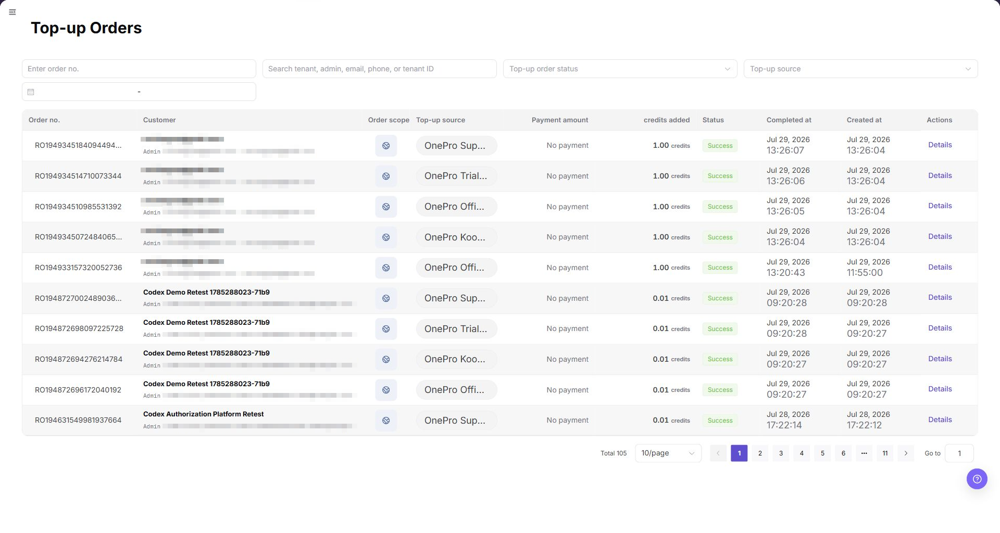

# Top-up Orders

::: info Document Information
Version: v1.0
Updated: 2026-08-27
:::

## Feature Overview

| Item | Content |
| --- | --- |
| Applicable Role | Operations administrator |
| Navigation path | Billing > Customer Billing > Customer Top-up Orders |
| Page route | `/billing/customers/top-ups/orders` |
| Managed objects | Customer top-up orders, payment channel, credited credits, order status, and customer balance changes |

`Customer Top-up Orders` is used to view the customer top-up order list, top-up amount, credited credits, payment channel, order status, created time, completed time, and details entry. Operators use this page to verify customer balance changes and troubleshoot top-up issues.

#### Beginner Explanation

Customer Top-up Orders works like a top-up ledger. After a customer completes a top-up, the order appears on this page so operators can verify the source, amount, credited credits, status, and details.

#### Terms Quick Reference

| Term | Meaning | Handling tip |
| --- | --- | --- |
| Top-up Order | An order record generated by a customer top-up. | Use the order number to locate issues. |
| Payment Channel | The third-party or platform payment channel used for top-up. | Check upstream payment status when abnormal. |
| Credited Credits | Credits actually credited to the customer account. | Verify it separately from payment amount and currency. |
| Top-up Order Status | The current processing result of a top-up order. | Do not adjust customer balance directly when status is abnormal. |
| Details | Row-level entry for a single top-up order. | Use it before comparing balances or payment transactions. |

## Prerequisites

1. The current account can access `Customer Billing > Customer Top-up Orders`.
2. At least one customer or top-up order exists before the list can show data.
3. The browser is logged in with an operator account and the session has not expired.

## Page Description

The filter area is above the table. In addition to order number, the current page supports searching tenant, administrator, email, phone, or Tenant ID, then narrowing by order status, top-up source, and date range. To identify an externally created order, use the order scope, top-up source, external reference information, and channel text together.

| Field | Description |
| --- | --- |
| Top-up Order No. | Searches by order number. |
| Customer identity | Searches tenant, administrator, email, phone, or Tenant ID. |
| Top-up Order Status | Selects an order status. |
| Top-up Source | Selects the source of the top-up order. |
| Date range | Limits the order creation or completion period. |

The order table contains:

| Field | Description |
| --- | --- |
| Top-up Order No. | Order number generated by the system. |
| Customer | Customer tenant and administrator account. |
| Order Scope | Business scope of the order. |
| Top-up Source | Top-up channel or controlled source, such as `New User Registration`, `Stripe`, or `KooGallery`. |
| Payment Amount | Amount in the original order currency. |
| Credits Added | Credits actually posted to the account. |
| Status | Order status, such as `Succeeded` or `Canceled`. |
| Completed At | Time when the order completed. |
| Created At | Time when the order was created. |
| Actions | Row actions, usually including `Details`. |

::: tip Table columns and horizontal viewport
All columns remain part of the order table. Depending on the UI language and available width, longer English labels can place `Completed At` and `Created At` outside the initial horizontal viewport while the fixed `Actions` column remains visible. Scroll the table horizontally to verify the timestamp columns. The screenshot below shows the initial English viewport; missing timestamp headers in that image do not mean the fields were removed.
:::

The list screenshot is placed under the main operation steps. Screenshot data is masked to avoid exposing customer or order information.

Page screenshot:

The image shows the page entry or current state for this operation. Verify the page title, target record, and visible actions.

## Main Operations

### View Customer Top-up Orders

1. Go to `Billing > Customer Billing > Customer Top-up Orders`.
2. Select a time range and filter by customer, order number, status, payment channel, or posting result.
3. Check creation time, customer, amount direction, status, and completion time.
4. If no record is returned, check the time zone and reset filters. Redact order and customer information before screenshots or exports.

The image shows the page entry or current state for this operation. Verify the page title, target record, and visible actions.

### Reconcile a Top-up Order with Account Posting

1. Open the target order details and record a redacted order number, status, and posting time.
2. Compare the customer account or transactions and locate the corresponding posting and amount direction.
3. The order status and account transaction should be mutually traceable. If not, check payment status and refresh time.
4. If records are inconsistent, do not create another top-up, supplemental order, or adjustment. Escalate the case to authorized personnel.

Use the following operation to review customer top-up orders and verify balance changes. Complete view-only checks before any export, refund, correction, or manual adjustment.

The image shows the page entry or current state for this operation. Verify the page title, target record, and visible actions.

### View Customer Top-up Order Details

1. Go to `Billing > Customer Billing > Customer Top-up Orders`.
2. Enter filters such as `Top-up Order No.`, tenant, administrator, email, phone, Tenant ID, order status, top-up source, or date range as needed.
3. Click **"Search"** and review the customer top-up order list.
4. Verify the order number, customer, order scope, top-up source, payment amount, credits added, status, completed time, and created time. Scroll the table horizontally when the timestamp columns are outside the initial viewport.
5. For an externally created order, compare the source, external reference information, and channel text.
6. To verify a single top-up order, click **"Details"** for the target order.
7. Compare with Customer Overview, Financial Accounts, or payment transactions to confirm that customer balance and top-up order status are consistent.

## Parameter Quick Reference

| Field Name | Required | Field Type | Example | Description |
| --- | --- | --- | --- | --- |
| Top-up Order No. | No | Text | `TOPUP-202607080001` | Precisely locates a customer top-up order. Use placeholders only in documentation. |
| Tenant / administrator / email / phone / Tenant ID | No | Text | `Example tenant` | Locates top-up orders by the visible customer identity fields. |
| Top-up Order Status | No | Enum | `Succeeded` | Filters customer top-up orders by status. |
| Payment Amount | System generated | Amount | `USD 100.00` | Payment amount displayed in the original order currency. |
| Credits Added | System generated | Credits | `1,000 Credits` | Credits actually credited to the customer account. |
| Payment Channel | System generated | Enum | `Stripe` | Payment channel or source of the top-up funds. |
| Order Scope | System generated | Tag | Displayed on page | Identifies the business scope of the order. |
| Top-up Source | System generated | Text | Displayed on page | Identifies the source or controlled channel of the order. |
| External Reference Information | System generated | Text | Sanitized value | Helps match an order created by an external system. |
| Created At | System generated | Time | `2026-07-10 12:00:00` | Time when the top-up order was created. |
| Completed At | System generated | Time | `2026-07-10 12:10:00` | Time when the top-up order was completed. |
| Details | No | Button / link | `Details` | Opens a single customer top-up order for verification. |
| Search | No | Button | `Search` | Refreshes the top-up order list by current filters. |
| Reset | No | Button | `Reset` | Clears filters and restores the default list. |

## Pitfalls

- Do not rely on one amount field alone for financial confirmation; cross-check transactions, bills, settlement statements, and reconciliation results.
- Do not repeat high-risk billing operations when the first attempt fails; check status and error details first.
- Remove sensitive customer, bank, contract, token, Key, or internal processing information before sharing screenshots or tickets.
- Top-up orders include customer identity, order number, amount, payment channel, and credited information. Desensitize screenshots and tickets.
- Do not mix top-up order numbers with payment transaction numbers. They are different objects.
- Long channel values can occupy more than one line. Do not infer a different order from text wrapping alone.
- Before exporting top-up order data, verify the data scope and recipient permission, and redact customer identity, order numbers, and amounts.

## Result Validation

| Check Item | Success Signal | If Abnormal |
| --- | --- | --- |
| Filters | The list refreshes according to the selected filters. | Clear the filters and search again. |
| Order details | Order details show the amount, status, payment channel, and related customer. | Check order permissions and the details entry point. |
| Posting consistency | The status, completion time, and credited amount match the upstream payment or customer balance change. | Check the payment channel and customer balance records. |

## FAQ

#### The Order List Is Empty

**Symptom:**

No records appear in the top-up order list.

**Possible causes:**

- No top-up order exists in the current billing period or time range.
- The filters are too narrow.

**Resolution:**

1. Clear the filters and refresh the page.
2. Confirm whether the customer completed a top-up.
3. Open `Customer Overview` and check the customer record.

#### The Review or Fund Status Is Unexpected

**Symptom:**

The order status, credited amount, or completion time differs from customer feedback.

**Possible causes:**

- Synchronization with the upstream payment channel is delayed.
- The order was canceled or payment was not completed.
- The customer is viewing another business unit or account.

**Resolution:**

1. Search again with the top-up order number.
2. Open `Finance Operations > Financial Accounts` and check the posted transaction.
3. Confirm the top-up account, business unit, and payment channel with the customer.

#### The Customer Balance Is Not Updated

**Symptom:**

The customer balance does not change after the order shows Succeeded.

**Possible causes:**

- The order is still being processed and has not been posted.
- The business unit is disabled or its credit policy restricts the transaction.

**Resolution:**

1. Wait briefly and refresh the page.
2. Open `Finance Operations > Financial Accounts` and check the posted transaction.
3. Check the business unit status and contact the platform administrator if necessary.

#### Customer Top-up Orders Does Not Update After Refresh

**Symptom:**

The amount, count, or status in Customer Top-up Orders remains unchanged after the related process finishes.

**Possible causes:**

- The billing cycle, tenant, customer, or business scope does not match the processed object.
- An upstream statistics, posting, or settlement task is still running.
- The current account can view only part of the data scope.

**How to handle:**

1. Recheck the billing cycle and object scope in Customer Top-up Orders.
2. Refresh the page, reopen the target record, and verify the update time.
3. Cross-check the upstream status in Customer Overview and Financial Accounts.
4. If the value still does not update, provide authorized personnel with the desensitized billing cycle, object identifier, status, and update time.

#### What Must Be Checked Before Sharing Customer Top-up Orders Information?

**Symptom:**

Customer Top-up Orders results must be shared in a screenshot, ticket, or report.

**Possible causes:**

- Customer names, order numbers, amounts, payment channels, and transaction numbers may be sensitive billing information.
- The sharing scope may exceed the recipient's business permission.
- A full screenshot may include account, environment, or unrelated information.

**How to handle:**

1. Keep only fields, statuses, and time ranges required for troubleshooting.
2. Use the specified light-gray opaque small-pixel mosaic only on sensitive text and values.
3. Confirm that the screenshot does not contain top-menu account data, environment information, real credentials, or internal addresses.
4. Share with the minimum required audience and record the desensitized scope.
## Notes

- Billing amounts, settlements, balances, and customer information are sensitive. Desensitize them before sharing.
- Keep page routes, API fields, Key, AK/SK, License, and other product terms in their UI form.
- Keep credentials, private operational details, and sensitive customer data out of the manual.
- Do not record real customer names, customer IDs, phone numbers, emails, top-up order numbers, payment transaction numbers, amounts, payment vouchers, accounts, Token, or Key.
- Before exporting top-up order data, verify the data scope and recipient permission, and redact customer identity, order numbers, and amounts.

## Next Steps

- Open [Customer Overview](../customer-overview/) to check the customer balance and top-up posting.
- Open `Finance Operations > Financial Accounts` to handle related fund transactions.
