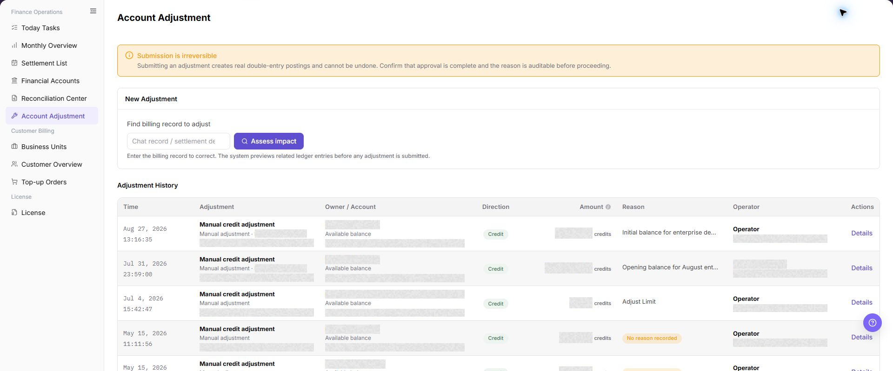

# Account Adjustment

::: info Document Information
Version: v1.0
Updated: 2026-07-10
:::

## Feature Overview

| Item | Content |
| --- | --- |
| Applicable Role | Operations administrator |
| Navigation path | Billing > Finance Operations > Account Adjustment |
| Page route | `/billing/admin/account-adjustments` |
| Managed objects | Billing records, adjustment impact assessment, and adjustment records |

`Account Adjustment` is used to find billing records that require manual correction, evaluate adjustment impact, and review submitted adjustment records. The page warns that submitted adjustments may generate real fund flows and are usually irreversible, so approval, reason, and impact scope must be confirmed before submission.

#### Beginner Explanation

Account Adjustment is like a financial reversal or correction voucher. It is a fund correction action that should only be performed after approval. Normal queries can be repeated, but submitted adjustments may generate real fund flows and are usually irreversible.

#### Terms Quick Reference

| Term | Meaning | Handling tip |
| --- | --- | --- |
| Adjustment | Approved fund correction for abnormal billing records. | Confirm impact scope before submission. |
| Reversal | Reverse correction for an incorrect fund direction or amount. | Keep approval and reason for audit. |
| Approval Status | Workflow status that determines whether adjustment can continue. | Do not submit without approval. |
| Related Document | Settlement statement, transaction, or billing fact related to the adjustment. | Used for traceability. |
| Impact Billing Cycle | Billing cycle affected by the adjustment. | Avoid adjusting the wrong billing cycle. |

## Prerequisites

1. The current account can access `Finance Operations > Account Adjustment`.
2. Adjustment approval or business confirmation has been obtained.
3. The billing record, settlement detail, transaction number, or billing fact ID to correct is ready.
4. Adjustment reason, amount direction, and impact scope have been confirmed.

## Page Description

The page includes a risk notice, `New Adjustment` area, and `Adjustment Records` list.

| Area | Description |
| --- | --- |
| Risk notice | Reminds operators that submitted adjustments are usually irreversible and require approval and reason confirmation. |
| New Adjustment | Enter billing record clues and evaluate adjustment impact. |
| Billing Record to Adjust | Supports billing record, settlement detail, transaction number, or billing fact ID. |
| Evaluate Impact | Previews related accounting entries and impact scope before adjustment. |
| Adjustment Records | Shows time, adjustment type, subject / account, direction, amount, reason, operator, and details entry. |

The following screenshot shows the risk notice, new adjustment area, and adjustment records list.

## Main Operations

Use the following operations to view the account adjustment page, evaluate adjustment impact, and review adjustment records. Before submitting an adjustment, verify the target billing record, approval status, direction, amount, and reason.

### View Account Adjustment

1. Go to `Billing > Finance Operations > Account Adjustment`.
2. Review the risk notice at the top of the page and confirm that submitted adjustments may generate real fund flows and are usually irreversible.
3. Review the `New Adjustment` area and confirm that target records can be located by billing record, settlement detail, transaction number, or billing fact ID.
4. Review the `Adjustment Records` list, including time, adjustment type, subject / account, direction, amount, reason, operator, and details entry.

### Evaluate Adjustment Impact

1. Go to `Billing > Finance Operations > Account Adjustment`.
2. In the `New Adjustment` area, enter the billing record clue that requires adjustment.
3. Before clicking `Evaluate Impact`, confirm record source, billing cycle, tenant, amount direction, and approval basis.
4. Review affected account, direction, amount, related document, and reason in the evaluation result.
5. If the result does not match expectations, stop submission and continue verification in Financial Accounts, Settlement List, or Reconciliation Center.

The image shows the page entry or current state for this operation. Verify the page title, target record, and visible actions.

### View Adjustment Records

1. Go to `Billing > Finance Operations > Account Adjustment`.
2. Review existing records in the `Adjustment Records` list.
3. Locate the target record by time, subject / account, direction, amount, reason, or operator.
4. Click **"Details"** to view more information for a single adjustment record.
5. Verify whether the record is consistent with approval basis, related document, and account transactions.
6. Hide real account, tenant name, transaction number, amount, and approval information when sharing screenshots or external communication.

The image shows the page entry or current state for this operation. Verify the page title, target record, and visible actions.

## Parameter Quick Reference

| Field Name | Required | Field Type | Example | Description |
| --- | --- | --- | --- | --- |
| New Adjustment | No | Page area | New Adjustment | Used to enter billing record clues and start impact evaluation. |
| Billing Record to Adjust | Yes | Text | `FACT-202607080001` | Billing record, settlement detail, transaction number, or billing fact ID. |
| Evaluate Impact | No | Button | Evaluate Impact | Previews affected account, direction, amount, and related document. |
| Adjustment Records | System-generated | List | Adjustment Records | Shows adjustment history and details entry. |
| Time | System-generated | Time | `2026-07-08 10:00` | Time when the adjustment record was generated. |
| Adjustment Type | System-generated | Enum / Text | Reversal | Adjustment type or business transaction information. |
| Subject / Account | System-generated | Text | Example Tenant A / Platform Clearing Account | Subject and account affected by the adjustment. |
| Direction | System-generated | Enum | Income | Income or expense direction. |
| Amount | System-generated | Amount | `1,000.00 credits` | Adjustment amount. |
| Reason | Yes | Text | Duplicate settlement transaction reversal | Adjustment reason or note. |
| Operator | System-generated | Text | operator | Operator who initiated or processed the adjustment. |
| Details | System-generated | Operation entry | Details | Shows more information for a single adjustment record. |
| Approval Basis | Yes | Text / Attachment | Desensitized approval note | Explains the adjustment basis for audit traceability. |
| Related Document | Yes | Text | Desensitized settlement statement number | Related settlement statement, transaction, or billing fact. |

## Pitfalls

- Do not rely on one amount field alone for financial confirmation; cross-check transactions, bills, settlement statements, and reconciliation results.
- Do not repeat high-risk billing operations when the first attempt fails; check status and error details first.
- Remove sensitive customer, bank, contract, token, Key, or internal processing information before sharing screenshots or tickets.
- Submitted adjustments may generate real fund flows and are usually irreversible.
- Before adjustment, confirm approval, billing cycle, tenant, related document, amount direction, and affected account.
- Adjustment cannot replace normal settlement, compensation, or reconciliation flows.
- Before submitting an adjustment, verify the target billing record, approval status, direction, amount, and reason.
- Do not record real accounts, account IDs, customer names, tenant names, billing-cycle amounts, transaction numbers, internal transaction numbers, approval information, tokens, or keys.

## Result Validation

| Check Item | Success Signal | If Abnormal |
| --- | --- | --- |
| Page access | The `Finance Operations > Account Adjustment` page opens and data loads normally. | Check role permissions and refresh the page. |
| Filter result | The list changes according to the selected filters. | Reset filters and search again. |
| Record detail | Details, status, amount, permission, or configuration values are visible. | Confirm the record scope and permissions. |
| Follow-up path | Related pages or dialogs can be opened from visible entries. | Return to the sidebar and enter the downstream page directly. |

## FAQ

#### The Record to Adjust Cannot Be Found

**Symptom:**

No target record is found after you enter a conversation record, settlement detail, transaction number, or billing fact ID.

**Possible causes:**

- The record clue is incomplete or uses the wrong type.
- The target record has not entered the billing ledger.
- The current account cannot view the target record.

**Resolution:**

1. Check the entered record clue.
2. Confirm that the target record exists in Financial Accounts or Settlement List.
3. Confirm the permission scope and evaluate the adjustment again.

#### What Must Be Confirmed Before Submission?

**Symptom:**

The page warns that submission cannot be undone, and the operator is unsure whether to continue.

**Possible causes:**

- The adjustment creates a real fund transaction.
- The reason, amount direction, or impact scope has not been confirmed.
- Approval or audit evidence is incomplete.

**Resolution:**

1. Pause submission and complete approval confirmation.
2. Check the adjustment direction, amount, subject, and account.
3. Save the reason and impact assessment.
4. Submit only after all information is confirmed.

#### The Amount After Impact Assessment Is Unexpected

**Symptom:**

After `Assess Impact` is selected, the displayed direction, amount, or affected account differs from expectations.

**Possible causes:**

- The billing record clue does not identify the target business transaction.
- The target record spans billing periods or involves multiple transactions.
- The expected amount definition differs from the platform adjustment definition.

**Resolution:**

1. Pause the adjustment submission.
2. Check related transactions in Financial Accounts, Settlement List, or Reconciliation Center.
3. Confirm the direction, amount, and affected billing period with the billing owner before assessing again.

#### The Processed Result Is Missing from Adjustment Records

**Symptom:**

The adjustment record does not appear after processing completes.

**Possible causes:**

- The adjustment task is still processing.
- Filters exclude the target time, subject, or account.
- The current account cannot view the target adjustment record.

**Resolution:**

1. Clear the filters and refresh the page.
2. Confirm that approval and submission have completed.
3. If the record is still missing, ask an administrator to check permissions and background processing status.

#### Account Adjustment Entry Is Unavailable

**Symptom:**

A billing difference is confirmed, but no Account Adjustment entry is available.

**Possible causes:**

- The current account does not have adjustment permission.
- The target record status does not allow adjustment.
- Approval evidence or related records are incomplete.

**How to handle:**

1. Confirm the difference across Financial Accounts, Reconciliation Center, and Settlement List.
2. Check the target record status and current account permission.
3. Complete approval evidence, related records, and impact assessment before entering the adjustment process.
## Notes

- Billing amounts, settlements, balances, and customer information are sensitive. Desensitize them before sharing.
- Keep page routes, API fields, Key, AK/SK, License, and other product terms in their UI form.
- Submitted adjustments may generate real fund flows and are usually irreversible. Confirm approval, reason, direction, amount, subject, and impact scope before submission.
- Do not record real accounts, account IDs, customer names, tenant names, billing-cycle amounts, transaction numbers, internal transaction numbers, approval information, tokens, or keys in the manual, screenshots, notes, or tickets.

## Next Steps

1. Review related billing records, transactions, settlement statements, and account balance changes.
2. Keep only desensitized page paths, timestamps, status values, and screenshots when escalating.
3. Continue with the related reconciliation, settlement, top-up, or adjustment flow after the result is confirmed.
