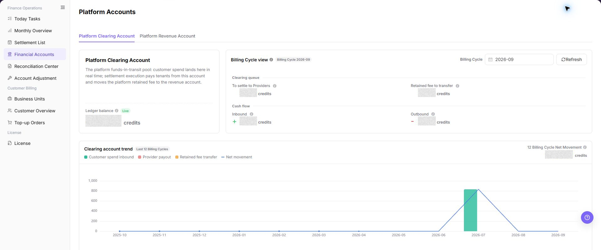

# Financial Accounts

::: info Document Information
Version: v1.0
Updated: 2026-07-10
:::

## Feature Overview

| Item | Content |
| --- | --- |
| Applicable Role | Operations administrator |
| Navigation path | Billing > Finance Operations > Financial Accounts |
| Page route | `/billing/admin/financial-accounts` |
| Managed objects | Platform clearing account, platform revenue account, account balance, transactions, and transaction details |

`Financial Accounts` is used to review platform clearing accounts, platform revenue accounts, balances, income, expense, available amount, and transactions. Billing operators use this page to confirm whether funds are in the expected account and continue to settlement, monthly overview, or reconciliation pages when amounts differ.

#### Beginner Explanation

Financial Accounts is the platform's fund ledger. It shows account balance, income, expense, available amount, and transactions for accounts such as `Platform Clearing Account` and `Platform Revenue Account`.

Settlement List is the statement pool and focuses on whether an tenant has a settlement record for a billing cycle. Financial Accounts focuses on where the money comes from, where it goes, and how much remains.

#### Terms Quick Reference

| Term | Meaning | Handling tip |
| --- | --- | --- |
| Platform Clearing Account | Temporary account for collecting and clearing transaction funds. | Verify inflow and clearing status before settlement. |
| Platform Revenue Account | Account for platform retained fee, service fee, commission, or other platform revenue. | Cross-check with Monthly Overview and settlement statements. |
| Account Balance | Current fund or credit balance displayed for the account. | Cross-check with income, expense, and transactions. |
| Transactions | Each income, expense, refund, or settlement-related fund change. | Start here when locating amount differences. |
| Last Update Time | Last refresh time of account data. | Avoid drawing conclusions from stale data. |

#### Account Relationship Notes

| Account type | Beginner view | Main use |
| --- | --- | --- |
| Platform Clearing Account | Temporary transit ledger for collected funds | Review fund inflow, clearing, and pre-settlement status. |
| Platform Revenue Account | Final platform revenue ledger | Review retained fee, service fee, or revenue summary. |
| Transactions | Fund change records | Investigate income, expense, refund, and settlement differences. |

## Prerequisites

1. The current account can access `Finance Operations > Financial Accounts`.
2. The target platform account type has been confirmed, such as `Platform Clearing Account` or `Platform Revenue Account`.
3. Before reviewing transactions, the target billing cycle, tenant, transaction type, or transaction number has been confirmed.
4. Before investigating settlement differences, the settlement statement, monthly overview, or reconciliation scope has been confirmed.

## Page Description

The page usually displays account name, account type, account balance, income, expense, available amount, last update time, and transaction entry. Billing operators can start from account cards, then open details or transactions to verify fund changes.

| Area | Description |
| --- | --- |
| Account list | Shows platform clearing account, platform revenue account, and other financial accounts. |
| Account Balance | Shows current balance, available amount, income, and expense. |
| Details | Opens target account details and balance changes. |
| Transactions | Shows income, expense, refund, settlement, and other transactions under the selected account. |
| Last Update Time | Indicates whether account amount and transaction data have refreshed. |

The following screenshot shows the platform clearing account view. It includes account overview, billing-cycle view, and transactions.

The following screenshot shows the platform revenue account view. It includes revenue account overview, revenue trend, and transaction list.

#### Where to Look

| Your Goal | Start Here | Next Step |
| --- | --- | --- |
| Confirm whether an account balance is correct | Account list | Review account income, expense, and balance. |
| Investigate a specific fund change | Transaction details | Filter by transaction time, type, or number. |
| Check a settlement amount | [Settlement List](../settlement-list/) | Compare settlement amounts with account transactions. |
| Check monthly revenue | [Monthly Overview](../monthly-overview/) | Compare billing-period totals with account changes. |
| Locate a billing difference | [Reconciliation Center](../reconciliation-center/) | Investigate by billing period, tenant, or transaction type. |

## Main Operations

Use the following operations to review account information and transactions. Before adjustment, posting confirmation, clearing, or export, verify the target account, operation permission, and impact scope.

### View Account List

1. Go to `Billing > Finance Operations > Financial Accounts`.
2. Review accounts such as `Platform Clearing Account` and `Platform Revenue Account`.
3. Check account balance, total income, total expense, available amount, and last update time.
4. If the list is empty, reset filters first, then confirm whether the current account has financial-account view permission.

The image shows the page entry or current state for this operation. Verify the page title, target record, and visible actions.

### View Platform Clearing Account

1. Go to `Billing > Finance Operations > Financial Accounts`.
2. Find `Platform Clearing Account` in the account list.
3. Review account balance, income, expense, available amount, and last update time.
4. To verify fund flow, click **"Details"** or the transaction entry for the account.
5. Compare with Monthly Overview, Settlement List, or Reconciliation Center to confirm that the clearing account amount matches the billing-cycle settlement status.

The image shows the page entry or current state for this operation. Verify the page title, target record, and visible actions.

### View Platform Revenue Account

1. Go to `Billing > Finance Operations > Financial Accounts`.
2. Find `Platform Revenue Account` in the account list.
3. Review account balance, income, expense, available amount, and last update time.
4. Focus on platform retained fee, self-operated revenue, or other platform revenue amounts.
5. Compare with Monthly Overview, Settlement Statement Details, and Financial Account transactions to confirm that revenue amount scopes are consistent.

The following screenshot shows the Platform Revenue Account area. Use it to compare the revenue amount with the billing-period summary.

### View Account Details

1. Select the target account in the account list.
2. Open account details.
3. Review basic account information, balance changes, income and expense summary, and transactions.
4. Record the last update time to avoid using stale data for reconciliation.

The image shows the page entry or current state for this operation. Verify the page title, target record, and visible actions.

### View Transactions

1. Open the target account details.
2. Filter by transaction time, transaction type, or transaction number.
3. Open transaction details.
4. Verify the amount, fund direction, related settlement statement, related order, or business source.
5. Before sharing transaction details in tickets or comments, desensitize the amount, tenant name, transaction number, and account information.

The image shows the page entry or current state for this operation. Verify the page title, target record, and visible actions.

### Troubleshoot Account Differences

1. Confirm the target account, billing cycle, tenant, and transaction type to avoid cross-scope comparison.
2. In Settlement List, compare the amount, tenant, billing cycle, and posting status.
3. In Monthly Overview, compare billing-cycle totals with account income and expenses.
4. If the difference remains unexplained, open Reconciliation Center and investigate by billing cycle, tenant, or transaction type.
5. Record only the desensitized account type, billing cycle, symptom, and update time. Do not record real amounts, accounts, or transaction numbers.

| Symptom | Recommended Page | What to Check |
| --- | --- | --- |
| The account amount does not match the settlement statement | [Settlement List](../settlement-list/) | Compare the amount, tenant, billing cycle, and posting status. |
| The monthly summary is incorrect | [Monthly Overview](../monthly-overview/) | Compare billing-cycle totals with account income and expenses. |
| A billing difference cannot be explained | [Reconciliation Center](../reconciliation-center/) | Investigate by billing cycle, tenant, or transaction type. |

The image shows the page entry or current state for this operation. Verify the page title, target record, and visible actions.

## Parameter Quick Reference

| Field Name | Required | Field Type | Example | Description |
| --- | --- | --- | --- | --- |
| Platform Clearing Account | System-generated | Account type | Platform Clearing Account | Used to review clearing balance, income, expense, and transactions. |
| Platform Revenue Account | System-generated | Account type | Platform Revenue Account | Used to review platform retained fee, self-operated revenue, and other platform revenue. |
| Account Balance | System-generated | Amount | `12,345.67 credits` | Current fund or credit balance displayed for the account. |
| Income | System-generated | Amount | `10,000.00 credits` | Inbound amount in the current selected scope. |
| Expense | System-generated | Amount | `2,000.00 credits` | Outbound amount in the current selected scope. |
| Available Amount | System-generated | Amount | `8,000.00 credits` | Amount available for later clearing, confirmation, or statistics. |
| Last Update Time | System-generated | Date and time | `2026-07-08 10:00` | Indicates whether account amount and transaction data have refreshed. |
| Details | System-generated | Operation entry | `Details` | Opens target account details and balance changes. |
| Transactions | System-generated | Operation entry | `Transactions` | Opens income, expense, refund, settlement, and other transactions for the selected account. |
| Transaction Time | No | Time range | `2026-07-01 to 2026-07-31` | Filters transactions within a specific time range. |
| Transaction Type | No | Enum | `Income` | Distinguishes income, expense, refund, settlement, and other transaction types. |
| Transaction Number | No | Text | `TXN-202607080001` | Locates a specific transaction record. |
| Tenant | No | Text | `Example Tenant A` | Locates account transactions or settlement differences by tenant. |
| Account Status | No | Enum | `Normal` | Indicates whether the account can be viewed, receive entries, or continue reconciliation. |

## Pitfalls

- Do not rely on one amount field alone for financial confirmation; cross-check transactions, bills, settlement statements, and reconciliation results.
- Do not repeat high-risk billing operations when the first attempt fails; check status and error details first.
- Remove sensitive customer, bank, contract, token, Key, or internal processing information before sharing screenshots or tickets.
- Financial account amounts are sensitive billing information. Screenshots and documents must be desensitized.
- Adjustment, posting confirmation, clearing, and export are high-risk actions. This page records view-only steps and does not guide real submission.
- Do not record real account IDs, customer names, tenant names, billing-cycle amounts, transaction numbers, internal transaction numbers, approval information, accounts, tokens, or keys.

## Result Validation

| Check Item | Success Signal | If Abnormal |
| --- | --- | --- |
| Page access | The `Finance Operations > Financial Accounts` page opens and data loads normally. | Check role permissions and refresh the page. |
| Filter result | The list changes according to the selected filters. | Reset filters and search again. |
| Record detail | Details, status, amount, permission, or configuration values are visible. | Confirm the record scope and permissions. |
| Follow-up path | Related pages or dialogs can be opened from visible entries. | Return to the sidebar and enter the downstream page directly. |

## FAQ

#### The Account List Is Empty

**Symptom:** The Platform Clearing Account or Platform Revenue Account does not appear.

**Possible cause:** The current account lacks financial-account view permission, filters restrict the account scope, or the target tenant does not yet have a financial account.

**Resolution:** Clear the filters and search again. Confirm that the current account has billing-operations permission. If the list remains empty, ask the platform administrator to check tenant, account, and permission configuration.

#### The Account Balance Does Not Match the Settlement Amount

**Symptom:** The balance, income, or expense in Financial Accounts differs from the amount in Settlement List.

**Possible cause:** The pages use different billing periods, tenants, or transaction types. Settlement List uses a document view while Financial Accounts uses account transactions. Refunds, adjustments, clearing delays, or pending posting can also cause a difference.

**Resolution:** Confirm that billing period, tenant, and amount definition are consistent. Open Transactions and compare income, expense, refund, and settlement records. If the difference remains, continue in Settlement List and Reconciliation Center.

#### The Target Transaction Cannot Be Found

**Symptom:** The target transaction is absent from account details or Transactions.

**Possible cause:** The transaction time, type, number, or tenant filter does not match. The target transaction may not yet have generated an account entry, or synchronization may be delayed.

**Resolution:** Broaden the filters and search again. Use a transaction number or related order number for exact matching. If the record is still absent, check Monthly Overview, Settlement List, or Reconciliation Center to confirm whether it has entered the billing workflow.

#### The Account Amount Has Not Updated for a Long Time

**Symptom:** The account balance, income, expense, or last update time has not changed for a long period.

**Possible cause:** No new transaction exists in the current billing period, account synchronization is delayed, or an upstream clearing, settlement, or reconciliation task failed.

**Resolution:** Check the last update time and recent transactions. Confirm that the upstream transaction completed. If it completed but the account did not change, open Reconciliation Center and check for unmatched transactions or failed tasks.

#### Account Details Entry Is Unavailable

**Symptom:**

The account list is visible, but the target account details or transactions cannot be opened.

**Possible causes:**

- The current account has list-only permission.
- The target account status is abnormal or page data has not finished loading.

**How to handle:**

1. Refresh the account list and confirm the target account status.
2. Check whether the current account has permission for account details and transactions.
3. If the entry is still unavailable, provide authorized personnel with the desensitized account type, status, and update time.
## Notes

- Billing amounts, settlements, balances, and customer information are sensitive. Desensitize them before sharing.
- Keep page routes, API fields, Key, AK/SK, License, and other product terms in their UI form.
- Do not record real account IDs, customer names, tenant names, billing-cycle amounts, transaction numbers, internal transaction numbers, approval information, accounts, tokens, or keys in the manual, screenshots, notes, or tickets.

## Next Steps

1. Open [Settlement List](../settlement-list/) to check settlement documents.
2. Open [Monthly Overview](../monthly-overview/) to review billing-period income, expense, and totals.
3. Open [Reconciliation Center](../reconciliation-center/) to investigate billing differences, unmatched transactions, or failed tasks.
4. After amounts are confirmed, deliver sanitized account information, transaction scope, and conclusions to Finance for confirmation or archiving.
