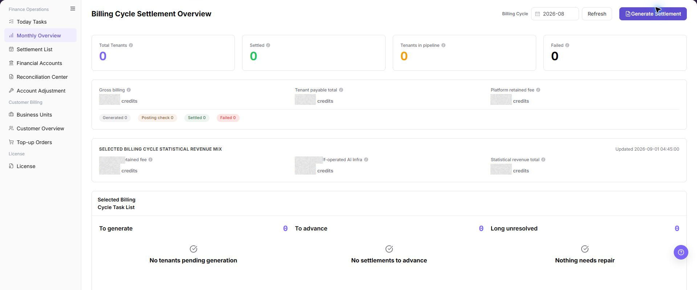

# Monthly Overview

::: info Document Information
Version: v1.0
Updated: 2026-08-27
:::

## Feature Overview

| Item | Content |
| --- | --- |
| Applicable Role | Operations administrator |
| Navigation path | Billing > Finance Operations > Monthly Overview |
| Page route | `/billing/admin/provider-settlements/monthly-overview` |
| Managed objects | Billing cycle, tenant settlement status, monthly revenue mix, and pending tasks |

`Monthly Overview` is used to review monthly billing cycles, tenant settlement status, monthly gross flow, payable amounts, platform retained fee, revenue mix, and pending settlement tasks. Operators use this page to decide whether settlement statements can be generated or whether exceptions need follow-up first.

#### Beginner Explanation

Monthly Overview is like the billing-cycle monthly report. Select a billing cycle first, then check how many tenants are settled, how many still need follow-up, and how platform revenue is composed. If To generate or To advance is not zero, continue with settlement list or reconciliation pages before final actions.

#### Terms Quick Reference

| Term | Meaning | Handling tip |
| --- | --- | --- |
| Billing Cycle | The month or settlement period used for billing, revenue, and reconciliation. | Keep the cycle consistent across Monthly Overview, Settlement List, and Financial Accounts. |
| Tenant settlement status | Settlement progress for tenants in the selected billing cycle. | Check Pending Tenants and Failed before generating statements. |
| Revenue Mix | Platform retained fee, self-operated revenue, and total statistical revenue. | Treat it as a summary and reconcile abnormal amounts with details. |
| Task List | To generate, To advance, and Long unresolved task counts. | Use it to decide the next downstream page. |
| Generate Settlement | Button for generating settlement statements for eligible tenants. | Use only after confirming billing cycle, tenant scope, and exceptions. |

## Prerequisites

1. The current account can access `Finance Operations > Monthly Overview`.
2. The target billing cycle and operation scope have been confirmed.
3. If `Generate Settlement` may be used, the tenant scope, failed tasks, reconciliation status, and approval basis have been prepared.

## Page Description

The page includes billing-cycle selection, refresh and settlement generation entries, billing-cycle statistic cards, revenue mix, and task lists.

| Area | Description |
| --- | --- |
| Billing Cycle | Select the monthly billing cycle to review. |
| Refresh | Reload statistics for the selected billing cycle. |
| Generate Settlement | Generate settlement statements for eligible tenants. |
| Tenant Total | Number of tenants included in the selected billing cycle. |
| Settled | Number of tenants already settled. |
| Pending Tenants | Tenants that still require follow-up. |
| Failed | Failed settlement generation or processing count. |
| Revenue Mix | Platform retained fee, self-operated revenue, and total statistical revenue. |
| Task List | To generate, To advance, and long unresolved tasks. |

The following screenshot shows monthly overview list.

## Main Operations

### View Monthly Close Scope

1. Go to `Billing > Finance Operations > Monthly Overview`.
2. Select the target billing period and filter by provider, settlement status, or anomaly type.
3. Check pending settlement count, amount due, anomaly count, and data refresh time.
4. If no data is shown, check the billing period and settlement job status. Redact amounts before screenshots or exports.

Use the following operations to work with monthly overview records and related status. Complete view-only checks before opening dialogs that may create, save, submit, activate, transfer, settle, publish, or delete data.

The image shows the page entry or current state for this operation. Verify the page title, target record, and visible actions.

### View Monthly Overview

1. Go to `Billing > Finance Operations > Monthly Overview`.
2. Select the target month in `Billing Cycle` and confirm the billing-cycle scope.
3. Click **"Refresh"** and wait for statistics and task lists to update.
4. Review billing-cycle statistic cards, especially `Tenant Total`, `Settled`, `Pending Tenants`, and `Failed`.
5. Review the revenue mix area, including `Platform Retained Fee`, `Self-operated Revenue`, and total statistical revenue.
6. Review task counts such as `To generate`, `To advance`, and `Long unresolved`.

The image shows the page entry or current state for this operation. Verify the page title, target record, and visible actions.

### Generate Settlement

1. Confirm that `Billing Cycle` is correct.
2. Review the To Generate count in the task list.
3. Click **"Generate Settlement"**.
4. Open [Settlement List](../settlement-list/) to view the generated settlement page.

The image shows the page entry or current state for this operation. Verify the page title, target record, and visible actions.

## Parameter Quick Reference

| Field Name | Required | Field Type | Example | Description |
| --- | --- | --- | --- | --- |
| Billing Cycle | Yes | Month / billing period | `2026-07` | Switches the monthly settlement cycle being reviewed. |
| Tenant Total | System-generated | Number | `0` | Number of tenants included in the selected billing cycle. |
| Settled | System-generated | Number | `0` | Number of tenants already settled. |
| Pending Tenants | System-generated | Number | `0` | Tenants that still require operator follow-up. |
| Failed | System-generated | Number | `0` | Failed settlement generation or processing count. |
| Gross Flow | System-generated | Amount | `0.00 credits` | Gross monthly flow counted in the selected billing cycle. |
| Payable to Tenants | System-generated | Amount | `0.00 credits` | Total amount payable to tenants or providers in the selected billing cycle. |
| Platform Retained Fee | System-generated | Amount | `0.00 credits` | Platform retained fee in the selected billing cycle. |
| Self-operated Revenue | System-generated | Amount | `0.00 credits` | Revenue from platform self-operated business in the selected billing cycle. |
| Total Statistical Revenue | System-generated | Amount | `0.00 credits` | Total revenue statistics from retained fee, self-operated revenue, and related sources. |
| To generate | System-generated | Number | `0` | Tasks that have not generated settlement statements yet. |
| To advance | System-generated | Number | `0` | Generated or in-progress tasks that require follow-up. |
| Long unresolved | System-generated | Number | `0` | Tasks or exceptions that have not been resolved for a long time. |
| Generate Settlement | Operation entry | Button | Generate Settlement | Generates settlement statements for eligible tenants in the selected billing cycle. |

## Pitfalls

- Do not rely on one amount field alone for financial confirmation; cross-check transactions, bills, settlement statements, and reconciliation results.
- Do not repeat high-risk billing operations when the first attempt fails; check status and error details first.
- Remove sensitive customer, bank, contract, token, Key, or internal processing information before sharing screenshots or tickets.
- `Generate Settlement` affects the real billing-cycle settlement flow.
- Before clicking `Generate Settlement`, confirm the billing cycle, tenant scope, To generate count, failed tasks, and reconciliation status.
- Do not click generation repeatedly. If it fails, check Settlement List or Reconciliation Center before retrying.

## Result Validation

| Check Item | Success Signal | If Abnormal |
| --- | --- | --- |
| Billing-period switch | The statistic cards and task list update after the billing period changes. | Select the billing period again and refresh. |
| Page refresh | The loading state clears after you click Refresh. | Check the network, permissions, and background task status. |
| Settlement generation | Settlement List shows a record or status change for the selected billing period. | Open Settlement List and check the generation result. |

## FAQ

#### The To Generate Count Is Not Zero

**Symptom:** The task list still shows items to generate.

**Possible causes:** Some tenants do not yet have settlement statements, billing data aggregation is incomplete, or a preceding reconciliation exception exists.

**Resolution:**

1. Confirm that the selected billing period is correct.
2. Check the billing-period statistics before selecting `Generate Settlement`.
3. After generation, open Settlement List and track settlement status.

#### The Revenue Mix Is Unexpected

**Symptom:** Platform retained fees, self-operated revenue, or total statistical revenue differs from expectations.

**Possible causes:** The billing period is incorrect, aggregation is incomplete, or adjustments and reconciliation exceptions affect the statistics.

**Resolution:**

1. Check the billing period.
2. Open Financial Accounts and review account transactions and trends.
3. Open Reconciliation Center and check for exceptions.

#### Generate Settlement Is Unavailable

**Symptom:** `Generate Settlement` cannot be selected or does not proceed.

**Possible causes:** Statistics are incomplete, the current account lacks permission, or exceptions and pending tasks block the billing period.

**Resolution:**

1. Confirm whether billing-period statistics are complete.
2. Check pending and failed counts in the task list.
3. If permission is missing, ask the platform administrator for finance-operations permission.

#### Task Counts Do Not Match Settlement List

**Symptom:** To Generate, To Advance, or Long Unresolved counts differ from filtered results in Settlement List.

**Possible causes:** The pages use different billing periods or statuses, Monthly Overview is delayed, or Settlement List updated before the overview refreshed.

**Resolution:**

1. Use the same billing period and status filters on both pages.
2. Click **"Refresh"** in Monthly Overview.
3. If the difference remains, open Reconciliation Center and check background tasks or exceptions.

#### When Is Monthly Overview Ready for Settlement?

**Symptom:**

Monthly Overview shows data, but it is unclear whether settlement generation can continue.

**Possible causes:**

- Billing-cycle statistics are not complete.
- Today Tasks or Reconciliation Center still has blocking exceptions.

**How to handle:**

1. Confirm the target billing cycle, update time, and statistics status.
2. Check high-priority items in Today Tasks.
3. Refresh Reconciliation Center and confirm that no blocking exception remains.
4. Enter settlement generation only after all checks pass.
## Notes

- Billing amounts, settlements, balances, and customer information are sensitive. Desensitize them before sharing.
- Keep page routes, API fields, Key, AK/SK, License, and other product terms in their UI form.
- Do not record real billing-cycle amounts, tenants, tenants, customer names, settlement statement numbers, internal transaction numbers, or approval information in the manual, screenshots, notes, or tickets.

## Next Steps

1. Review related billing records, transactions, settlement statements, and account balance changes.
2. Keep only desensitized page paths, timestamps, status values, and screenshots when escalating.
3. Continue with the related reconciliation, settlement, top-up, or adjustment flow after the result is confirmed.
