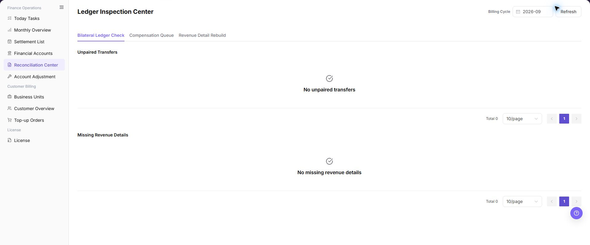

# Reconciliation Center

::: info Document Information
Version: v1.0
Updated: 2026-07-10
:::

## Feature Overview

| Item | Content |
| --- | --- |
| Applicable Role | Operations administrator |
| Navigation path | Billing > Finance Operations > Reconciliation Center |
| Page route | `/billing/admin/reconciliation` |
| Managed objects | Bilateral ledger check, compensation queue, revenue detail rebuild, unmatched transfer, and missing revenue detail |

`Reconciliation Center` is used to inspect billing-operation exceptions, including bilateral ledger checks, compensation queues, revenue detail rebuilds, unmatched transfers, and missing revenue details. Operators select a billing cycle, refresh inspection results, and then continue verification in Financial Accounts, Settlement List, or Account Adjustment when exceptions appear.

#### Beginner Explanation

Reconciliation Center is the billing health-check page. It helps operators find records that may be unmatched, incomplete, or waiting for retry. It does not complete settlement by itself and should not be used as the only basis for financial adjustment.

#### Terms Quick Reference

| Term | Meaning | Handling tip |
| --- | --- | --- |
| Bilateral Ledger Check | Checks whether fund-related ledgers can be matched on both sides. | If abnormal, verify related transactions in Financial Accounts. |
| Compensation Queue | Queue of billing tasks waiting for retry, compensation, or manual handling. | Review failure reason before any retry. |
| Revenue Detail Rebuild | Rebuilds missing revenue details. | Confirm billing cycle and impact scope before real submission. |
| Unmatched Transfer | Transfer record without a matched counterpart. | Verify account transactions and business records. |
| Missing Revenue Detail | Consumption or settlement evidence exists, but revenue detail is missing. | Refresh after rebuild and compare with settlement records. |

#### Reconciliation Object Quick Reference

| Object | Beginner view | Where to check next |
| --- | --- | --- |
| Bilateral Ledger Check | Checks whether fund ledgers can be paired. | Financial Accounts, Settlement List |
| Compensation Queue | Shows tasks needing retry, compensation, or manual handling. | Compensation queue details, Account Adjustment |
| Revenue Detail Rebuild | Rebuilds missing revenue details. | Revenue details, Settlement List |
| Unmatched Transfer | Transfer record cannot be matched yet. | Financial account transactions, business records |
| Missing Revenue Detail | Consumption or settlement evidence exists, but revenue detail is missing. | Revenue detail rebuild, Settlement List |

#### Where to Look First

| Symptom | Check first | Next step |
| --- | --- | --- |
| Unmatched transfer exists | Bilateral Ledger Check results | Go to Financial Accounts to verify transactions. |
| Missing revenue detail exists | Revenue Detail Rebuild results | Go to Settlement List to verify billing cycle. |
| Compensation queue is backlogged | Queue status and failure reason | Decide whether retry or manual handling is needed. |
| Amount differs from expectation | Billing cycle, tenant, and fund direction | Go to Settlement List or Account Adjustment. |

## Prerequisites

1. The current account can access `Finance Operations > Reconciliation Center`.
2. The billing cycle to inspect has been confirmed.
3. Related settlement statements, financial account transactions, or business records are available for comparison.
4. Before rebuild or compensation, the impact scope and running tasks of the same type have been confirmed.
5. Manual adjustment follows the platform approval or finance handling process.

## Page Description

The page includes billing-cycle selection, refresh, inspection entries, and exception lists. Operators select a billing cycle and refresh results first, then review unmatched transfers, missing revenue details, and compensation queue status.

| Area | Description |
| --- | --- |
| Billing Cycle | Select the billing period to inspect. |
| Refresh | Reload inspection results for the selected billing cycle. |
| Bilateral Ledger Check | Checks matching status for fund-related ledgers. |
| Compensation Queue | Shows tasks requiring compensation, retry, or manual handling. |
| Revenue Detail Rebuild | Checks and rebuilds missing revenue details. |
| Unmatched Transfer | Shows transfer records without a matched counterpart. |
| Missing Revenue Detail | Shows records missing revenue details. |

Page screenshot:

The image shows the page entry or current state for this operation. Verify the page title, target record, and visible actions.

## Main Operations

Use the following operations to view reconciliation results and exception areas. Before retry, compensation, adjustment, confirmation, or rebuild, verify the exception scope, operation permission, and downstream impact.

### View Reconciliation Results

1. Go to `Billing > Finance Operations > Reconciliation Center`.
2. Select the target `Billing Cycle`.
3. Click **"Refresh"**.
4. Review result update time or exception count changes.
5. Check unmatched transfers, missing revenue details, and compensation queue status.
6. Continue in Financial Accounts, Settlement List, or Account Adjustment according to the exception type.

The image shows the page entry or current state for this operation. Verify the page title, target record, and visible actions.

### View Bilateral Ledger Check

1. Go to `Billing > Finance Operations > Reconciliation Center`.
2. Select the target `Billing Cycle`.
3. Click **"Refresh"** and wait for reconciliation results to update.
4. Review the `Bilateral Ledger Check` area, especially unmatched transfers, fund direction, transaction object, business context, and reference information.
5. If unmatched records or amount differences exist, continue verification in Financial Accounts, Settlement List, or transactions.

### View Compensation Queue

1. Go to `Billing > Finance Operations > Reconciliation Center`.
2. Select the target `Billing Cycle`.
3. Click **"Refresh"** and confirm that compensation queue status has updated.
4. Review the `Compensation Queue` area, especially task status, failure reason, retry count, related transaction, related settlement statement, and processing time.
5. If pending, retrying, or failed items exist, first confirm whether unmatched transfers or missing revenue details exist in the same billing cycle.

### View Revenue Detail Rebuild

1. Go to `Billing > Finance Operations > Reconciliation Center`.
2. Select the target `Billing Cycle`.
3. Review the `Revenue Detail Rebuild` area and confirm whether missing revenue details exist.
4. Verify tenant, billing cycle, business source, related transaction, and exception reason for missing records.
5. If rebuild is required, first confirm that Monthly Overview, Settlement List, and Financial Account transactions use a consistent scope.

## Parameter Quick Reference

| Field Name | Required | Field Type | Example | Description |
| --- | --- | --- | --- | --- |
| Billing Cycle | Yes | Month / billing period | `2026-07` | Selects the billing period to inspect. |
| Refresh | No | Button | `Refresh` | Reloads reconciliation results for the current billing cycle. |
| Bilateral Ledger Check | No | Operation entry | Bilateral Ledger Check | Checks whether fund-related ledgers can be matched. |
| Compensation Queue | No | Operation entry | Compensation Queue | Shows queue items requiring compensation, retry, or manual handling. |
| Revenue Detail Rebuild | No | Operation entry | Revenue Detail Rebuild | Checks or rebuilds missing revenue details. |
| Unmatched Transfer | System-generated | Exception list | `3 unmatched transfers` | Shows transfer records without a matched counterpart. |
| Missing Revenue Detail | System-generated | Exception list | `2 missing revenue details` | Shows records missing revenue details. |
| Task Status | System-generated | Status | Pending / Retrying / Failed | Shows current status of compensation or rebuild tasks. |
| Failure Reason | System-generated | Text | Example failure reason | Shows why a task failed or an inspection is abnormal. |
| Retry Count | System-generated | Number | `3` | Shows retry count of compensation or rebuild tasks. |
| Related Transaction | System-generated | Text | Desensitized transaction number | Locates the related transaction. |
| Related Settlement Statement | System-generated | Text | Desensitized settlement statement number | Locates the related settlement statement. |
| Inspection Result | System-generated | Result status | Completed / Exceptions Found | Shows the result generated from the billing period and inspection action. |
| Actions | System-generated | Operation entry | View / Open | Provides view, jump, or follow-up entries. |

## Pitfalls

- Do not rely on one amount field alone for financial confirmation; cross-check transactions, bills, settlement statements, and reconciliation results.
- Do not repeat high-risk billing operations when the first attempt fails; check status and error details first.
- Remove sensitive customer, bank, contract, token, Key, or internal processing information before sharing screenshots or tickets.
- Bilateral Ledger Check is used to find exceptions. It does not prove that funds have been confirmed.
- Retry, compensation, adjustment, and confirmation actions in Compensation Queue are high-risk operations.
- Revenue Detail Rebuild may affect billing-cycle statistics, settlement statement amount, and revenue detail scope.
- Do not record real account IDs, tenant names, customer names, billing-cycle amounts, transaction numbers, internal transaction numbers, approval information, accounts, tokens, or keys.

## Result Validation

| Check Item | Success Signal | If Abnormal |
| --- | --- | --- |
| Billing period | The page shows data for the target billing period. | Select the billing period again and refresh. |
| Inspection refresh | The exception-list update time or count changes. | Check permissions, the network, and background task status. |
| Unmatched transfers | No one-sided transaction exception remains in the current billing period. | Open Financial Accounts and check related transactions. |
| Missing revenue details | The missing-revenue-details list is empty. | Rebuild revenue details and refresh again. |
| Compensation queue | No pending or failed item remains in the queue. | Review the failure reason and follow the handling process. |

## FAQ

#### Unmatched Transfers Are Listed

**Symptom:** The Unmatched Transfers area contains exception records.

**Possible cause:** Only one side of a fund transaction exists, the related business record has not synchronized, or clearing is delayed.

**Resolution:** Record the billing period, tenant, and sanitized transaction clue. Check the transaction in [Financial Accounts](../financial-accounts/), then confirm settlement status in [Settlement List](../settlement-list/). Use Account Adjustment only after approval if manual correction is necessary.

#### Missing Revenue Details Are Listed

**Symptom:** The Missing Revenue Details area contains records.

**Possible cause:** Consumption exists but revenue details have not been generated, upstream synchronization is delayed, or a rebuild task is pending or failed.

**Resolution:** Confirm the billing period and tenant, run Revenue Detail Rebuild, and refresh. If records remain, compare Financial Accounts and Settlement List.

#### The Result Does Not Change After Refresh

**Symptom:** Counts, update time, or status do not change after `Refresh`.

**Possible cause:** No new data exists, the inspection task is still running, or the current account cannot view the target scope.

**Resolution:** Confirm the billing period, wait for the background task, and refresh again. If the result remains unchanged, check permissions, tenant scope, and task status.

#### Pending Items Remain in the Compensation Queue

**Symptom:** Pending, Retrying, or Failed items remain for a long time.

**Possible cause:** Required upstream transactions, settlement statements, or revenue details are not ready, retries failed, or manual confirmation is required.

**Resolution:** Review queue details and failure reasons. Check for unmatched transfers or missing revenue details in the same billing period. Submit a handling or adjustment request through the approved process when manual intervention is required.

#### Revenue Details Are Still Missing After Rebuild

**Symptom:** Missing revenue details remain after rebuild and refresh.

**Possible cause:** The rebuild is still processing, target billing data is incomplete, or consumption and revenue definitions do not match.

**Resolution:** Wait for completion and refresh again. Check the billing period, tenant, and business records. Continue in Settlement List, Financial Accounts, and Account Adjustment if the list cannot be cleared.

## Notes

- Billing amounts, settlements, balances, and customer information are sensitive. Desensitize them before sharing.
- Keep page routes, API fields, Key, AK/SK, License, and other product terms in their UI form.
- Reconciliation results are investigation entries, not final financial conclusions.
- Rebuild or compensation must be preceded by billing-cycle and impact-scope confirmation.
- Do not record real account IDs, tenant names, customer names, billing-cycle amounts, transaction numbers, internal transaction numbers, approval information, accounts, tokens, or keys in the manual, screenshots, notes, or tickets.

## Next Steps

| Exception Type | Next Page | Goal |
| --- | --- | --- |
| Unmatched transfer | [Financial Accounts](../financial-accounts/) | Check account transactions and fund direction. |
| Settlement amount difference | [Settlement List](../settlement-list/) | Check settlement status and amount. |
| Manual correction required | [Account Adjustment](../account-adjustment/) | Submit or process an approved adjustment. |
| Billing-period summary exception | [Monthly Overview](../monthly-overview/) | Check the billing-period summary and statistical definition. |
