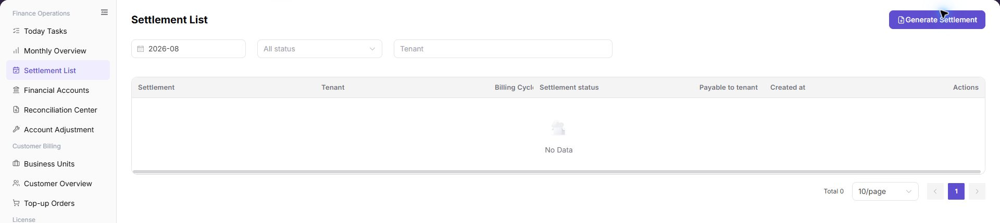

# Settlement List

::: info Document Information
Version: v1.0
Updated: 2026-08-27
:::

## Feature Overview

| Item | Content |
| --- | --- |
| Applicable Role | Operations administrator |
| Navigation path | Billing > Finance Operations > Settlement List |
| Page route | `/billing/admin/provider-settlements` |
| Managed objects | Settlement statements, tenants, billing cycles, settlement status, payable amount, and posting confirmation |

`Settlement List` is used to search, generate, and track tenant settlement statements. Billing operators can filter settlement statements by billing cycle, status, and tenant, open details to verify amount, status, and posting confirmation, and start the settlement generation flow from this page.

#### Beginner Explanation

Settlement List is like a settlement work order pool. Each settlement statement usually represents one tenant in one billing cycle. Operators use the statement status to understand whether it has been generated, is waiting for posting confirmation, has been settled, or has failed.

Settlement List is not a complete finance backend. It provides entries for viewing, generating, and tracking settlement statements. Amounts, status, and posting confirmation should be cross-checked with [Monthly Overview](../monthly-overview/), [Financial Accounts](../financial-accounts/), and [Reconciliation Center](../reconciliation-center/).

#### Terms Quick Reference

| Term | Meaning | Handling tip |
| --- | --- | --- |
| Settlement statement | A settlement record for an tenant in a billing cycle. | Open details to verify amount and status. |
| Billing Cycle | The month or settlement period of the statement. | Keep it consistent with Monthly Overview. |
| Posting confirmation | The finance-side status for confirming whether funds have been posted. | Check Financial Accounts if it remains unchanged for a long time. |
| Payable amount | The amount payable to the tenant in the current settlement statement. | Cross-check it with Monthly Overview and account flows. |
| Settlement status | The processing stage of the settlement statement. | Decide the next action based on status. |
| Generation Checks | Pre-generation checks before creating settlement statements. | Do not submit repeatedly when checks fail. |
| Settlement Preview | Preview of settlement scope and amount before submission. | Verify tenant and billing cycle again before submitting. |

## Prerequisites

1. The current account can access `Finance Operations > Settlement List`.
2. The target billing cycle, tenant, or settlement status has been confirmed.
3. Before generating a settlement statement, statistics for the target billing cycle have been completed.
4. The current account has permission to generate settlement statements when generation is required.
5. For exception handling, the account can access Monthly Overview, Financial Accounts, and Reconciliation Center.

## Page Description

The page includes the `Generate Settlement` button, filters, settlement table, detail entry, and pagination.

| Area | Description |
| --- | --- |
| Generate Settlement | Generate settlement statements for eligible billing cycles and tenants. |
| Billing Cycle filter | Filter settlement statements by monthly billing cycle. |
| Status filter | Filter by all statuses or a specified settlement status. |
| Tenant filter | Search settlement statements by tenant keyword. |
| Settlement table | Shows settlement statement, tenant, billing cycle, settlement status, payable amount, created time, and actions. |
| Details | Opens settlement statement details to verify status, amount, and posting confirmation. |

The following screenshot shows settlement list.

The following screenshot shows settlement details.

#### Where to Look First

| Your Goal | Start Here | Next Step |
| --- | --- | --- |
| Review overall billing-period settlement | [Monthly Overview](../monthly-overview/) | Confirm whether billing-period statistics are complete. |
| Find a tenant settlement statement | Settlement List | Search by billing period, status, and tenant. |
| Check fund transactions | [Financial Accounts](../financial-accounts/) | Compare account transactions and posting status. |
| Investigate settlement exceptions | [Reconciliation Center](../reconciliation-center/) | Review unmatched transfers or missing revenue details. |
| Review document details | Settlement details | Check amount, status, and posting confirmation. |

#### Status Quick Reference

| Status | Meaning | Next action |
| --- | --- | --- |
| Generated | The settlement statement has been generated. | Open details and verify the amount. |
| Posting confirmation | The statement is waiting for posting or finance confirmation. | Check Financial Accounts and Reconciliation Center. |
| Settled | The settlement flow has completed. | Archive or continue downstream reconciliation. |
| Failed | Generation, posting, or settlement is abnormal. | Open details and investigate in Reconciliation Center. |

#### Completion Checks

| Check Item | Success Signal | If Abnormal |
| --- | --- | --- |
| Page access | The `Finance Operations > Settlement List` page opens and data loads normally. | Check role permissions and refresh the page. |
| Filter result | The list changes according to the selected filters. | Reset filters and search again. |
| Record detail | Details, status, amount, permission, or configuration values are visible. | Confirm the record scope and permissions. |
| Follow-up path | Related pages or dialogs can be opened from visible entries. | Return to the sidebar and enter the downstream page directly. |

## Main Operations

### View Settlement Statements

1. Go to `Billing > Finance Operations > Settlement List`.
2. Filter by billing period, provider, statement number, status, or generation time.
3. Check the target billing period, amount direction, status, and update time.
4. If no record is returned, reset filters and check the billing period. Redact settlement data before sharing.

Use the following operations to search, view, and generate settlement statements. Complete view-only checks before opening dialogs that may create, save, submit, confirm, or delete data.

The image shows the page entry or current state for this operation. Verify the page title, target record, and visible actions.

### View Settlement Statement Details

1. Find the target settlement statement in the table.
2. Click **"Details"** in the row.
3. Verify the settlement statement, tenant, billing period, status, amount, and posting confirmation.
4. If the status or amount is abnormal, return to the list, record the billing period, tenant, and sanitized settlement statement number, and investigate in Reconciliation Center.

The following screenshot shows settlement details. Use it to verify the billing period, tenant, status, amount, and posting information.

### Generate Settlement

#### Pre-operation Checks

Before generating a settlement statement, confirm that:

1. Statistics for the target billing cycle have been completed.
2. The target tenant scope has been confirmed.
3. No obvious exception exists in `Monthly Overview`.
4. `Financial Accounts` and `Reconciliation Center` have no blocking exceptions.
5. The current account has permission to generate settlement statements.

#### Steps

6. Go to `Billing > Finance Operations > Settlement List`.
7. Click **"Generate Settlement"**.
8. Select the target `Billing Cycle` and `Tenant`.

   The following screenshot shows selecting billing cycle and tenant. Use it to specify the settlement scope.

   

9. Review `Generation Checks` and confirm that no blocking exception exists.

   The following screenshot shows generation checks before settlement submission.

   

10. Review `Settlement Preview`, including tenant, billing cycle, payable amount, and settlement status.

   The following screenshot shows settlement preview before generation.

   

11. Enter only desensitized processing notes in `Remark`. Do not write real bank accounts, contract numbers, customer-sensitive information, or internal handling comments.

   The following screenshot shows the remark step.

   

12. After submission, return to the settlement list and search by billing cycle and tenant.
13. Click **"Details"** to confirm settlement status, amount, and posting confirmation information.

#### Risk Notes

- Do not generate settlement statements before billing-cycle data is verified.
- Do not repeatedly generate statements for the same tenant and billing cycle.
- If generation fails, check generation checks, settlement details, or Reconciliation Center before retrying.
- `Submit` is a high-risk final action.
- Do not record real bank accounts, contract numbers, customer names, settlement statement numbers, internal transaction numbers, approval comments, accounts, tokens, or keys.

## Parameter Quick Reference

| Field Name | Required | Field Type | Example | Description |
| --- | --- | --- | --- | --- |
| Settlement Statement | System-generated | Text | `SETTLE-202606-ORG001` | Settlement statement name or identifier used to locate a specific record. |
| Tenant | System-generated | Text | `Example Tenant A` | Tenant that owns the settlement statement. |
| Billing Cycle | System-generated / Required in generation | Month | `2026-06` | Billing cycle to which the settlement belongs. |
| Settlement Status | System-generated | Enum | `Posting confirmation` | Current processing stage of the settlement statement. |
| Payable Amount | System-generated | Amount | `12,345.67 credits` | Amount payable to the tenant in the current settlement statement. |
| Created At | System-generated | Date and time | `2026-07-08 10:00` | Time when the settlement statement was generated. |
| Generate Settlement | No | Operation entry | `Generate Settlement` | Opens the settlement generation flow. |
| Generation Checks | System-generated | Check result | `Passed` | Shows prerequisite checks for billing cycle, tenant, and data completeness. |
| Settlement Preview | System-generated | Preview information | `Payable amount 12,345.67 credits` | Shows tenant, billing cycle, amount, and settlement status before submission. |
| Remark | No | Text | `Example processing note` | Records desensitized processing notes. Do not include sensitive finance or customer information. |
| Submit | No | High-risk button | `Submit` | Confirms generation for the selected billing cycle and tenant scope. |
| Details | System-generated | Operation entry | `Details` | Opens settlement statement details to verify status, amount, and posting confirmation. |

## Pitfalls

- Do not rely on one amount field alone for financial confirmation; cross-check transactions, bills, settlement statements, and reconciliation results.
- Do not repeat high-risk billing operations when the first attempt fails; check status and error details first.
- Remove sensitive customer, bank, contract, token, Key, or internal processing information before sharing screenshots or tickets.
- `Generate Settlement` affects the real billing-cycle settlement flow.
- `Submit` is a high-risk final action.
- If generation fails, investigate Generation Checks, settlement details, or Reconciliation Center first. Do not submit repeatedly.
- Do not record real bank accounts, contract numbers, customer names, settlement statement numbers, internal transaction numbers, approval comments, accounts, tokens, or keys.

## Result Validation

| Check Item | Success Signal | If Abnormal |
| --- | --- | --- |
| Statement visible | The target settlement statement can be found by billing period, status, or tenant. | Open statement details. |
| Amount verified | The payable tenant amount matches Monthly Overview. | Open Financial Accounts and check transactions. |
| Status traceable | The status is Generated, Posting Confirmation, Settled, or Failed. | Continue according to the current status. |
| Details available | Details show the amount, tenant, and posting information. | Continue reconciliation or archive the record. |
| Exception path available | Failed or long-running statuses have a clear investigation path. | Open Reconciliation Center. |
| Generated record | After generation, the target statement can be searched by billing cycle and tenant. | Check Generation Checks and failure reason. |

## FAQ

#### The Target Settlement Statement Cannot Be Found

**Symptom:** The list does not show the target statement after a search by billing period or tenant.

**Possible causes:** The billing period is incorrect, the status filter is too narrow, or no statement has been generated for the tenant.

**Resolution:**

1. Click **"Reset"** to clear the filters.
2. Select the billing period again and search.
3. Return to Monthly Overview and confirm that statistics are complete for the billing period.
4. Generate a statement only after the pre-operation checks confirm that one is required.

#### Settlement Status Has Not Changed for a Long Time

**Symptom:** The statement remains Processing or Posting Confirmation for a long time.

**Possible causes:** Posting confirmation is incomplete, downstream account processing is delayed, or an exception requires operator handling.

**Resolution:**

1. Open settlement details and review status information.
2. Open Financial Accounts and check account transactions and posting status.
3. Open Reconciliation Center and check for unmatched transfers or missing revenue details.

#### Generate Settlement Is Unavailable

**Symptom:** The button cannot be selected or does not open the generation flow.

**Possible causes:** The current account lacks permission, billing-period statistics are incomplete, or current page state does not meet generation conditions.

**Resolution:**

1. Confirm that the current account has finance-operations generation permission.
2. Return to Monthly Overview and check billing-period statistics.
3. Clear the filters, refresh, and open the generation flow again.

#### The Settlement Amount Is Unexpected

**Symptom:** The payable tenant amount differs from the expected amount or Monthly Overview.

**Possible causes:** The billing period, tenant, or settlement definition differs; statistics are incomplete; or unmatched transfers, missing revenue details, or account exceptions exist.

**Resolution:**

1. Confirm that the statement and Monthly Overview use the same billing period and tenant.
2. Open Financial Accounts and check account transactions.
3. Open Reconciliation Center and review exception items.
4. Do not archive or deliver the statement to Finance until the difference is resolved.

#### Settlement Generation Fails

**Symptom:** Submission fails or the statement status is Failed.

**Possible causes:** Generation checks found a blocking exception, billing-period or tenant data is incomplete, or a statement already exists for the same tenant and billing period.

**Resolution:**

1. Review generation checks and the failure message.
2. Open Reconciliation Center and investigate unmatched transfers, missing revenue details, or other exceptions.
3. Confirm that no duplicate statement exists before starting generation again.
4. Do not select the generation action repeatedly.

#### Can a Settlement Statement Be Generated Repeatedly?

**Symptom:** A statement already exists for the tenant and billing period, and the operator is unsure whether another can be generated.

**Possible causes:** Generation rules are unclear, the existing statement has an abnormal status or amount, or pre-generation checks are incomplete.

**Resolution:**

1. Search for the existing statement by billing period and tenant.
2. Open details and confirm its status and amount.
3. If correction is required, check Monthly Overview, Financial Accounts, and Reconciliation Center first.
4. Do not generate another statement for the same tenant and billing period until the rule and required action are confirmed.

## Notes

- Billing amounts, settlements, balances, and customer information are sensitive. Desensitize them before sharing.
- Keep page routes, API fields, Key, AK/SK, License, and other product terms in their UI form.
- Do not record real bank accounts, contract numbers, customer names, settlement statement numbers, internal transaction numbers, approval comments, accounts, tokens, or keys in the manual, screenshots, notes, or tickets.

## Next Steps

1. Open [Monthly Overview](../monthly-overview/) to review overall billing-period status.
2. Open [Financial Accounts](../financial-accounts/) to check fund transactions.
3. Open [Reconciliation Center](../reconciliation-center/) when a financial exception exists.
4. Archive settled statements through the internal process or deliver them to Finance for confirmation.
5. Investigate failed, long-running, or amount-mismatch statements before any follow-up action.
