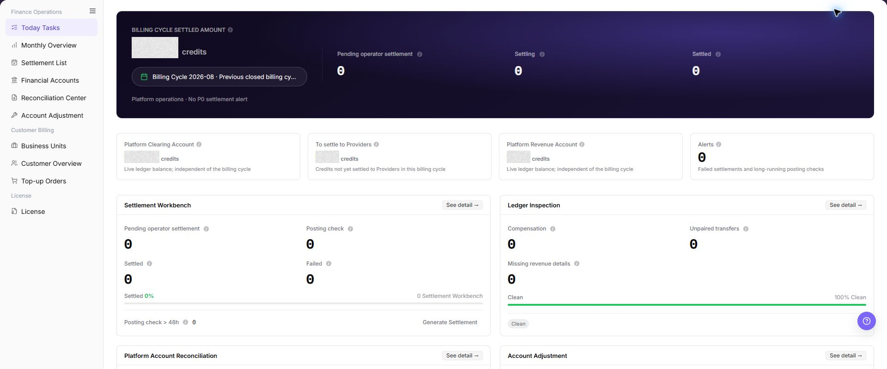

# Today Tasks

::: info Document Information
Version: v1.0
Updated: 2026-08-27
:::

## Feature Overview

| Item | Content |
| --- | --- |
| Applicable Role | Operations administrator |
| Navigation path | Billing > Finance Operations > Today Tasks |
| Page route | `/billing/admin/tasks` |
| Managed objects | Billing cycle, settlement tasks, platform accounts, alert items, and downstream cards |

`Today Tasks` is the finance operations workbench for viewing the current billing cycle settled amount, settlement progress, platform account status, alert items, and downstream processing entries.

#### Beginner Explanation

Today Tasks is like the daily finance operations desk. Check the top metrics first to understand the billing cycle and account status, then use the four downstream cards to decide whether to review settlement, reconciliation, account records, or adjustment processing.

#### Terms Quick Reference

| Term | Meaning | Handling tip |
| --- | --- | --- |
| Today Tasks | Summary of billing items that need attention in the current billing cycle. | Check counts first, then open downstream details. |
| Task type | Settlement, reconciliation, platform account check, adjustment, and similar task categories. | Use the type to choose the next page. |
| Processing status | Awaiting Execution, Settling, Settled, and similar settlement states. | Open settlement or reconciliation details when status looks abnormal. |
| Alert Items | Failed settlement, long posting check, or other risks that need attention. | Prioritize alerts instead of checking amount only. |
| Downstream card | Card entry for Settlement Workbench, Billing Reconciliation, Platform Account Reconciliation, or Account Adjustment. | Open only after confirming the billing cycle and scope. |

## Prerequisites

1. The current account can access `Finance Operations > Today Tasks`.
2. The billing cycle and operation scope to review have been confirmed.
3. If settlement generation, adjustment, cleanup, compensation, or rebuild actions may be needed, the approval basis and impact scope have been prepared.

## Page Description

The page is composed of billing-cycle metrics, platform account metrics, alert items, and downstream task cards.

| Area | Description |
| --- | --- |
| Billing Cycle Settled Amount | Displays the settled amount in the selected billing cycle. |
| Settlement progress metrics | Displays Awaiting Execution, Settling, Settled, and similar state counts. |
| Platform account metrics | Displays Platform Clearing Account, Payable to Provider, Platform Revenue Account, and related amounts. |
| Alert Items | Displays failed settlement, long posting check, or other items that require attention. |
| Settlement Workbench | Opens settlement processing and may expose Generate Settlement. |
| Billing Reconciliation | Opens compensation queue, unpaired transfers, and revenue detail rebuild checks. |
| Platform Account Reconciliation | Displays clearing account difference and platform retained fee. |
| Account Adjustment | Displays adjustment capability status and processing entry. |

The following screenshot shows today tasks list.

## Main Operations

### Prioritize Today's Tasks

1. Go to `Billing > Finance Operations > Today's Tasks`.
2. Filter by task type, status, owner, due time, or anomaly severity.
3. Check pending, in-progress, overdue, and abnormal task counts.
4. If no task is returned, reset filters and check the date. Prioritize by due time and business impact without bypassing approval.

Use the following operations to work with today tasks records and related status. Complete view-only checks before opening dialogs that may create, save, submit, activate, transfer, settle, publish, or delete data.

The image shows the page entry or current state for this operation. Verify the page title, target record, and visible actions.

### View Today Tasks Overview

1. Go to `Billing > Finance Operations > Today Tasks`.
2. Check `Billing Cycle Settled Amount`, the current billing cycle, and platform operation notice.
3. Review settlement progress metrics such as `Awaiting Execution`, `Settling`, and `Settled`.
4. Review `Platform Clearing Account`, `Payable to Provider`, `Platform Revenue Account`, and `Alert Items`.
5. Review the downstream cards: `Settlement Workbench`, `Billing Reconciliation`, `Platform Account Reconciliation`, and `Account Adjustment`.

The image shows the page entry or current state for this operation. Verify the page title, target record, and visible actions.

### Open a Task Processing Page

1. In the `Settlement Workbench`, `Billing Reconciliation`, `Platform Account Reconciliation`, or `Account Adjustment` card, click **"See Detail"**.
2. Continue filtering, viewing details, or checking exceptions on the downstream page.
3. If settlement generation or adjustment is required, confirm the billing period, tenant, amount, and approval basis before any final action.

The image shows the page entry or current state for this operation. Verify the page title, target record, and visible actions.

## Parameter Quick Reference

| Field Name | Required | Field Type | Example | Description |
| --- | --- | --- | --- | --- |
| Billing Cycle Settled Amount | System-generated | Amount | `0.00 credits` | Settled amount summary in the current billing cycle. |
| Awaiting Execution | System-generated | Number | `0` | Settlement tasks that still need operator execution. |
| Settling | System-generated | Number | `0` | Settlement tasks that are in progress. |
| Settled | System-generated | Number | `0` | Settlement tasks that have been completed. |
| Platform Clearing Account | System-generated | Amount | `0.00 credits` | Live ledger balance of the platform clearing account. |
| Payable to Provider | System-generated | Amount | `0.00 credits` | Amount not yet settled to providers in the current billing cycle. |
| Platform Revenue Account | System-generated | Amount | `0.00 credits` | Platform retained revenue account balance. |
| Alert Items | System-generated | Number | `0` | Failed settlements, long posting checks, or similar alert items. |
| Settlement Workbench | System-generated | Card entry | See detail / Generate Settlement | Opens settlement processing and settlement generation entry. |
| Billing Reconciliation | System-generated | Card entry | See detail / Clean | Opens compensation queue, unpaired transfers, and revenue detail rebuild checks. |
| Platform Account Reconciliation | System-generated | Card entry | See detail | Opens clearing account difference and retained fee checks. |
| Account Adjustment | System-generated | Card entry | See detail | Opens adjustment impact assessment, submit rule, audit trail, and processing entry. |

## Pitfalls

- Do not rely on one amount field alone for financial confirmation; cross-check transactions, bills, settlement statements, and reconciliation results.
- Do not repeat high-risk billing operations when the first attempt fails; check status and error details first.
- Remove sensitive customer, bank, contract, token, Key, or internal processing information before sharing screenshots or tickets.
- `Generate Settlement` affects the real billing-cycle settlement flow. Confirm billing cycle, tenant, amount, and approval basis before execution.
- `Account Adjustment` involves financial correction and is irreversible after submission.
- Cleanup, compensation, and rebuild actions require billing cycle, tenant, amount, and approval evidence before execution.

## Result Validation

| Check Item | Success Signal | If Abnormal |
| --- | --- | --- |
| Billing-period metrics | The page shows the current billing period and related billing metrics. | Refresh the page and confirm billing-period permissions. |
| Task cards | Each task card shows its status count and description. | Open the related feature page and review details. |
| Quick entry points | Card entry points open the related settlement, reconciliation, account, or adjustment page. | Check menu permissions and link configuration. |

## FAQ

#### Today Tasks Shows Pending Items

**Symptom:** Awaiting settlement, compensation, unmatched transfer, or alert counts are not zero.

**Possible causes:** Settlement has not advanced, reconciliation found an exception, or posting confirmation exceeded the expected duration.

**Resolution:**

1. Click **"See Detail"** on the related card.
2. Filter the destination page by billing period, tenant, or status.
3. Follow the page guidance and confirm approval before any fund-changing action.

#### Metric Amounts Are Unexpected

**Symptom:** Platform Clearing Account, Payable to Provider, or Platform Revenue Account differs from expectations.

**Possible causes:** The selected billing period is incorrect, new transactions or settlement tasks are incomplete, or reconciliation and adjustment records affect balances.

**Resolution:**

1. Open Monthly Overview and confirm the billing period.
2. Open Financial Accounts and review account trends and transactions.
3. If an exception exists, continue in Reconciliation Center or Account Adjustment.

#### A Quick Entry Point Does Not Open

**Symptom:** `See Detail` does not open Settlement List, Reconciliation Center, Financial Accounts, or Account Adjustment.

**Possible causes:** The current account lacks permission, the session expired, or the browser blocked navigation or page loading failed.

**Resolution:**

1. Refresh the page and select the entry point again.
2. Confirm that the current account can access the destination page.
3. If navigation still fails, record the entry-point name and billing period and ask an administrator to check menu configuration.

#### Alert Counts Do Not Decrease

**Symptom:** Failed settlements, long posting confirmations, or reconciliation exceptions remain unchanged.

**Possible causes:** Exception tasks are untreated, background reconciliation or settlement tasks are still running, or the current billing-period data was not refreshed after handling.

**Resolution:**

1. Open the related details page and review exception type and status.
2. Confirm whether settlement, compensation, rebuild, or adjustment is required.
3. After handling completes, return to Today Tasks and refresh the data.

#### A Completed Task Appears Again

**Symptom:**

The same or a similar item appears again in Today Tasks after handling.

**Possible causes:**

- The upstream issue was not fully closed.
- The task was regenerated for a new billing cycle or object.
- The page has not refreshed to the latest status.

**How to handle:**

1. Compare task type, billing cycle, object, and generation time.
2. Open the processing page and confirm the upstream status.
3. Refresh Today Tasks and compare the task identifier.
4. If it is a duplicate exception, provide authorized personnel with desensitized clues.
## Notes

- Billing amounts, settlements, balances, and customer information are sensitive. Desensitize them before sharing.
- Keep page routes, API fields, Key, AK/SK, License, and other product terms in their UI form.
- Do not record real accounts, emails, tenant IDs, billing-cycle amounts, transaction numbers, tokens, or internal processing parameters in the manual, screenshots, notes, or tickets.

## Next Steps

1. Open [Monthly Overview](../monthly-overview/) to advance month-end settlement.
2. Open [Settlement List](../settlement-list/) to review settlement status.
3. Open [Financial Accounts](../financial-accounts/) to check platform accounts.
4. Open [Reconciliation Center](../reconciliation-center/) to investigate exceptions.
