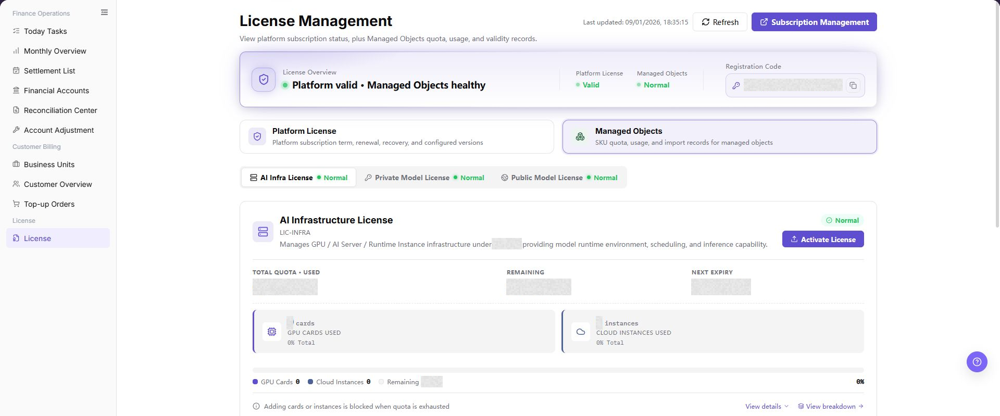

# License

::: info Document Information
Version: v1.0
Updated: 2026-08-27
:::

## Feature Overview

| Item | Content |
| --- | --- |
| Applicable Role | Operations administrator |
| Navigation path | Billing > License > License |
| Page route | `/user/usercenter/license/managed-objects` |
| Managed objects | Registration code, activation code, AI infrastructure authorization, authorized quota, and validity period |

`License Management` is used to view the current instance license state, registration code, license categories, AI infrastructure authorization, authorized quota, and validity period. It also supports activating authorization by using an activation code. Operators use this page to confirm whether the platform authorization is valid, whether quota is sufficient, and whether the current instance can continue using AI infrastructure capabilities.

#### Beginner Explanation

License Management works like the authorization center for a platform instance. The registration code identifies the current instance, and the activation code writes authorization into that instance. After activation, the page shows authorization state, validity period, total quota, used quota, and remaining quota.

#### Terms Quick Reference

| Term | Meaning | Handling tip |
| --- | --- | --- |
| Registration Code | Authorization identifier generated for the current platform instance. | Copy it completely and do not expose it in public materials. |
| Activation Code | Authorization credential returned by License support based on the registration code. | It is usually bound to the current instance and should not be reused across environments. |
| AI Infrastructure Authorization | License authorization area for AI Infra capabilities. | Confirm the target environment and instance before activation. |
| Authorized Quota | Resource quota allowed by the License. | Check total quota, used quota, and remaining quota. |
| Validity Period | Effective and expiry period of the License. | Renew before expiry. |

#### Applicable Scenarios

- The platform is deployed for the first time and needs a registration code and activation code.
- AI infrastructure authorization is inactive, expired, or insufficient and needs activation or renewal.
- Operators need to verify authorization state, validity period, total quota, used quota, and remaining quota.
- Operators need to submit a desensitized activation request to License support.

#### Flow Overview

| Step | Description |
| --- | --- |
| Get Registration Code | Copy the current instance registration code from `License Management`. |
| Send Registration Code and Get Activation Code | Send the registration code and required application information to License support. |
| Activate AI Infrastructure Authorization | Enter the activation code in `AI Infrastructure Authorization` and click **"Activate"**. |
| Verify Activation Result | Refresh the page and verify authorization state, validity period, and quota. |

## Prerequisites

1. The current account can access `License > License`.
2. The current page belongs to the target environment and target instance.
3. Required approval for License activation has been completed when activation is needed.
4. The browser is logged in to the platform and the session has not expired.

::: warning Security Reminder
Registration codes and activation codes are sensitive credentials. Do not expose complete registration codes, activation codes, License file content, login credentials, Token, or Key in public documents, screenshots, tickets, chats, or comments.
:::

## Page Description

The page shows platform state, license categories, managed object authorization information, registration code, and activation entry. License categories may include AI Infrastructure Authorization, Private Model Authorization, and Public Model Authorization. Use the actual page display as the source of truth.

#### Import Records

`Import Records` show License activation or import history, usually including record identifier, quota, effective time, expiry time, state, and current active marker. When troubleshooting authorization issues, first check whether the corresponding activation result appears in import records.

#### View Details

`View Details` shows license type description, applicable objects, controlled objects, and metering description. Before confirming activation scope, verify that details match the target authorization type.

#### View Composition

`View Composition` shows authorized quota composition, current active licenses, and quota source. When quota is abnormal, check composition before contacting an administrator or License support.

Page screenshot:

The image shows the page entry or current state for this operation. Verify the page title, target record, and visible actions.

## Main Operations

### View Licenses

1. Go to `Billing > License > License`.
2. Filter by license name, product, status, licensed object, or expiration time.
3. Open details and check scope, effective time, expiration, usage limits, and current status.
4. If no record is returned, reset filters. Do not share license files or authorization identifiers.

The image shows the page entry or current state for this operation. Verify the page title, target record, and visible actions.

### Check Expiration and Capacity Risk

1. Sort by expiration or remaining capacity to locate licenses that are expiring or near their limit.
2. Compare the licensed object and usage scope with the actual product and tenant.
3. A healthy license should have sufficient validity and capacity. For a risk, record a redacted identifier and start the renewal or expansion process.
4. Do not upload, replace, disable, or delete a license during read-only validation.

The image shows the page entry or current state for this operation. Verify the page title, target record, and visible actions.

### Manage Licenses

#### Get Registration Code

1. Log in to the platform.
2. Go to `License > License`.
3. Review platform state, license categories, and managed object authorization information.
4. Find `Registration Code` on the `License Management` page.
5. Copy the complete registration code.
6. Check whether the registration code is complete, with no missing characters, extra spaces, or truncated line breaks.
7. Do not expose the registration code in documents, screenshots, tickets, or chats.

#### Send Registration Code and Get Activation Code

8. Send the registration code to License support through an offline channel or email according to the internal process.
9. Example email: `<ACCOUNT_EMAIL>`.
10. The email should include registration code, company or tenant name, contact person, contact method, and activation scenario.
11. Before sending, confirm recipient, environment, instance, and activation scenario.
12. After receiving `Activation Code`, do not write it into public documents or screenshots.

#### Activate AI Infrastructure Authorization

13. Return to `License > License`.
14. Find `AI Infrastructure Authorization`.
15. Click **"Activate License"**.
16. In the activation window, find the `Activation Code` input field.
17. Paste the activation code.
18. Verify that the activation code is complete, with no missing characters, extra spaces, or truncated line breaks.
19. Click the final `Activate`.
20. Wait for the page to return the activation result.

#### Verify Activation Result

21. Refresh the `License > License` page.
22. Confirm whether `AI Infrastructure Authorization` is activated or valid.
23. Check whether expiry time or validity period is displayed.
24. Check whether total quota, used quota, and remaining quota are displayed.
25. Confirm that the page shows no error message.
26. If the state is not updated, refresh the page and check import records before resubmitting the same activation code.

## Parameter Quick Reference

| Field Name | Required | Field Type | Example | Description |
| --- | --- | --- | --- | --- |
| Registration Code | System generated | Text | Not displayed | Authorization identifier of the current instance. Do not publicly record the complete value. |
| Activation Code | Required for activation | Text | Not displayed | Activation credential returned by License support based on the registration code. |
| AI Infrastructure Authorization | System generated | Authorization area | `AI Infrastructure Authorization` | Authorization area for AI Infra capabilities. |
| Activate License | No | Button | `Activate License` | Opens the License activation window. |
| Activate | Required for activation | Final action button | `Activate` | Submits the activation code and affects the current instance authorization state. |
| Validity Period | System generated | Time range | `2026-07-10 to 2027-07-10` | Effective and expiry period of the License. |
| Authorized Quota | System generated | Number | `100` | Resource quota granted by the License. |
| Total Quota | System generated | Number | `100` | Total available quota for the current authorization dimension. |
| Used Quota | System generated | Number | `20` | Currently consumed quota. |
| Remaining Quota | System generated | Number | `80` | Currently remaining available quota. |

## Pitfalls

- Registration codes and activation codes are sensitive credentials and must not be written into public documents, screenshots, tickets, or chats.
- Activation codes are usually bound to the current instance registration code and cannot be reused across environments.
- Authorized quota is not the same as billing balance. It controls resource permission and capacity scope, while billing balance is checked in billing account and transaction pages.
- Clicking `Activate` affects the current instance authorization state.
- Before activation, confirm that the current page belongs to the target environment and target instance.
- If the state is not updated, refresh the page and check import records before resubmitting the same activation code.
- Do not record complete registration codes, activation codes, License file content, login credentials, Token, or Key.

## Result Validation

| Check Item | Success Signal | If Abnormal |
| --- | --- | --- |
| Authorization state | `AI Infrastructure Authorization` shows activated or valid. | Refresh the page and check import records. |
| Validity period | Correct expiry time or validity period is displayed. | Confirm whether the activation code matches the current instance. |
| Quota information | Total quota, used quota, and remaining quota are visible and expected. | Check authorization composition and contact an administrator. |
| Error message | No activation error message appears on the page. | Record desensitized error information and contact License support. |

## FAQ

#### Registration Code is not visible

The `Registration Code` is not visible after entering the page.

**How to check:**

1. Confirm that the current account has License view permission.
2. Refresh the page and re-enter `License > License`.
3. Confirm whether the current environment and instance are correct.

#### Activation Code is invalid

The page reports that the activation code is invalid or verification failed after clicking `Activate`.

**How to check:**

1. Confirm whether the activation code was copied completely.
2. Confirm whether the activation code matches the current instance registration code.
3. Do not repeatedly try unknown activation codes. Contact License support for verification.

#### State does not update after activation

Authorization state, validity period, or quota does not change after activation.

**How to check:**

1. Refresh the page and check import records.
2. Confirm whether the current page belongs to the target environment and target instance.
3. If it is still not updated, contact an administrator with desensitized time, page path, and error message.

#### License status shows expired

Authorization state shows expired, or remaining quota is unavailable.

**How to check:**

1. Contact an administrator to confirm renewal or expansion plans.
2. Activate again after obtaining a new activation code.
3. Complete renewal before business is affected.

#### Resources Remain Unavailable Although License Quota Is Sufficient

**Symptom:**

License quota and validity are normal, but the target resource or module is still unavailable.

**Possible causes:**

- Resource quota, permission, or status is abnormal.
- License status has not synchronized to the target module.
- The issue concerns billing balance or resource capacity rather than authorization quota.

**How to handle:**

1. Confirm License type, validity, status, and covered resource scope.
2. Check quota, permission, and runtime status on the target resource page.
3. Separate authorization quota, billing balance, and actual resource capacity.
4. If the cause remains unclear, provide the desensitized License type, status, and target module information.
## Notes

- Registration codes, activation codes, License file content, login credentials, Token, and Key must not be written into documents, screenshots, tickets, or chats.
- `Activate` is a high-risk final action. Before clicking it, confirm environment, instance, registration code, and activation code source.
- The current page does not provide a `Delete License` entry. Do not invent a deletion flow.
- If the License is expired or quota is exhausted, contact an administrator for renewal before resources become unavailable.

## Next Steps

- After confirming License state, continue verifying resource availability in `AI Infra` or `Model and AI Services`.
- When handling License exceptions, provide desensitized page path, time, and error message to an administrator or License support.
