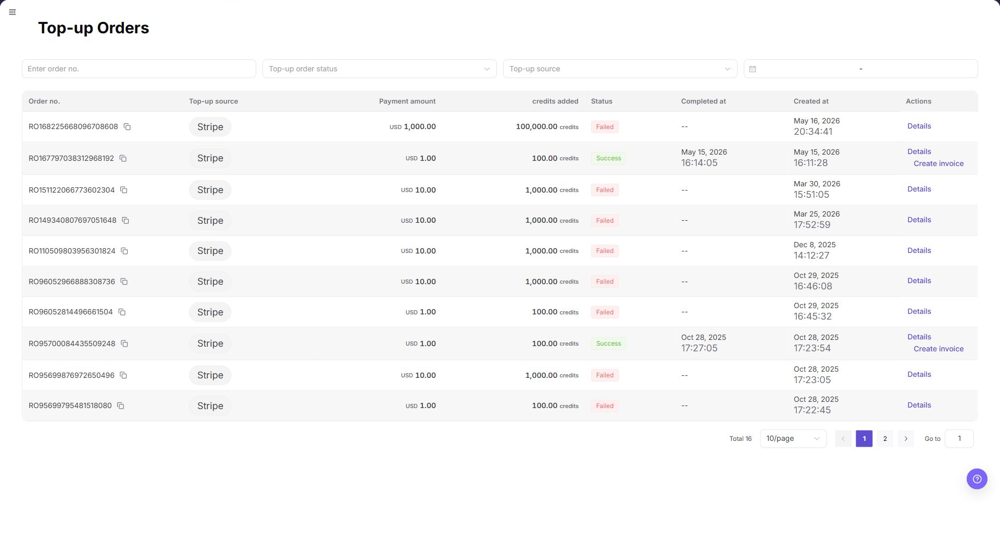

# Top-up Orders

::: info Document Information
Version: v1.0
Updated: 2026-08-27
:::

## Feature Overview

| Item | Content |
| --- | --- |
| Applicable Role | Model caller |
| Navigation path | Billing > User Billing > Top-up Orders |
| Page route | `/billing/my/top-ups/orders` |
| Managed objects | Top-up orders, credit sources, top-up amounts, credited amounts, and order states |

`Top-up Orders` displays top-up records initiated by or associated with the current account, including order number, credit source, top-up amount, credited amount, order state, completion time, creation time, and details. Locate a top-up by order number, state, or credit source to confirm whether processing completed.

#### Beginner Explanation

A top-up order works like a receipt. It shows which top-up was submitted, whether it was credited, and where to troubleshoot a failure. If the balance did not change, first confirm that the order succeeded, then check whether the credited amount produced an income transaction.

#### Terms Quick Reference

| Term | Meaning | Handling Tip |
| --- | --- | --- |
| Top-up Order Number | Order identifier created after a user initiates a top-up. | Use a sanitized number for exact search. |
| Credit Source | Funding source or payment channel for the top-up. | Reconcile it with Transactions. |
| Top-up Amount | Amount the user requested to add. | Distinguish it from the payment result and credited amount. |
| Credited Amount | Credits or amount added after the top-up completes. | Synchronization may still be delayed after success. |
| Order State | Processing, completed, failed, or canceled state. | Open details for an abnormal state. |

## Prerequisites

1. The current account has permission to view user-side billing.
2. Open `My Billing > Top-up Orders`.
3. Prepare an order number, order state, or credit source before searching.
4. Before retrying, refunding, or handling an exception, confirm the order state and payment result.

::: warning High-risk Operation Boundary
Top-ups, refunds, repayment, and order exports may affect real funds or expose sensitive information. This page explains query and view boundaries only; it does not guide real submission.
:::

## Page Description

The page contains filters and an order list. Filter by `Top-up Order Number`, `Top-up Order State`, or `Credit Source`, then use `Search`, `Reset`, or `Expand`. The table shows order number, credit source, top-up amount, credited amount, state, completion time, creation time, and `Details`.

The following screenshot shows Top-up Orders. Sanitize order numbers and amounts before sharing it.

| Area | Description |
| --- | --- |
| Top-up Order Number | Searches for an exact order number. |
| Order State | Filters by top-up processing state. |
| Credit Source | Filters by payment channel or credit source. |
| Search | Queries the order list with current filters. |
| Reset | Clears filters and restores the default list. |
| Expand | Shows additional filters. |
| Order List | Displays order number, source, amounts, state, completion time, creation time, and operation. |
| Details | Opens top-up order details. |

## Main Operations

### Reconcile a Top-up Order with Account Transactions

1. Open the target order details and record a redacted order number, status, and completion time.
2. Open Transactions and locate the corresponding posting in the same time range.
3. The order status, posted amount direction, and transaction time should be mutually traceable.
4. If they differ, check payment status and refresh time. Do not create another top-up or supplemental order.

The image shows the page entry or current state for this operation. Verify the page title, target record, and visible actions.

### Query Top-up Orders

1. Go to `Billing > User Billing > Top-up Orders`.
2. Enter `Top-up Order Number` or select an order state and credit source.
3. Click **"Search"**.
4. Review top-up amount, credited amount, and state in the order list.
5. Click **"Reset"** to clear filters when needed.
6. Before exporting orders, verify the filters, data scope, and recipient permission.

The image shows the page entry or current state for this operation. Verify the page title, target record, and visible actions.

### View Order Details

1. Go to `Billing > User Billing > Top-up Orders`.
2. Click **"Details"** in the target row.
3. Review order state, credit source, amounts, credited information, creation time, and completion time.
4. If the order failed or was canceled, keep a sanitized order number and contact the operator.
5. Hide real order numbers, payment transaction numbers, accounts, emails, amounts, and payment evidence in external communication.

The image shows the page entry or current state for this operation. Verify the page title, target record, and visible actions.

## Parameter Quick Reference

| Field Name | Required | Field Type | Example | Description |
| --- | --- | --- | --- | --- |
| Top-up Order Number | No | Text | Sanitized order number | Locates an individual top-up order. |
| Top-up Order State | No | Enum | `Canceled`, `Failed` | Filters orders by processing state. |
| Credit Source | No | Enum | Sanitized source | Displays or filters the top-up source. |
| Search | No | Button | `Search` | Refreshes the list using current filters. |
| Reset | No | Button | `Reset` | Clears filters. |
| Expand | No | Button | `Expand` | Shows more filters. |
| Top-up Amount | System-generated | Amount | Sanitized amount | Payment amount requested by the user. |
| Credited Amount | System-generated | Credits / amount | Sanitized amount | Credits added after top-up completion. |
| State | System-generated | Enum | `Completed` | Top-up order processing state. |
| Completion Time | System-generated | Time | Sanitized time | Time when the order completed or ended. |
| Creation Time | System-generated | Time | Sanitized time | Time when the order was created. |
| Details | No | Entry | `Details` | Opens top-up order details. |

## Pitfalls

- A successful top-up does not guarantee that Credits appear immediately; balance and transaction synchronization may be delayed.
- Order number, payment transaction number, and billing transaction number are different objects. Do not mix them during troubleshooting.
- Do not retry immediately after an order fails or is canceled; first confirm whether funds were deducted.
- Different credit sources can have different posting times and reconciliation rules.
- Do not record real accounts, emails, order numbers, transaction numbers, amounts, customer names, tenant names, Tokens, or Keys.
- Sanitize screenshots, exports, tickets, and comments.

## Result Validation

| Check Item | Success Signal | If Abnormal |
| --- | --- | --- |
| Page loading | Filters and the top-up order list are displayed. | Refresh the page or check user-side billing permission. |
| Filtering | Order number, state, and credit source locate target orders. | Click **"Reset"** and filter again. |
| List fields | Order number, source, amounts, state, and time fields are visible. | Adjust filters and retry. |
| Detail entry | Row-level `Details` opens order information. | Check permission or page loading state. |
| Funding actions controlled | Retry, refund, and order export are performed only by authorized users for the confirmed scope. | If an unintended action occurs, record the time and scope and notify the owner for review. |

## FAQ

#### A Top-up Order Cannot Be Found

**Symptom:**

The list is empty after entering an order number.

**Possible Causes:**

The order number is incorrect, too many filters are active, or the current account does not own the order.

**Solution:**

Clear filters and query again, verify the order number, and contact the operator with a sanitized number if the order is still missing.

#### The Order Failed or Was Canceled

**Symptom:**

The order state is Failed or Canceled.

**Possible Causes:**

Payment did not complete, the payment channel returned an error, the order timed out, or it was canceled.

**Solution:**

First confirm whether funds were deducted. Do not resubmit the same order. If funds were deducted but the order is abnormal, contact the operator.

#### Top-up Succeeded but the Balance Did Not Change

**Symptom:**

The order appears completed, but Account Overview did not change.

**Possible Causes:**

Posting is delayed or the current account, billing cycle, and transaction scope are inconsistent.

**Solution:**

Refresh Account Overview, then open `Transactions` and check for the income record. Contact the operator if the records remain inconsistent.

#### Top-up Orders Does Not Update After Refresh

**Symptom:**

The amount, count, or status in Top-up Orders remains unchanged after the related process finishes.

**Possible causes:**

- The billing cycle, tenant, customer, or business scope does not match the processed object.
- An upstream statistics, posting, or settlement task is still running.
- The current account can view only part of the data scope.

**How to handle:**

1. Recheck the billing cycle and object scope in Top-up Orders.
2. Refresh the page, reopen the target record, and verify the update time.
3. Cross-check the upstream status in Account Overview and Transactions.
4. If the value still does not update, provide authorized personnel with the desensitized billing cycle, object identifier, status, and update time.

#### What Must Be Checked Before Sharing Top-up Orders Information?

**Symptom:**

Top-up Orders results must be shared in a screenshot, ticket, or report.

**Possible causes:**

- Order numbers, amounts, payment channels, statuses, and accounts may be sensitive billing information.
- The sharing scope may exceed the recipient's business permission.
- A full screenshot may include account, environment, or unrelated information.

**How to handle:**

1. Keep only fields, statuses, and time ranges required for troubleshooting.
2. Use the specified light-gray opaque small-pixel mosaic only on sensitive text and values.
3. Confirm that the screenshot does not contain top-menu account data, environment information, real credentials, or internal addresses.
4. Share with the minimum required audience and record the desensitized scope.
## Notes

- Order number, payment source, amounts, and credited information are sensitive billing data and must be sanitized in screenshots and communication.
- Do not initiate another top-up before confirming the payment result.
- Refunds, repayment, order export, and abnormal posting must follow the platform process and be handled by an authorized user.
- Before retrying, refunding, or exporting, verify the target order, account permission, amount, and impact scope.

## Next Steps

1. To verify the credited transaction, open [Transactions](../transactions/).
2. To review the balance change, open [Account Overview](../overview/).
3. For monthly reconciliation, open [Monthly Bill](../monthly-bill/).
