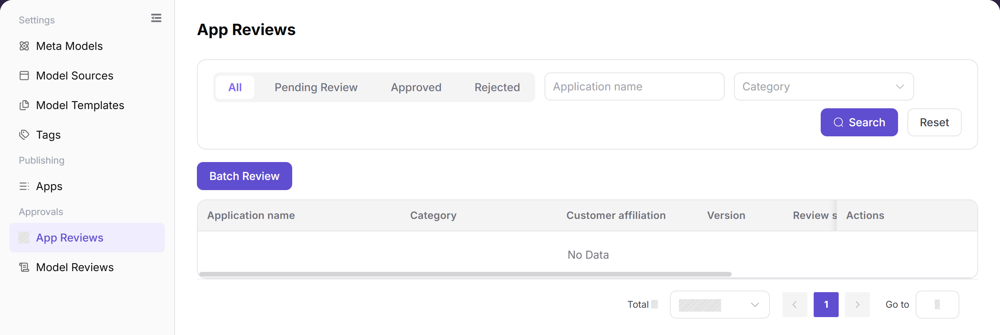

# App Reviews

::: info Document Information
Version: v1.0
Updated: 2026-08-31
:::

## Feature Overview

| Item | Content |
| --- | --- |
| Applicable Role | Operator Admin |
| Navigation path | Model Services > Approvals > App Reviews |
| Page route | `/modelone/audit/app` |
| Managed objects | App review records, app configuration, visibility scope, and review comments |

#### Beginner Explanation

App Reviews is the checkpoint before an app is shown to its intended Model Consumers. The Operator Admin checks what the app does, which models it uses, where it can be seen, and whether the submitted information is complete before making a decision.

#### Glossary

| Term | Description |
| --- | --- |
| App review record | A record created when an app submission or change enters the review process. |
| Bound model | The model or aggregation model that the app is configured to call. |
| Visibility scope | The set of customers or tenants that can see the app after publication. |
| Review comment | The explanation recorded with an approval, rejection, or request for supplementary information. |

#### Recommended Operation Sequence

1. Locate the target record with the status tabs and the filters shown on the page.
2. Open **"Details"** to compare the submitted information with the review criteria.
3. Open **"Review"**, record a clear conclusion, and then verify the resulting status.

#### Beginner Quick Choice

- To locate a record, use **"Search"** and **"Reset"**.
- To inspect a record without changing it, use **"Details"**.
- To make a decision for one record, use **"Review"**.
- To process several eligible records together, use **"Batch Review"** after checking the selected count.

## Prerequisites

1. The current account has permission to review apps.
2. The submitted app has a name, version, category, bound models, publication channel, visibility scope, and usage description.
3. Before making a decision, the reviewer has confirmed the bound model status, customer authorization, and expected impact of publication.

## Page Description

This page lists app review records by status and provides filters for the app name and category. The list shows the app name, category, customer affiliation, version, review status, submission time, review time, and the actions shown for the current account.

Page screenshot:

The screenshot focuses on the status tabs, search controls, batch entry, result table, and pagination. The screenshot uses a neutral empty result set so that no customer or environment data is exposed.

## Main Operations

### Query App Reviews

1. Go to `Model Services > Approvals > App Reviews`.
2. Select a review status: `All`, `Pending Review`, `Approved`, or `Rejected`.
3. Enter an app name or select a category, then click **"Search"**. Check the app name, category, customer affiliation, version, status, and submission time in the result.
4. If no result is returned, click **"Reset"** and apply one condition at a time. If duplicate names remain, compare the version and submission time before opening a record.

The screenshot highlights the status tabs, app name and category filters, **"Search"**, **"Reset"**, and the result table.

### Query App Review Details

1. Locate the target record and click **"Details"** to open its detail panel.
2. Review the `Review Info`, `Application Test`, and `App Details` tabs in order.
3. Check the app name, version, category, publication channel, publication method, customer affiliation, application configuration, release channel, and visibility-related information.
4. Compare the detail values with the list record. For read-only inspection, click **"Cancel"** or close the panel without submitting a review decision.

The screenshot highlights the detail tabs, review information, application configuration, release channel, and the review actions shown on the page.

### Review an App

1. Locate a record with the appropriate review status and click **"Review"**.
2. Check the `Review Info`, `Application Test`, and `App Details` tabs. Confirm the app purpose, bound model use, publication channel, category, visibility scope, and usage boundary.
3. Choose **"Approve"** only when the submitted information is complete and the bound models show the expected status. Choose **"Reject"** when a required condition is not met.
4. Before the final confirmation, verify the target app, version, review comment, and impact scope. When rejecting, write the missing or incorrect item in the review comment.
5. After submission, return to the list and confirm that the record has moved to the expected status tab.

The screenshot highlights the final **"Reject"** and **"Approve"** actions at the bottom of the review panel. Use the visible page state as the source of truth for the final confirmation wording.

### Batch Review Apps

1. Filter the list to records that are eligible for the same conclusion.
2. Select the target rows and confirm the selected count and each record's version.
3. Click **"Batch Review"** and check the records, review status, and review comment in the batch panel.
4. Select the conclusion shown by the page, confirm the impact scope, and submit only after the selected records are correct.
5. Refresh the list and verify every selected record in its corresponding status tab. If any record remains pending, review that record individually.

The screenshot highlights the batch entry and the result table used to select records. Do not include customer-sensitive data when sharing a batch-review screenshot.

## Parameter Reference

| Field Name | Required | Field Type | Example | Description |
| --- | --- | --- | --- | --- |
| Application name | System-displayed | Text | `sample-app` | Name of the app under review. |
| Category | System-displayed | Tag | `Text Generation` | Category assigned to the app. |
| Customer affiliation | System-displayed | Text | `tenant-a` | Customer or tenant associated with the app. |
| Version | System-displayed | Text | `1.0.0` | Version submitted for the current review. |
| Review status | System-displayed | Enum | `Pending Review` / `Approved` / `Rejected` | Current lifecycle status of the review record. |
| Submit time | System-displayed | DateTime | `2026-08-01 09:00:00` | Time when the app entered the review process. |
| Review time | System-displayed | DateTime | `2026-08-01 09:10:00` | Time when a review decision was recorded; empty or `--` before review. |
| Review comment | Conditionally required | Multiline text | `Please add the usage boundary.` | Explanation for a rejection or supplementary-information request. |
| Actions | Displayed by permission | Button | `Details` / `Review` | Entry for read-only inspection or review processing. |

## Pitfalls

- Searching only by app name can return multiple versions; compare the version and submission time before reviewing.
- An app can be approved while its publication channel or visibility scope is incomplete; check both before the decision.
- A bound model with a restricted or rate-limited status changes the app's review risk and should be called out in the review comment.
- Do not put customer privacy, real business data, complete request headers, or real credentials in the app description or review comment.
- Batch review can apply one conclusion to several records; verify the selected count and versions before submitting.

## Result Validation

| Check Item | Success Signal | If Abnormal |
| --- | --- | --- |
| The App Reviews page opens | The page route loads and the App Reviews title, filters, and table are visible. | Check the current account's app-review permission, the sidebar entry, and whether the route was loaded in the correct site language. |
| The expected status records are shown | The selected status tab displays records whose review status matches the tab. | Click **"Reset"**, select the status again, and confirm that the submission has not already been processed by another reviewer. |
| App name and category filters work | **"Search"** returns only records matching the entered name and selected category. | Clear the name, reselect the category, and submit one filter at a time to isolate the condition that excludes the record. |
| App review details open | **"Details"** opens the review information, application test, and app details without changing the list status. | Check whether the record has been processed or removed, then refresh the list and confirm that the account can view the record. |
| A review decision is recorded | The record appears under `Approved` or `Rejected`, with review time and, when required, a review comment. | Reopen the record to check the decision form, required comment, and permission; do not resubmit until the original status is clear. |
| Batch review is complete | Every selected record moves to the expected status and the selected count is cleared after refresh. | Compare the selected rows with the status results and process any remaining pending record individually. |

## FAQ

#### No App Review Record Is Returned

**Symptom:**

The list is empty after selecting a status or entering an app name.

**Possible Causes:**

- The current status or category excludes the record.
- The app name does not match the submitted name.
- The record has already been processed or the account cannot view it.

**Handling:**

1. Click **"Reset"** and select `All`.
2. Search by app name only, then try the category filter.
3. If the record is still missing, confirm its submission status and review permission.

#### App Review Details Are Incomplete

**Symptom:**

The detail panel does not show the expected tab or field.

**Possible Causes:**

- The record is still loading.
- The submission was created with incomplete information.
- Another reviewer changed the record while it was open.

**Handling:**

1. Close the panel and reopen it from the refreshed list.
2. Check each detail tab and compare it with the submission record.
3. Ask the submitter to supplement the missing information when the field is genuinely absent.

#### The App Review Is Rejected

**Symptom:**

The app appears under `Rejected` after review.

**Possible Causes:**

- The usage boundary or application configuration is incomplete.
- A bound model is unavailable or outside the permitted scope.
- The visibility or publication configuration does not meet the review criteria.

**Handling:**

1. Read the review comment in the record.
2. Check the bound model, publication channel, and visibility scope.
3. Ask the submitter to correct the listed items and resubmit the app.

#### The Customer Cannot See the App After Approval

**Symptom:**

The app is approved, but the intended customer cannot find it.

**Possible Causes:**

- Publication has not completed.
- The customer is outside the visibility scope.
- Publication synchronization is delayed.

**Handling:**

1. Check the app publication status.
2. Compare the customer's tenant with the visibility scope.
3. Refresh the publication state and validate again after synchronization.

#### The Model Consumer Cannot Use the App After Approval

**Symptom:**

The app is visible, but the model call from the app fails.

**Possible Causes:**

- The bound model is unavailable or restricted.
- The call scope or model permission is incomplete.
- The app configuration does not match the selected release channel.

**Handling:**

1. Check the bound model status and its permitted call scope.
2. Check the app configuration and release channel.
3. Review the call log to distinguish a permission error from a model-service error.

#### Batch Review Does Not Process Every Selected App

**Symptom:**

Some selected records remain pending after batch review.

**Possible Causes:**

- The records do not share the same eligible status.
- A selected record was changed by another reviewer.
- The batch action rejected a record because required information was missing.

**Handling:**

1. Refresh the list and compare the selected records with their current status.
2. Open the remaining record with **"Review"** and read its validation message.
3. Process the record individually after correcting or documenting the missing item.

## Notes

- Review the app's purpose, bound models, publication channel, and visibility scope as one decision set.
- Review comments should identify an actionable missing item without including private data or real credentials.
- Approval does not replace publication and post-publication call validation.

## Next Steps

1. Check the app publication page and confirm the approved version and visibility scope.
2. Ask the Model Consumer to verify that the app entry and bound model are shown as expected.
3. Review call logs and customer feedback after publication.
