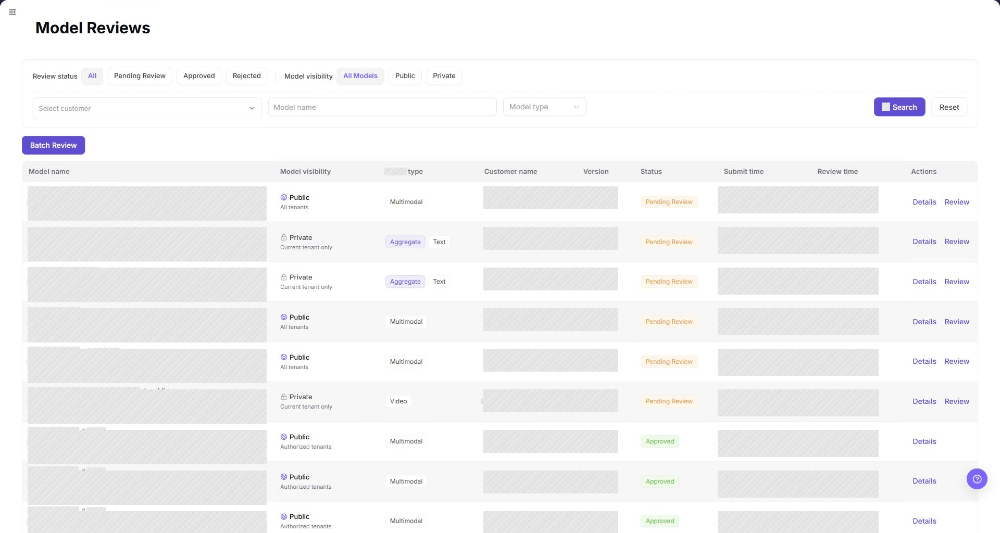
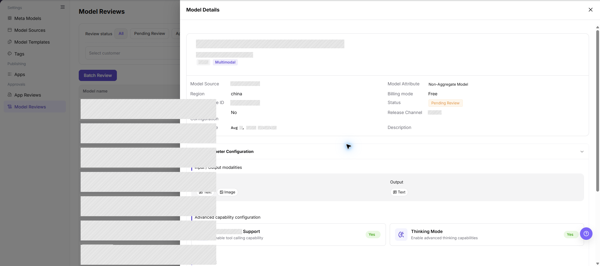
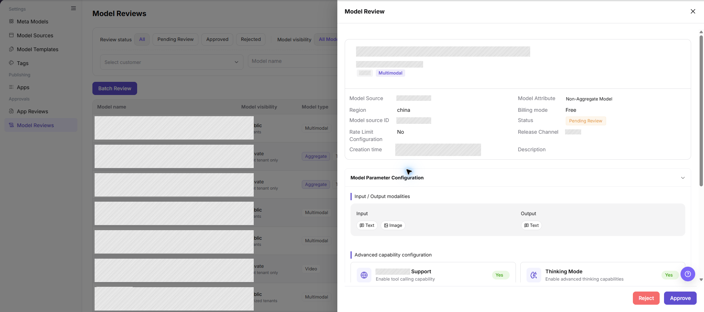
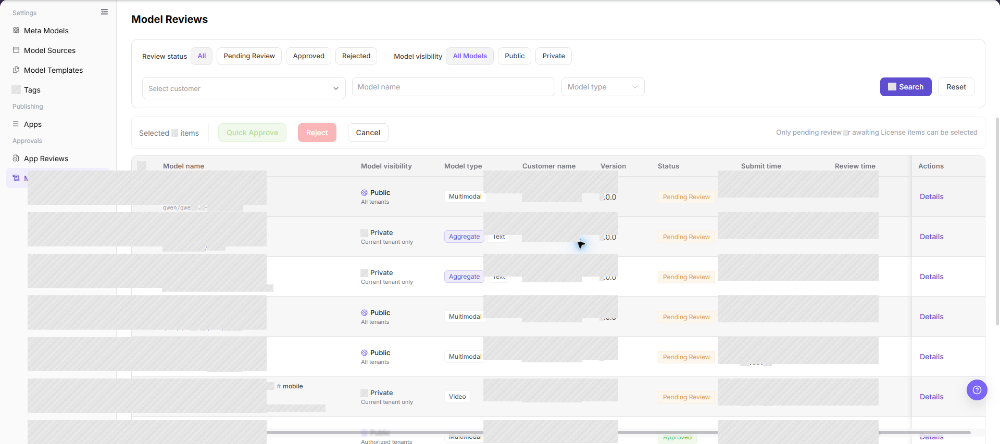

# Model Reviews

::: info Document Information
Version: v1.0
Updated: 2026-08-31
:::

## Feature Overview

| Item | Content |
| --- | --- |
| Applicable Role | Operator Admin |
| Navigation path | Model Services > Approvals > Model Reviews |
| Page route | `/modelone/audit/model` |
| Managed objects | Model review records, model source configuration, model parameters, visibility scope, and review comments |

#### Beginner Explanation

Model Reviews is the checkpoint before a model is listed for discovery or calling. The Operator Admin checks the model source, capability settings, usage boundary, billing and rate-limit settings, and visibility scope before making a decision.

#### Glossary

| Term | Description |
| --- | --- |
| Model review record | A record created when a model publication or change enters the review process. |
| Model source | The configured upstream source and region used by the published model. |
| Model parameter configuration | The model's input/output modalities, Token limits, protocols, and capability settings. |
| Visibility scope | The customers or tenants that can see the model after publication. |
| Review comment | The explanation recorded with an approval, rejection, or request for supplementary information. |

#### Recommended Operation Sequence

1. Locate the target record with the review status, visibility, customer, model name, and model type controls.
2. Open **"Details"** to compare the model profile and parameter configuration with the review criteria.
3. Open **"Review"**, record a clear conclusion, and then verify the resulting status.

#### Beginner Quick Choice

- To locate a record, use **"Search"** and **"Reset"**.
- To inspect a record without changing it, use **"Details"**.
- To make a decision for one record, use **"Review"**.
- To process several eligible records together, use **"Batch Review"** after checking the selected count.

## Prerequisites

1. The current account has permission to review models.
2. The submitted model has a model name, source, source ID, region, model type, visibility scope, protocol, input/output modalities, Token limits, billing settings, and rate-limit settings.
3. Before making a decision, the reviewer has confirmed the model's authorization scope, usage boundary, expected cost impact, and publication effect.

## Page Description

This page lists model review records by review status and model visibility. The filters include customer, model name, and model type; the list shows the model name, visibility, type, customer, version, free quota, status, submission time, review time, and the actions shown for the current account.

Page screenshot:

The screenshot focuses on the status tabs, visibility controls, search filters, batch entry, result table, and pagination. The screenshot uses a neutral empty result set so that no customer or environment data is exposed.

## Main Operations

### Query Model Reviews

1. Go to `Model Services > Approvals > Model Reviews`.
2. Select a review status: `All`, `Pending Review`, `Approved`, or `Rejected`; then select a model visibility: `All Models`, `Public`, or `Private`.
3. Select a customer when needed, enter a model name or choose a model type, and click **"Search"**.
4. Check the model name, visibility, model type, customer, version, free quota, status, submission time, and review time. If no result is returned, click **"Reset"** and apply one condition at a time.

The screenshot highlights the review status, model visibility, customer, model name, model type, **"Search"**, and **"Reset"** controls.

### Query Model Review Details

1. Locate the target record and click **"Details"** to open the model detail panel.
2. Check the model name, model source, region, model source ID, model attribute, billing mode, status, release channel, free quota, and creation time.
3. Expand `Model Parameter Configuration` and review input/output modalities, Token limits, advanced capability settings, protocol information, and usage boundaries.
4. Compare the detail version with the list version. For read-only inspection, close the panel without submitting a review decision.

The screenshot highlights the model profile and `Model Parameter Configuration` section used during detail inspection.

### Review a Model

1. Locate a record with the appropriate review status and click **"Review"**.
2. Check the model profile and `Model Parameter Configuration`. Confirm that the source, protocol, modalities, Token limits, billing, rate limit, usage boundary, and visibility scope are consistent.
3. Choose **"Approve"** only when the model is authorized, technically usable, and ready for publication. Choose **"Reject"** when a required condition is not met.
4. Before the final confirmation, verify the target model, version, review comment, and impact scope. When rejecting, write the missing or incorrect item in the review comment.
5. After submission, return to the list and confirm that the record has moved to the expected status tab.

The screenshot highlights the final **"Reject"** and **"Approve"** actions at the bottom of the review panel. Use the visible page state as the source of truth for the final confirmation wording.

### Batch Review Models

1. Filter the list to records that are eligible for the same conclusion.
2. Select the target rows and confirm the selected count, model names, versions, and visibility scopes.
3. Click **"Batch Review"** and check the records, current statuses, and review comment in the batch panel.
4. Select the conclusion shown by the page, confirm the impact scope, and submit only after the selected records are correct.
5. Refresh the list and verify every selected record in its corresponding status tab. If any record remains pending, review that record individually.

The screenshot highlights the batch entry and the result table used to select records. Do not include customer-sensitive data when sharing a batch-review screenshot.

## Parameter Reference

| Field Name | Required | Field Type | Example | Description |
| --- | --- | --- | --- | --- |
| Model name | System-displayed | Text | `sample-model:version-1` | Name of the model under review. |
| Model source | System-displayed | Text | `source-a` | Configured upstream model source. |
| Region | System-displayed | Text | `region-a` | Region associated with the model source. |
| Model source ID | System-displayed | Text | `model-id-a` | Source-side model identifier used by the publication configuration. |
| Model visibility | System-displayed | Enum | `Public` / `Private` | Visibility scope of the model. |
| Model type | System-displayed | Tag | `Text` / `Multimodal` | Capability type shown in the review list. |
| Version | System-displayed | Text | `1.0.0` | Version submitted for the current review. |
| Free quota | System-displayed | Enum | `Enabled` / `Disabled` | Whether free quota is enabled for the model. |
| Review status | System-displayed | Enum | `Pending Review` / `Approved` / `Rejected` | Current lifecycle status of the review record. |
| Submit time | System-displayed | DateTime | `2026-08-01 09:00:00` | Time when the model entered the review process. |
| Review time | System-displayed | DateTime | `2026-08-01 09:10:00` | Time when a review decision was recorded; empty or `--` before review. |
| Review comment | Conditionally required | Multiline text | `Please add the usage boundary.` | Explanation for a rejection or supplementary-information request. |
| Actions | Displayed by permission | Button | `Details` / `Review` | Entry for read-only inspection or review processing. |

## Pitfalls

- A model name alone is not enough for approval; source, protocol, modalities, Token limits, billing, and usage boundary must also be reviewable.
- Do not treat a model source ID as a credential. Never paste real keys, complete request headers, or private call content into a review comment.
- Public visibility exposes the model to a wider audience; confirm the authorization scope and publication impact before approval.
- Token limits or modalities that do not match the source capability can cause failed calls or incorrect model filtering.
- Batch review can apply one conclusion to several records; verify the selected count, versions, and visibility scopes before submitting.

## Result Validation

| Check Item | Success Signal | If Abnormal |
| --- | --- | --- |
| The Model Reviews page opens | The page route loads and the Model Reviews title, filters, and table are visible. | Check the current account's model-review permission, the sidebar entry, and whether the route was loaded in the correct site language. |
| The expected status and visibility records are shown | The selected status and visibility controls display records matching both conditions. | Click **"Reset"**, select one status and visibility value again, and confirm that the request has not already been processed. |
| Customer, model name, and model type filters work | **"Search"** returns records matching the selected customer and entered or selected model conditions. | Clear the filters, search by model name only, and then reapply customer and model type to identify the condition that excludes the record. |
| Model review details open | **"Details"** opens the model profile and parameter configuration without changing the list status. | Check whether the record has been processed or removed, refresh the list, and confirm that the account can view the record. |
| A review decision is recorded | The record appears under `Approved` or `Rejected`, with review time and, when required, a review comment. | Reopen the record to check the decision form, required comment, and permission; do not resubmit until the original status is clear. |
| Batch review is complete | Every selected record moves to the expected status and the selected count is cleared after refresh. | Compare the selected rows with the status results and process any remaining pending record individually. |

## FAQ

#### No Model Review Record Is Returned

**Symptom:**

The list is empty after selecting a status, visibility, customer, or model type.

**Possible Causes:**

- The selected status and visibility combination excludes the record.
- The model name or model type does not match the submitted record.
- The record has already been processed or the account cannot view it.

**Handling:**

1. Click **"Reset"** and select `All` and `All Models`.
2. Search by model name only, then add customer and model type filters.
3. If the record is still missing, confirm its submission status and review permission.

#### Model Review Details Are Incomplete

**Symptom:**

The detail panel does not show the expected source or parameter information.

**Possible Causes:**

- The record is still loading.
- The publication request omitted required model information.
- Another reviewer changed the record while it was open.

**Handling:**

1. Close the panel and reopen it from the refreshed list.
2. Expand `Model Parameter Configuration` and check each visible section.
3. Ask the Model Provider to supplement the missing source, protocol, or capability information.

#### Review Materials Are Insufficient

**Symptom:**

The review record lacks source authorization, protocol information, test evidence, or usage boundaries.

**Possible Causes:**

- The Model Provider submitted only basic identification fields.
- The source authorization scope is unclear.
- Connectivity or representative-call validation was not completed.

**Handling:**

1. Reject or return the request according to the page workflow.
2. List each missing authorization, protocol, test, or usage-boundary item in the review comment.
3. Review the new submission after the missing information is added.

#### The Model Is Not Visible After Approval

**Symptom:**

The model is approved, but the intended Model Consumer cannot find it in the model marketplace.

**Possible Causes:**

- Publication has not completed.
- The visibility scope or release channel excludes the Model Consumer.
- Publication synchronization is delayed.

**Handling:**

1. Check the model publication status and release channel.
2. Compare the Model Consumer's tenant with the model visibility scope.
3. Refresh the publication state and validate again after synchronization.

#### The Model Cannot Be Called After Approval

**Symptom:**

The model is approved and visible, but the Model Consumer receives a call failure.

**Possible Causes:**

- The model source is unavailable or the protocol path is inconsistent.
- Billing or rate-limit configuration is incomplete.
- The Model Consumer lacks the required visibility or call permission.

**Handling:**

1. Check the model source status and protocol configuration.
2. Check billing mode, free quota, and rate-limit configuration.
3. Review call logs and Model Consumer permissions to separate access errors from source errors.

#### Batch Review Does Not Process Every Selected Model

**Symptom:**

Some selected records remain pending after batch review.

**Possible Causes:**

- The records do not share the same eligible status or visibility condition.
- A selected record was changed by another reviewer.
- The batch action rejected a record because required information was missing.

**Handling:**

1. Refresh the list and compare the selected records with their current statuses.
2. Open the remaining record with **"Review"** and read its validation message.
3. Process the record individually after correcting or documenting the missing item.

## Notes

- Review source authorization, capability parameters, publication scope, billing, and rate limits as one decision set.
- Review comments should identify an actionable missing item without including private data or real credentials.
- Approval does not replace publication and representative-call validation.

## Next Steps

1. Check the model publication page and confirm the approved version and visibility scope.
2. Validate that the Model Consumer can discover the model and use the expected protocol.
3. Track call logs, billing results, and user feedback after publication.
