# Meta Models

## Feature Overview

| Item | Content |
| --- | --- |
| Applicable Role | Operator Admin |
| Navigation path | Model Services > Settings > Meta Models |
| Page route | `/modelone/settings/meta` |
| Managed objects | Model capabilities, protocols, modalities, Token limits, default parameters, and capability tags |

#### Beginner Explanation

A meta-model is like a model's "product specification page" — it tells the system what content the model can handle (text, images, or audio), which protocol it uses, how much content it can process, and which default parameters are used for Playground and API calls. It is not a concrete model instance, but a shared capability template for all similar models. When you need to integrate a new model into the platform, you must first create a meta-model to define its capabilities before publishing it to the model marketplace.

#### Glossary

| Term | Description |
| --- | --- |
| Meta-model | Abstract definition that describes model capabilities and call protocols, like a capability template |
| Model Author | The provider or developing organization of a model, such as Qwen or GLM |
| Input/Output Modalities | Text, image, audio, or video input/output types supported by the model |
| Token Limits | Limits for model context, input length, and output length |
| Official Native Protocol | Compatible protocol definition such as OpenAI or Anthropic |
| Endpoint Path | The API address for protocol calls, such as `/v1/chat/completions` |

#### Recommended Operation Sequence

For the first setup, use this order: add a model author, add a meta-model, open the details page, enable the meta-model, and then verify it in a model template or model publishing flow. This separates "who provides the model" from "what the model can do" and helps prevent missing options later in templates or publishing.

#### Beginner Quick Choice

| Case | Do First | Avoid |
| --- | --- | --- |
| New vendor or organization | Add a model author | Adding a meta-model first |
| New model capability | Add a meta-model, then open details and enable it | Skipping protocol, modality, and Token limit checks |
| Similar configuration | Copy a meta-model, then change the unique identifier and name | Overwriting key capability fields on the original record |
| Unknown template or published-model references | Open details, filter by author, and confirm references | Disabling or deleting directly |

## Prerequisites

1. The current account has meta-model configuration permission.
2. Model type, input/output modalities, context length, Token limits, and default parameters have been confirmed.
3. Compatible protocols and endpoint paths have been confirmed by the technical owner. If you are unsure who to contact, reach out to the platform administrator.
4. Before adding or changing a meta-model, the impact on model publishing templates and published models has been evaluated.

## Page Description

This page maintains model capability abstractions, including input/output modalities, protocols, Token limits, capability tags, and default parameters. The left side is the model author filter area, and the right side is the meta-model list, where you can see each meta-model's name, status, modalities, protocols, and operation entry points.

Page screenshot:

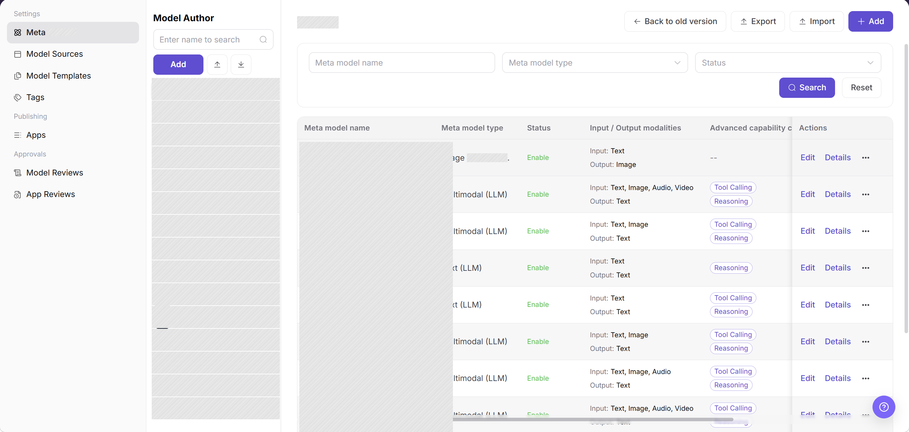

In the image above, the red box on the left highlights the model author filter area, and the right side is the meta-model list. The "Status" column shows whether each meta-model is enabled.

## Main Operations

<!-- main-operation-title-exceptions: Edit,Delete -->

The operations below are ordered for new users. Start with first setup, then check details and enable the meta-model. Use edit and copy for daily maintenance. Treat delete as high risk. Use import and export for batch maintenance.

### Add a Model Author

1. Go to `Model Services > Settings > Meta Models`.
2. In the `Model Author` area on the left, click **"Add"** to open the `Add` dialog.
3. Fill in the `Unique identifier`. It distinguishes this model author from others and cannot be changed after creation. Use the vendor's English name, for example `qwen`.
4. Enter the `Display Name`.
5. Upload or select an `Application Icon`.
6. Click **"Confirm"** to save.

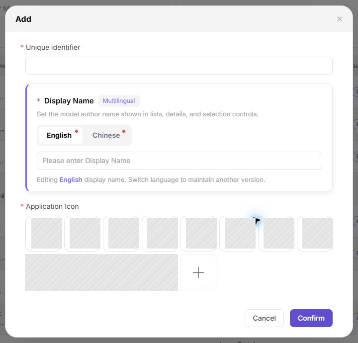

The image above shows the add dialog for a model author. Check `Unique identifier`, multilingual `Display Name`, and `Application Icon`, because they affect the left-side author list and later meta-model ownership selection.

### Add a Meta-model

1. Go to `Model Services > Settings > Meta Models`.
2. Click **"Add"** above the meta-model list to open the add form.
3. Select the model author, then enter the meta-model name and unique identifier. The unique identifier cannot be modified after creation. Use a naming convention such as `{vendor}-{capability-type}`, for example `qwen-text`.
4. Select the model type and business scenario, configure input/output modalities, and optionally fill in a description.
5. Configure advanced capabilities, protocols, Token limits, and default parameters. Confirm that they match the intended model capability. Do not enter real internal endpoints or credentials in descriptions, protocol paths, or examples.
6. Click **"Next"** to open `Meta-model Details`, then maintain the model description, capability details, and parameter descriptions.
7. Before submission, check for duplicate identifiers and verify that protocols, modalities, and Token limits are complete.
8. Click **"Submit"** to save. After a successful save, query the new meta-model in the list and open its details to verify its name, status, and capability configuration.

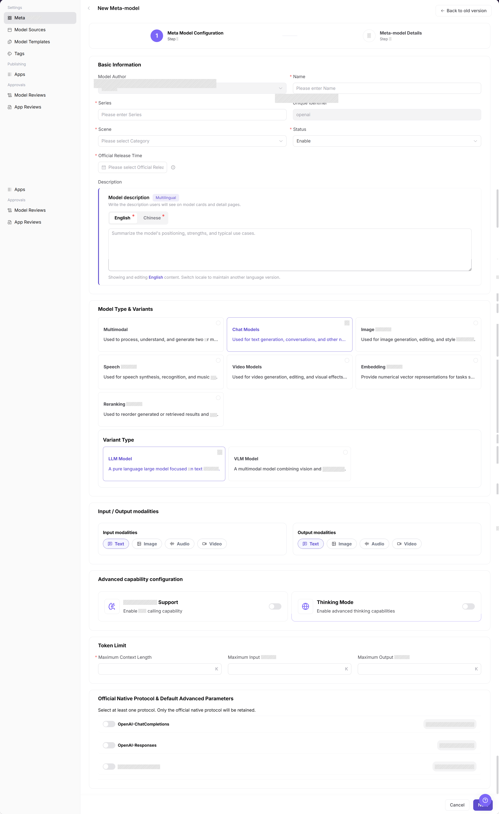

In the image above, the red box highlights the Token limit configuration area. Please verify that the input and output limits match the real model capability.

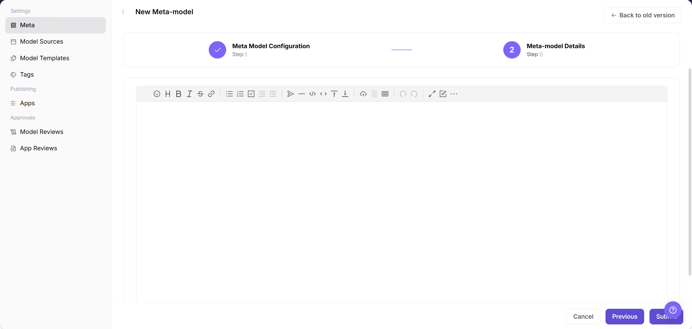

The image above shows the `Meta-model Details` step in the add wizard. The bottom action area contains **"Previous"** and **"Submit"**. Before submitting, check that the detail text is suitable for later publishing and marketplace display.

### Query Meta-model Details

1. Go to `Model Services > Settings > Meta Models`.
2. Use the page query controls to locate the target record.
3. Click **"Details"** or the meta-model name.
4. Check the unique identifier, model author, model type, input/output modalities, protocol, Token limits, default parameters, and current status.
5. The details should match the list name and status. If no record is returned, clear the query conditions and confirm the active tab.

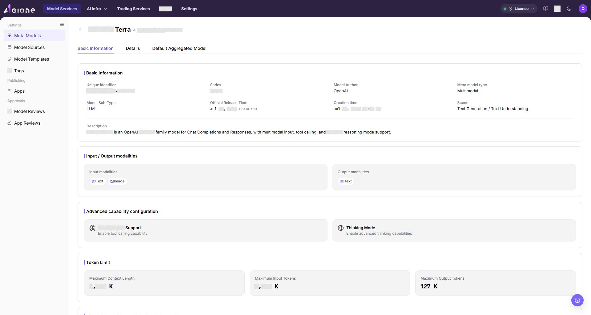

The image above shows the meta-model details page. Check `Unique identifier`, `Status`, protocol, input/output modalities, and Token limits. Confirm that they match the list record and real model capability.

### Enable or Disable a Meta-model

1. Query and open the target meta-model details. Confirm its current status and record whether templates, publishing flows, or marketplace filters use it.
2. Before clicking **"Enable"** or **"Disable"**, confirm the impacted objects: future template selection, model publishing options, marketplace filtering, and any Model Consumers that may depend on this meta-model.
3. If you cannot confirm the dependency scope, a publishing review is in progress, or this is the only configuration for a live model, do not disable it yet. Ask the template maintainer or technical owner to confirm first.
4. Read the confirmation message. If the message does not match your expected impact, click **"Cancel"**.
5. When the change is safe, confirm the action. After the operation succeeds, refresh the list and details and check status, update time, and selector entries in later flows.
6. If the status does not change, check permission, references, page cache, and synchronization time instead of clicking repeatedly.

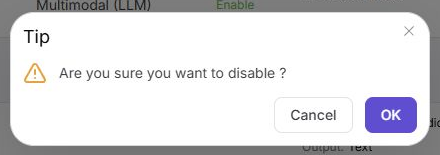

The image above shows the status-change entry point. After the change, check the `Status` column in the list and the status field on the details page to confirm the expected `Enabled` or `Disabled` state.

### Edit a Meta-model

1. Locate the target record in the meta-model list and click the row action **"Edit"**.
2. Check the model author, name, unique identifier, model type, input/output modalities, scene, protocols, Token limits, and advanced capabilities.
3. Change only the fields that need to be modified. Assess the impact on templates, published models, and existing calls.
4. Before changing Token limits, modalities, protocols, or default parameters, confirm whether templates, published models, or Model Consumers depend on the current configuration. If the dependency scope is unclear, do not submit the change yet.
5. Click **"Confirm"** to save. After a successful save, refresh the list and open the details. If saving fails, check required fields, field compatibility, references, and permission.

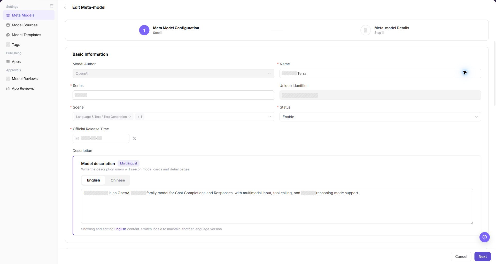

The image above shows the meta-model edit page. The field layout is similar to the add page. After saving, return to the list and check whether the status and update time match the expected change.

### Copy a Meta-model

1. Locate the target meta-model in the list. On the right side of the target row, click **"..."** to open the more-actions menu.
2. Click **"Copy"**. Check the model author, name, series, modalities, protocol, and default parameters in the copy form.
3. Enter a new unique identifier and name for the copy to avoid conflicts with the original.
4. Before submission, verify capability boundaries and Token limits.
5. After clicking **"Save"**, query the new identifier in the list and open its details to confirm the copy and its status.

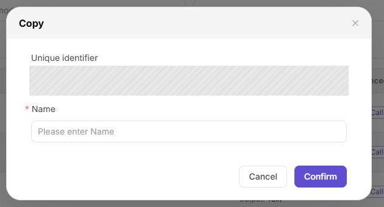

The image above shows the copy dialog opened from the row **"..."** menu. Check `Unique identifier` and `Name` carefully so the copy is not confused with the original meta-model in lists or publishing flows.

### Edit a Model Author

1. In the `Model Author` area, locate the target author and click **"Edit"**.
2. In the dialog, check `Unique identifier`, `Display Name`, and `Application Icon`. If the identifier is read-only, follow the page state.
3. Change only the fields that need to be modified. Check that the new name and icon will not affect list recognition or meta-model associations.
4. Click **"Confirm"** to save. After a successful save, the list should show the updated name or icon. If saving fails, check required fields, name format, and permission.

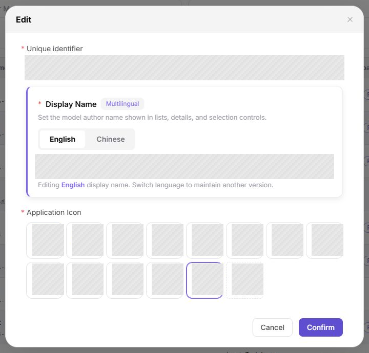

The image above shows the edit dialog for a model author. After saving, return to the left-side `Model Author` list and check whether the name and icon use the new configuration.

### Delete a Meta-model

1. Locate the target record and click **"Details"** first to review its status and configuration.
2. Return to the list. On the right side of the target row, click **"..."** to open the more-actions menu.
3. Click **"Delete"**, read the confirmation message, and check whether templates, published models, or other business objects reference the meta-model.
4. If you cannot confirm that the meta-model has no references, do not delete it. Disable it first or ask the dependent owner to confirm.
5. If the button is grayed out or deletion fails, follow the page message and check references, permission, and current status before removing references or migrating the configuration.
6. After a successful deletion, refresh the list and confirm that the record is removed.

The image above shows the delete confirmation dialog. Before confirming, check the dialog title and the target row again to avoid deleting a similarly named meta-model under the same author.

### Delete a Model Author

1. In the `Model Author` area, locate the target author and check its associated meta-models and usage status.
2. Click **"Delete"** and read the confirmation message.
3. If the author still has meta-models, or if you cannot confirm the association count, do not delete it. Filter the meta-model list by this author first, then migrate or clean up related configurations.
4. If the button is grayed out or deletion fails, follow the page message and check associated meta-models, current account permission, and author status.
5. After a successful deletion, refresh the author list and confirm that the record is removed.

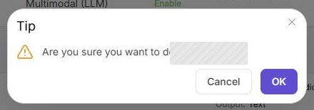

The image above shows the delete confirmation dialog for a model author. Before confirming, check the selected author name on the left to avoid deleting an author still used by meta-models.

### Import Meta-models

1. Click **"Import"** above the meta-model list.
2. Before importing, verify the file format and field structure. Make sure the file contains no credentials, customer data, or real internal endpoints.
3. Import can add or update configurations in batches. Do not import when the field source is unclear, unique identifiers have not been deduplicated, or production configuration is frozen.
4. Use a small test file first. Check field mapping, duplicate identifiers, and validation results before running the full import.
5. After the import completes, clear filters and verify the new records. If the page reports success but no records appear, check filters, duplicate identifiers, associated model authors, and field formats first.

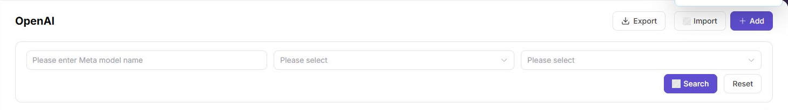

The image above shows **"Import"** and **"Export"** above the meta-model list. After import, clear filters and check the list for new records or validation messages.

### Import Model Authors

1. In the `Model Author` area, click **"Import"**.
2. Before importing, verify the file format, field structure, and unique identifiers. Make sure the file contains no credentials, customer data, or internal notes.
3. Import changes the left-side model author list. Do not import when author names are unclear, icons are not ready, or unique identifiers have not been deduplicated.
4. Use a small test file first to validate the format and field mapping before running the full import.
5. After the import completes, clear search conditions and verify the new records. If the new author does not appear, check duplicate identifiers, file format, icon fields, and account permission.

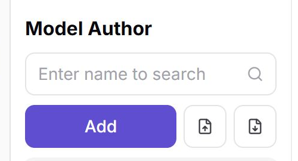

The image above shows **"Import"** and **"Export"** in the model author area. After import, check whether the new author name and icon appear in the left-side author list.

### Export Meta-models

1. Click **"Export"** above the meta-model list.
2. Before exporting, confirm the current model author filter, data scope, and data permission. This prevents exporting meta-model configurations outside the authorized scope.
3. The exported file can include protocol, capability, and parameter configuration. Do not send it to unauthorized chat groups, external email, or public knowledge bases.
4. After a successful export, verify the file content. If the operation fails, check filter conditions, permission, browser download status, and download-blocking messages.

The image above shows the import and export buttons located above the meta-model list.

### Export Model Authors

1. In the `Model Author` area, click **"Export"**.
2. Before exporting, confirm the current search conditions, scope, and data permission. Store exported files in a controlled location. Do not distribute them without authorization.
3. The exported file can include author identifiers and display information. Do not send it directly as external delivery material.
4. After a successful export, verify the file content. If the operation fails, check filter conditions, permission, browser download status, and download-blocking messages.

The image above shows the import and export buttons in the model author area.

## Parameter Reference

### Model Author Fields

| Field Name | Required | Field Type | Example | Description |
| --- | --- | --- | --- | --- |
| Unique identifier | Yes | Text / read-only text | `qwen` | Unique identifier of the model author, cannot be modified after creation |
| Display Name | Yes | Multilingual text | `Qwen` | Display name of the model author in lists, details, and selectors |
| Application Icon | Yes | Image upload | `qwen.png` | Icon shown for the model author in the list |

### Meta-model Fields

| Field Name | Required | Field Type | Example | Description |
| --- | --- | --- | --- | --- |
| Model Author | Yes | Dropdown | `Qwen` | Model author that the new meta-model belongs to |
| Name | Yes | Text | `Qwen Text` | Display name of the meta-model on the page and in publishing flows |
| Unique identifier | Yes | Text / read-only text | `qwen-text` | Unique identifier of the meta-model, cannot be modified after creation |
| Series | Yes | Text | `Qwen` | Series that the meta-model belongs to |
| Scene | Yes | Dropdown | `Text Generation` | Business scenario where the meta-model is used |
| Status | Yes | Dropdown | `Enabled` | Status displayed for the meta-model |
| Official Release Time | No | Date picker | `2026-07-08` | Official release time of the corresponding model capability |
| Model description | No | Multilingual text | `For text generation.` | Description displayed on model cards and detail pages |
| Model Type & Variants | Yes | Radio card | `Conversation Model` / `LLM Model` | Defines the capability category and subtype of the meta-model |
| Input / Output modalities | Yes | Multi-select | `Text -> Text` | Declares the data input and output types supported by the model |
| Function / Tool support | No | Toggle | `Off` | Controls whether tool calling capability is enabled |
| Thinking mode | No | Toggle | `Off` | Controls whether deep thinking or reasoning capability is enabled |
| Max context / Max input / Max output | Yes | Number | `128` K | Defines the upper Token limits for context, input, and output |
| Official Native Protocol & Default Advanced Parameters | Yes | Toggle / parameter configuration | `OpenAI-ChatCompletions` | Selects the compatible protocol and maintains default advanced parameters |

## Pitfalls

- Setting Token limits higher than the real model capability causes call failures. Strictly follow official documentation.
- Protocol endpoint paths should be paths or placeholder examples. Do not write real internal addresses.
- Incorrect input/output modalities affect template selection, publishing flows, and marketplace filtering. Verify that modalities match the target scene before publishing.
- The unique identifier cannot be changed after creation. Confirm naming rules before adding, copying, or importing records.
- If enable, disable, delete, import, or export does not produce the expected result, clear filters first. Then check account permission, file format, and references before clicking the action again.

## Result Validation

| Check Item | Success Signal | If Abnormal |
| --- | --- | --- |
| The new model author is visible in the left filter area | The author name and icon appear in the filter area | Check whether the unique identifier is duplicated, then refresh the page and retry |
| The new meta-model is visible in the list | The new meta-model appears in the list | Check account permission, filter conditions, and configuration status |
| The meta-model details match the list record | The details page shows the expected unique identifier, status, protocol, modalities, and Token limits | Return to the list and confirm that the correct record was opened. Clear filters and open the details again if needed |
| The status changes after enable or disable | The list `Status` column and details page show the expected `Enabled` or `Disabled` state | Check permission, references, and page cache. Wait for synchronization, refresh the page, and confirm again |
| A copied meta-model creates a new record | The new unique identifier appears in the list, and the details match the expected copy | Check whether the unique identifier or name conflicts with the original record or an existing record |
| The meta-model can be selected in a template or publishing flow | The target meta-model appears in the dropdown | Confirm the meta-model status is enabled, and check model type and modality match |
| Protocols, modalities, and Token limits match the real model capability | Protocols, modalities, and Token limits are consistent with official documentation | Return to the meta-model details page and verify configuration. Contact the technical owner if needed |
| Default parameters take effect in Playground or call tests | Playground or API calls return expected results | Check default parameter configuration and verify whether Model Consumer parameters override defaults |
| Import produces visible records or validation feedback | New records appear in the list, or the page returns a clear validation result | Clear filters, then check duplicate unique identifiers, file fields, associated model author, and import permission |
| Export creates a downloaded file | The browser downloads an export file, and its content matches the current filter scope | Check filters, data permission, browser download status, and download-blocking messages |
| The deleted meta-model no longer appears in the list | The target meta-model is removed from the list | Check whether templates, published models, or other business objects still reference it. Migrate configuration first if needed |
| The deleted model author no longer appears in the list | The author disappears from the filter area | Check whether any associated meta-models remain. Filter the meta-model list by the author to investigate |

## FAQ

#### Cannot Select the Meta-model When Publishing a Model

**Symptom:**

After a Model Provider enters the publishing flow, the target item is missing from the meta-model dropdown.

**Possible Causes:**

- The meta-model is not enabled.
- Model type or modality does not match the publishing method.
- The current role or tenant does not have permission to use this meta-model.

**Handling:**

1. Confirm that the meta-model status is enabled.
2. Check model type, input/output modalities, and publishing method.
3. Check role, tenant, and visibility scope configuration.

#### Call Reports Token Limit Exceeded

**Symptom:**

Model Playground or API calls return context length, input length, or output length limit errors.

**Possible Causes:**

- The meta-model Token limit is smaller than the actual request.
- Default Max Tokens is set too high.
- The Model Consumer passed an excessively long context.

**Handling:**

1. Check the meta-model context, input, and output limits.
2. Adjust default parameters or call parameters.
3. Shorten the Prompt or conversation context and retry.

#### Meta-model Parameters Do Not Match During Model Publishing

**Symptom:**

When a provider publishes a model, the meta-model default parameters or context limits do not match the real model capability.

**Possible Causes:**

The meta-model protocol, modalities, Token limits, or default parameters are maintained incorrectly, or the template references an old configuration.

**Handling:**

Go back to the meta-model page and check protocols, modalities, and Token limits. Also check model template references, then validate the change with a test publishing flow.

#### What If the Unique Identifier Is Filled Incorrectly?

**Symptom:**

The unique identifier of a meta-model or model author is filled incorrectly and needs to be modified.

**Possible Causes:**

- The unique identifier cannot be modified after creation.
- Naming conventions are not clear.

**Handling:**

1. Check whether the unique identifier is referenced by other business objects.
2. If not referenced, delete and recreate it.
3. If referenced, remove the references first, then delete and recreate.

#### What Happens to Published Models After a Meta-model Is Disabled?

**Symptom:**

You need to know whether published models still work after a meta-model is disabled.

**Possible Causes:**

- Disabling a meta-model affects subsequent publishing and template selection.
- Published-model call behavior depends on the current reference relationship and runtime configuration. Do not infer it only from the meta-model list status.

**Handling:**

1. Before disabling, check which templates and published models reference this meta-model.
2. After disabling, check template selection, model publishing, marketplace filtering, and a representative call result.
3. To restore, re-enable the meta-model and revalidate the template, publishing, and calling flows.

#### Import Reports Success but No Records Appear

**Symptom:**

After importing meta-models or model authors, the page shows a success message but no new records appear in the list.

**Possible Causes:**

- Unique identifiers in the import file conflict with existing records, so the system may skip duplicate records or return a validation message.
- Current list filters exclude the newly imported records.
- Field formats in the file do not meet requirements, and some records were not parsed.

**Handling:**

1. Clear list filter conditions and check all records.
2. Check whether unique identifiers in the import file conflict with existing records.
3. Verify the file format and field structure meet page requirements, then re-import after corrections.

#### Model Author Deletion Fails — Button Is Grayed Out

**Symptom:**

Clicking **"Delete"** on a model author results in a grayed-out button or a rejected deletion operation.

**Possible Causes:**

- The author still has associated meta-models.
- The current account lacks sufficient permission.

**Handling:**

1. Filter the meta-model list by the target author to check the number of associated meta-models.
2. Migrate associated meta-models to another author, or delete the associated meta-models first.
3. After confirming zero associations, retry the deletion.
4. If it still fails, check whether the current account has deletion permission.

## Notes

- Meta-model changes affect model publishing, template selection, and marketplace filtering. Confirm dependency scope before release.
- Token limits, protocol paths, and default parameters must match real model capability.
- Before adjusting input/output modalities, check whether published models can still be filtered and called correctly.

## Next Steps

1. Select this meta-model in the model template or publishing flow and confirm that protocol, modalities, and Token limits are referenced correctly.
2. Use a representative model for one publishing validation and check whether input/output formats match.
3. When protocol, context length, or default parameters change, notify template maintainers and Model Providers.
