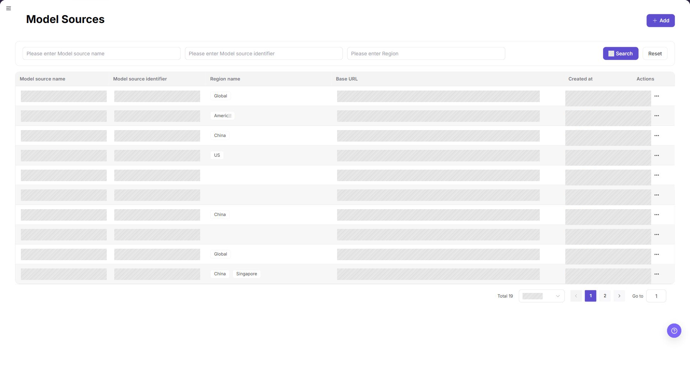
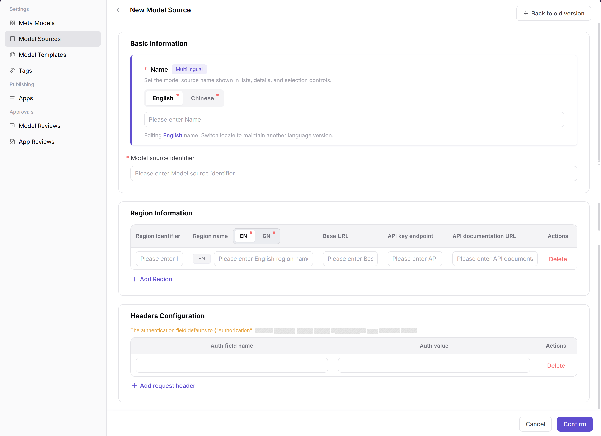
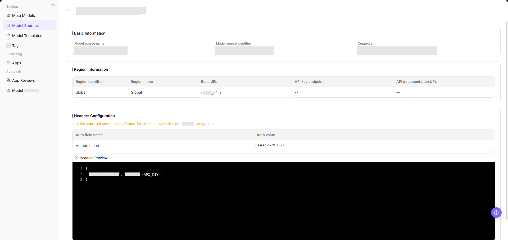
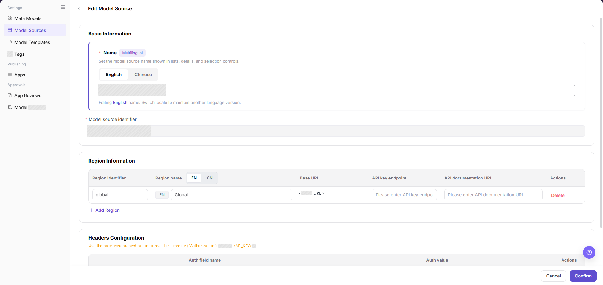
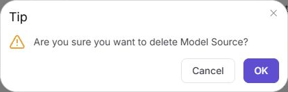

# Model Sources

::: info Document Information
Version: v1.0
Updated: 2026-09-01
:::

## Feature Overview

| Item | Content |
| --- | --- |
| Applicable role | Operator Admin |
| Navigation path | **Model Services** > **Settings** > **Model Sources** |
| Page route | `/modelone/settings/vendor` |
| Managed objects | Model Source names, identifiers, Regions, Base URLs, Request headers, and authentication settings |

#### Beginner Explanation

A Model Source stores the address and authentication settings for an upstream model service.
A Meta-model describes what a model can do.
A Model Source describes where the platform calls the service and how the platform authenticates.

#### Glossary

| Term | Description |
| --- | --- |
| Model Source | A record that stores an upstream service address and Request header settings. |
| Region | A service location with its own Base URL. |
| Base URL | The root address used before an API Endpoint path. |
| Endpoint | The path for one API operation. It is usually added after the Base URL. |
| API Key endpoint | The address used to obtain or manage API Keys. It is not the model call Endpoint. |
| Request header | An authentication or custom header that the platform sends to the upstream service. |

#### Beginner Quick Choice

| Case | Do First | Avoid |
| --- | --- | --- |
| First connection to an upstream service | Add the Model Source. Enter the approved upstream address. | Creating a model template first |
| A template requires a Region | Enter the Region identifier, Region name, and Base URL. | Entering only the Model Source name |
| The upstream service requires authentication | Check the default header. Enter the approved value. | Putting API Keys in docs or tickets |
| Template or published-model references are unclear | Open **"Details"** and confirm known references | Deleting the Model Source |

## Prerequisites

1. Confirm that the current account has permission to maintain Model Sources.
2. Get the Region, address, and Request header requirements from the upstream service owner.
3. Confirm network, certificate, and allowlist requirements with the responsible teams.
4. Prepare an approved method to enter or reference credentials.
5. Before an edit or deletion, identify the templates and published models that use the Model Source.

## Page Description

Use this page to maintain upstream Model Sources.
Each row shows the name, identifier, Region name, Base URL, creation time, and actions.

Page screenshot:

The row-end **"..."** opens **"Details"** and **"Delete"**.
The screenshot masks address values. Do not include real credentials in documentation screenshots.

## Main Operations

<!-- main-operation-title-exceptions: Edit,Delete -->

Use this order: initial setup, details verification, approved maintenance, and high-risk deletion.

### Add a Model Source

1. Go to **Model Services** > **Settings** > **Model Sources**.
2. Click **"Add"**.
3. In **"English"**, enter the required `Name`.
4. In **"Chinese"**, enter `Name` only when users need a Chinese display name.
5. Enter a unique value in `Model source identifier`.
6. When a template requires a Region, click **"Add Region"**.
7. Enter the approved `Region identifier`, `Region name`, and `Base URL` as one complete set.
8. Enter `API Key endpoint` and `API documentation URL` only when these links apply.
9. When the upstream service requires an additional Request header, click **"Add request header"**.
10. Enter the approved `Auth field name` and `Auth value`.
11. Enter real credentials only through the approved secret-entry method.
12. Compare all values with the approved upstream configuration.
13. Click **"Confirm"** to submit the form.
14. Return to the list and search for the new identifier.
15. To close the form without submission, click **"Cancel"**.

The screenshot shows the localized name tabs, Region fields, and Request header fields.
The page requires the English `Name` and `Model source identifier`. Use the table below for all other field conditions.

### View Model Source Details

1. Go to **Model Services** > **Settings** > **Model Sources**.
2. Locate the target Model Source.
3. Click **"..."** at the end of the target row.
4. Click **"Details"**.
5. Check `Name`, `Model source identifier`, and the creation time.
6. Check `Region identifier`, `Region name`, `Base URL`, `API Key endpoint`, and `API documentation URL`.
7. Check the field names and value format in `Headers Configuration` and `Headers Preview`.
8. Do not expose or copy a real authentication value into tickets or documentation.
9. If the values do not match the approved configuration, return to the list and verify the target row.

The details page groups the fields into `Basic Information`, `Region Information`, and `Headers Configuration`.
The screenshot masks address and authentication values.

### Edit a Model Source

1. Go to **Model Services** > **Settings** > **Model Sources**.
2. Locate the target Model Source.
3. Click **"Edit"** in the target row.
4. Verify that the page shows the expected record.
5. Keep `Model source identifier` unchanged because it is read-only on the edit page.
6. Change only the approved name, Region, address, or Request header fields.
7. Click **"Confirm"** to submit the change.
8. Open **"Details"** again.
9. Confirm that the displayed values match the approved configuration.
10. If the update is not visible, check the page message, required fields, URL values, and account permission.

The edit page shows the multilingual name, read-only identifier, Region fields, and Request header fields.
Review these values before you click **"Confirm"**.

### Delete a Model Source

1. Open **"Details"** for the target Model Source and verify its name, identifier, Region, and Base URL.
2. Check the approved configuration inventory for known template and published-model use.
3. Stop and confirm with the responsible owner when the use scope is unclear.
4. Return to **Model Services** > **Settings** > **Model Sources** and click **"..."** on the verified row.
5. Select **"Delete"** and read the confirmation message.
6. The dialog does not show the target name. Return to the list and verify the row again when needed.
7. Confirm the target and approval. Click **"OK"** in the dialog.
8. Refresh the list and search for the identifier.
9. Confirm that the identifier no longer appears. Record any visible error or remaining row.

> **Recovery:** To recover an accidental deletion, use an approved record or backup. Recreate the record. Repeat details and downstream checks.

The screenshot shows the delete confirmation dialog, not the **"..."** menu.
The dialog has **"Cancel"** and **"OK"**. It does not identify the target row.

## Parameter Reference

The table separates form requirements from downstream requirements.
A field can be optional in this form but required by a template or upstream service.

| Field name | Form requirement | Downstream requirement | Field type | Example | Description |
| --- | --- | --- | --- | --- | --- |
| English Name | Required | Required for every Model Source | Multilingual text | `Example Source` | Lists and selectors show this English name. |
| Chinese Name | Optional | Chinese UI display | Multilingual text | `Example Source` | The Chinese interface shows this name. |
| Model source identifier | Required | All Model Sources | Text | `example-source` | Enter a unique value. Read-only on edit. |
| Region identifier | Optional | Templates with a Region | Text | `example-region` | Enter with Region name and Base URL. |
| Region name | Optional | Required when the template uses a Region | Multilingual text | `Example Region` | The Region selector shows this name. |
| Base URL | Optional | Region call to upstream | URL | `https://api.example.com` | Root address. Add operation paths downstream. |
| API Key endpoint | Optional | API Key management | URL | `https://api.example.com/keys` | Key link. Not a model call Endpoint. |
| API documentation URL | Optional | Documentation link | URL | `https://api.example.com/docs` | Upstream documentation address. |
| Auth field name | Optional | Upstream Request header auth | Text | `Authorization` | Default field: `Authorization`. |
| Auth value | Optional | Upstream authentication | Text | `Bearer <API_KEY>` | Default format: `Bearer <key>`. Use the approved secret method. |
| Headers Preview | System-generated | Configured Request headers | JSON preview | `{"Authorization":"Bearer <API_KEY>"}` | Generated from configured headers. Compare with the upstream specification. |

## Pitfalls

- Do not enter an operation Endpoint in `Base URL` unless the upstream specification requires it.
- When a template requires a Region, enter the Region identifier, Region name, and Base URL as one complete set.
- Match the Request header field name, prefix, and value format to the upstream specification.
- After an address or header change, reopen **"Details"** and compare the displayed values with the approved configuration.
- Before deletion, confirm known template and published-model references. The confirmation dialog does not show dependency details.

## Result Validation

| Check item | Observable result | If the result is absent |
| --- | --- | --- |
| New Model Source | List shows the expected name and identifier. | Clear filters. Refresh. Check the message after **"Confirm"**. |
| Details | The details page shows the expected fields. | Verify the identifier. Reopen **"Details"**. |
| Headers Preview | The preview shows the expected names and values. | Compare the headers with the upstream specification. |
| Edit | The list or details page shows the new values. | Check the message. Submit the approved change again. |
| Template provider selection | `Select Provider` shows the target source. | Reopen the selector. Check the name, identifier, and Operator Admin permission. |
| Template Region selection | `Select Region` shows the configured Region. | Stop the flow. Complete Region fields in Model Sources. |
| Delete dialog | The dialog shows **"Cancel"** and **"OK"**. | Close the dialog. Verify the target row. |
| Deleted Model Source | Search does not show the identifier. | Record errors or a remaining row. Do not assume completion. |

## FAQ

#### Cannot Find the Model Source After Adding It

**Symptom:**

The list does not show the new name or identifier.

**Possible causes:**

- Search fields hide the record.
- The form shows a validation message.
- The submission did not complete.

**Handling:**

1. Clear the search fields and refresh the list.
2. Search for the exact `Model source identifier`.
3. Check the message shown after **"Confirm"**.

#### Details Do Not Match the Approved Configuration

**Symptom:**

The details page shows an unexpected Region, address, or Request header structure.

**Possible causes:**

- You opened a different row.
- An edit was not submitted.
- You entered the approved value in a different field.

**Handling:**

1. Return to the list and verify the identifier.
2. Open **"Details"** again.
3. Compare each visible field with the approved configuration.

#### Headers Preview Does Not Match the Upstream Specification

**Symptom:**

`Headers Preview` shows an unexpected field name, prefix, or value format.

**Possible causes:**

- `Auth field name` is incorrect.
- `Auth value` has an incorrect prefix or placeholder format.
- Multiple Request headers use an incorrect combination.

**Handling:**

1. Compare the fields with the upstream API specification.
2. Edit only the approved Request header values.
3. Reopen **"Details"** and check `Headers Preview`.

#### Model Templates Do Not Show the Model Source

**Symptom:**

`Select Provider` does not show the target Model Source.

**Possible causes:**

- The selector search does not match the source name.
- The Region fields are incomplete for a template that requires a Region.
- The current Operator Admin account cannot use the required record.

**Handling:**

1. Go to **Model Services** > **Settings** > **Model Templates**.
2. Select the target source in the `Model Source` list.
3. Click **"Add"**.
4. In `Provider Information`, reopen `Select Provider`.
5. If **"Select Region"** requires a value, complete the Region fields.

#### Downstream Call Fails

**Symptom:**

The template can select the Model Source, but a downstream validation call fails.

**Possible causes:**

- Base URL or Endpoint is incorrect.
- Request header authentication is incomplete or invalid.
- Network, certificate, rate limit, or upstream service policy blocks the call.

**Handling:**

1. Model Source setup ends when you select the source in the template or publishing flow.
2. Use the error shown in the downstream call flow to continue troubleshooting.
3. See [Publish and Call a Model](../../../end-to-end/publish-and-call-model/) for the call procedure.

#### Deletion Does Not Complete

**Symptom:**

The confirmation dialog remains open, an error appears, or the refreshed list still shows the Model Source.

**Possible causes:**

- The deletion request did not complete.
- The current account does not have the required permission.
- The service rejected the deletion for a reason that is not shown before confirmation.

**Handling:**

1. Record the visible error message.
2. Search for the identifier after a refresh.
3. Confirm known template and published-model use with the responsible owner.
4. Do not repeat the deletion until the cause is understood.

## Notes

- A Model Source visible in the list is not proof that the upstream service is callable.
- Keep real authentication values in the approved secret-entry system.

## Next Steps

Use the [Model Templates](../model-templates/) manual for the next page.

**When the Model Source has a Region**

1. As an Operator Admin, go to **Model Services** > **Settings** > **Model Templates**.
2. Select the target source in the `Model Source` list.
3. Click **"Add"**.
4. In `Provider Information`, select the source from **"Select Provider"**.
5. Select the configured Region from **"Select Region"**.
6. Continue only after both selectors show the expected values.

**When the Model Source has no Region**

1. Open `Provider Information` and check **"Select Provider"**.
2. If the source appears, check the state of **"Select Region"**.
3. If the page requires **"Select Region"** or shows no option, stop the template flow.
4. Continue without a Region only after the template owner confirms that this flow supports it.
5. If the flow is not approved, return to Model Sources and add a complete Region configuration.

After the template and publishing steps, follow [Publish and Call a Model](../../../end-to-end/publish-and-call-model/) for call validation.
Call validation is outside the Model Sources page. Use the response or error shown by that flow.
