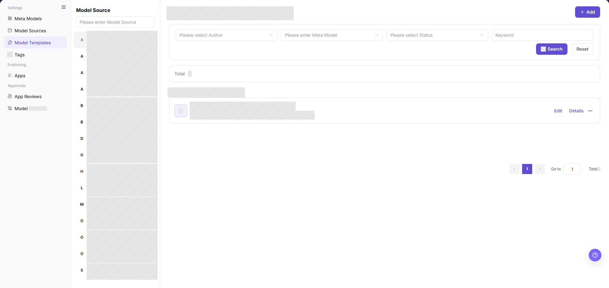
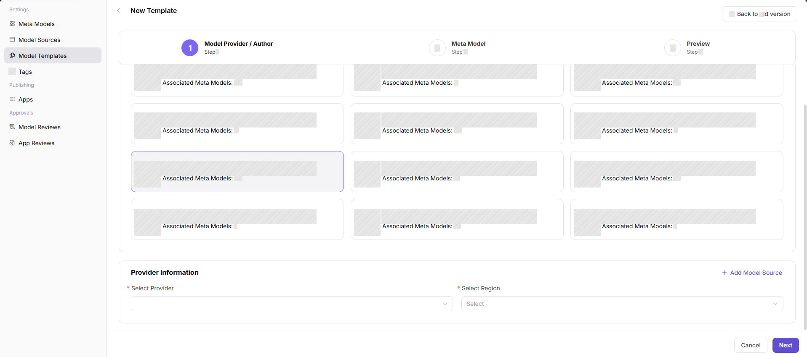
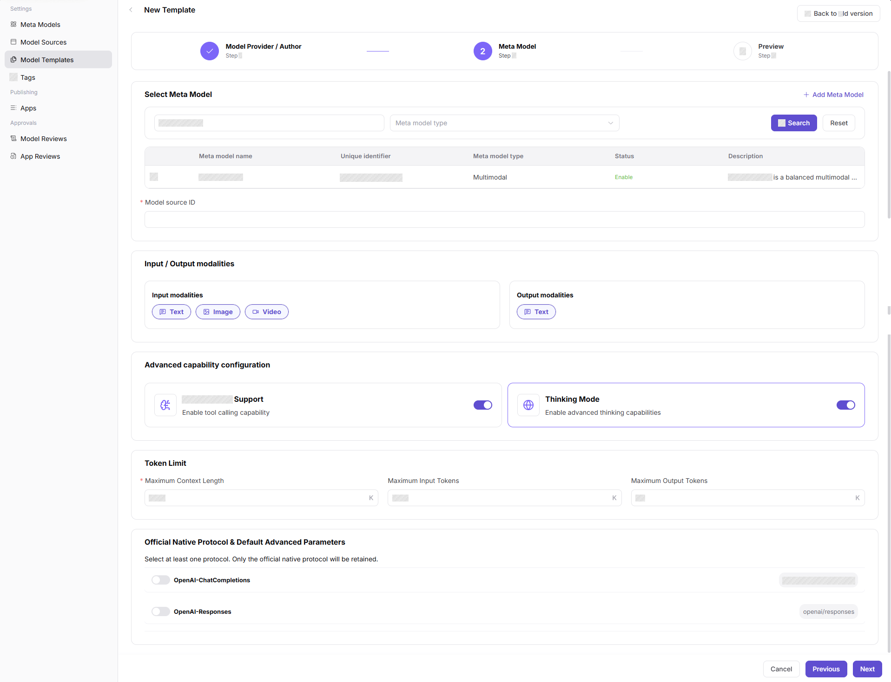
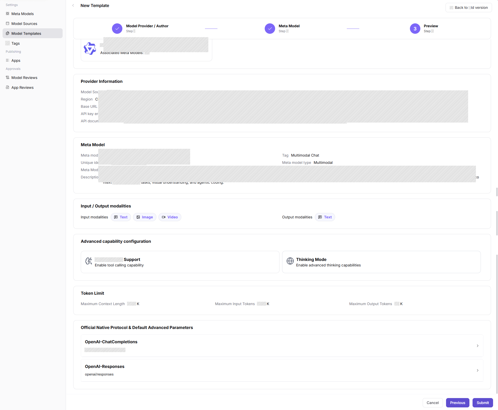
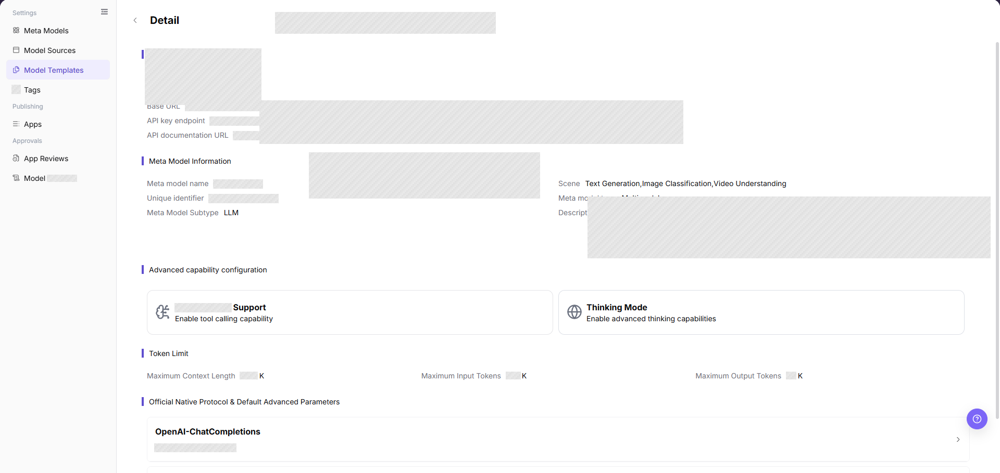
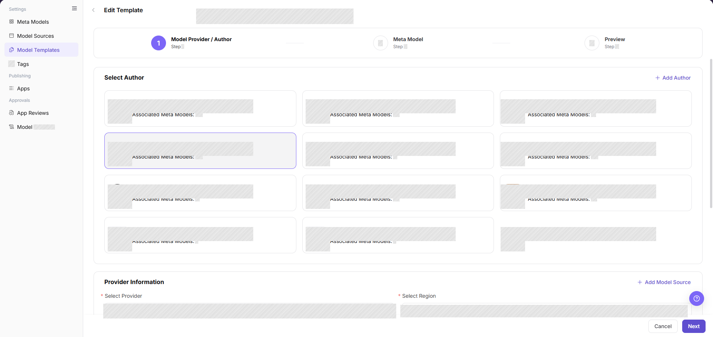
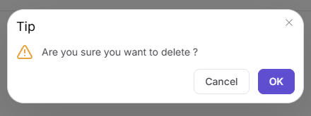

# Model Templates

## Feature Overview

| Item | Content |
| --- | --- |
| Applicable Role | Operator Admin |
| Navigation path | Model Services > Settings > Model Templates |
| Page route | `/modelone/settings/provider-template` |
| Managed objects | Vendor templates, source previews, protocols, default parameters, and publishing forms |

#### Beginner Explanation

A model template is like a preset for the model publishing form — it packages a provider, meta-model, default parameters, and protocol into one reusable configuration. After a template is set up, Model Providers can select it when publishing and have most fields auto-filled, reducing repeated input and configuration drift. When multiple models need to be published with the same configuration, create a template first.

#### Glossary

| Term | Description |
| --- | --- |
| Template | Reusable model publishing configuration set that includes provider, meta-model, default parameters, and protocol |
| Vendor Configuration Preview | Displays Base URL, documentation URL, and request header examples |
| Default Advanced Parameters | Preset parameters such as temperature and max Token used when publishing a model |
| Protocol Mapping | Mapping between the template and model call protocols |
| Model Source ID | Model identifier in the upstream model source |

#### Recommended Operation Sequence

For the first setup, use this order: confirm that the model author and meta-model are ready, then add a template, query template details to verify the configuration, and finally validate the template in a publishing flow to confirm it can be selected and parameters are carried in correctly. Use edit and delete operations for daily management.

#### Beginner Quick Choice

| Case | Do First | Avoid |
| --- | --- | --- |
| New vendor integration | Confirm model author and meta-model exist, then add a template | Skipping meta-model configuration and creating a template directly |
| Need to change template parameters | Edit the template, then run a publishing validation | Changing parameters directly on a published model |
| Need to review current configuration | Query template details and check all fields | Relying on memory to judge template content |
| Template no longer needed | Disable it first, confirm no references remain, then delete the template | Deleting a template still in use |

## Prerequisites

1. The current account has model template maintenance permission.
2. Selectable providers, model authors, meta-models, and model sources have been maintained.
3. Default parameters, request header previews, and publishing form fields have been confirmed.
4. Before enabling the template, the publishing flow has been validated with a sample model.

## Page Description

This page maintains model publishing templates. A template combines provider, meta-model, default parameters, protocol, and source preview to help Model Providers reduce repeated input.

Page screenshot:

The image above shows the template list page. You can view each template's name, status, provider, and associated configuration, along with operation entry points.

## Main Operations

<!-- main-operation-title-exceptions: Edit,Delete -->

### Add a Template

1. Go to `Model Services > Settings > Model Templates`.
2. Click **"Add"** to open the add template page.
3. In the `Model Provider / Author` step, select a model author card.
4. In `Provider Information`, select the provider and region. To maintain a new source configuration, click **"Add Model Source"**.
5. Before clicking **"Next"**, verify the provider and region information.

The image above shows the provider information step when adding a template. Confirm that the model author, provider, and region are correct, as these affect meta-model filtering and the fields carried into the publishing form.

6. In the `Meta Model` step, filter and select the target meta-model, then fill in `Model source ID`.
7. Check `Input / Output modalities`, `Advanced capability configuration`, `Token Limit`, and `Official Native Protocol & Default Advanced Parameters`.
8. Before clicking **"Next"**, verify the meta-model and protocol parameters.

The image above shows the meta-model selection step when adding a template. Confirm that the meta-model name, modalities, and Token limits match the target model capability.

9. In the `Preview` step, check `Provider Information`, `Meta Model`, `Input / Output modalities`, `Advanced capability configuration`, `Token Limit`, and protocol parameters.
10. Click **"Submit"** to save. After a successful save, query the new template in the list and open its details to verify the configuration.

The image above shows the final preview confirmation step when adding a template. Before submitting, verify that all configuration fields are complete and correct.

### Query Template Details

1. Go to `Model Services > Settings > Model Templates`.
2. Use the page query controls to locate the target record.
3. Click **"Details"** or the template name.
4. Check the provider, region, meta-model, model source ID, input/output modalities, protocol mapping, Token limits, and default parameters.
5. The details should match the list name and status. If no record is returned, clear the query conditions and confirm the active tab.

The image above shows the details entry point and details page. Click the template name or details button, then verify that all configuration fields match the expected values.

### Edit a Template

1. Locate the target record in the template list and click the row action **"Edit"**.
2. Check the provider, region, meta-model, model source ID, default parameters, and protocol mapping.
3. Change only the fields that need to be modified, and assess the impact on published models that use this template.
4. Before changing the meta-model, protocol, or default parameters, confirm whether any publishing flows depend on the current configuration. If the dependency scope is unclear, do not submit the change yet.
5. Click **"Confirm"** to save. After a successful save, refresh the list and query template details. If saving fails, check required fields, field compatibility, references, and permission.

The image above shows the template edit page. After editing and saving, return to the list, check whether the update time for the target template has been refreshed, and query template details to verify fields.

### Delete a Template

1. Locate the target record and click **"Details"** first to review its status and configuration.
2. Return to the list. Click **"Delete"** on the target row, read the confirmation message, and check whether the template is referenced by any publishing flows.
3. If you cannot confirm that the template has no references, do not delete it. Disable it first, verify it no longer appears in new publishing flows, and confirm no dependencies remain before deleting.
4. If the button is grayed out or deletion fails, the template is still referenced. Follow the page message and check references, permission, and current status before removing references first.
5. After a successful deletion, refresh the list and confirm that the record is removed.

The image above shows the template list page. Before deleting, confirm the target row name to avoid accidentally deleting a similarly named template.

## Parameter Reference

### Template Configuration Fields

| Field Name | Required | Field Type | Example | Description |
| --- | --- | --- | --- | --- |
| Model Author | Yes | Card selection | `Qwen` | Model author associated with the template |
| Select Provider | Yes | Dropdown | `Alibaba` | Model source or provider corresponding to the template |
| Select Region | Yes | Dropdown | `China` | Region where the model source is located |
| Meta-model name | Yes | Filter / radio selection | `Qwen3.7-Plus` | Meta-model associated with the template by default |
| Model source ID | Yes | Text | `qwen/qwen3.7-plus` | Model identifier in the upstream model source |

### Meta-model Carry-over Fields

| Field Name | Required | Field Type | Example | Description |
| --- | --- | --- | --- | --- |
| Input / Output modalities | System-filled | Tag | `Text` / `Image` / `Video` | Supported input and output modalities from the selected meta-model |
| Function / Tool support | System-filled | Toggle / read-only information | `Enabled` | Tool calling capability of the selected meta-model |
| Thinking Mode | System-filled | Toggle / read-only information | `Enabled` | Advanced thinking or reasoning capability of the selected meta-model |
| Token Limit | System-filled | Number | `1000` K | Context, input, and output Token limits of the selected meta-model |
| Official Native Protocol & Default Advanced Parameters | System-filled | Protocol configuration | `OpenAI-ChatCompletions` | Protocols and default advanced parameters supported by the selected meta-model |

## Pitfalls

- Template default parameters affect all published models that reference the template. Assess the impact scope before making changes.
- Provider and meta-model capability mismatches cause call failures after publishing. Confirm compatibility before adding a template.
- Request header previews can contain placeholders only. Do not write real internal addresses or credentials.
- After editing a template, published models do not automatically sync the new parameters. Manual updates or republishing is required.
- Before deleting a template, verify in the publishing flow that the template is no longer referenced. Deleting a template that is still in use may cause active publishing flows to fail.

## Result Validation

| Check Item | Success Signal | If Abnormal |
| --- | --- | --- |
| The new template is visible in the list | The new template appears in the list | Check account permission, filter conditions, and configuration status |
| The template can be selected in the model publishing flow | The template appears in the publishing flow dropdown | Confirm the template status is enabled, and check whether the associated meta-model and provider appear in their selectors |
| Parameters carried by the template match expectations | The publishing form auto-fills parameters, modalities, and protocols consistent with the template configuration | Open the template details and check default parameters and protocol mapping. Confirm the meta-model has not changed |
| The update time in the list refreshes after editing | The update time for the template shows the most recent edit time | Refresh the page and re-check. Confirm that the save was successful |
| The deleted template no longer appears in the list | The target template is removed from the list | Check whether publishing flows still reference it. Disable first and confirm no references before deleting |
| Disabled templates no longer appear in new publishing flows | The template no longer appears in new publishing flow dropdowns | Check whether the template status has changed to disabled. Clear the publishing page cache and retry |

## FAQ

#### Target Template Is Missing from Publishing Flow

**Symptom:**

The Model Provider cannot see the expected template when creating a model.

**Possible Causes:**

- The template is not enabled.
- The meta-model or source associated with the template is unavailable.
- The template's applicable provider does not match the current selection.

**Handling:**

1. Confirm that the template status is enabled.
2. Check the associated meta-model, source, and provider.
3. Re-enter the publishing flow and verify the dropdown.

#### Parameters Carried by the Template Are Incorrect

**Symptom:**

Parameters, request headers, or modalities auto-filled in the publishing form do not match expectations.

**Possible Causes:**

- Template default parameters were not updated.
- Meta-model limits changed but the template was not synchronized.
- Source preview still points to old configuration.

**Handling:**

1. Open the template details page and check default parameters and request header preview.
2. Check whether the associated meta-model Token limits or protocol have changed.
3. After saving, run through the publishing flow with a test model.

#### Template Is Selectable but Publishing Form Fields Are Missing

**Symptom:**

The template can be selected when publishing a model, but the form does not bring in the expected fields or default parameters.

**Possible Causes:**

- The template is not associated with the correct source, meta-model, or protocol.
- Default parameter configuration is incomplete.
- The template version has not refreshed.

**Handling:**

1. Return to the template details page and check source preview, protocol, and default parameters.
2. Confirm that the meta-model and provider associations are correct.
3. After saving, re-enter the publishing flow and verify whether fields are brought in.

#### Published Model Parameters Do Not Update After Template Edit

**Symptom:**

After modifying template default parameters, the parameters of already published models that use this template do not change automatically.

**Possible Causes:**

- Template edits only affect subsequent new publishing flows. They do not write back to already published models.
- Published model parameters are fixed at the time of publishing.

**Handling:**

1. Confirm that the changes are saved in the template details.
2. Go to the published model configuration page and update parameters manually, or re-run the publishing flow.
3. After updating, verify parameters in Playground or through an API call.

#### Delete Template Button Is Grayed Out

**Symptom:**

Clicking **"Delete"** on a template results in a grayed-out button or a rejected deletion operation.

**Possible Causes:**

- The template is still referenced in publishing flows.
- The current account lacks sufficient permission.

**Handling:**

1. Disable the template first and verify it no longer appears in new publishing flows.
2. After confirming no active references, retry the deletion.
3. If the button is still grayed out, check whether the current account has deletion permission.

## Notes

- Template changes affect model publishing and marketplace filtering. Confirm dependency scope before release.
- Template default parameters, protocol paths, and request header previews must match real call capability. Request headers can contain placeholders only.
- Before adjusting the meta-model or protocol configuration associated with a template, check whether published models can still reference and call correctly.

## Next Steps

1. Use the template to create or update a test model and confirm that default parameters, pricing, and visibility scope take effect.
2. Go to model details or Playground and validate the call examples and parameter descriptions generated by the template.
3. After template changes, notify affected providers to avoid using old rules in the publishing flow.
