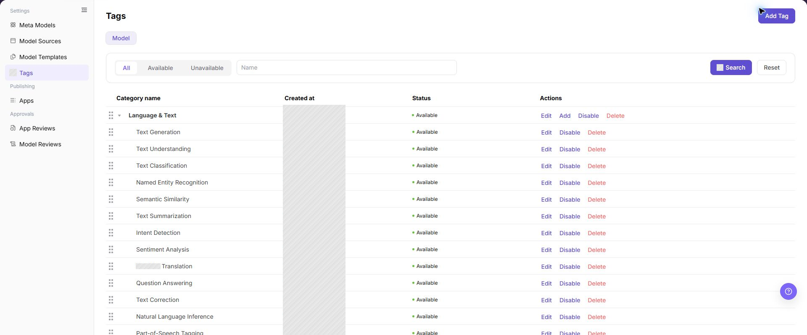
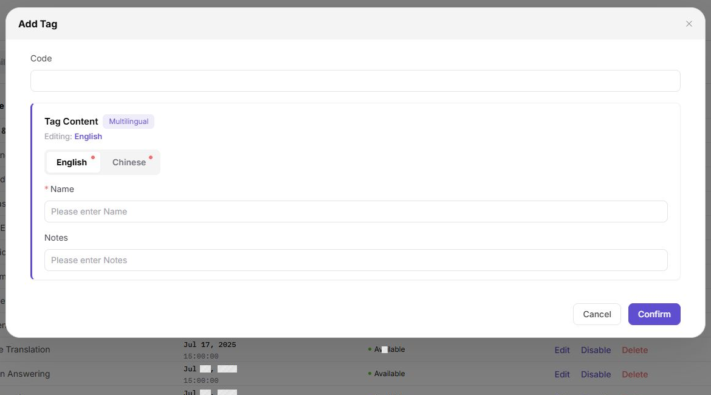
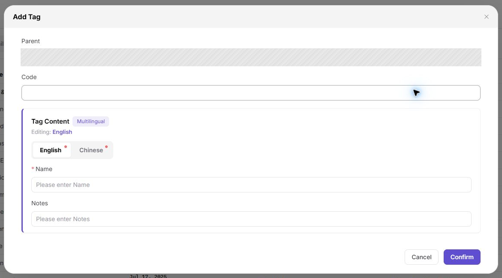
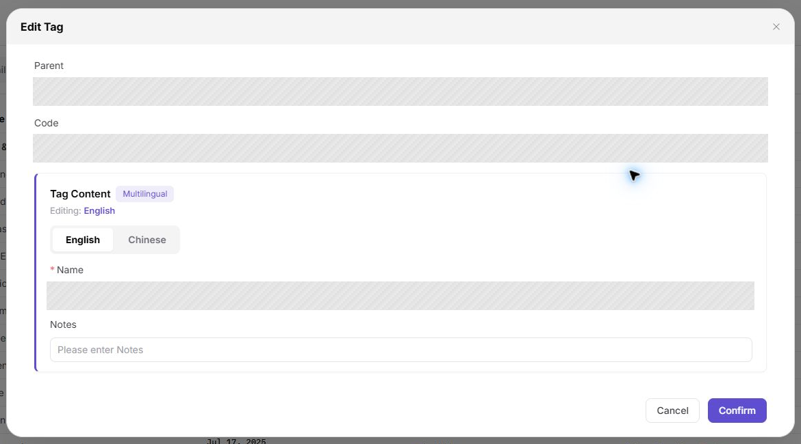
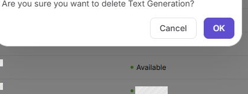

# Tags

## Feature Overview

| Item | Content |
| --- | --- |
| Applicable Role | Operator Admin |
| Navigation Path | Model Services > Settings > Tags |
| Page Route | `/modelone/settings/tags` |
| Managed Objects | Tag categories, child tags, display hierarchy, and status |

#### Beginner Explanation

Tags work like shelf labels in the model marketplace. They tell users which capability, scenario, or industry a model is suitable for. The operator organizes tag categories and child tags first, so providers and operators can later place models in the right discovery path.

#### Glossary

| Term | Description |
| --- | --- |
| Tag | User-visible classification for model capability, scenario, or industry |
| Tag category | Top-level node in the tag tree that organizes related child tags |
| Child tag | Specific tag under a category, used for model filtering and display |
| Tag status | Status shown for the tag in binding and filter controls |
| Binding relationship | Reference relationship between a tag and a model, app, or display entry |

#### Recommended Operation Sequence

When organizing tags for the first time, add tag categories first, then add child tags under each category. After saving, query the tags and confirm the name, hierarchy, and status. For daily changes, edit tags or enable and disable tags first; delete tags only after confirming that no binding relationship remains. This separates "which category the tag belongs to" from "what the tag is called," reducing marketplace filter confusion.

#### Beginner Quick Choice

| Scenario | Do First | Do Not Directly Do |
| --- | --- | --- |
| Build the model filter system for the first time | Add tag categories | Create many flat tags without categories |
| Add a filter option for a capability | Add a child tag, then query the tag hierarchy | Mix capability, industry, and recommendation tags in one category |
| Tag name or notes are inaccurate | Edit the tag and check both language names | Change only one language version |
| A tag should temporarily stop being bound | Disable the tag and check marketplace filters | Delete a tag that is still referenced by models |

## Prerequisites

1. The current account has `Tags` configuration permission.
2. Tag categories, child tag naming rules, display hierarchy, and status policy have been confirmed.
3. Before adding a tag, check whether synonymous, duplicate, or overly narrow tags already exist.
4. Before editing, disabling, or deleting a tag, assess the impact on model bindings, marketplace filters, and listed model display.

## Page Description

This page maintains the tag tree for Model Services, including tag categories, child tags, creation time, status, and row actions. Operators can add tags from the top of the page, query tags by status or name, and edit, add child tags, disable, or delete a specific row.

Page screenshot:

The top area contains status and name filters. The `Actions` column shows the edit, add, disable, and delete entries. Indentation on the left indicates tag hierarchy, and parent categories can be expanded to display child tags.

## Main Operations

<!-- main-operation-title-exceptions: Edit,Delete -->

The operations below follow a beginner-friendly order: create tag categories first, then add child tags. Query and edit are used for daily checks. Enable, disable, and delete affect marketplace filters, so confirm binding relationships first.

### Add a Tag Category

1. Go to `Model Services > Settings > Tags`.
2. Click **"Add Tag"** in the upper-right corner to open the `Add Tag` dialog.
3. Fill in `Code` as the unique identifier of the tag category. Use a stable lowercase identifier with hyphens, such as `language-text`.
4. In `Tag Content`, maintain the `English` and `Chinese` values for `Name`.
5. Fill in `Notes` as needed to describe the capability scope or usage boundary.
6. Click **"Confirm"** to save. After saving, return to the list and confirm that the new category appears in `Category name`.

The screenshot shows the `Add Tag` dialog. Focus on `Code`, multilingual `Name`, and `Notes`, because these fields affect list display and later marketplace filtering.

### Add a Child Tag

1. Go to `Model Services > Settings > Tags`.
2. Locate the target parent category in `Category name`.
3. Click **"Add"** in the target category row to open the child tag dialog.
4. Fill in the child tag `Code`, then maintain the `English` and `Chinese` values for `Name`.
5. Use `Notes` to describe the model capability or scenario that should use this child tag.
6. Click **"Confirm"** to save. After saving, expand the parent category and confirm that the child tag appears under the correct hierarchy.

The screenshot shows the `Add Tag` dialog opened from a parent category row. `Parent` is filled automatically; before saving, check the parent, code, and multilingual names.

### Query Tags

1. Go to `Model Services > Settings > Tags`.
2. Select `All`, `Available`, or `Unavailable` in the status switcher.
3. Enter a tag name or keyword in the `Name` field.
4. Click **"Search"** to query results. Click **"Reset"** when you need to clear conditions and start again.
5. Expand the target category and check tag name, creation time, status, hierarchy, and the actions shown for the current account.
6. If the target tag is missing, switch back to `All`, clear the name condition, and confirm whether the English and Chinese names are consistent.

The screenshot shows the status switcher, name filter, and tag list. Confirm the status condition first, then check the hierarchy of the target tag.

### Edit a Tag

1. Locate the target tag or tag category in the list.
2. Click **"Edit"** in the target row to open the edit dialog.
3. Check `Code`, `English` and `Chinese` `Name`, and `Notes`. If `Code` is read-only, follow the page state.
4. Change only the name or notes that need to be updated, and confirm that the new name will not conflict with sibling tags.
5. Click **"Confirm"** to save. After saving, refresh or query the target tag again and confirm that the list name and status remain correct.

The screenshot shows the `Edit Tag` dialog. The parent and existing values are populated automatically; confirm that the correct child tag is open, then check the code and multilingual names.

### Enable or Disable a Tag

1. Locate the target tag in the list.
2. Before clicking **"Disable"** or **"Enable"**, confirm whether the tag is used by models, apps, or marketplace filter entries.
3. If the tag is still a primary filter entry for online models, do not disable it directly. Prepare a replacement tag or adjust model bindings first.
4. Read the page prompt and confirm that the target tag is correct before completing the status change.
5. After the operation succeeds, switch to `Available` or `Unavailable` and confirm that the target tag appears in the expected list.
6. If the status does not change, check account permission, binding relationships, filter conditions, and page refresh state. Avoid repeated clicks.

The screenshot shows the **"Disable"** entry in the tag list. After changing status, use the status switcher to confirm that the tag moved to the expected state.

### Delete a Tag

1. Locate the target tag in the list and confirm its name, hierarchy, and status.
2. Click **"Delete"** in the target row and read the delete confirmation prompt.
3. If the tag is referenced by models, apps, or marketplace entries, migrate the bindings or disable the tag first. Do not delete it directly.
4. If you are deleting a parent category, confirm that it has no child tags that still need to remain.
5. After confirming deletion, refresh the list and query with `All` status and the name condition to confirm that the target tag no longer appears.
6. If the delete button is grayed out or deletion fails, follow the page prompt and check child tags, binding relationships, account permission, and current status.

The screenshot shows the delete confirmation for a child tag. Before clicking **"OK"**, check the tag name in the prompt; after deletion, the tag is removed from its parent category.

## Parameter Reference

| Field Name | Required | Field Type | Example | Description |
| --- | --- | --- | --- | --- |
| Code | Yes | Text / read-only text | `text-generation` | Unique identifier of a tag or tag category; after saving, it usually should not be changed |
| Tag Content | Yes | Multilingual text | `Text Generation` | User-visible tag name shown in the list, marketplace, and filter entries |
| Name | Yes | Text | `Text Generation` | Name maintained under the current language tab |
| Notes | No | Text | `For text generation models` | Describes tag purpose, scope, or operational boundary |
| Parent Category | Depends on operation | Tag hierarchy | `Language & Text` | Confirms the parent when adding a child tag |
| Status | System-generated / operation changed | Enum | `Available` | Status shown for the tag in binding and filter controls |
| Display Hierarchy | System display | Tree structure | `Language & Text > Text Generation` | Determines where the tag appears in the list and filter system |

## Pitfalls

- Do not mix tag categories and child tags. Categories organize the tree, while child tags provide more specific filter options.
- Maintain both English and Chinese names; otherwise, the English and Chinese sites can show filters with different meanings.
- Before disabling a tag, check model bindings and marketplace filter entries so Model Consumers do not suddenly lose a common discovery path.
- Handle child tags before deleting a parent category, or useful child tags may be affected together.
- Do not use internal project codenames, customer abbreviations, or temporary campaign names as general model tags.

## Result Validation

| Check Item | Success Signal | If Abnormal |
| --- | --- | --- |
| The new tag category is visible in the list | The new category appears in `Category name` with `Available` status | Clear the name condition and switch to `All`; check whether the code is duplicated or the save failed |
| The child tag appears under the correct parent | After expanding the parent category, the new child tag is visible | Confirm whether **"Add"** was clicked on the correct parent row; edit or add again if needed |
| Query conditions can locate the target tag | After entering a name and clicking **"Search"**, the list keeps matching entries only | Switch to `All`, then check the English name, Chinese name, keyword, and letter case |
| The list display updates after editing | The target row name or notes are saved, and hierarchy remains unchanged | Reopen the edit dialog and check fields; confirm whether only the current language name was changed |
| Status changes after enabling or disabling | The target tag appears in the corresponding `Available` or `Unavailable` list | Check account permission, binding relationships, and page refresh state; wait for sync and query again |
| The tag disappears from the list after deletion | The target tag cannot be found with `All` status and name query | Check whether another same-name tag was deleted, or whether the target still has child tags or bindings |
| Marketplace filters match expectations | Model Consumers can filter the correct models by the new tag | Check whether models are bound to the tag, listed, and visible to the Model Consumer |

## FAQ

#### Tag Filter Result Is Empty

**Symptom:**

A model Model Consumer clicks a tag, but no models are displayed.

**Possible Causes:**

- No listed models are bound to this tag.
- The tag status is unavailable.
- Model visibility scope does not include the current Model Consumer.

**Handling:**

1. Return to the Tags page and confirm that the tag status is `Available`.
2. Check tag binding in model editing or publishing configuration.
3. Check model listing status and visibility scope.

#### New Child Tag Is Missing Under the Parent Category

**Symptom:**

After adding a child tag, expanding the target category does not show the new record.

**Possible Causes:**

- The wrong parent category was selected or clicked during saving.
- Current name filters hide the new child tag.
- A duplicate code caused the save to fail.

**Handling:**

1. Click **"Reset"** to clear query conditions.
2. Expand possible parent categories and confirm the child tag location.
3. If it is still missing, check whether the code already exists before adding it again.

#### Marketplace Display Does Not Change After Editing a Tag

**Symptom:**

The tag name has been changed, but the marketplace filter area still shows the old name.

**Possible Causes:**

- Only one language version was changed.
- Marketplace index or page cache has not refreshed.
- The marketplace uses model binding data, and the tag has not synced back to model bindings.

**Handling:**

1. Reopen the edit dialog and check both `English` and `Chinese` names.
2. Refresh the marketplace page and check filters again.
3. Check model bindings and confirm that target models are still bound to this tag.

#### Disabled Tag Can Still Be Filtered

**Symptom:**

The tag has been disabled, but it still appears in the marketplace or model editing page.

**Possible Causes:**

- Page cache or index sync is delayed.
- Existing model bindings are still displayed.
- A same-name tag, not the target tag, remains in `Available` status.

**Handling:**

1. On the Tags page, switch to `Unavailable` and confirm the target tag status.
2. Check whether another tag with `Available` status has the same name.
3. After synchronization, recheck the marketplace and model editing page.

#### Delete Button Is Grayed Out or Deletion Fails

**Symptom:**

After clicking **"Delete"**, the button is grayed out, the page reports failure, or the tag remains in the list.

**Possible Causes:**

- The tag still has child tags.
- The tag is still referenced by models, apps, or marketplace entries.
- The current account does not have deletion permission.

**Handling:**

1. Expand the tag hierarchy and confirm whether child tags exist.
2. Migrate or remove bindings on models and apps.
3. Delete again after confirming no references remain; if it still fails, check account permission.

#### English and Chinese Tag Names Are Inconsistent

**Symptom:**

The Chinese site and English site show tag names with different meanings.

**Possible Causes:**

- Only the current language name was maintained during add or edit.
- Translation does not match the business boundary of the tag category.
- Multiple synonymous tags are maintained separately.

**Handling:**

1. Open the tag edit dialog and check both `English` and `Chinese` names.
2. Standardize the translation according to the same business meaning.
3. For duplicate tags, migrate bindings first, then disable or delete extra entries.

## Notes

- Tags affect marketplace filters, model display, and the Model Consumer discovery path. Confirm the impact scope before making changes.
- Tag names should be understandable to users. Avoid internal project codenames, temporary campaign terms, or abbreviations only the operations team understands.
- For tags involving customer names, industry-specific meanings, or restricted models, confirm display boundaries and visibility scope first.
- Before bulk tag cleanup, export the existing tag and binding relationship list to avoid deleting tags that are still in use.

## Next Steps

1. Bind target tags in model editing, model publishing, or app configuration.
2. Go to the marketplace or playground and validate whether tag filtering returns the expected models.
3. Periodically clean up duplicate, low-usage, or overly narrow tags, and update naming rules at the same time.
