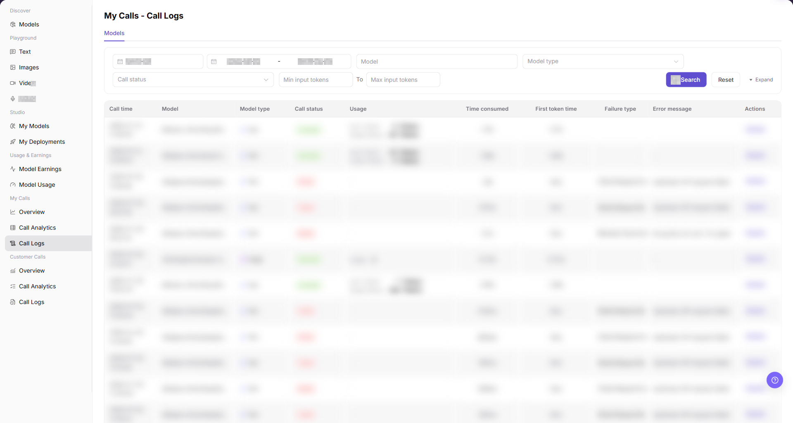
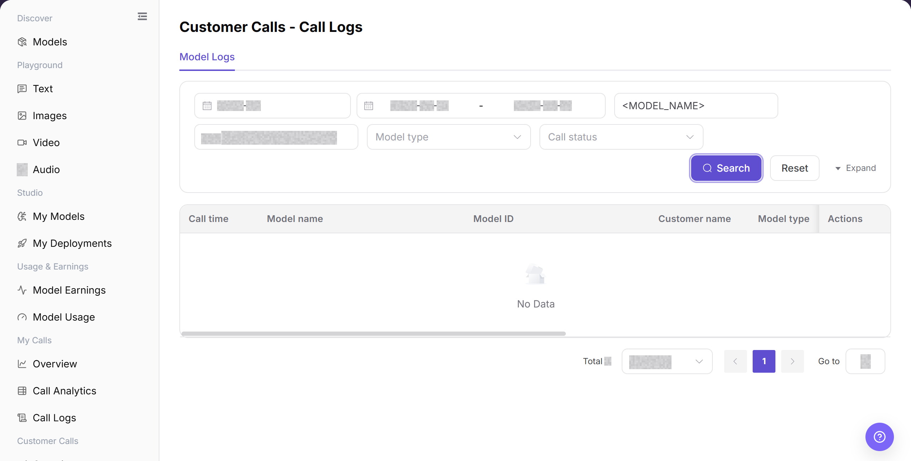
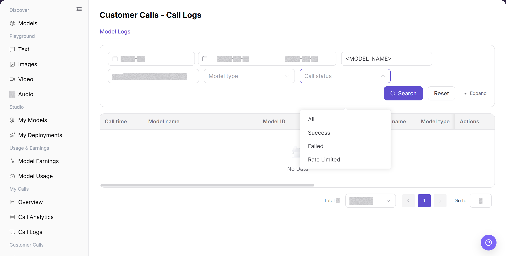

# Call Logs

## Feature Overview

| Item | Content |
| --- | --- |
| Applicable Roles | Model Provider |
| Navigation Path | Model Services > Customer Calls > Call Logs |
| Page Route | `/modelone/monitoring/monitor/log/model` |
| Managed Objects | Customer model-call records, results, usage, latency, and failed records |

#### Beginner Explanation

Customer Call Logs works like a troubleshooting register for customer requests. Locate records by time, model, and status, and use customer name, result, usage, and latency to assess impact.

#### Terminology

| Term | Description |
| --- | --- |
| Customer Name | The customer identifier associated with a model call. |
| Call Result | The success or failure state of one customer call. |
| Usage | Token, count, or other consumption information for one call. |
| First Token Time | The time for a text model to return its first token. |

#### Recommended Operation Order

Set a time range and query customer call logs, locate failed records, and use customer, model, error, and latency information to assess impact.

#### Beginner Checklist

| Scenario | Do First | Do Not Do Directly |
| --- | --- | --- |
| A customer reports a failure | Check time and model first | Infer from customer name alone |
| Many records failed | Locate by status and compare time distribution | Repeat calls one by one |
| Cannot find a record | Reset filters and check time zone | Keep narrowing the scope |
| Preparing to share logs | Redact customer, request, and credential data | Share complete details externally |

## Prerequisites

1. The current account has access to the `Call Logs` page.
2. The month, date range, model, model type, or call status to view has been clarified.
3. Troubleshooting materials must not contain complete customer requests, response bodies, Keys, accounts, or cost details.

## Page Description

The page shows customer model-call records. Query by model name, model ID, type, status, and time range. The list includes customer name, result, usage, latency, and details.

Page screenshots:

Focus on time range, model criteria, customer name, call result, and details.

## Main Operations

### Query Customer Call Logs

1. Go to `Model Services > Customer Calls > Call Logs`.
2. Set a time range, enter a model name or model ID, and select model type and call status if needed.
3. Click **"Search"** and verify call time, customer name, result, usage, and latency.
4. Click **"Reset"** if the criteria are incorrect. Redact customer and business identifiers before sharing results.

The image shows customer call-log results. Verify time, customer, model, and call result.

### Locate Failed Call Records

1. Select a failed state in Call Status.
2. Click **"Search"** and compare customer, model, time, and latency across failed records.
3. Open **"Details"** for the target record and retain only a redacted error summary. Do not copy complete requests, responses, or credentials.

The image shows a failed-status query. Compare customer, model, and time distribution across failed records.

## Parameter Reference

| Field Name | Required | Field Type | Example | Description |
| --- | --- | --- | --- | --- |
| Month | Yes | Month selector | `2026-07` | Controls the statistical month for call logs. |
| Date Range | Yes | Date range | `2026-07-01 to 2026-07-17` | Controls the query time range for call logs. |
| Model | No | Input | `Example Model` | Filters call logs by model name. |
| Model Type | No | Selector | `Text` | Filters call logs by model capability type. |
| Call Status | No | Selector | `Success` | Filters logs by call processing result. |
| Minimum Input Tokens | No | Number input | `0` | Sets the lower input-token boundary for the query. |
| Maximum Input Tokens | No | Number input | `1000` | Sets the upper input-token boundary for the query. |
| Call Time | System-generated | Time | `2026-07-17 14:30` | Shows when a single customer call occurred. |
| Customer Name | System-generated | Text | `Example Customer` | Shows the customer that initiated the call. |
| Usage | System-generated | Text / tag | `Input 100 / Output 40 Tokens` | Shows input tokens, output tokens, cached input tokens, context size, or free usage information. |
| Time Consumed | System-generated | Time | `1.2 s` | Shows the total time consumed by a single call. |
| First Token Time | System-generated | Time | `0.3 s` | Shows the time before the first token is returned. |
| Failure Type | System-generated | Text | `Authentication` | Shows the issue category for a failed request. |
| Error Message | System-generated | Text | `Redacted error message` | Shows the error summary for a failed request. Redact it before screenshots or external communication. |
| Actions | No | Action entry | `Details` | Opens single customer call log details. |

## Pitfalls

- Request IDs, customer identifiers, and error messages in call logs must be sanitized before sharing.
- 401, 429, and 5xx point to different troubleshooting paths. Do not treat every failure as the same issue.
- Log retention may be limited. Confirm the time range and keep desensitized clues early.

## Result Validation

| Check Item | Success Signal | If Abnormal |
| --- | --- | --- |
| Page is accessible | The `Customer Calls - Call Logs` page opens, and `Customer Calls > Call Logs` is highlighted in the sidebar. | Check account permissions, navigation path, and page loading status. |
| Log list loads | The list shows columns such as call time, model, customer name, call status, usage, latency, and error message. | Refresh the page or retry after adjusting the month and date range. |
| Filter controls can be selected | After filtering by month, date range, model, model type, or call status, the list refreshes. | Check whether filters are too narrow, and click **"Reset"** if needed. |
| Search / Reset works | `Search` displays matching logs, and `Reset` clears the filters. | Check network status, page API responses, and account permissions. |
| Log details can be opened | Clicking `Details` opens more information about a single customer call. | Confirm that the record is still within the log retention period. |
| Field information is consistent | Call status, time consumed, usage, failure type, and error message are consistent with the details page. | Reopen details or expand the time range for cross-checking. |

## FAQ

#### Customer Call Log Is Missing

**Symptom:**

The target record does not appear after a search by customer, model, or time.

**Possible Causes:**

- The filters exclude the target call.
- The current account cannot view the customer record.

**Resolution:**

1. Click **"Reset"** and select the call date.
2. Filter by customer, Model ID, and status one at a time.
3. If the record remains missing, ask the administrator to verify Model Provider permissions and provide the redacted call time.

#### Failed-Status Filter Shows No Record

**Symptom:**

The list is empty after you select the failed status.

**Possible Causes:**

- The selected range contains no failed request.
- A model, customer, or date filter excludes failed records.

**Resolution:**

1. Keep the failed status and clear other filters.
2. Expand the date range and search again.
3. If Overview shows failures but the log remains empty, send the administrator the same filters and a redacted screenshot.

#### One Customer Has Many Failures

**Symptom:**

One customer has several failed logs in a short period.

**Possible Causes:**

- The customer uses an invalid credential, Model ID, or request format.
- The target model returns repeated upstream errors.

**Resolution:**

1. Keep the same customer and time range.
2. Open several failed records and compare the error type and Model ID.
3. Send the redacted error to the customer. Contact the Model Provider if the upstream error continues.

#### Customer Call Latency Increases

**Symptom:**

Total latency or first-token latency increases for the same model.

**Possible Causes:**

- The customer request has a longer input or higher output limit.
- The model or provider responds slowly during the selected period.

**Resolution:**

1. Compare calls with the same customer, Model ID, and a similar input size.
2. Review total latency and first-token latency separately.
3. If latency remains high, send the Model Provider the time range and redacted request IDs.

#### Customer Log Contains Sensitive Data

**Symptom:**

Details shows a customer credential, full Endpoint, input, or response content.

**Possible Causes:**

- The call itself contains sensitive data.
- A screenshot or support ticket was not redacted.

**Resolution:**

1. Stop copying or sharing the details.
2. Mask the customer name, Personal Key, request header, request body, response, and full Endpoint.
3. If a credential was exposed, contact the administrator or security owner immediately and rotate it.

## Notes

- Do not expose complete customer requests, response bodies, Keys, accounts, or cost details in documentation, screenshots, or tickets.
- Customer logs are for troubleshooting and do not replace revenue settlement or billing details.
- Error messages are only used for troubleshooting and must be redacted before public communication.

## Next Steps

1. Click **"Details"** to view redacted details for the target customer call.
2. Go to `Customer Calls > Call Analytics` to determine whether a batch anomaly exists.
3. Return to `Customer Calls > Overview` to view trend changes by customer or model.
